<!-- _backgroundColor: aquq -->

<!-- _color: orange -->

<!-- paginate: false -->

## CE100 Algorithms and Programming II

## Week-1 (Introduction to Analysis of Algorithms)

#### Spring Semester, 2021-2022

Download [DOC](ce100-week-1-intro.md_doc.pdf), [SLIDE](ce100-week-1-intro.md_slide.pdf), [PPTX](ce100-week-1-intro.md_slide.pptx)

<iframe width=700, height=500 frameBorder=0 src="../ce100-week-1-intro.md_slide.html"></iframe>

---

<!-- paginate: true -->

## Brief Description of Course and Rules

We will first talk about, 

1. Course Plan and Communication

2. Grading System, Homeworks, and Exams

please read the syllabus carefully. 

---


## TODO : Brief Proof Methods

---

## Introduction to Analysis of Algorithms

## Outline

- Study two sorting algorithms as examples
  
  - Insertion sort: Incremental algorithm
  - Merge sort: Divide-and-conquer 

- Introduction to runtime analysis
  
  - Best vs. worst vs. average case 
  - Asymptotic analysis

---

## What is Algorithm

**Algorithm**: A sequence of computational steps that transform the input to the desired output

**Procedure vs. algorithm**
An algorithm must halt within finite time with the right output

---

**Example Sorting Algorithms**

**Input**: a sequence of n numbers

$$
\langle a_1,a_2,...,a_n \rangle
$$

**Algorithm**: Sorting / Permutation

$$
\prod = \langle \prod_{(1)},\prod_{(2)},...,\prod_{(n)} \rangle
$$

**Output**: sorted permutation of the input sequence

$$
\langle a_{\prod_{(1)}} \leqslant a_{\prod_{(2)}} \leqslant,...,a_{\prod_{(n)}}  \rangle
$$

---

## Pseudo-code notation

We can use [Flowgorithm - Flowchart Programming Language](http://www.flowgorithm.org/)

- Objective: Express algorithms to humans in a clear and concise way

- Liberal use of English

- Indentation for block structures

- Omission of error handling and other details (needed in real programs)

---

### Pseudocode Links to Visit

[Pseudocode - Wikipedia](https://en.wikipedia.org/wiki/Pseudocode)

[Pseudocode Examples](https://www.unf.edu/~broggio/cop2221/2221pseu.htm)

[How to write a Pseudo Code? - GeeksforGeeks](https://www.geeksforgeeks.org/how-to-write-a-pseudo-code/)

---

## Matematical Notations

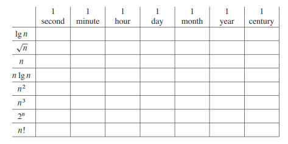

---

## Insertion Sort

Insertion sort is a simple sorting algorithm that works similar to the way you sort playing cards in your hands

The array is virtually split into a sorted and an unsorted part

Values from the unsorted part are picked and placed at the correct position in the sorted part.

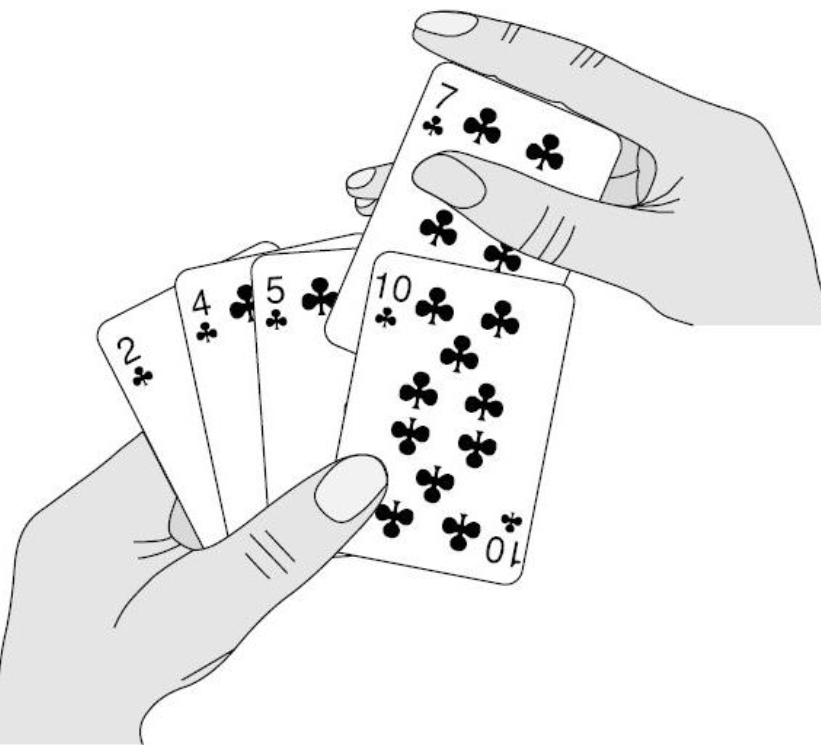

---

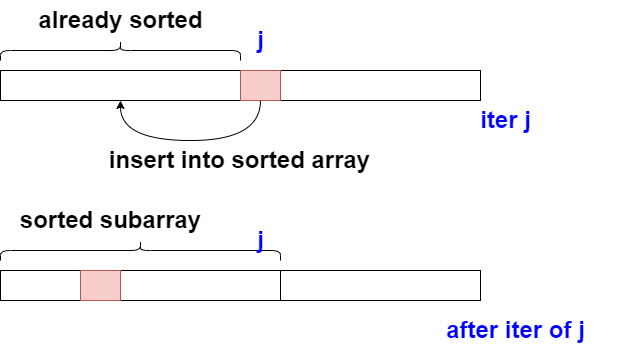

---

## Insertion Sort Algorithm

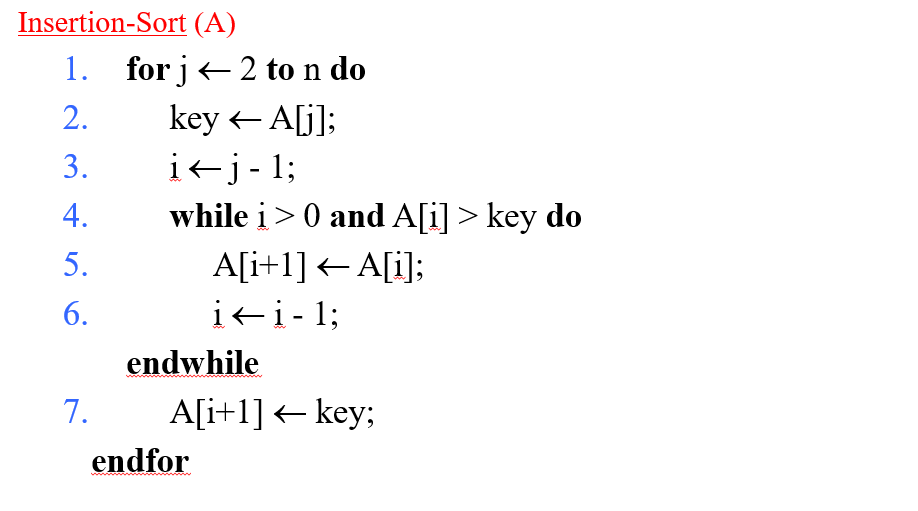

---

```r
Insertion-Sort(A)
1. for j=2 to A.length
2.     key = A[j]
3.     //insert A[j] into the sorted sequence A[1...j-1]
4.     i = j - 1
5.     while i>0 and A[i]>key
6.         A[i+1] = A[i]
7.         i = i - 1
8.     A[i+1] = key
```

---

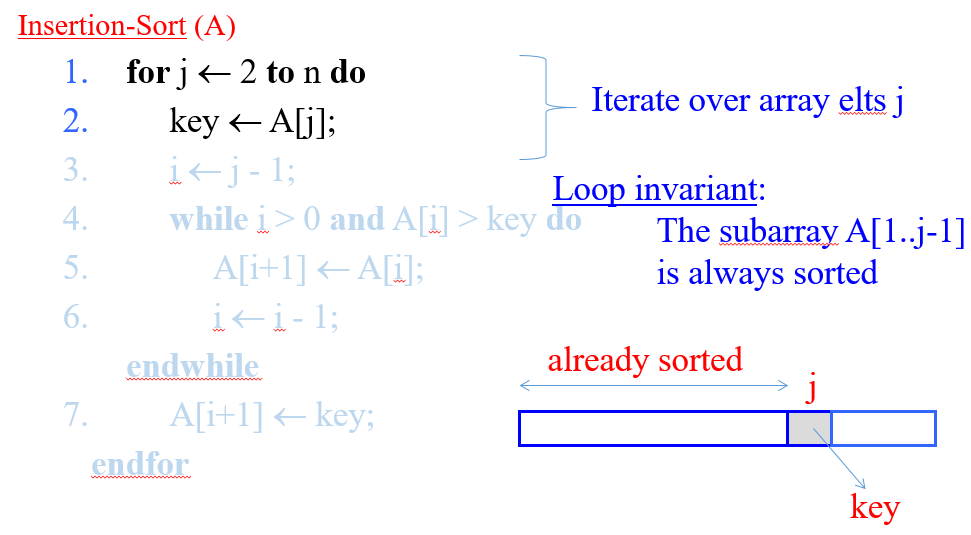

---

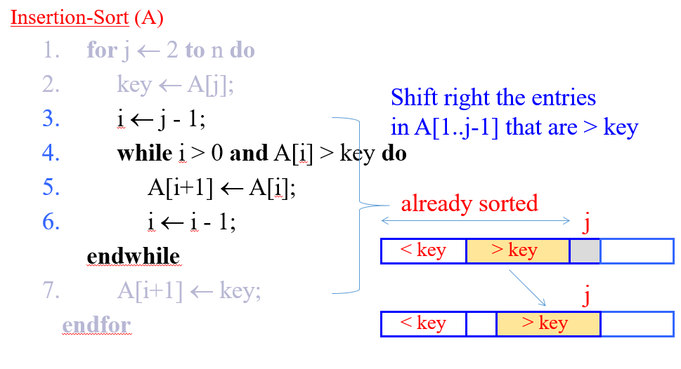

---

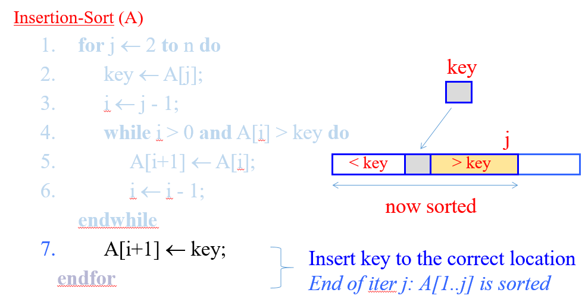

---

## Insertion Sort Example

### initial

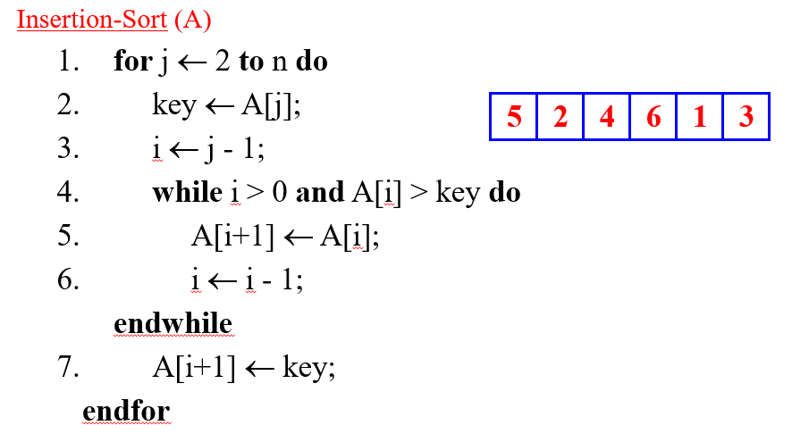

---

### j=2

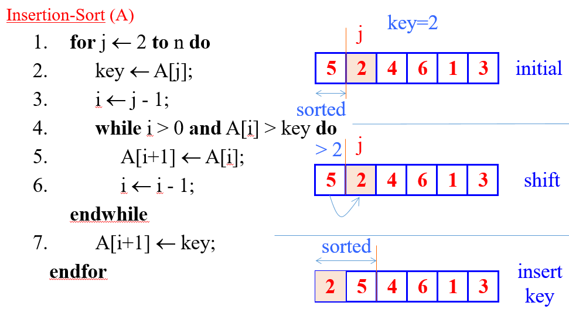

---

### j=3

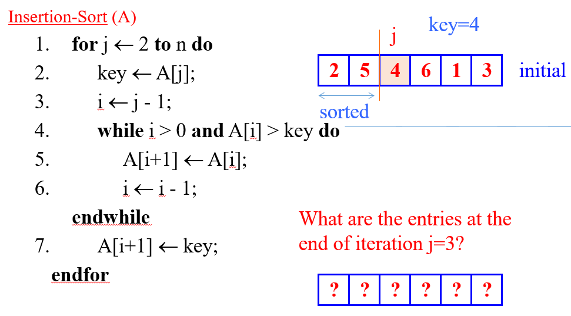

---

### j=3

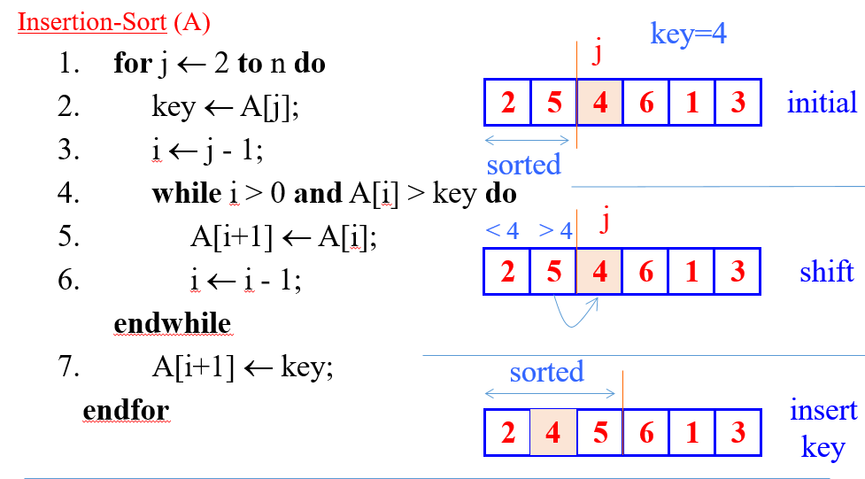

---

### j=4

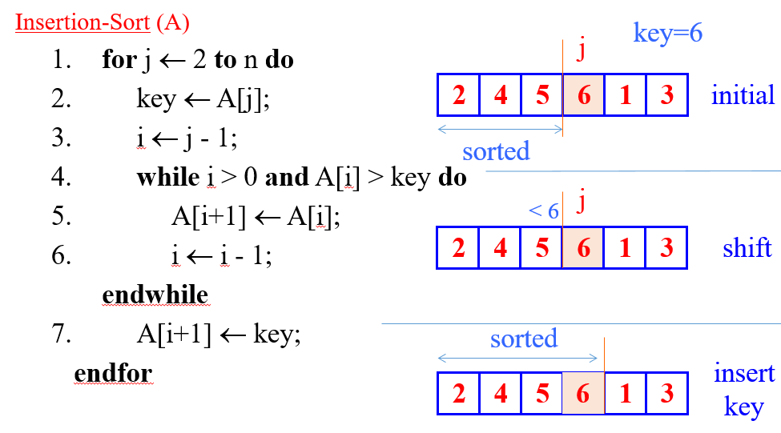

---

### j=5

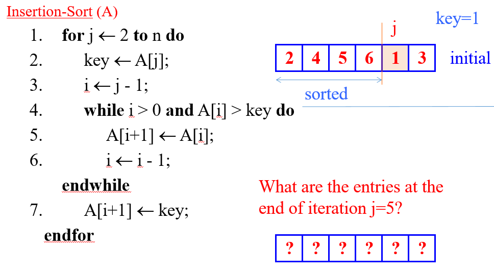

---

### j=5

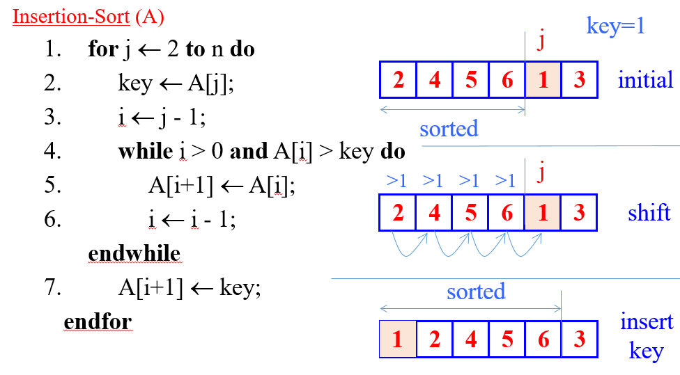

---

### j=6

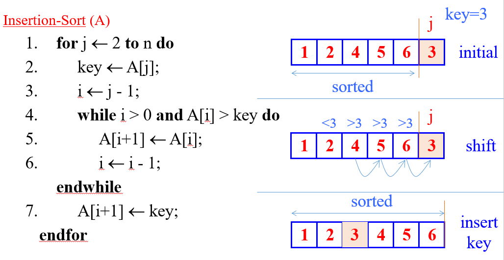

---

## Insertion Sort Review

- Items sorted in-place 
  
  - Elements are rearranged within the array.
  
  - At a  most constant number of items stored outside the array at any time (e.,g. the variable key)
  
  - Input array $A$  contains a sorted output sequence when the algorithm ends

---

- Incremental approach 
  
  - Having sorted $A[1..j-1]$ , place $A[j]$  correctly so that $A[1..j]$  is sorted

- Running Time
  
  - It depends on Input Size (5 elements or 5 billion elements) and Input Itself (partially sorted)

- Algorithm approach to *upper bound* of overall performance analysis

---

## Visualization of Insertion Sort

[Sorting (Bubble, Selection, Insertion, Merge, Quick, Counting, Radix) - VisuAlgo](https://visualgo.net/en/sorting)

https://www.cs.usfca.edu/~galles/visualization/ComparisonSort.html

https://algorithm-visualizer.org/

[HMvHTs - Online C++ Compiler & Debugging Tool - Ideone.com](https://ideone.com/HMvHTs)

---

<iframe width="800" height="500" frameborder="0" src="https://pythontutor.com/iframe-embed.html#code=//%20C%2B%2B%20program%20for%20insertion%20sort%0A%23include%20%3Cstring.h%3E%0A%23include%20%3Ciostream%3E%0A%0Ausing%20namespace%20std%3B%0A%0Avoid%20printArray%28int%20arr%5B%5D,%20int%20n%29%3B%0Avoid%20insertionSort%28int%20arr%5B%5D,%20int%20n%29%3B%0A%0A%20%0A/*%20Function%20to%20sort%20an%20array%20using%20insertion%20sort*/%0Avoid%20insertionSort%28int%20arr%5B%5D,%20int%20n%29%0A%7B%0A%20%20%20%20int%20i,%20key,%20j%3B%0A%20%20%20%20for%20%28i%20%3D%201%3B%20i%20%3C%20n%3B%20i%2B%2B%29%0A%20%20%20%20%7B%0A%20%20%20%20%20%20%20%20key%20%3D%20arr%5Bi%5D%3B%0A%20%20%20%20%20%20%20%20j%20%3D%20i%20-%201%3B%0A%20%0A%20%20%20%20%20%20%20%20/*%20Move%20elements%20of%20arr%5B0..i-1%5D,%20that%20are%0A%20%20%20%20%20%20%20%20greater%20than%20key,%20to%20one%20position%20ahead%0A%20%20%20%20%20%20%20%20of%20their%20current%20position%20*/%0A%20%20%20%20%20%20%20%20while%20%28j%20%3E%3D%200%20%26%26%20arr%5Bj%5D%20%3E%20key%29%0A%20%20%20%20%20%20%20%20%7B%0A%20%20%20%20%20%20%20%20%20%20%20%20arr%5Bj%20%2B%201%5D%20%3D%20arr%5Bj%5D%3B%0A%20%20%20%20%20%20%20%20%20%20%20%20j%20%3D%20j%20-%201%3B%0A%20%20%20%20%20%20%20%20%7D%0A%20%20%20%20%20%20%20%20arr%5Bj%20%2B%201%5D%20%3D%20key%3B%0A%20%20%20%20%7D%0A%7D%0A%20%0A//%20A%20utility%20function%20to%20print%20an%20array%20of%20size%20n%0Avoid%20printArray%28int%20arr%5B%5D,%20int%20n%29%0A%7B%0A%20%20%20%20int%20i%3B%0A%20%20%20%20for%20%28i%20%3D%200%3B%20i%20%3C%20n%3B%20i%2B%2B%29%0A%20%20%20%20%20%20%20%20cout%20%3C%3C%20arr%5Bi%5D%20%3C%3C%20%22%20%22%3B%0A%20%20%20%20cout%20%3C%3C%20endl%3B%0A%7D%0A%20%0A/*%20Driver%20code%20*/%0Aint%20main%28%29%0A%7B%0A%20%20%20%20int%20arr%5B%5D%20%3D%20%7B%2012,%2011,%2013,%205,%206%20%7D%3B%0A%20%20%20%20int%20n%20%3D%20sizeof%28arr%29%20/%20sizeof%28arr%5B0%5D%29%3B%0A%20%0A%20%20%20%20insertionSort%28arr,%20n%29%3B%0A%20%20%20%20printArray%28arr,%20n%29%3B%0A%20%0A%20%20%20%20return%200%3B%0A%7D&codeDivHeight=400&codeDivWidth=350&cumulative=false&curInstr=0&heapPrimitives=nevernest&origin=opt-frontend.js&py=cpp_g%2B%2B9.3.0&rawInputLstJSON=%5B%5D&textReferences=false"> </iframe>

---

## Kinds of Running Time Analysis (Time Complexity)

- **Worst Case (Big-O  Notation)** 
  - $T(n)$ = maximum processing time of any input $n$
  - $$
    O(n)
    $$
- **Average Case (Teta Notation)**
  - $T(n)$ = average time over all inputs of size $n$, inputs can have a uniform distribution
  - $$
    \Theta(n)
    $$
- **Best Case (Omega Notation)**
  - $T(n)$ = min time on any input of size $n$, for example sorted array
  - $$
    \Omega(n)
    $$

---


---

## Comparison of Time Analysis Cases

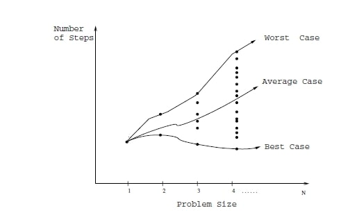

For insertion sort, worst-case time depends on the speed of primitive operations such as

- **Relative Speed** (on the same machine)

- **Absolute Speed** (on different machines)

---

## Asymptotic Analysis

- Ignore machine-dependent constants

- Look at the growth of  $T(n) | n\rightarrow\infty$

---

## Theta-Notation (Average-Case)

- Drop low order terms

- Ignore leading constants

e.g

$$
2n^2 + 5n + 3 = \Theta(n^2)
$$

$$
3n^3+90n^2-2n+5=\Theta(n^3)
$$

- As $n$ gets large, a $\Theta(n^2)$ algorithm runs faster than a $\Theta(n^3)$ algorithm

---

For both algorithms, we can see a minimum item size in the following chart. After this point, we can see performance differences.  Some algorithms for small item size can be run faster than others but if you increase item size you will see a reference point that notation proof performance metrics. 

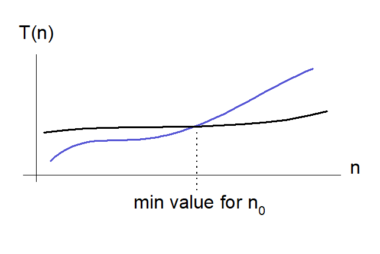

---

## Insertion Sort - Runtime Analysis

```r
Cost   Times   Insertion-Sort(A)
c1     n       1. for j=2 to A.length
c2     n-1     2.     key = A[j]
c3     n-1     3.     //insert A[j] into the sorted sequence A[1...j-1]
c4     n-1     4.     i = j - 1
c5     k5      5.     while i>0 and A[i]>key do 
c6     k6      6.         A[i+1] = A[i]
c7     k6      7.         i = i - 1
c8     n-1     8.     A[i+1] = key
```

we have two loops here, if we sum up costs as follow we can see big-O worst case notation. 

$k_5 = \sum_{j=2}^n{t_j}$ and $k_6 = \sum_{j=2}^n{t_i-1}$ for operation counts

---

cost function can be evaluated as follow;

$T(n)=c_1n+c_2(n-1)+0(n-1)+c_4(n-1)+c_5\sum_{j=2}^n{t_j}+c_6\sum_{j=2}^n{t_i-1}+c_7\sum_{j=2}^n{t_i-1}+c_8(n-1)$
--

---

$\sum_{j=2}^n j = (n(n+1)/2)- 1$ **and** $\sum_{j=2}^n {j-1} = n(n-1)/2$
--

---

$T(n)=(c_5/2 + c_6/2 + c_7/2)n^2 + (c_1+c_2+c_4+c_5/2-c_6/2-c_7/2+c_8)n-(c_2 + c_4 + c_5 + c_6)$
--
---

$T(n)= an^2 + bn + c$
--
---

$O(n^2)$
--
---

## Best-Case Scenario (Sorted Array)

Problem-1, If $A[1...j]$  is already sorted, what will be $t_j=?$

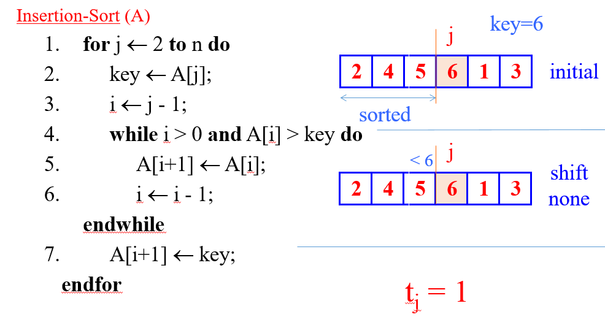

---

Original Function for below representation (a bit different than upper calculation there is no comment)

---

$T(n)=c_1n+c_2(n-1)+c_3(n-1)+c_4\sum_{j=2}^nt_j+c_5\sum_{j=2}^n(t_j-1)+c_6\sum_{j=2}^n(t_j-1)+c_7(n-1)$

$t_j=1$ for all $j$ 

$T(n)=(c_1+c_2+c_3+c_4+c_7)n-(c_2+c_3+c_4+c_7)$

$T(n)=an-b$

$\Omega(n)$

---

## Worst-Case Scenario (Reversed Array)

Problem-2 If $A[j]$ is smaller than every entry in $A[1...j-1]$, what will be $t_j=?$ 

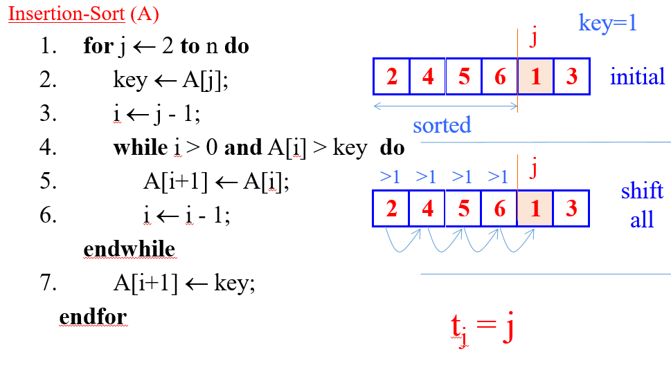

---

The input array is reverse sorted $t_j=j$ for all $j$ after calculation worst case runtime will be

$T(n)=1/2(c_4+c_5+c_6)n^2+(c_1+c_2+c_3+1/2(c_4-c_5-c_6)+c_7)n-(c_2+c_3+c_4+c_7)$

$T(n)=1/2an^2+bn-c$

$O(n^2)$

---

## Insertion Sort - Asymptotic Runtime Analysis

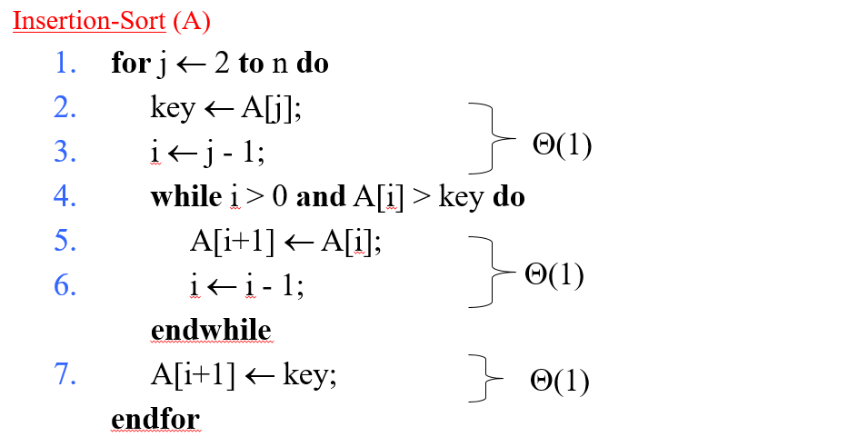

---

### Asymptotic Runtime Analysis of **Insertion-Sort**

---

**Worst-case** (input reverse sorted)

Inner Loop is $\Theta(j)$ 

$T(n)=\sum_{j=2}^n\Theta(j)=\Theta(\sum_{j=2}^nj)=\Theta(n^2)$

---

**Average case** (all permutations uniformly distributed)

Inner Loop is $\Theta(j/2)$

$T(n)=\sum_{j=2}^n\Theta(j/2)=\sum_{j=2}^n\Theta(j)=\Theta(n^2)$

---

To compare this sorting algorithm please check the following map again.


---

## Merge Sort : Basic Idea

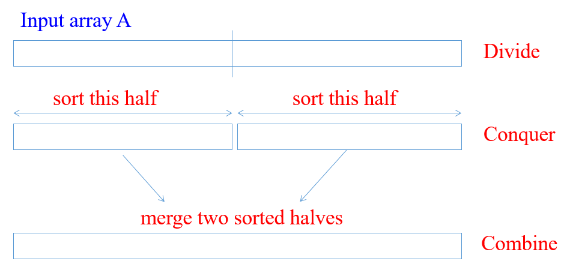

---

**Divide**: we divide the problem into a number of subproblems

**Conquer**: We solve the subproblems recursively

**Base-Case**: Solve by Brute-Force

**Combine**: Subproblem solutions to the original problem

---

## Merge Sort : Example


---

## Merge Sort : Algorithm

Merge Sort is a recursive sorting algorithm, for initial case we need to call `Merge-Sort(A,1,n)` for sorting $A[1..n]$ 

---

initial case

```r
A : Array
p : 1 (offset)
r : n (length)
Merge-Sort(A,1,n)
```

---

internal iterations

```r
A : Array
p : offset
r : length
Merge-Sort(A,p,r)
    if p=r then                (CHECK FOR BASE-CASE)
        return
    else
        q = floor((p+r)/2)    (DIVIDE)
        Merge-Sort(A,p,q)     (CONQUER)
        Merge-Sort(A,q+1,r)   (CONQUER)
        Merge(A,p,q,r)        (COMBINE)
    endif
```

---


---

brute-force task, merging two sorted subarrays

The pseudo-code in the textbook (Sec. 2.3.1)


---

```r
Merge(A,p,q,r)
    n1 = q-p+1
    n2 = r-q

    //allocate left and right arrays 
    //increment will be from left to right 
    //left part will be bigger than right part

    L[1...n1+1] //left array
    R[1...n2+1] //right array

    //copy left part of array
    for i=1 to n1
        L[i]=A[p+i-1]

    //copy right part of array
    for j=1 to n2
        R[j]=A[q+j]

    //put end items maximum values for termination
    L[n1+1]=inf
    R[n2+1]=inf

    i=1,j=1
    for k=p to r
        if L[i]<=R[j]
            A[k]=L[i]
            i=i+1
        else
            A[k]=R[j]
            j=j+1
```

---


---

## What is the complexity of merge operation?

You can find by counting loops will provide you base constant nested level will provide you exponent of this constant, if you drop constants you will have complexity

we have 3 for loops
--

it will look like $3n$ and $\Theta(n)$ will be merge complexity

---

## Merge Sort : Correctness

- **Base case**
  
  - $p = r$ (Trivially correct)

- **Inductive hypothesis**
  
  - MERGE-SORT is correct for any subarray that is a strict (smaller) subset of $A[p, q]$.

- **General Case**
  
  - MERGE-SORT is correct for $A[p, q]$. From inductive hypothesis and correctness of Merge.

---

```r
A : Array
p : offset
r : length
Merge-Sort(A,p,r)
    if p=r then                (CHECK FOR BASE-CASE)
        return
    else
        q = floor((p+r)/2)    (DIVIDE)
        Merge-Sort(A,p,q)     (CONQUER)
        Merge-Sort(A,q+1,r)   (CONQUER)
        Merge(A,p,q,r)        (COMBINE)
    endif
```

---

## Merge Sort : Complexity

```r
A : Array
p : offset
r : length
Merge-Sort(A,p,r)-------------> T(n)
    if p=r then--------------->Theta(1)                
        return
    else
        q = floor((p+r)/2)---->Theta(1)
        Merge-Sort(A,p,q)-----> T(n/2)
        Merge-Sort(A,q+1,r)---> T(n/2)
        Merge(A,p,q,r)-------->Theta(n)
    endif
```

---

## Merge Sort : Recurrence

We can describe a function recursively in terms of itself, to analyze the performance of recursive algorithms

$$
T(n)=\begin{cases} \Theta(1)&\text{if n=1} \\ 2T(n/2)+\Theta(n)&otherwise \end{cases}
$$

---

## How to solve recurrence

$$
T(n)=\begin{cases} \Theta(1)&\text{if n=1} \\ 2T(n/2)+\Theta(n)&otherwise \end{cases}
$$

---

We will assume $T(n)= \Theta(1)$ for sufficiently small $n$ to rewrite equation as 

$$
T(n)=2T(n/2)+\Theta(n)
$$

Solution for this equation will be $\Theta(nlgn)$ with following recursion tree. 

---

Multiply by height $\Theta(lgn)$ with each level cost $\Theta(n)$ we can found $\Theta(nlgn)$

---

This tree is binary-tree and binary-tree height is related with item size.

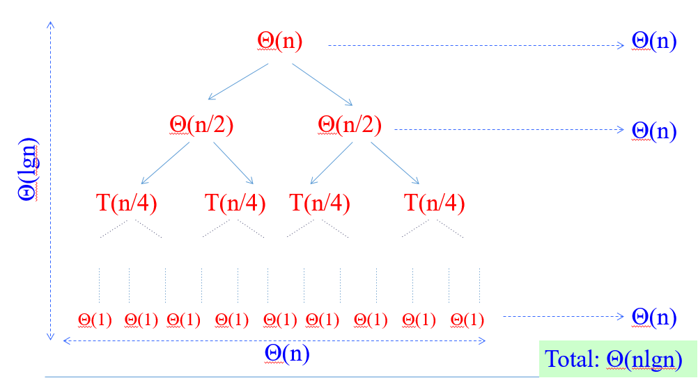

---

## How Height of a Binary Tree is Equal to $logn$ ?

Merge-Sort recursion tree is a perfect binary tree, a binary tree is a tree which every node has at most two children, A perfect binary tree is binary tree in which all internal nodes have exactly two children and all leaves are at the same level.

---

Let $n$ be the number of nodes in the tree and let $l_k$ denote the number of nodes on level k. According to this;

- $l_k = 2l_{k-1}$ i.e. each level has exactly twice as many nodes as the previous level

- $l_0 = 1$ , i.e. on the first level we have only one node (the root node)

- The leaves are at the last level, $l_h$ where $h$ is the height of the tree.

---

**The total number of nodes** in the tree is equal to the sum of the nodes on all the levels: nodes $n$ 

$$
1+2^1+2^2+2^3+...+2^h=n
$$

$$
1+2^1+2^2+2^3+...+2^h=2^{h+1}-1
$$

$$
2^{h+1}-1=n
$$

$$
2^{h+1}=n+1
$$

$$
log_2{2^{h+1}} = log_2{(n+1)}
$$

$$
h+1 = log_2{(n+1)}
$$

$$
h = log_2{(n+1)}-1
$$

---

If we write it as asymptotic approach, we will have the following result

$$
\text{height of tree is }h = log_2{(n+1)}-1 = O(logn)
$$

also

$$
\text{number of leaves is } l_h = (n+1)/2
$$

nearly half of the nodes are at the leaves

---

## Review

$\Theta(nlgn)$ grows more slowly than $\Theta(n^2)$ 

Therefore Merge-Sort beats Insertion-Sort in the worst case

In practice Merge-Sort beats Insertion-Sort for $n>30$ or so

---

## Asymptotic Notations

---

#### Big-O / $O$- Notation : Asymptotic Upper Bound (Worst-Case)

$f(n)=O(g(n))$ if $\exists$ positive constants $c$, $n_0$ such that 

$$
0 \leq f(n) \leq cg(n), \forall n \geq n_0
$$

---


---


---

Asymptotic running times of algorithms are usually defined by functions whose domain are $N={0, 1, 2, …}$  (natural numbers)

---

#### Example-1

Show that $2n^2 = O(n^3)$

we need to find two positive constant $c$ and $n_0$ such that:

$$
0 \leq 2n^2 \leq cn^3 \text{ for all } n \geq n_0
$$

Choose $c=2$ and $n_0 = 1$

$$
2n^2 \leq 2n^3 \text{ for all } n \geq 1
$$

Or, choose $c=1$ and $n_0=2$ 

$$
2n^2 \leq n^3 \text{ for all } n \geq 2
$$

---

#### Example-2

Show that $2n^2 + n = O(n^2)$

We need to find two positive constant $c$ and $n_0$ such that:

$$
0 \leq {2n^2+n} \leq cn^2 \text{ for all } n \geq n_0
$$

$$
2 + (1/n) \leq c \text{ for all } n \geq n_0
$$

Choose $c=3$ and $n_0=1$ 

$$
2n^2 + n \leq 3n^2 \text{ for all } n \geq 1
$$

---

### $O$ - notation continue...

We can say the followings about  $f(n)=O(g(n))$ equation

The notation is a little sloppy

One-way equation, e.q. $n^2 = O(n^3)$ but we cannot say $O(n^3)=n^2$

---

$O(g(n))$ is in fact a set of functions as follow

$O(g(n)) = \{ f(n) : \exist \text{ positive constant } c, n_0 \text{ such that } 0 \leq f(n) \leq cg(n), \forall n \geq n_0 \}$

---

In other words $O(g(n))$ is in fact, the set of functions that have asymptotic upper bound $g(n)$

e.q $2n^2 = O(n^3)$ means $2n^2 \in O(n^3)$

---

#### Examples

$10^9n^2 = O(n^2)$  

$0 \leq 10^9n^2 \leq cn^2 \text{ for } n \geq n_0$

choose $c=10^9$ and $n_0=1$

$0 \leq 10^9n^2 \leq 10^9n^2 \text{ for } n \geq 1$

**CORRECT**

---

$100n^{1.9999}=O(n^2)$

$0 \leq 100n^{1.9999} \leq cn^2 \text{ for } n \geq n_0$

choose $c=100$ and $n_0=1$

$0 \leq 100n^{1.9999} \leq 100n^2 \text{ for } n \geq 1$

**CORRECT**

---

$10^{-9}n^{2.0001} = O(n^2)$

$0 \leq 10^{-9}n^{2.0001} \leq cn^2 \text{ for } n \geq n_0$

$10^{-9}n^{0.0001} \leq c \text{ for } n \geq n_0$

**INCORRECT** (Contradiction)

---

If we analysis $O(n^2)$ case, $O$-notation is an upper bound notation and the runtime $T(n)$ of algorithm A is **at least** $O(n^2 )$.  

$O(n^2)$: The set of functions with asymptotic **upper bound** $n^2$

$T(n) \geq O(n^2)$ means $T(n) \geq h(n)$ for some $h(n) \in O(n^2)$

$h(n)=0$ function is also in $O(n^2)$. Hence : $T(n) \geq 0$ , runtime must be nonnegative.

---

### Big-Omega / $\Omega$-Notation : Asymptotic Lower Bound (Best-Case)

$f(n)=\Omega(g(n))$ if $\exist$ positive constants $c,n_0$ such that $0 \leq cg(n) \leq f(n) , \forall n \geq n_0$

---


---


---

#### Example-1

Show that $2n^3 = \Omega(n^2)$

We need to find two positive constants $c$ and $n_0$ such that:

$$
0 \leq cn^2 \leq 2n^3 \text{ for all } n \geq n_0
$$

Choose $c=1$ and $n_0=1$

$$
n^2 \leq 2n^3 \text{ for all } n \geq 1
$$

---

#### Example-4

Show that $\sqrt{n}=\Omega(lgn)$

We need to find two positive constants $c$ and $n_0$ such that:

$$
clgn \leq \sqrt{n} \text{ for all } n \geq n_0
$$

Choose $c=1$ and $n_0=16$ 

$$
lgn \leq \sqrt{n} \text{ for all } n \geq 16
$$

---

### $\Omega$ - Notation Continue...

$\Omega(g(n))$ is the set of functions that have asymptotic lower bound $g(n)$ 

$$
\Omega(g(n))=\{ f(n):\exist \text{ positive constants } c,n_0 \text{ such that } 0 \leq cg(n) \leq f(n), \forall n \geq n_0 \}
$$

---

#### Examples

$10^9n^2 = \Omega(n^2)$

$0 \leq cn^2 \leq 10^9n^2 \text{ for } n\geq n_0$

Choose $c=10^9$  and  $n_0=1$

$0 \leq 10^9n^2 \leq 10^9n^2 \text{ for } n\geq 1$

**CORRECT**

---

$100n^{1.9999} = \Omega(n^2)$

$0 \leq cn^2 \leq 100n^{1.9999} \text{ for } n \geq n_0$

$n^{0.0001} \leq (100/c) \text{ for } n \geq n_0$

**INCORRECT**(Contradiction)

---

$10^{-9}n^{2.0001} = \Omega(n^2)$

$0 \leq cn^2 \leq 10^{-9}n^{2.0001} \text{ for } n \geq n_0$

Choose $c=10^{-9}$ and $n_0=1$ 

$0 \leq 10^{-9}n^2 \leq 10^{-9}n^{2.0001} \text{ for } n \geq 1$

**CORRECT**

---

### Comparison of notations


---


---

### Big-Theta /$\Theta$-Notation : Asymptotically tight bound (Average Case)

$f(n)=\Theta(g(n))$ if $\exist$ positive constants $c_1,c_2,n_0$ such that $0 \leq c_1g(n) \leq f(n) \leq c_2g(n), \forall n \geq n_0$

---


---

### Example-1

Show that $2n^2 + n = \Theta(n^2)$

We need to find 3 positive constants $c_1,c_2$ and $n_0$ such that:

$0 \leq c_1n^2 \leq 2n^2+n \leq c_2n^2$ for all $n \geq n_0$

$c_1 \leq 2 + (1/n) \leq c_2$ for all $n \geq n_0$

Choose $c_1=2, c_2=3$ and $n_0=1$ 

$2n^2 \leq 2n^2+n \leq 3n^2$ for all $n \geq 1$

---

### Example-2

Show that $1/2n^2-2n=\Theta(n^2)$

We need to find 3 positive constants $c_1,c_2$ and $n_0$ such that:

$0 \leq c_1n^2 \leq 1/2n^2-2n \leq c_2n^2 \text{ for all } n \geq n_0$

$c_1 \leq 1/2 - 2 / n \leq c_2 \text{ for all } n \geq n_0$

Choose 3 positive constants $c_1,c_2, n_0$ that satisfy $c_1 \leq 1/2 - 2/n \leq c_2$ for all $n \geq n_0$ 

---


---

$$
1/10 \leq 1/2 - 2/n \text{ for } n \geq 5
$$

$$
1/2 - 2/n \leq 1/2 \text{ for } n \geq 0 
$$

Therefore we can choose $c_1 = 1/10, c_2=1/2, n_0=5$

---

### $\Theta$-Notation Continue...

**Theorem**: leading constants & low-order terms don’t matter

**Justification**: can choose the leading constant large enough to make high-order term dominate other terms

---

### Examples

$10^9n^2 = \Theta(n^2)$  **CORRECT**

$100n^{1.9999} = \Theta(n^2)$ **INCORRECT**

$10^9n^{2.0001} = \Theta(n^2)$ **INCORRECT**

---

$\Theta(g(n))$ is the set of functions that have asymptotically tight bound $g(n)$

$\Theta(g(n))=\{ f(n): \exist \text{ positive constants } c_1,c_2, n_0 \text{ such that } 0 \leq c_1g(n) \leq  f(n) \leq  c_2g(n), \forall n \geq n_0 \}$

---

**Theorem**: 

$f(n)=\Theta(g(n))$ if and only if $f(n)=O(g(n))$ and $f(n)=\Omega(g(n))$

$\Theta$ is stronger than both $O$ and $\Omega$ 

$\Theta(g(n)) \subseteq O(g(n)) \text{ and } \Theta(g(n)) \subseteq \Omega(g(n))$ 

---

#### Example

Prove that $10^{-8}n^2 \neq \Theta(n)$

We can check that $10^{-8}n^2 = \Omega(n)$ and $10^{-8}n^2 \neq O(n)$

Proof by contradiction for $O(n)$ notation

$$
O(g(n)) = \{ f(n) : \exist \text{ positive constant } c, n_0 \text{ such that } 0 \leq f(n) \leq cg(n), \forall n \geq n_0 \}
$$

---

Suppose positive constants $c_2$ and $n_0$ exist such that: 

$10^{-8}n^2 \leq c_2n, \forall  n \geq n_0$

$10^{-8}n \leq c_2, \forall n \geq n_0$

**Contradiction**: $c_2$ is a constant

---

### Summary of $O,\Omega$ and $\Theta$ notations

$O(g(n))$ : The set of functions with asymptotic upper bound $g(n)$

$\Omega(g(n))$ :  The set of functions with asymptotic lower bound  $g(n)$

$\Theta(n)$: The set of functions with asymptotically tight bound $g(n)$

$f(n)=\Theta(g(n)) \Leftrightarrow f(n)=O(g(n)) \text{ and } f(n)=\Omega(g(n))$ 

---


---

### Small-o / $o$-Notation : Asymptotic upper bound that is not tight

Remember, upper bound provided by big- $O$ notation can be tight or not tight

Tight mean values are close the original function

e.g. followings are true

$2n^2 = O(n^2)$ is asymptotically tight

$2n = O(n^2)$ is not asymptotically tight

According to this small-$o$ notation is an upper bound that is not asymptotically tight

---

**Note that in equations equality is removed in small notations**

$o(g(n))=\{ f(n): \text{ for any constant} c > 0, \exist \text{ a constant } n_0 > 0, \text{ such that } 0 \leq f(n) < cg(n), \forall n \geq n_0 \}$

$$
\lim_{n \to \infty} \frac{f(n)}{g(n)} = 0
$$

e.g $2n=o(n^2)$ any positive $c$ satisfies but $2n^2 \neq o(n^2)$  $c=2$ does not satisfy

---

### Small-omega / $\omega$-Notation: Asymptotic lower bound that is not tight

$\omega(g(n))=\{ f(n): \text{ for any constant } c > 0, \exist \text{ a constant } n_0>0, \text{ such that } 0 \leq cg(n) < f(n), \forall n \geq n_0$

$$
\lim_{n \to \infty} \frac{f(n)}{g(n)} = \infty
$$

e.g. $n^2/2=\omega(n)$, any positive $c$ satisfies but $n^2/2 \neq \omega(n^2)$, $c=1/2$ does not satisfy

---

### (Important) Analogy to compare of two real numbers

$$
f(n)= O(g(n)) \leftrightarrow a \leq b 
$$

$$
f(n)= \Omega(g(n)) \leftrightarrow a \geq b 
$$

$$
f(n)= \Theta(g(n)) \leftrightarrow a = b 
$$

$$
f(n)= o(g(n)) \leftrightarrow a < b 
$$

$$
f(n)= \omega(g(n)) \leftrightarrow a > b 
$$

---

Trichotomy property for real numbers:

 For any two real numbers $a$ and $b$, we have either

 $a<b$, or $a=b$, or $a>b$

Trichotomy property does not hold for asymptotic notation, for two functions $f(n)$ and $g(n)$, it may be the case that neither $f(n)=O(g(n))$ nor $f(n)=\Omega(g(n))$ holds. 

e.g. $n$ and $n^{1+sin(n)}$ cannot be compared asymptotically

---

### Examples

| $5n^2=O(n^2)$       | TRUE     | $n^2lgn = O(n^2)$      | FALSE |
| ------------------- | -------- | ---------------------- | ----- |
| $5n^2=\Omega(n^2)$  | **TRUE** | $n^2lgn = \Omega(n^2)$ | TRUE  |
| $5n^2=\Theta(n^2)$  | **TRUE** | $n^2lgn = \Theta(n^2)$ | FALSE |
| $5n^2=o(n^2)$       | FALSE    | $n^2lgn = o(n^2)$      | FALSE |
| $5n^2=\omega(n^2)$  | FALSE    | $n^2lgn = \omega(n^2)$ | TRUE  |
| $2^n = O(3^n)$      | **TRUE** |                        |       |
| $2^n = \Omega(3^n)$ | FALSE    | $2^n=o(3^n)$           | TRUE  |
| $2^n = \Theta(3^n)$ | FALSE    | $2^n = \omega(3^n)$    | FALSE |

---

### Asymptotic Function Properties

**Transitivity**: holds for all

e.g. $ f(n) = \Theta(g(n)) \& g(n)=\Theta(h(n)) \Rightarrow f(n)=\Theta(h(n))$

**Reflexivity**: holds for $\Theta,O,\Omega$

e.g. $f(n)=O(f(n))$

**Symmetry**: hold only for $\Theta$

e.g. $f(n)=\Theta(g(n)) \Leftrightarrow g(n)=\Theta(f(n))$

**Transpose Symmetry**: holds for $(O \leftrightarrow \Omega)$ and $(o \leftrightarrow \omega)$

e.g. $f(n)=O(g(n))\Leftrightarrow g(n)=\Omega(f(n))$

---

### Using $O$-Notation to Describe Running Times

Used to bound worst-case running times, Implies an upper bound runtime for arbitrary inputs as well

**Example:**

Insertion sort has worst-case runtime of $O(n^2 )$

**Note:**

- This $O(n^2)$ upper bound also applies to its running time on every input
  
  - Abuse to say “running time of insertion sort is $O(n^2)$"

- For a given $n$, the actual running time depends on the particular input of size $n$
  
  - i.e., running time is not only a function of $n$

- However, **worst-case** running time is only a function of $n$

---

- When we say:
  
  - Running time of insertion sort is $O(n^2)$

- What we really mean is
  
  - Worst-case running time of insertion sort is $O(n^2)$

- or equivalently
  
  - No matter what particular input of size n is chosen, the running time on that set of inputs is $O(n^2)$

---

### Using $\Omega$-Notation to Describe Running Times

Used to bound best-case running times, Implies a lower bound runtime for arbitrary inputs as well

**Example:**

Insertion sort has best-case runtime of $\Omega(n)$

**Note**:

- This $\Omega(n)$ lower bound also applies to its running time on every input

---

- When  we say
  
  - Running time of algorithm A is $\Omega(g(n))$

- What we mean is
  
  - For any input of size $n$, the runtime of A is *at least* a constant times $g(n)$ for sufficiently large $n$

- It’s not contradictory to say
  
  - **worst-case** running time of insertion sort is $\Omega(n^2)$
  
  - Because there exists an input that causes the algorithm to take $\Omega(n^2)$

---

### Using $\Theta$-Notation to Describe Running Times

Consider 2 cases about the runtime of an algorithm

- Case 1: Worst-case and best-case not asymptotically equal
  
  - Use $\Theta$-notation to bound worst-case and best-case runtimes separately

- Case 2: Worst-case and best-case asymptotically equal 
  
  - Use $\Theta$-notation to bound the runtime for any input

---

- Case 1: Worst-case and best-case not asymptotically equal
  - Use $\Theta$-notation to bound the worst-case and best-case runtimes separately
  - We can say: 
    - "The worst-case runtime of insertion sort is $\Theta(n^2)$"
    - "The best-case runtime of insertion sort is $\Theta(n)$"
  - But, we can’t say:
    - "The runtime of insertion sort is $\Theta(n^2)$ for every input"
  - A $\Theta$-bound on worst/best-case running time does not apply to its running time on arbitrary inputs

---

e.g. for merge-sort, we have:

$$
T(n)=\Theta(nlgn)\begin{cases} T(n)=O(nlgn)\\ T(n)=\Omega(nlgn)\end{cases}
$$

---

### Using Asymptotic Notation to Describe Runtimes Summary

- "The worst case runtime of Insertion Sort is $O(n^2)$"
  
  - Also implies: "The runtime of Insertion Sort is $O(n^2)$"

- "The best-case runtime of Insertion Sort is $\Omega(n)$"
  
  - Also implies: "The runtime of Insertion Sort is $\Omega(n)$"

---

- "The worst case runtime of Insertion Sort is $\Theta(n^2)$"
  
  - But: "The runtime of Insertion Sort is not $\Theta(n^2)$"

- "The best case runtime of Insertion Sort is $\Theta(n)$"
  
  - But: "The runtime of Insertion Sort is not $\Theta(n)$"

---

  Which one is true?

- **FALSE** "The worst case runtime of Merge Sort is $\Theta(nlgn)$"

- **FALSE** "The best case runtime of Merge Sort is $\Theta(nlgn)$"

- **TRUE** "The runtime of Merge Sort is $\Theta(nlgn)$"
  
  - This is true, because the best and worst case runtimes have asymptotically the same tight bound $\Theta(nlgn)$

---

### Asymptotic Notation in Equations

- Asymptotic notation appears alone on the **RHS** of an equation:
  
  - implies set membership 
    
    - e.g., $n = O(n^2)$ means $n \in O(n^2)$  

Asymptotic notation appears on the **RHS** of an equation
stands for some anonymous function in the set

- e.g., $2n^2 + 3n + 1 = 2n^2  + \Theta(n)$  means:

- $2n^2 + 3n + 1 = 2n^2  + h(n)$, for some $h(n) \in \Theta(n)$ 
  
  - i.e., $h(n) = 3n + 1$ 

---

- Asymptotic notation appears on the **LHS** of an equation:
  
  - stands for any anonymous function in the set
    
    - e.g., $2n^2 + \Theta(n) = \Theta(n^2)$ means:
  
  - for any function $g(n) \in \Theta(n)$  
  
  - $\exist$ some function $h(n)\in \Theta(n^2)$ 
    
    - such that $2n^2+g(n) = h(n)$ 

- **RHS** provides coarser level of detail than **LHS**

---

## References

[Introduction to Algorithms, Third Edition | The MIT Press](https://mitpress.mit.edu/books/introduction-algorithms-third-edition)

http://nabil.abubaker.bilkent.edu.tr/473/

[Insertion Sort - GeeksforGeeks](https://www.geeksforgeeks.org/insertion-sort/)

http://www.cs.gettysburg.edu/~ilinkin/courses/Fall-2012/cs216/notes/bintree.pdf

[Dictionary of Algorithms and Data Structures](https://xlinux.nist.gov/dads/)

[big-O notation](https://xlinux.nist.gov/dads/HTML/bigOnotation.html)

[Omega](https://xlinux.nist.gov/dads/HTML/omegaCapital.html)
