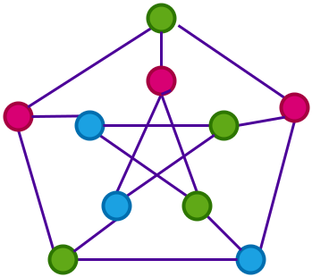
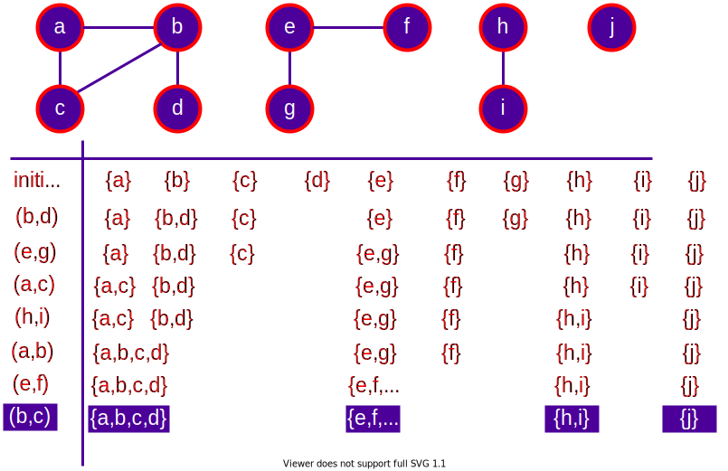
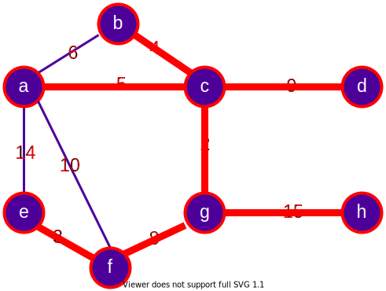

<!-- _backgroundColor: aquq -->

<!-- _color: orange -->

<!-- paginate: false -->

## CE100 Algorithms and Programming II

## Week-10 (Graphs)

#### Spring Semester, 2021-2022

Download [DOC-PDF](ce100-week-10-graphs.en.md_doc.pdf), [DOC-DOCX](ce100-week-10-graphs.en.md_word.docx), [SLIDE](ce100-week-10-graphs.en.md_slide.pdf), [PPTX](ce100-week-10-graphs.en.md_slide.pptx)

<iframe width=700, height=500 frameBorder=0 src="../ce100-week-10-graphs.en.md_slide.html"></iframe>

---

<!-- paginate: true -->

## Graphs

## Outline

- Introduction to Graphs
- Graphs and Representation
- BFS (Breath-First Search) 
- DFS (Depth-First Search) 
  - in-order 
  - post-order 
  - pre-order 

---

- Topological Order 
- SCC (Strongly Connected Components) 
- MST 
  - Prim 
  - Kruskal 

---

<style scoped>section{ font-size: 40px; }</style>

## **Introduction to Graphs**

---

### Introduction to Graphs

- The graph is a non-linear data structure. 

- It contains a set of points known as 
  
  - nodes (or vertices) and 
  
  - a set of links known as edges (or Arcs). 

---

### Introduction to Graphs

- Here edges are used to connect the vertices. A graph is defined as follows.
- Generally, a graph $G$ is represented as $G=(V,E)$, where 
  - $V$ is set of vertices and 
  - $E$ is set of edges.


---

<style scoped>section{ font-size: 30px; }</style>

### Introduction to Graphs - **Example**

- The following is a graph with `5 vertices` ($V$) and `6 edges` ($E$).
- This graph G can be defined as

$$
\begin{aligned}
G&=(V,E)
\end{aligned}
$$

$$
\begin{align*}
V&=\{A,B,C,D,E\}&
\end{align*}
$$

$$
\begin{align*}
E=\{&(A,B),(A,C),(A,D),\\
    &(B,D),(C,D),(B,E),\\
    &(E,D)\}
\end{align*}
$$


---

<style scoped>section{ font-size: 40px; }</style>

## **Graph Terminology**

---

## **Graph Terminology**

### Vertex

Individual data element of a graph is called as Vertex. Vertex is also known as node. In above example graph, $A, B, C, D, E$ are known as vertices.


---

## **Graph Terminology**

### Edge

- An edge is a connecting link between two vertices. 
- Edge is also known as Arc. 
- An edge is represented as 

$$
(\text{startingVertex}, \text{endingVertex})
$$

- For example, in above graph the link between vertices $A$ and $B$ is represented as 

$$
(A,B)
$$


---

## **Graph Terminology**

### Edge

- In example graph, there are $7$ edges 

$$
(A,B),(A,C),(A,D),\\
(B,D),(B,E),(C,D),(D,E)
$$


---

## **Graph Terminology**

### Edge

- Edges are three types.
  
  - Undirected Edge 
  - Directed Edge
  - Weighted Edge
  
  

---

## **Graph Terminology**

### Edge

#### Undirected Edge

- An undirected egde is a bidirectional edge. If there is undirected edge between vertices $A$ and $B$ then edge $(A,B)$ is equal to edge $(B,A)$
  
  

---

## **Graph Terminology**

### Edge

#### Directed Edge

- A directed egde is a unidirectional edge. If there is directed edge between vertices A and B then edge $(A,B)$ is not equal to edge $(B,A)$.
  
  

---

## **Graph Terminology**

### Edge

#### Weighted Edge

- A weighted egde is a edge with value (cost) on it.
  
  

---

## **Graph Terminology**

### Undirected Graph

- A graph with only undirected edges is said to be undirected graph.
  
  

---

## **Graph Terminology**

### Directed Graph

- A graph with only directed edges is said to be directed graph.
  
  

---

## **Graph Terminology**

### Mixed Graph

- A graph with both undirected and directed edges is said to be mixed graph.
  
  

---

## **Graph Terminology**

### End vertices or Endpoints

- The two vertices joined by edge are called end vertices (or endpoints) of that edge.

- In graph theory, a vertex with degree 1 is called an end vertex (plural end vertices)
  
  

---

## **Graph Terminology**

### Origin

- If a edge is directed, its first endpoint is said to be the origin of it.
  
  

---

## **Graph Terminology**

### Destination

- If a edge is directed, its first endpoint is said to be the origin of it and the other endpoint is said to be the destination of that edge.
  
  

---

## **Graph Terminology**

### Adjacent

- If there is an edge between vertices $A$ and $B$ then both $A$ and $B$ are said to be adjacent. In other words, vertices A and B are said to be adjacent if there is an edge between them.

  

---

## **Graph Terminology**

### Incident

- **Edge/Arc** is said to be **incident** on a **Vertex/Node** if the **Vertex/Node** is one of the endpoints of that **Edge/Arc**.

- An incidence is a pair $(B, e1)$ where $B$ is a vertex and $e1$ is an edge incident to $B$

- Two distinct incidences $(B, e1)$ and $(v,e2)$ are adjacent if and only if $B = v$, $e1 = e2$ or $BB' = e1$ or $e2$.
  
  

---

## **Graph Terminology**

### Outgoing Edge

- A directed edge is said to be outgoing edge on its origin vertex.


---

## **Graph Terminology**

### Incoming Edge

- A directed edge is said to be incoming edge on its destination vertex.


---

## **Graph Terminology**

### Degree

- Total number of edges connected to a vertex is said to be degree of that vertex.


---

## **Graph Terminology**

### Indegree

- Total number of incoming edges connected to a vertex is said to be indegree of that vertex.


---

## **Graph Terminology**

### Outdegree

- Total number of outgoing edges connected to a vertex is said to be outdegree of that vertex.


---

## **Graph Terminology**

### Parallel edges or Multiple edges

- If there are two undirected edges with same end vertices and two directed edges with same origin and destination, such edges are called parallel edges or multiple edges.


---

## **Graph Terminology**

### Self-loop

- Edge (undirected or directed) is a self-loop if its two endpoints coincide with each other.


---

## **Graph Terminology**

### Simple Graph

- A graph is said to be simple if there are no parallel and self-loop edges.


---

## **Graph Terminology**

### Complex Graph

- A graph is said to be complex if there are parallel or self-loop edges.


---

## **Graph Terminology**

### Path

- A path is a sequence of alternate vertices and edges that starts at a vertex and ends at other vertex such that each edge is incident to its predecessor and successor vertex.


---

<style scoped>section{ font-size: 40px; }</style>

## **Graph Representations**

---

## **Graph Representations**

- Graph data structure is represented using following representations
  - **Adjacency Matrix**
  - **Incidence Matrix**
  - **Adjacency List**

---

## **Graph Representations**

### Adjacency Matrix

- In this representation, the graph is represented using a matrix of size total number of vertices by a total number of vertices. 
- That means a graph with 4 vertices is represented using a matrix of size 4X4.
- In this matrix, both rows and columns represent vertices. 
  - This matrix is filled with either 1 or 0. 
  - Here, 
    - 1 represents that there is an edge from row vertex to column vertex and 
    - 0 represents that there is no edge from row vertex to column vertex.

---

## **Graph Representations**

### Adjacency Matrix

- Undirected Graph


---

## **Graph Representations**

### Adjacency Matrix

- Directed Graph


---

<style scoped>section{ font-size: 26px; }</style>

## **Graph Representations**

### Incidence Matrix

- In this representation, the graph is represented using a matrix of size total number of vertices by a total number of edges. 
- That means graph with 4 vertices and 6 edges is represented using a matrix of size 4X6. 
- In this matrix, rows represent vertices and columns represents edges. 
- This matrix is filled with 0 or 1 or -1. 
  - Here, 
    - 0 represents that the row edge is not connected to column vertex, 
    - 1 represents that the row edge is connected as the outgoing edge to column vertex and 
    - -1 represents that the row edge is connected as the incoming edge to column vertex.

---

<style scoped>section{ font-size: 28px; }</style>

## **Graph Representations**

### Incidence Matrix


---

<style scoped>section{ font-size: 28px; }</style>

## **Graph Representations**

### Adjacency List

- In this representation, every vertex of a graph contains list of its adjacent vertices.

---

<style scoped>section{ font-size: 28px; }</style>

## **Graph Representations**

### Adjacency List

- Linked List Implementation


---

<style scoped>section{ font-size: 28px; }</style>

## **Graph Representations**

### Adjacency List

- Reference Array Implementation


---

<style scoped>section{ font-size: 40px; }</style>

## **Graph Representations** - Review

---

<style scoped>section{ font-size: 30px; }</style>

## **Graph Representations** - Review

- The standard two ways to represent a graph $G=(V,E)$
  - As a collection of **adjacency-lists**
  - As an **adjacency-matrix**
- **Adjacency-list** representation is usually preferred
- Provides a compact way to represent sparse graphs
  - Those graphs for which $|E| << |V|^2$

---

<style scoped>section{ font-size: 30px; }</style>

## **Graph Representations** - Review

- **Adjacency-matrix** representation may be preferred 
  - for dense graphs for which $|E|$ is close to $|V|^2$
  - when we need to be able to tell quickly if there is an edge connecting two given vertices

---

<style scoped>section{ font-size: 30px; }</style>

## **Adjacency-List Representation** - Review

- An array $Adj$ of $|V|$ lists, one for each vertex $u \in V$
- For each $u \in V$ the adjacency-list $Adj[u]$ contains (pointers to) all vertices $v$ such that $(u,v) \in E$
- That is, $Adj[u]$ consists of all vertices adjacent to $u$ in $G$
- The vertices in each adjacency-list are stored in an arbitrary order

---

<style scoped>section{ font-size: 30px; }</style>

## **Adjacency-List Representation** - Review

- If $G$ is a directed graph 
  - The sum of the lengths of the adjacency lists $=|E|$
- If $G$ is an undirected graph 
  - The sum of the lengths of the adjacency lists $=2|E|$
  - since an edge $(u,v)$ appears in both $Adj[u]$ and $Adj[v]$ 

---

<style scoped>section{ font-size: 30px; }</style>

## **Undirected Graphs Representations** - Review


---

<style scoped>section{ font-size: 30px; }</style>

## **Directed Graphs Representations** - Review


---

<style scoped>section{ font-size: 30px; }</style>

## **Adjacency List Representation (continued)** - Review

- Adjacency list representation has the desirable property
  - it requires $O(max(V,E)) = O(V+E)$ memory
  - for both undirected and directed graphs
- Adjacency lists can be adopted to represent **weighted graphs** 
  - each edge has an associated **weight** typically given by a **weight function** $w: E \rightarrow R$
- The weight $w(u, v)$ of an edge $(u, v) \in E$ is simply stored with 
  - vertex $v$ in $Adj[u]$ or with                                                  
  - vertex $u$ in $Adj[v]$ or **both**

---

<style scoped>section{ font-size: 30px; }</style>

## **Adjacency List Representation (continued)** - Review

- A **potential disadvantage** of adjacency list representation
  - there is no quicker way to determine if a given edge $(u, v)$ is present in G than to search $v$ in $Adj[u]$ or $u$ in $Adj[v]$
- This disadvantage can be remedied by an **adjacency matrix** representation at the cost of using asymptotically more memory

---

<style scoped>section{ font-size: 25px; }</style>

## **Adjacency Matrix Representation** - Review

- Assume that, the vertices of $G=(V, E)$ are numbered as $1,2,\dots,|V|$ 
- Adjacency matrix rep. consists of a $|V|\times|V|$ matrix $A=(a_{ij}) \backepsilon$ 

$$
a_{ij}=
\begin{cases} 
1 & \text{if} \ (i,j) \in E \\ 
0 & otherwise 
\end{cases}
$$

- Requires $\Theta(V^2)$ memory independent of the number of edges $|E|$
- We define the transpose of a matrix $A=(a_{ij})$ to be the matrix
  - $A^T = (a_{ij})^T$ given by $a_{ij}^T = a_{ji}$
- Since in an undirected graph, $(u,v)$ and $(v,u)$ represent the same edge $A = A^T$ for an undirected graph
- That is, adjacency matrix of an undirected graph is symmetric
- Hence, in some applications, only upper triangular part is stored

---

<style scoped>section{ font-size: 30px; }</style>

## **Adjacency Matrix Representation** - Review

- Adjacency matrix representation can also be used for
  - weighted graphs

$$
a_{ij}=
\begin{cases} 
w(i,j) & \text{if} \ (i,j) \in E \\ 
NIL \ or \ 0 \ or \ \infty & otherwise 
\end{cases}
$$

- Adjacency matrix may also be preferable for
  - reasonably small graphs
- Moreover, if the graph  is unweighted
  - rather than using one word of memory for each matrix entry adjacency matrix representation uses one bit per entry

---

<style scoped>section{ font-size: 30px; }</style>

### **Introduction to Graphs** - Review

$G=(V,E)$

- Adjency List Complexity $O(degree \ of \ u)$ $(u,v) \in E$
- Sparse Matrix $\rightarrow$ $|E|<|V^2|$
- Dense Matrix $\rightarrow$ $|E| \ close \ to \ |V^2|$
- Space Complexity $\Theta(|V|+|E|)$

---

<style scoped>section{ font-size: 27px; }</style>

### **Introduction to Graphs** - Review

- Many definitions for directed and undirected graphs are the same although certain terms have slightly different meanings
- If $(u,v) \in E$ in a **directed graph** $G=(V,E)$, we say that $(u,v)$ is **incident from** or **leaves** vertex $u$ and is **incident to** or **enters** vertex $v$
- If $(u,v) \in E$ in an **undirected graph** $G=(V,E)$, we say that $(u,v)$ is **incident on** vertices $u$ and $v$
- If $(u,v)$ is an edge in a graph $G=(V,E)$, we say that vertex $v$ is **adjacent to** vertex $u$
- When the graph is **undirected**,the **adjacency relation** is symmetric
- When the graph is **directed** 
  - the **adjacency relation** is **not necessarily symmetric**
  - if $v$ is adjacent to $u$, we sometimes write $u \rightarrow v$

---

<style scoped>section{ font-size: 27px; }</style>

### **Introduction to Graphs** - Review

- The **degree** of a vertex in an **undirected graph** is the number of edges **incident on** it
- In a directed graph, 
  - **out-degree of a vertex:** number of edges **leaving** it
  - **in-degree of a vertex:** number of edges **entering** it
  - **degree of a vertex:** its **in-degree** + its **out-degree**
- A **path** of **length** $k$ from a vertex $u$ to a vertex $u'$ in a graph $G=(V,E)$ is a **sequence** $\langle v_0,v_1,v_2,\dots,v_k \rangle$ of vertices such 
  - that $v_0=u$,$v_k=u'$ and $(v_{i-1},v_i) \in E$, for $i=1,2,\dots,k$
- The **length** of a **path** is the **number of edges** in the path

---

<style scoped>section{ font-size: 27px; }</style>

### **Introduction to Graphs** - Review

- If there is a path $p$ from $u$ to $u'$, we say that $u'$ is **reachable** from $u$ via $p: u \xrightarrow[]{p} u'$
- A **path is simple** if all vertices in the path are **distinct**
- A **subpath** of path $p= \langle v_0,v_1,v_2,\dots,v_k \rangle$ is a **contiguous subsequence** of its vertices
- That is, for any $0 \leq i \leq j \leq k$, the subsequence of vertices $\langle v_i, v_{i+1},\dots, v_j \rangle$ is a **subpath** of $p$
- In a **directed graph**, a path $\langle v_0,v_1,\dots, v_k\rangle$ forms a **cycle** if $v_0=v_k$ and the path contains at least one edge
- The **cycle** is **simple** if, in addition, $v_0,v_1,\dots,v_k$ are **distinct** 
- A **self-loop** is a **cycle** of **length 1**

---

<style scoped>section{ font-size: 27px; }</style>

### **Introduction to Graphs** - Review

Two paths $\langle v_0,v_1,v_2,\dots,v_k\rangle$ & $\langle v_0',v_1',v_2',\dots,v_k'\rangle$ form the **same cycle** if there is an integer $j$ such that $v_i' = v_{(i+j)\ \text{mod} \ k }$ for $i=0,1,\dots,k-1$


- The path $p_1 = \langle 1, 2, 4, 1\rangle$ forms the same cycles as the paths
  - $p_2= \langle 2, 4, 1, 2 \rangle$ and $p_3= \langle 4, 1, 2, 4\rangle$
- A **directed graph** with **no self-loops** is **simple**
- In an **undirected graph** a path $\langle v_0,v_1,\dots,v_k\rangle$ forms a **cycle**
  - if $v_0=v_k$ and $v_1,v_2,\dots,v_k$ are **distinct**
- A **graph** with **no cycles** is **acyclic**

---

<style scoped>section{ font-size: 28px; }</style>

### **Introduction to Graphs** - Review

- An **undirected graph** is **connected**
  - if every pair of vertices is **connected** by a **path**
- The **connected components** of a graph are the
  - **equivalence classes** of vertices under the
  - "**is reachable from**" relation
- An **undirected graph** is **connected** if it has exactly **one component**, 
  - i.e., if every vertex is reachable from every other vertex

---

<style scoped>section{ font-size: 28px; }</style>

### **Introduction to Graphs** - Review

- A **directed graph** is **strongly-connected**
  - if every two vertices are reachable from each other
- The **strongly-connected components** of a digraph are the 
  - **equivalence classes** of vertices under the
  - "**are mutually reachable**" relation
- A directed graph is **strongly-connected**
  - if it has **only one strongly-connected component**


---

<style scoped>section{ font-size: 25px; }</style>

### **Introduction to Graphs** - Review

- Two graphs $G=(V,E)$ and $G'=(V',E')$ are **isomorphic**
  - if there exists a bijection $f : V \rightarrow V'$ such that
  - $(u, v) \in E \iff (f (u), f (v)) \in E'$
- That is, we can relabel the vertices of $G$ to be vertices of $G'$ maintaining the corresponding edges in $G$ and $G'$


---

<style scoped>section{ font-size: 25px; }</style>

### **Introduction to Graphs** - Review

- A graph $G'=(V', E')$ is a **subgraph** of $G=(V,E)$ if
  - $V \subseteq V$ and $E' \subseteq E$
- Given a set $V' \subseteq V$, the subgraph of $G$ **induced** by $V'$ is the graph 
  - $G'=(V', E')$ where $E'=\{(u,v) \in E: u,v \in V'\}$


---

<style scoped>section{ font-size: 25px; }</style>

### **Introduction to Graphs** - Review

- Given an **undirected** graph $G=(V,E)$, the **directed version** of $G$ is the directed graph $G'=(V', E')$, where
  - $(u,v)\in E'$ and $(v,u) \in E' \iff (u,v) \in E$ 
- That is, each undirected edge $(u,v)$ in $G$ is replaced in $G'$ by two directed edges $(u,v)$ and $(v,u)$
- Given a **directed** graph $G=(V,E)$, the **undirected version** of G is the undirected graph $G'=(V',E')$, where
  - $(u,v) \in E' \iff u \neq v$ and $(u,v) \in E$
- That is the undirected version contains the edges of G 
  - "**with their directions removed**" and with **self-loops eliminated**

---

<style scoped>section{ font-size: 25px; }</style>

### **Introduction to Graphs** - Review


- i.e., $(u,v)$ and $(v,u)$ in $G$ are replaced in $G'$ by the same edge $(u,v)$
- In a directed graph $G=(V,E)$, a neighbor of a vertex $u$ is any vertex that is adjacent to $u$ in the undirected version of $G$
- That, is $v$ is a neighbor of $u \iff$ either $(u,v)\in E$ or $(v,u) \in E$ 


- $v$ is a neighbor of $u$ in both cases
- In an **undirected graph**, $u$ and $v$ are **neighbors** if they are **adjacent**

---

<style scoped>section{ font-size: 25px; }</style>

### **Introduction to Graphs** - Review

- Several kinds of graphs are given special names
  - **Complete graph:** undirected graph in which every pair of vertices is **adjacent**
  - **Bipartite graph:** undirected graph $G=(V,E)$ in which $V$ can be partitioned into two disjoint sets $V_1$ and $V_2$ such that
    - $(u,v) \in E$ implies either $u \in V_1$ and $v \in V_2$ or $u \in V_2$ and $v \in V_1$


---

<style scoped>section{ font-size: 25px; }</style>

### **Introduction to Graphs** - Review

- **Forest**: *acyclic*, *undirected graph*
- **Tree**: *connected*, *acyclic*, *undirected graph*
- **Dag**: *directed* *acyclic graph*
- **Multigraph**: *undirected graph* with *multiple edges between vertices* and *self-loops*

---

<style scoped>section{ font-size: 25px; }</style>

### **Introduction to Graphs** - Review

- **Hypergraph**: like an *undirected graph*, but each *hyperedge*,
  - rather than connecting two *vertices*,
  - connects an arbitrary subset of *vertices*


---

<style scoped>section{ font-size: 40px; }</style>

## **Free Trees**

---

<style scoped>section{ font-size: 30px; }</style>

## **Free Trees**

- A **free tree** is a **connected, acyclic, undirected** graph
- We often omit the adjective "**free**" when we say that a graph is a tree
- If an undirected graph is acyclic but possibly disconnected it is a **forest**

---

<style scoped>section{ font-size: 30px; }</style>

## **Theorem (Properties of Free Trees)**

- The following are equivalent for an undirected graph $G=(V,E)$
1. $G$ is a free tree
2. Any two vertices in $G$ are connected by a unique simple-path
3. $G$ is connected, but if any edge is removed from E the resulting graph is disconnected
4. $G$ is connected, and $|E| = |V|-1$
5. $G$ is acyclic, and $|E| = |V| - 1$
6. $G$ is acyclic, but if any edge is added to $E$, the resulting graph contains a cycle

---

<style scoped>section{ font-size: 30px; }</style>

## **Properties of Free Trees $(1 \Rightarrow 2)$**

1. G is a free tree
2. Any two vertices in G are connected by a unique simple-path

---

<style scoped>section{ font-size: 30px; }</style>

## **Properties of Free Trees $(1 \Rightarrow 2)$**

- Since a tree is connected, any two vertices in $G$ are connected by a simple path
  - Let two vertices $u,v \in V$ are connected by two simple paths $p_1$ and $p_2$
  - Let $w$ and $z$ be the first vertices at which $p_1$ and $p_2$ diverge and re-converge
  - Let $p'_1$ be the subpath of $p_1$ from $w$ to $z$
  - Let $p'_2$ be the subpath of $p_2$ from $w$ to $z$
  - $p'_1$ and $p'_2$ share no vertices except their end points
  - The path $p'_1 || p'_2$ is a cycle (contradiction)

---

<style scoped>section{ font-size: 30px; }</style>

## **Properties of Free Trees $(1 \Rightarrow 2)$**


- $p'_1$ and $p'_2$ share no vertices except their end points
- $p'_1 || p'_2$ is a cycle (contradiction)
- Thus, if $G$ is a tree, there can be at most one path between two vertices


---

<style scoped>section{ font-size: 30px; }</style>

## **Properties of Free Trees $(2 \Rightarrow 3)$**

2. Any two vertices in $G$ are connected by a unique simple-path
3. $G$ is connected, but if any edge is removed from $E$ the resulting graph is disconnected

---

<style scoped>section{ font-size: 30px; }</style>

## **Properties of Free Trees $(2 \Rightarrow 3)$**

- If any two vertices in $G$ are connected by a unique simple path, then $G$ is connected
  - Let $(u,v)$ be any edge in $E$. This edge is a path from $u$ to $v$. So it must be the unique path from $u$ to $v$
- Thus, if we remove $(u,v)$ from $G$, there is no path from $u$ to $v$
- Hence, its removal disconnects $G$

---

<style scoped>section{ font-size: 30px; }</style>

## **Properties of Free Trees $(3 \Rightarrow 4)$**

- Before proving $3 \Rightarrow 4$ consider the following
- **Lemma**: any connected, undirected graph $G=(V,E)$ 
  - satisfies $|E| \geq |V|-1$
- **Proof**: Consider a graph $G'$ with $|V|$ vertices and no edges. 
  - Thus initially there are $|C|=|V|$ connected components
    - Each isolated vertex is a connected component
  - Consider an edge $(u,v)$ and let $C_u$ and $C_v$ denote the connected-components of $u$ and $v$

---

<style scoped>section{ font-size: 30px; }</style>

## **Properties of Free Trees (Lemma)$**

- If $C_u \neq C_v$ then $(u,v)$ connects $C_u$ and $C_v$ into a 
  - connected component $C_{uv}$
- Otherwise $(u,v)$ adds an extra edge to the 
  - connected component $C_u = C_v$
- Hence, each edge added to the graph reduces the 
  - number of connected components by at most $1$
- Thus, at least $|V|-1$ edges are required to reduce the number of components to $1$    
  - $Q.E.D$

---

<style scoped>section{ font-size: 30px; }</style>

## **Properties of Free Trees $(3 \Rightarrow 4)$**

3. $G$ is connected, but if any edge is removed from $E$ the resulting graph is disconnected
4. $G$ is connected, and $|E|=|V|-1$

---

<style scoped>section{ font-size: 30px; }</style>

## **Properties of Free Trees $(3 \Rightarrow 4)$**

- By assuming **(3)**, the graph $G$ is connected
- We need to show both $|E| \geq |V|-1$ and $|E| \leq |V|-1$ in 
  - order to show that $|E| = |V|-1$
- $|E| \geq |V|-1$: valid due previous lemma
- $|E| \leq |V|-1$: (proof by induction)
- **Basis**: a connected graph with $n=1$ or $n=2$ vertices has $n-1$ edges
- **IH**: suppose that all graphs $G'=(V',E')$ satisfying **(3)** also 
  - satisfy $|E'| \leq |V'|-1$

---

<style scoped>section{ font-size: 30px; }</style>

## **Properties of Free Trees $(3 \Rightarrow 4)$**

- Consider $G=(V,E)$ that satisfies **(3)** with $|V|= n \geq 3$
- Removing an arbitrary edge $(u,v)$ from $G$ separates the graph into **2** connected graphs $G_u=(V_u,E_u)$ and $G_v=(V_v,E_v)$ such that $V = V_u \cup V_v$ and $E=E_u \cup E_v$
- Hence, connected graphs $G_u$ and $G_v$ both satisfy **(3)** else $G$ would not satisfy $(3)$
- Note that $|V_u|$ and $|V_v| < n$ since $|V_u| + |Vv| = n$ 
- Hence, $|E_u| \leq |V_u|-1$ and $|E_v| \leq |V_v|-1$ (by IH)
- Thus, $|E| = |E_u| + |E_v| + 1 \leq (|V_u|-1) + (|V_v|-1) + 1$
  - $\Rightarrow |E| \leq |V|-1$ 
  - $Q.E.D$
          
---

<style scoped>section{ font-size: 30px; }</style>

## **Properties of Free Trees $(4 \Rightarrow 5)$**

4. $G$ is connected, and $|E|=|V|-1$ 
5. $G$ is acyclic, and $|E|=|V|-1$

---

<style scoped>section{ font-size: 30px; }</style>

## **Properties of Free Trees $(4 \Rightarrow 5)$**

- Suppose that $G$ is connected, and $|E|=|V|-1$, we must 
  - show that $G$ is acyclic
- Suppose $G$ has a cycle containing $k$ vertices $v_1, v_2,\dots, v_k$
- Let $G_k=(V_k,E_k)$ be subgraph of $G$ consisting of the cycle


- If $k < |V|$, there must be a vertex $v_{k+1} \in V-V_k$ that is adjacent to some vertex $v_i \in V_k$, since $G$ is connected

---

<style scoped>section{ font-size: 28px; }</style>

## **Properties of Free Trees $(4 \Rightarrow 5)$**

- Define $G_{k+1}=(V_{k+1},E_{k+1})$ to be subgraph of $G$ with $V_{k+1}=V_k \cup v_{k+1}$ and $E_{k+1} = E_k \cup (v_{k+1},v_i)$ 


- If $k+1 < |V|$, we can similarly define $G_{k+2} =(V_{k+2},E_{k+2})$ to be the subgraph of $G$ with 
  - $V_{k+2}= V_{k+1} \cup v_{k+2}$ and $E_{k+2} = E_{k+1} \cup (v_{k+2},v_j)$ 
  - for some $v_j \in V_{k+1}$ where $|V_{k+2}|=|E_{k+2}|$

---

<style scoped>section{ font-size: 30px; }</style>

## **Properties of Free Trees $(4 \Rightarrow 5)$**

- We can continue defining $G_{k+m}$ with $|V_{k+m}|=|E_{k+m}|$ until we obtain $G_n = (V_n,E_n)$ where 
  - $n=|V|$ and $V_n=|V|$ and $|V_n|=|E_n|=|V|$
- Since $G_n$ is a subgraph of $G$, we have
  - $E_n \subseteq E \Rightarrow |E| \geq |E_n|=|V|$ which contradicts the assumption $|E|=|V|-1$
- Hence $G$ is acyclic
  - $Q.E.D$

---

<style scoped>section{ font-size: 30px; }</style>

## **Properties of Free Trees $(5 \Rightarrow 6)$**

5. $G$ is acyclic, and $|E| = |V| - 1$
6. $G$ is acyclic, but if any edge is added to $E$, the resulting graph contains a cycle

---

<style scoped>section{ font-size: 30px; }</style>

## **Properties of Free Trees $(5 \Rightarrow 6)$**

- Suppose that $G$ is acyclic and $|E| = |V| - 1$
- Let $k$ be the number of connected components of $G$
- $G_1=(V_1,E_1),G_2=(V_2,E_2),\dots,G_k=(V_k,E_k)$ such that
  - $\overset{k}{\underset{i=1}{\cup}}V_i=V;V_i \cap V_j = \empty; 1 \leq i,j \leq k$ and $i \neq j$
  - $\overset{k}{\underset{i=1}{\cup}}E_i=E;E_i \cap E_j = \empty; 1 \leq i,j \leq k$ and $i \neq j$
- Each connected component $G_i$ is a tree by definition.


---

<style scoped>section{ font-size: 30px; }</style>

## **Properties of Free Trees $(5 \Rightarrow 6)$**

- Since $(1 \Rightarrow 5)$ each component $G_i$ is satisfies
  - $|E_i| = |V_i| -1$ for $i =1,2, \dots,k$
- Thus
  - $\sum \limits_{i=1}^{k} |E_i| = \sum \limits_{i=1}^{k} |V_i| - \sum \limits_{i=1}^{k} 1$
  - $|E|=|V|-k$
- Therefore, we must have $k=1$

---

<style scoped>section{ font-size: 30px; }</style>

## **Properties of Free Trees $(5 \Rightarrow 6)$**

- That is $(5) \Rightarrow G$ is connected $\Rightarrow G$ is a tree
- Since $(1 \Rightarrow 2)$
  - any two vertices in $G$ are connected by a unique simple path
- Thus,
  - adding any edge to $G$ creates a cycle

---

<style scoped>section{ font-size: 30px; }</style>

## **Properties of Free Trees $(6 \Rightarrow 1)$**

6. $G$ is acyclic, but if any edge is added to $E$, the resulting graph contains a cycle
1. $G$ is a free tree

---

<style scoped>section{ font-size: 30px; }</style>

## **Properties of Free Trees $(6 \Rightarrow 1)$**

- Suppose that $G$ is acyclic but if any edge is added to $E$ a cycle is created
- We must show that $G$ is connected due to the definition
- Let $u$ and $v$ be two arbitrary vertices in $G$
- If $u$ and $v$ are not already adjacent
  - adding the edge $(u,v)$ creates a cycle in 
  - which all edges but $(u,v)$ belong to $G$

---

<style scoped>section{ font-size: 30px; }</style>

## **Properties of Free Trees $(6 \Rightarrow 1)$**

- Thus there is a path from $u$ to $v$, and since $u$ and $v$ are chosen arbitrarily $G$ is connected


---

<style scoped>section{ font-size: 40px; }</style>

## **Elementary Graph Algorithms**

---

<style scoped>section{ font-size: 40px; }</style>

## **Online Visual Animations**

---

## **Online Visual Animations**

- Graph Structures

- https://visualgo.net/en/graphds?slide=1

- Single-Source Shortest Paths (SSSP)
  
  - https://visualgo.net/en/sssp?slide=1

- Minimum Spanning Tree (MST)
  
  - https://visualgo.net/en/mst?slide=1

- Convex Hull
  
  - https://visualgo.net/en/convexhull?slide=1

---

## **Online Visual Animations**

- Data Structure Visualizations (University of Sout Florida-USF)
  - https://www.cs.usfca.edu/~galles/visualization/Algorithms.html

---

## **Online Visual Animations**

- Common Graph Algorithms
  - https://algorithm-visualizer.org/

---

<style scoped>section{ font-size: 40px; }</style>

## **Graph Tools**

---

## **Graph Tools**

- Graphviz Tools
  - https://graphviz.org/download/
- Graphviz (short for Graph Visualization Software) is a package of open-source tools initiated by AT&T Labs Research for drawing graphs specified in DOT language scripts having the file name extension "gv". It also provides libraries for software applications to use the tools. Graphviz is free software licensed under the Eclipse Public License.

---

## **Graph Tools**

- Graphviz Tools
  - https://graphviz.org/download/
  - https://graphviz.org/doc/info/command.html
  - https://graphviz.org/docs/outputs/svg/
  - http://magjac.com/graphviz-visual-editor/
  - https://graphs.grevian.org/graph
- Graphviz Tutorials
  - https://graphs.grevian.org/example#example-1 
  - https://graphs.grevian.org/reference
  - 

---

## **Graphviz Gallery**

### Family Tree

- https://graphviz.org/Gallery/directed/kennedyanc.html
  
  ### UML
- https://graphviz.org/Gallery/directed/UML_Class_diagram.html
  
  ### Data Structure
- https://graphviz.org/Gallery/gradient/datastruct.html
- https://graphviz.org/Gallery/directed/datastruct.html

---

## **Graphviz Gallery**

### Neural Network (Keras)

- https://graphviz.org/Gallery/directed/neural-network.html
  
  ### Linux Kernel Diagram
- https://graphviz.org/Gallery/directed/Linux_kernel_diagram.html

---

## Graphviz Tools and Binaries

- Graphviz consists of a graph description language named the DOT language[4] and a set of tools that can generate and/or process DOT files:

---

## **Graphviz Layout Engines**

### dot

a command-line tool to produce layered drawings of directed graphs in a variety of output formats, such as (PostScript, PDF, SVG, annotated text and so on).

Visit: https://graphviz.org/docs/layouts/dot/

---

## **Graphviz Layout Engines**

### neato

useful for undirected graphs. "spring model" layout, minimizes global energy. Useful for graphs up to about 1000 nodes

Visit : https://graphviz.org/docs/layouts/neato/

---

## **Graphviz Layout Engines**

### fdp

useful for undirected graphs. "spring model" which minimizes forces instead of energy

Visit : https://graphviz.org/docs/layouts/fdp/

---

## **Graphviz Layout Engines**

### sfdp

multiscale version of fdp for the layout of large undirected graphs

Visit : https://graphviz.org/docs/layouts/sfdp/

---

## **Graphviz Layout Engines**

### twopi

for radial graph layouts. Nodes are placed on concentric circles depending their distance from a given root node

Visit : https://graphviz.org/docs/layouts/twopi/

---

## **Graphviz Layout Engines**

### circo

circular layout. Suitable for certain diagrams of multiple cyclic structures, such as certain telecommunications networks

Visit : https://graphviz.org/docs/layouts/circo/

---

## **Graphviz Layout Engines**

### osage

osage draws clustered graphs. Suitable for certain diagrams of multiple cyclic structures, such as certain telecommunications networks

Visit : https://graphviz.org/docs/layouts/osage/

---

## **Graphviz Layout Engines**

### patchwork

patchwork draws clustered graphs using a squarified treemap layout.

Visit : https://graphviz.org/docs/layouts/patchwork/

---

## **Graphviz Layout Engines**

### dotty (DEPRECATED)

a graphical user interface to visualize and edit graphs.

---

## **Graphviz Tools**

### lefty (DEPRECATED)

a programmable (in a language inspired by EZ[5]) widget that displays DOT graphs and allows the user to perform actions on them with the mouse. Therefore, Lefty can be used as the view in a model–view–controller GUI application that uses graphs.

---

## **Graphviz Tools**

### gml2gv - gv2gml

convert to/from GML, another graph file format.

---

## **Graphviz Tools**

### graphml2g

convert a GraphML file to the DOT format.

---

## **Graphviz Tools**

### gxl2gv - gv2gxl

convert to/from GXL, another graph file format.

---

## **Graphviz Tools**

for more information visit 

- https://graphviz.org/documentation/#tool-manual-pages

---

## **Graphviz API**

- Visit
  - https://graphviz.org/documentation/#sample-programs-using-graphviz

---

## **Graph Tools**

- Plantuml Tools (https://plantuml.com/download)
  - PlantUML is an open-source tool allowing users to create diagrams from a plain text language. Besides various UML diagrams, PlantUML has support for various other software development related formats (such as Archimate, Block diagram, BPMN, C4, Computer network diagram, ERD, Gantt chart, Mind map, and WBD), as well as visualisation of JSON and YAML files.

---

## **Graph Tools**

- Plantuml Tutorials
  - Visit [OOP Plantuml Course Notes](https://ucoruh.github.io/ce204-object-oriented-programming/week-5/ce204-week-5/)

---

## **Graph Tools**

- Plantuml Graphs and References
  - https://plantuml.com/use-case-diagram
  - https://plantuml.com/deployment-diagram
  - https://plantuml.com/component-diagram
  - https://plantuml.com/mindmap-diagram
  - https://plantuml.com/object-diagram
  - https://plantuml.com/state-diagram
  - https://plantuml.com/wbs-diagram
  - https://plantuml.com/json
  - https://plantuml.com/yaml

---

## **Graph Tools**

- Plantuml API
  - https://plantuml.com/api

---

## **Graph Tools**

- Microsoft Graph Layout
- MSAGL is a .NET tool for graph layout and viewing. 
- It was developed in Microsoft by Lev Nachmanson, Sergey Pupyrev, Tim Dwyer and Ted Hart. 
- MSAGL is available as open source.
  - Demo Project
    - https://github.com/ucoruh/microsoft-graph-layout-cs-demo
  - Library
    - https://github.com/microsoft/automatic-graph-layout
  - Website
    - https://www.microsoft.com/en-us/research/project/microsoft-automatic-graph-layout/

---

<style scoped>section{ font-size: 40px; }</style>

## **Elementary Graph Algorithms**

---

<style scoped>section{ font-size: 30px; }</style>

## **Elementary Graph Algorithms**

- **Graph Traversal**
  - Breadth-first search (BFS)
  - Depth-first search (DFS)

- **Strongly connected components (SCC)**
  - Kosaraju's algorithm
  - Tarjan's algorithm

---

<style scoped>section{ font-size: 30px; }</style>

## **Elementary Graph Algorithms**


- **Topological sort**
  - DFS version
  - BFS version (Kahn's algorithm)

- **Minimum spanning tree**
  - Kruskal's algorithm
  - Prim's algorithm

---

<style scoped>section{ font-size: 30px; }</style>

## **Elementary Graph Algorithms**

- **Cycle Detection**
  - DFS
  - BFS
- **Bipartite Graph Check**
  - DFS
  - BFS

---

<style scoped>section{ font-size: 40px; }</style>

## **Breadth-first search (BFS)**

---

## **Graph Traversal**

### Breadth-first search (BFS)

- Breadth-first search (BFS) is a graph traversal algorithm that starts at a vertex and explores as far as possible along each branch before backtracking.

---

<style scoped>section{ font-size: 25px; }</style>

## **Graph Traversal**

### Breadth-first search (BFS)

- Graph $G=(V, E)$, directed or undirected with adjacency list repres.
- **GOAL:** Systematically explores edges of G to
  - discover every vertex reachable from the **source** vertex $s$
  - compute the shortest path distance of every vertex
    - from the **source** vertex $s$
  - produce a **breadth-first tree (BFT)** $G_\pi$ with root $s$
    - **BFT** contains all vertices reachable from $s$
    - the unique path from any vertex $v$ to $s$ in G        constitutes a shortest path from $s$ to $v$ in $G$
- **IDEA:** Expanding **frontier** across the **breadth** -greedy-
  - propagate a wave $1$ edge-distance at a time
  - using a **FIFO queue:** $O(1)$ time to update pointers to both ends

---

<style scoped>section{ font-size: 25px; }</style>

## **Graph Traversal**

### Breadth-first search (BFS)

- Maintains the following fields for each $u \in V$
  - $color[u]:$ color of $u$  
    - $WHITE$ : not discovered yet
    - $GRAY$  : discovered and to be or being processed
    - $BLACK$ : discovered and processed
  - $\pi[u]$: parent of $u$ ($NIL$ of $u = s$ or $u$ is not discovered yet)
  - $d[u]$: distance of $u$ from $s$

$Processing \ a \ vertex = scanning \ its \ adjacency \ list$

---

<style scoped>section{ font-size: 25px; }</style>

## **Graph Traversal**

### Breadth-first search (BFS) Algorithm

$$
\begin{align*}
& BFS(G, s) \\
& \quad for \ each \ u \in V - {s} do \\
& \qquad color[u] \rightarrow WHITE \\
& \qquad \pi[u] \rightarrow NIL; d [u] \rightarrow \infty \\[8pt]
& \quad color[s] \rightarrow GRAY \\
& \quad \pi[s] \rightarrow NIL; d [s] \rightarrow 0 \\
& \quad Q \rightarrow {s} \\[8pt]
& \quad while \ Q \neq \empty \ do \\
& \qquad u \rightarrow head[Q] \\
& \qquad for \ each \ v \ in \ Adj[u] \ do \\
& \quad \qquad if \ color[v] \rightarrow WHITE \ then \\
& \qquad \qquad color[v] \rightarrow GRAY \\
& \qquad \qquad \pi[v] \rightarrow u \\
& \qquad \qquad d [v] \rightarrow d [u] + 1 \\
& \qquad \qquad ENQUEUE(Q, v) \\
& \qquad DEQUEUE(Q) \\
& \qquad color[u] \rightarrow BLACK
\end{align*}
$$

---

## **Graph Traversal**

### Breadth-first search (BFS)

- In this algorithm, we use a queue to store the vertices that are yet to be visited.
- Complexity of following part is $O(V)$
  
  ```cpp
  G -> Graph
  s -> Source
  BFS(G,s)
    // Mark all the vertices as not visited
    for each vertex u in G.V - {s}
        u.color = white;
        u.distance = infinity;
        u.parent = NIL;
  ...
  ```

---

## **Graph Traversal**

### Breadth-first search (BFS)

- We enqueue the first vertex and mark it as visited.
- Complexity of following part is $O(1)$
  
  ```cpp
  ...
    s.color = gray;
    s.distance = 0;
    s.parent = NIL;
    // Create a queue for BFS
    Q = empty
    ENQUEUE(Q, s)
  ...
  ```

---

## **Graph Traversal**

### Breadth-first search (BFS)

- We dequeue a vertex u and mark it as visited.
- We enqueue all the adjacent vertices of u.
- Complexity of following part is $O(E)$
  
  ```cpp
  ...
    WHILE Q is not empty
        u = DEQUEUE(Q)
        for each vertex v in G.Adj[u]
            if v.color == white
                v.color = gray;
                v.distance = u.distance + 1;
                v.parent = u;
                ENQUEUE(Q, v)
        u.color = black;
  ```

---

## **Graph Traversal**

### Breadth-first search (BFS)

- Complexity of BFS is $O(V+E) = O(V)+O(E)+O(1)$

---

<style scoped>section{ font-size: 20px; }</style>

## **Graph Traversal**

### Breadth-first search (BFS) Complete Algorithm

```cpp
G -> Graph
s -> Source
BFS(G,s)
    // Mark all the vertices as not visited
    for each vertex u in G.V - {s}
        u.color = white;
        u.distance = infinity;
        u.parent = NIL;
    s.color = gray;
    s.distance = 0;
    s.parent = NIL;
    // Create a queue for BFS
    Q = empty
    ENQUEUE(Q, s)
    WHILE Q is not empty
        u = DEQUEUE(Q)
        for each vertex v in G.Adj[u]
            if v.color == white
                v.color = gray;
                v.distance = u.distance + 1;
                v.parent = u;
                ENQUEUE(Q, v)
        u.color = black;
```

---

<style scoped>section{ font-size: 25px; }</style>

## **Graph Traversal**

### Breadth-first search (BFS) Example-1

- s is the source vertex.


---

<style scoped>section{ font-size: 25px; }</style>

## **Graph Traversal**

### Breadth-first search (BFS) Example-1

- STEP-1
  
  ```cpp
  //init the graph
  s.parent = NIL;
  s.color = gray;
  s.distance = 0;
  Q = empty;
  ENQUEUE(Q, s)
  and 
  u = DEQUEUE(Q) in the while loop
  ```


---

<style scoped>section{ font-size: 25px; }</style>

## **Graph Traversal**

### Breadth-first search (BFS) Example-1

- STEP-2
  
```cpp
----------------
Q = {c,a}
s = b
----------------
c.parent = s
c.distance = 1
c.color = gray
----------------
a.parent = s
a.distance = 1
a.color = gray
----------------
```


---

<style scoped>section{ font-size: 25px; }</style>

## **Graph Traversal**
### Breadth-first search (BFS) Example-1
- STEP-3

```cpp
----------------
Q = {e,c}
a = b
----------------
e.parent = a
e.distance = 2
e.color = gray
----------------
```


---

<style scoped>section{ font-size: 25px; }</style>

## **Graph Traversal**

### Breadth-first search (BFS) Example-1

- STEP-4
  
```cpp
----------------
Q = {g,e}
c = b
----------------
g.parent = c
g.distance = 2
g.color = gray
----------------
```


---

<style scoped>section{ font-size: 25px; }</style>

## **Graph Traversal**
### Breadth-first search (BFS) Example-1
- STEP-5

```cpp
----------------
Q = {b,h,g}
e = b
----------------
h.parent = e
h.distance = 3
h.color = gray
----------------
b.parent = e
b.distance = 3
b.color = gray
----------------
```


---

<style scoped>section{ font-size: 25px; }</style>

## **Graph Traversal**

### Breadth-first search (BFS) Example-1

- STEP-6
  
```cpp
----------------
Q = {f,i,b,h}
g = b
----------------
i.parent = g
i.distance = 3
i.color = gray
----------------
f.parent = e
f.distance = 3
f.color = gray
----------------
```


---

<style scoped>section{ font-size: 25px; }</style>

## **Graph Traversal**
### Breadth-first search (BFS) Example-1

- STEP-7

```cpp
----------------
Q = {f,i,b}
h = b
----------------
```


---

<style scoped>section{ font-size: 25px; }</style>

## **Graph Traversal**

### Breadth-first search (BFS) Example-1

- STEP-8
  
```cpp
----------------
Q = {f,i}
b = b
----------------
```


---

<style scoped>section{ font-size: 25px; }</style>

## **Graph Traversal**
### Breadth-first search (BFS) Example-1

- STEP-9

```cpp
----------------
Q = {f}
i = b
----------------
```


---

<style scoped>section{ font-size: 25px; }</style>

## **Graph Traversal**

### Breadth-first search (BFS) Example-1

- STEP-10
  
```cpp
----------------
Q = {}
f = b
----------------
```


---

<style scoped>section{ font-size: 25px; }</style>

## **Graph Traversal**
### Breadth-first search (BFS) Example-1

- BFS is done and the graph is traversed.


---


<style scoped>section{ font-size: 25px; }</style>

## **Graph Traversal**

### Breadth-first search (BFS) Print Paths

- Prints out vertices on a $s \rightarrow v$ shortest path

$$
\begin{align*}
& \text{PRINT-PATH}(G, s, v) \\
& \quad	if \ v = s \ then \ print \ s \\
& \quad	else \ if \prod[v] = NIL \ then \\	    
& \qquad print \ no \ "s \rightarrow v \ path" \\
& \quad else \\
& \qquad \text{PRINT-PATH}(G, s, \prod[v] ) \\
& \qquad print \ v 
\end{align*}
$$


---
<style scoped>section{ font-size: 25px; }</style>

## **Graph Traversal**
### Breadth-first search (BFS) Algorithm Summary

- **Step 1** - Define a Queue of size total number of vertices in the graph.
- **Step 2** - Select any vertex as starting point for traversal. Visit that vertex and insert it into the Queue.
- **Step 3** - Visit all the non-visited adjacent vertices of the vertex which is at front of the Queue and insert them into the Queue.
- **Step 4** - When there is no new vertex to be visited from the vertex which is at front of the Queue then delete that vertex.
- **Step 5** - Repeat steps 3 and 4 until queue becomes empty.
- **Step 6** - When queue becomes empty, then produce final spanning tree by removing unused edges from the graph

---
<style scoped>section{ font-size: 25px; }</style>

## **Graph Traversal**
### Breadth-first search (BFS) Running Time

- **Running time:** $O(V+E) =$ considered linear time in graphs
  - **initialization:** $\Theta(V)$
  - **queue operations:** $O(V)$
    - each vertex **enqueued** and **dequeued** at most once
    - both enqueue and dequeue operations take $O(1)$ time
  - **processing gray vertices:** $O(E)$
    - each vertex is processed at most once and 
    - $\sum \limits{u \in V}{}|Adj[u]|=\Theta(E)$

---


$Begining-of-BFS-Proof$


---
<style scoped>section{ font-size: 25px; }</style>

## **Graph Traversal**
### Theorems Related to BFS

- **DEF**: $\delta(s, v) =$ shortest path distance from $s$ to $v$
- **LEMMA 1**: for any $s \in V \& (u, v) \in E; \delta(s, v) \leq \delta(s, u) + 1$
- For any $BFS(G, s)$ run on $G=(V,E)$
- **LEMMA 2**: $d[v] \geq \delta(s, v) \ \forall \ v \in V$
- **LEMMA 3**: at any time of $BFS$, the queue $Q=\langle v_1, v_2, \dots, v_r \rangle$ satisfies
  - $d[v_r] \leq d[v_1] + 1$
  - $d[v_i] \leq d[v_{i+1}], \ for \ i = 1, 2, \dots, r - 1$
- **THM1**: $BFS(G, s)$ achieves the following
  - discovers every $v \in V$ where $s \rightarrow v$ (i.e., $v$ is reachable from $s$)
  - upon termination, $d[v]= \delta(s, v) \ \forall \ v \in V$
  - for any $v \neq s \& s \rightarrow v; sp(s, \prod[v]) \sim (\prod[v], v)$ is a $sp(s, v)$

---

<style scoped>section{ font-size: 25px; }</style>

## **Graph Traversal**
### Proofs of BFS Theorems

- **DEF:** *shortest path distance* $\delta(s, v)$ from $s$ to $v$
  - $\delta(s, v)=$ minimum number of edges in any path from $s$ to $v$
  - $= \infty$ if no such path exists (i.e., $v$ is not reachable from $s$)
- **L1**: for any $s \in V  \&  (u, v) \in E; \delta(s, v) \leq \delta(s, u) + 1$
- **PROOF**: $s \rightarrow u \Rightarrow s \rightarrow v$. Then, 
  - consider the path $p(s, v) = sp(s, u) \sim (u, v)$
  - $|p(s, v)| = | sp(s, u) | + 1 = \delta(s, u) + 1$
  - therefore, $\delta(s, v) \leq |p(s, v)| = \delta(s, u) + 1$

  

---

<style scoped>section{ font-size: 25px; }</style>

## **Graph Traversal**
### Proofs of BFS Theorems

- **DEF**: shortest path distance $\delta(s, v)$ from $s$ to $v$
- $\delta(s, v) =$ minimum number of edges in any path from s to v
- **L1**: for any $s \in V \& (u, v) \in E; \delta(s, v) \leq \delta(s, u) + 1$
- **C1 of L1**: if $G=(V,E)$ is undirected then $(u, v) \in E \Rightarrow (v, u) \in E$ 
  - $\delta(s, v) \leq \delta(s, u) + 1$ and $\delta(s, u) \leq \delta(s, v) + 1$
  - $\Rightarrow \delta(s, u) - 1 \leq \delta(s, v) \leq \delta(s, u) + 1$ and 
  - $\delta(s, v) - 1 \leq \delta(s, u) \leq \delta(s, v) + 1$
  - $\Rightarrow \delta(s, u) \ \& \ \delta(s, v)$  differ by at most $1$

  

---

<style scoped>section{ font-size: 25px; }</style>

## **Graph Traversal**
### Proofs of BFS Theorems

- **L2**: upon termination of $BFS(G, s)$ on $G=(V,E)$;
  - $d[v] \geq \delta(s, v) \ \forall \ v \in V$
- **PROOF**: by induction on the number of **ENQUEUE** operations
  - **basis**: immediately after 1st enqueue operation
    - $ENQ(Q, s): d[s] = \delta(s, s)$ 
  - **hypothesis**: $d [v] \geq \delta(s, v)$  for all $v$ inserted into $Q$
  - **induction**: consider a white vertex $v$ discovered during scanning $Adj[u]$
    - $d [v] = d [u] + 1$ due to the assignment statement
    - $\geq \delta(s, u) + 1$  due to the **inductive hypothesis** since $u \in Q$
    - $\geq \delta(s, v)$ due to $L1$
  - vertex $v$ is then enqueued and it is never enqueued again
    - $d[v]$ never changes again, maintaining **inductive hypothesis**

---

<style scoped>section{ font-size: 25px; }</style>

## **Graph Traversal**
### Proofs of BFS Theorems

- **L3**: Let $Q = \langle v_1,v_2,\dots, v_r\rangle$ during the execution of $BFS(G, s)$, then,
  - $d[v_r] \leq d[v_1] + 1$ and $d[v_i] \leq d[v_{i+1}]$ for $i=1,2,\dots,r-1$

- **PROOF**: by induction on the number of $QUEUE$ operations
  - **basis**: lemma holds when $Q \leftarrow {s}$
  - **hypothesis**: lemma holds for a particular $Q$  (i.e., after a certain $\#$ of $QUEUE$ operations)
  - **induction**: must prove lemma holds after both $DEQUEUE$ & $ENQUEUE$ operations 
  - $DEQUEUE(Q): Q = \langle v_1, v_2, \dots , v_r \rangle \Rightarrow Q' = \langle v_2, v_3,\dots, v_r \rangle$ 
    - $d[v_r] \leq d[v_1] + 1$  & $d[v_1] \leq d[v_2]$ in $Q \Rightarrow d[v_r] \leq d[v_2]+1$ in $Q'$ 
    - $d[v_i] \leq d[v_{i+1}]$ for $i=1,2,\dots,r-1$ in $Q'$
    - $d[v_i] \leq d[v_{i+1}]$ for $i=2,\dots,r-1$ in $Q'$ 

---

<style scoped>section{ font-size: 25px; }</style>

## **Graph Traversal**
### Proofs of BFS Theorems

- $ENQUEUE(Q, v):$ 
  - $Q = \langle v_1, v_2, \dots , v_r \rangle \Rightarrow$ 
  - $Q' = \langle v_1, v_2,\dots, v_r,v_{r+1} = v \rangle$
- $v$ was encountered during scanning $Adj[u]$ where $u = v_1$
- thus, $d [v_{r+1}] = d[v] = d [u] + 1 = d [v_1] + 1 \Rightarrow$
  - $d[v_{r+1}] = d [v_1] + 1$ in $Q'$
- but $d[v_r] \leq d[v_1] + 1 = d [v_{r+1}]$
  - $\Rightarrow d[v_{r+1}] = d[v_1] + 1$ and $d [v_r] \leq d[v_{r+1}]$ in $Q'$
- **C3 of L3 (monotonicity property)**:
  - **if**: the vertices are enqueued in the order $v_1, v_2, \dots, v_n$
  - **then**: the sequence of distances is monotonically increasing,
    - i.e., $d [v_1] \leq d [v_2] \leq \dots \leq d[v_n]$

---

<style scoped>section{ font-size: 25px; }</style>

## **Graph Traversal**
### Proofs of BFS Theorems

- **THM (correctness of BFS)**: $BFS(G, s)$ achieves the following on $G=(V,E)$ 
  - discovers every $v \in V$ where $s \rightarrow v$ 
  - upon termination: $d[v] = \delta(s, v) \ \forall v \in V$
  - for any $v \neq s \& s \rightarrow v; sp(s,\prod[v]) \sim (\prod[v], v) = sp(s, v)$

- **PROOF**: by induction on $k$, where $V_k = \{v \in V: \delta(s, v) = k \}$
  - **hypothesis**: for each $v \in V_k, \exists$ exactly one point during execution of BFS at which $color[v] \rightarrow GRAY, d [v] \rightarrow k, \prod[v] \rightarrow u \in V_{k-1}$, and then $ENQUEUE(Q, v)$
  - **basis**: for $k=0$ since $V_0 = \{s\}; color[s] \rightarrow GRAY, d[s] \rightarrow 0$ and $ENQUEUE(Q, s)$
  - **induction**: must prove hypothesis holds for each $v \in V_{k+1}$

---

<style scoped>section{ font-size: 25px; }</style>

## **Graph Traversal**
### Proofs of BFS Theorems

- Consider an arbitrary vertex $v \in V_{k+1}$, where $k \geq 0$ 
  - monotonicity $(L3) + d[v] \geq k+1 \ (L2)+$ **inductive hypothesis**
    - $\Rightarrow$ $v$ must be discovered after all vertices in $V_k$ were enqueued
  - since $\delta(s, v) = k + 1, \exists \ u \in V_k$ such that $(u, v) \in E$
  - let $u \in V_k$ be the first such vertex grayed (must happen due to hyp.)
  - $u \leftarrow head(Q)$ will be ultimately executed since $BFS$ enqueues every grayed vertex
    - $v$ will be discovered during scanning $Adj[u]$
      - $color[v] \leftarrow WHITE$ since $v$ isn’t adjacent to any vertex in $V_j$ for $j<k$
    - $color[v] \leftarrow GRAY$, $d[v] \leftarrow d[u]+ 1, \prod[v] \leftarrow u$
    - then, $ENQUEUE(Q, v)$ thus proving the inductive hypothesis
- To conclude the proof
  - if $v \in V_{k+1}$ then due to above inductive proof  $\prod[v] \in V_k$
  - thus $sp(s, \prod[v]) \sim (\prod[v], v)$ is a shortest path from $s$ to $v$

---

<style scoped>section{ font-size: 25px; }</style>

## **Graph Traversal**
### Theorems Related to BFS

- **DEF**: $\delta(s, v) =$ shortest path distance from $s$ to $v$
- **LEMMA 1**: for any $s \in V \& (u, v) \in E; \delta(s, v) \leq \delta(s, u) + 1$
- For any $BFS(G, s)$ run on $G=(V,E)$
- **LEMMA 2**: $d[v] \geq \delta(s, v) \forall v \in V$
- **LEMMA 3**: at any time of $BFS$, the queue $Q=\langle v_1, v_2,\dots, v_r \rangle$ satisfies
  - $d[v_r] \leq d[v_1] + 1$
  - $d[v_i] \leq d[v_{i+1}], \ for \ i=1,2,\dots,r-1$
- **THM1**: $BFS(G, s)$ achieves the following
  - discovers every $v \in V$ where $s \rightarrow v$ (i.e., $v$ is reachable from $s$)
  - upon termination, $d[v]= \delta(s, v) \forall v \in V$
  - for any $v \neq s \& s \rightarrow v; sp(s, \prod[v]) \sim (\prod[v], v)$ is a $sp(s, v)$

---

<style scoped>section{ font-size: 25px; }</style>

## **Graph Traversal**
### Breadth-First Tree Generated by BFS

- **LEMMA 4**: predecessor subgraph $G_{\prod}=(V_{\prod}, E_{\prod})$ generated by $BFS(G, s)$, where 
  - $V_{\prod} =\{v \in V: \prod[v] \neq NIL\}\cup{s}$ and 
  - $E_{\prod} =\{(\prod[v],v) \in E: v \in V_{\prod} -\{s\}\}$
- is a **breadth-first tree** such that
  - $V_{\prod}$ consists of all vertices in $V$ that are reachable from $s$
  - $\forall v \in V_{\prod}$, unique path $p(v, s)$ in $G_{\prod}$ constitutes a $sp(s, v)$ in $G$

---

$End-of-BFS-Proof$

---


<style scoped>section{ font-size: 40px; }</style>

## **Depth-first search (DFS)**

---

## **Graph Traversal**
### Depth-first search (DFS) 
- DFS is a traversal algorithm that visits each vertex in a graph in a depth-first manner.

---

## **Graph Traversal**
### Depth-first search (DFS) 

- Graph $G=(V,E)$ directed or undirected
- Adjacency list representation
- **Goal**: Systematically explore every vertex and every edge
- **Idea**: search deeper whenever possible
  - Using a LIFO queue (Stack; FIFO queue used in BFS)

---

## **Graph Traversal**
### Depth-first search (DFS) 

- Maintains several fields for each $v \in V$ 
- Like $BFS$, colors the vertices to indicate their states. Each vertex is
  - **Initially** $white$, 
  - $grayed$ when **discovered**, 
  - $blackened$ when **finished**
- Like $BFS$, records discovery of a white $v$ during scanning $Adj[u]$ by $\pi[v] \rightarrow u$

---

## **Graph Traversal**
### Depth-first search (DFS) 

- Unlike $BFS$, predecessor graph $G_{\pi}$ produced by DFS forms spanning forest
- $G_{\pi}=(V,E_{\pi})$ where 
  - $E_{\pi}=\{(\pi[v],v): v \in V  \text{and} \pi[v] \neq NIL\}$
- $G_{\pi}=$ depth-first forest (DFF) is composed of disjoint depth-first trees (DFTs)

---

## **Graph Traversal**
### Depth-first search (DFS) 

- DFS also timestamps each vertex with two **timestamps**
- $d[v]$: records when v is first discovered and **grayed**
- $f[v]$: records when v is finished and **blackened**
- Since there is only one discovery event and finishing event for each vertex we have $1\leq d[v] \leq f[v] \leq 2|V|$


---

## **Graph Traversal**
### Depth-first search (DFS) Algorithm

$$
\begin{align*}
&         \text{DFS}(G) \\
& \quad   for \ each \ u \in V \ do \\
& \qquad		color[u] \leftarrow white \\
& \qquad		\pi[u] \leftarrow NIL \\[8pt]
& \quad	  time \leftarrow 0 \\[8pt]
& \quad   for \ each \ u \in V \ do \\
& \qquad    if \ color[u] = white \ then \\
& \quad \qquad \text{DFS-VISIT}(G, u)
\end{align*}
$$

---

## **Graph Traversal**
### Depth-first search (DFS) Algorithm

$$
\begin{align*}
& \text{DFS-VISIT}(G, u) \\
&	\quad color[u] \leftarrow gray \\
&	\quad d[u] \leftarrow time \leftarrow time +1 \\[8pt]
&	\quad for \ each \ v \in Adj[u] \ do \\
& \qquad if \ color[v] = white \ then \\
&	\quad \qquad \pi[v] \leftarrow u \\
& \quad \qquad \text{DFS-VISIT}(G, v) \\[8pt]
&	\quad color[u] \leftarrow black \\
&	\quad f[u] \leftarrow time \leftarrow time+1
\end{align*}
$$

---

## **Graph Traversal**
### Depth-first search (DFS) Algorithm
- Complexity of the following part is $\Theta(V+V)=O(V)$ (two sequential loops)

```cpp
DFS(G)
 for each vertex u in G.V
    u.color = white
    u.parent = nil
 time = 0
  for each vertex u in G.V
    if u.color == white
      DFS-VISIT(G,u)
```

---

## **Graph Traversal**

### Depth-first search (DFS) Algorithm

```cpp
DFS-VISIT(G,u)
  time = time + 1
  u.discovery = time
  u.color = gray
  for each vertex v in G.Adj[u]
    if v.color == white
      v.parent = u
      DFS-VISIT(G,v)
  u.color = black
  time = time + 1
  u.finish = time
```

---

## **Graph Traversal**

### Depth-first search (DFS)

- DFS complexity is $\Theta(V+E)$
- Note for all $v \rightarrow v.discovery < v.finish$
  - $1 \leq u.discovery < u.finish \leq 2|V|$

---

## **Graph Traversal**

### Edge Classification in a DFF

- Edge Types in DFS
  - Tree Edges
  - Back Edges
  - Forward Edges
  - Cross Edges
- Colors in DFS
  - White -> Tree Edges
  - Gray -> Back Edges
  - Black -> Forward Edges

---

## **Graph Traversal**

### Edge Classification in a DFF

- **Tree Edge**: discover a new (WHITE) vertex
  - $GRAY \Rightarrow WHITE$
- **Back Edge**: from a descendent to an ancestor in DFT
  - $GRAY \Rightarrow GRAY$
- **Forward Edge**: from ancestor to descendent in DFT
  - $GRAY \Rightarrow BLACK$
- **Cross Edge**: remaining edges (btwn trees and subtrees)
  - $GRAY \Rightarrow BLACK$
- **Note**: ancestor/descendent is wrt **Tree Edges**

---

## **Graph Traversal**

### Edge Classification in a DFF

- How to decide which $GRAY$ to $BLACK$ edges are forward, which are cross
  - Let $BLACK$ vertex $v \in Adj[u]$ is encountered while processing $GRAY$ vertex $u$
    - $(u,v)$ is a **forward edge** if $d[u] < d[v]$ 
    - $(u,v)$ is a **cross edge** if $d[u] < d[v]$ 

---

## **Graph Traversal**

### Depth-first search (DFS) Example-1


---

## **Graph Traversal**

### Depth-first search (DFS) Example-1

- STEP-1
  

---

## **Graph Traversal**

### Depth-first search (DFS) Example-1

- STEP-2
  

---

## **Graph Traversal**

### Depth-first search (DFS) Example-1

- STEP-3
  

---

## **Graph Traversal**

### Depth-first search (DFS) Example-1

- STEP-4
  

---

## **Graph Traversal**

### Depth-first search (DFS) Example-1

- STEP-5
  

---

## **Graph Traversal**

### Depth-first search (DFS) Example-1

- STEP-6
  

---

## **Graph Traversal**

### Depth-first search (DFS) Example-1

- STEP-7
  

---

## **Graph Traversal**

### Depth-first search (DFS) Example-1

- STEP-8
  

---

## **Graph Traversal**

### Depth-first search (DFS) Example-1

- STEP-9
  

---

## **Graph Traversal**

### Depth-first search (DFS) Example-1

- STEP-10
  

---

## **Graph Traversal**

### Depth-first search (DFS) Example-1

- STEP-11
  

---

## **Graph Traversal**

### Depth-first search (DFS) Example-1

- STEP-12
  

---

## **Graph Traversal**

### Depth-first search (DFS) Example-1

- STEP-13
  

---

## **Graph Traversal**

### Depth-first search (DFS) Example-1

- STEP-14
  

---

## **Graph Traversal**

### Depth-first search (DFS) Example-1

- STEP-15
  

---

## **Graph Traversal**

### Depth-first search (DFS) Example-1

- FINAL STEP-16
  

---

## **Graph Traversal**

### Depth-first search (DFS) Example-1

- Edges and Clusters after DFS
  

---

## **Graph Traversal**

### Depth-first search (DFS) Example-2

- Different Start Point and Different Graph
  

---

## **Graph Traversal**

### Depth-first search (DFS) 

- Running time: $\Theta(V+E)$
- Initialization loop in $DFS$ : $\Theta(V)$
- Main loop in $\text{DFS}$: $\Theta(V)$ exclusive of time to execute calls to $\text{DFS-VISIT}$
- $\text{DFS-VISIT}$ is called exactly once for each $v\in V$ since
- $\text{DFS-VISIT}$ is invoked only on white vertices and
- $\text{DFS-VISIT}(G, u)$ immediately colors u as gray
- For loop of $\text{DFS-VISIT}(G, u)$ is executed $|Adj[u]|$ time
- Since $\sum |Adj[u]| = E$, total cost of executing loop of 
  - $\text{DFS-VISIT}$ is $\Theta(E)$

---

<style scoped>section{ font-size: 24px; }</style>

## **Elementary Graph Algorithms**

### Depth-first search (DFS) Algorithm Summary

- **Step 1** - Define a Stack of size total number of vertices in the graph.
- **Step 2** - Select any vertex as starting point for traversal. Visit that vertex and push it on to the Stack.
- **Step 3** - Visit any one of the non-visited adjacent vertices of a vertex which is at the top of stack and push it on to the stack.
- **Step 4** - Repeat step 3 until there is no new vertex to be visited from the vertex which is at the top of the stack.
- **Step 5** - When there is no new vertex to visit then use back tracking and pop one vertex from the stack.
- **Step 6** - Repeat steps 3, 4 and 5 until stack becomes Empty.
- **Step 7** - When stack becomes Empty, then produce final spanning tree by removing unused edges from the graph

---

$Begining-of-DFS-Proof$

---

## **Elementary Graph Algorithms**
### DFS: Parenthesis Theorem

- **Thm**: In any DFS of $G=(V,E)$, let $int[v] = [d[v], f[v]]$ then exactly one of the following holds
- for any $u$ and $v \in V$
  - $int[u]$ and $int[v]$ are entirely disjoint
  - $int[v]$ is entirely contained in $int[u]$ and 
	$v$ is a descendant of $u$ in a $DFT$
  - $int[u]$ is entirely contained in $int[v]$ and 
	$u$ is a descendant of $v$ in a $DFT$

---

## **Elementary Graph Algorithms**
### Parenthesis Thm (proof for the case $d[u] < d[v]$) 

- **Subcase** $d[v] < f[u]$ ($int[u]$ and $int[v]$ are overlapping)
  - $v$ was discovered while $u$ was still $GRAY$
  - This implies that $v$ is a descendant of $u$ 
  - So search returns back to $u$ and finishes $u$ after finishing $v$
  - i.e., $d[v] < f[u] \Rightarrow int[v]$ is entirely contained in $int[u]$
- **Subcase** $d[v] > f[u] \Rightarrow int[v]$ and $int[u]$ are entirely disjoint
- **Proof** for the case $d[v] < d[u]$ is similar (dual)
$Q.E.D$

---

## **Elementary Graph Algorithms**
### Nesting of Descendents’ Intervals

- **Corollary 1** (Nesting of Descendents’ Intervals): 
  - $v$ is a descendant of u if and only if 
    - $d[u] < d[v] < f[v] < f[u]$
- **Proof**: immediate from the Parenthesis Thrm
$Q.E.D$

---

## **Elementary Graph Algorithms**
## DFS Parenthesis Theorem


---

<style scoped>section{ font-size: 30px; }</style>

## **Elementary Graph Algorithms**
### DFS on Undirected Graphs

- Ambiguity in edge classification, since $(u,v)$ and $(v,u)$ are the same edge
First classification is valid (whichever of $(u,v)$ or $(v,u)$ is explored first)
**Lemma 1**: any $DFS$ on an undirected graph produces only $Tree$ and $Back edges$

---

<style scoped>section{ font-size: 24px; }</style>

## **Elementary Graph Algorithms**
### DFS on Undirected Graphs - Lemma 1: Proof

- Assume $(x,z)$ is a $F(F?)$ (Figure-1)
  - But $(x,z)$ must be a $B$, since $DFS$ must finish $z$ before resuming $x$
- Assume $(u,v)$ is a $C(C?)$ btw subtrees (Figure-2-4)
  - But $(y,u) \& (y,v)$ cannot be both $T$; one must be a $B$ and $(u,v)$ must be a $T$
- If $(u,v)$ is first explored while processing $u /v, (y,v) / (y,u)$ must be a $B$  (Figure-2-4)


---

<style scoped>section{ font-size: 30px; }</style>

## **Elementary Graph Algorithms**
### DFS on Undirected Graphs

- **Lemma 2**: an undirected graph is acyclic (i.e. a forest) iff DFS yields no $Back edges$
- **Proof** 
  - (acyclic $\Rightarrow$ no Back edges; by contradiction):
	- Let $(u,v)$ be a $B$ then $color[u] = color[v] = GRAY$
	  - $\Rightarrow$ there exists a path between $u$ and $v$
	- So, $(u,v)$ will complete a cycle ($Back edge \Rightarrow cycle$)
- ($no Back edges \Rightarrow acyclic$):
	- If there are no $Back edges$ then there are only $T$ edges by 
  - **Lemma 1** $\Rightarrow$ forest \Rightarrow acyclic
$Q.E.D$

---

<style scoped>section{ font-size: 30px; }</style>

## **Elementary Graph Algorithms**
### DFS on Undirected Graphs (Cycle Detection)

- How to determine whether an undirected graph $G=(V,E)$ is acyclic 
  - Run a $DFS$ on $G$: 
    - if a $Back edge$ is found then there is a **cycle**
  - Running time: $O(V)$, not $O(V + E)$
  - If ever seen $|V|$ distinct edges, 
    - must have seen a back edge ($|E| \leq |V|-1$ in a forest)

---

## DFS: White Path Theorem

- **WPT**: In a $DFS$ of $G$, $v$ is a descendent of $u$ iff at time $d[u]$, $v$ can be reached from $u$ along a $WHITE$ path
- **Proof** ($\Rightarrow$): assume $v$ is a descendent of $u$ 
  - Let $w$ be any vertex on the path from $u$ to $v$ in the $DFT$
	- So, $w$ is a descendent of $u \Rightarrow d[u] < d[w]$ 
	  - (by **Corollary 1** nesting of descendents’ intervals)
	- Hence, $w$ is white at time $d[u]$

---

## DFS: White Path Theorem

- Proof ($\Leftarrow$) assume a white path $p(u,v)$ at time $d[u]$ but $v$ does not become a descendent of $u$ in the $DFT$ (contradiction):
  - Assume every other vertex along $p$ becomes a descendent of $u$ in the $DFT$


---

## DFS: White Path Theorem

- otherwise let $v$ be the closest vertex to $u$ along $p$ that does 
  - not become a descendent
- Let w be predecessor of $v$ along $p(u,v)$: 
  - $d[u] < d[w] < f[w] < f[u]$ by **Corollary 1**
	- Since, $v$ was $WHITE$ at time $d[u]$ ($u$ was $GRAY$) $d[u] < d[v]$
	- Since, $w$ is a descendent of $u$ but $v$ is not
	  - $d[w] < d[v] \Rightarrow d[v] < f[w]$
- By (1)–(3): $d[u] < d[v] < f[w] < f[u] \Rightarrow d[u] < d[v] < f[w]$
- So by Parenthesis Thm $int[v]$ is within $int[u]$, $v$ is descendent of $u$

$Q.E.D$

---

$End-of-DFS-Proof$


---


<style scoped>section{ font-size: 40px; }</style>

## **Strongly Connected Components (SCC)**


---

## **Graph Segmentation** - SCC (Strongly Connected Components)

- SCC Algorithm is used to find the connected components in a graph.
- Has two version
  - Kosaraju's algorithm
  - Tarjan's algorithm

---

## **Graph Segmentation** - SCC (Strongly Connected Components)

- **Definition**:  a strongly connected component ($SCC$) of a 
  - directed graph $G=(V,E)$ is a **maximal** set of vertices $U \subseteq V$ such that
  - For each $u,v \in U$ we have both $u \mapsto v$ and $v \mapsto u$ 
- i.e., $u$ and $v$ are **mutually reachable** from each other ($u \leftrightharpoons v$) 
- Let $G^T=(V,E_T)$ be the **transpose** of $G=(V,E)$ where
  - $E^T=\{(u,v):(v,u) \in E\}$
  - i.e., $E^T$ consists of edges of $G$ with their directions reversed
  - Constructing $G^T$ from $G$ takes $O(V+E)$ time (adjacency list rep)
  - Note: $G$ and $G^T$ have the same $SCC$s ($u \leftrightharpoons v$ in $G \iff u \leftrightharpoons v$ in $G^T$)


---

## **Graph Segmentation** - SCC (Strongly Connected Components)

- $G^T=(V,E^T)$ can create $G^T$ $\rightarrow$ $\Theta(V+E)$ adjency list.
- $SCC(G)$ complexity is $O(V+E)$

---

## **Graph Segmentation** - SCC Algorithm

$$
\begin{align*}
& \text{KOSARAJU-SCC}(G) \\
& \quad call \ DFS(G) \ compute \ all \ u.finishTime \ values \\
& \quad compute \ G^T = (V,E^T) \ and \ reverse \ edge \ directions \\
& \quad call \ DFS(G^T) \ but \ in \ the \ main \ loop, \\
& \quad consider \ vertices \ in \ order \ of \ decreasing \ u.finishTime \\
& \qquad (as \ computed \ in \ DFS) \\
& \quad output \ each \ DFT component
\end{align*}
$$

---

## **Graph Segmentation** - SCC - Kosaraju's algorithm

```cpp
1- call DFS(G) compute all u.finishTime values
2- compute G^T = (V,E^T) and reverse edge directions
3- call DFS(G^T) but in the main loop, 
consider vertices 
in order of decreasing u.finishTime 
(as computed in DFS)
```
---

## **Graph Segmentation** - SCC - Kosaraju's algorithm

```cpp
for each unvisited vertex u, DFS(u)
  try all free neighbor v of u, DFS(v)
  finish DFS(u), add u to the front of list
transpose the graph
DFS in order of the list, DFS(u)
  try all free neighbor v of u, DFS(v)
each time we complete a DFS, we get an SCC
```

---

## **Graph Segmentation** - SCC - Tarjan's algorithm

```cpp
for each unvisited vertex u
  DFS(u), s.push(u), num[u] = low[u] = DFSCount
    for each neighbor v of u
      if v is unvisited, DFS(v)
      low[u] = min(low[u], low[v])
    if low[u] == num[u] // root of an SCC
      pop from stack s until we get u
```

---

## **Graph Segmentation** - SCC Algorithm - Example-1
#### Kosaraju's algorithm

  

---

## **Graph Segmentation** - SCC Algorithm - Ex-1 / Step - 1


---

## **Graph Segmentation**
### SCC Algorithm - Ex-1 / Step - 2


---

## **Graph Segmentation**
### SCC Algorithm - Example-1 / Step - 3


---

## **Graph Segmentation**
SCC Algorithm - Example-1/ Step - 4
  


---

## **Graph Segmentation**
### SCC Algorithm - Example-1/ Step - 5


---

## **Graph Segmentation**
### SCC Algorithm - Example-1/ Step - 6


---

## **Graph Segmentation**
### SCC Algorithm - Example-1/ Step - 7


---

## **Graph Segmentation**
### SCC Algorithm - Example-1/ Step - 8


---

## **Graph Segmentation**
### SCC Algorithm - Example-1/ Step - 9


---

## **Graph Segmentation**
### SCC Algorithm - Example-1/ Step - 10


---

## **Graph Segmentation**
### SCC Algorithm - Example-1/ Step - 11


---

## **Graph Segmentation**
### SCC Algorithm - Example-1/ Step - 12


---

## **Graph Segmentation**
### SCC Algorithm - Example-1/ Step - 13


---

## **Graph Segmentation**
### SCC Algorithm - Example-1/ Step - 14


---

## **Graph Segmentation**
### SCC Algorithm - Example-1/ Step - 15


---

## **Graph Segmentation**
### SCC Algorithm - Example-1/ Step - 16


---

## **Graph Segmentation**
### SCC Algorithm - Example-1/ Step - 17


---

## **Graph Segmentation**
### SCC Algorithm - Example-1/ Step - 18


---

## **Graph Segmentation**
### SCC Algorithm - Example-1/ Step - 19


---

## **Graph Segmentation**
### SCC Algorithm - Example-1/ Step - 20


---

## **Graph Segmentation**
### SCC Algorithm - Example-1/ Step - 21


---

## **Graph Segmentation**
### SCC Algorithm - Example-1/ Step - 22


---

## **Graph Segmentation**
### SCC Algorithm - Example-1/ Step - 23


---

## **Graph Segmentation**
### SCC Algorithm - Example-1/ Step - 24


---

## **Graph Segmentation**
### SCC Algorithm - Example-1/ Step - 25


---

## **Graph Segmentation**
### SCC Algorithm - Example-1/ Step - 26


---

## **Graph Segmentation**
### SCC Algorithm - Example-1/ Step - 27


---

## **Graph Segmentation**
### SCC Algorithm - Example-1/ Step - 28


---

## **Graph Segmentation**
### SCC Algorithm - Example-1/ Step - 29


---

## **Graph Segmentation**
### SCC Algorithm - Example-1/ Step - 30


---

## **Graph Segmentation**
### SCC Algorithm - Example-1/ Step - 31


---

## **Graph Segmentation**
### SCC Algorithm - Example-1/ Step - 32


---

## **Graph Segmentation**
### SCC Algorithm - Example-1/ Step - 33


---

## **Graph Segmentation**
### SCC Algorithm - Example-1/ Step - 34


---

## **Graph Segmentation**
### SCC Algorithm - Example-1/ Step - 35


---

## **Graph Segmentation**
### SCC Algorithm - Example-1/ Step - 36


---

## **Graph Segmentation**
### SCC Algorithm - Example-1/ Step - 37


---

## **Graph Segmentation**
### SCC Algorithm - Example-1/ Step - 38


---

## **Graph Segmentation**
### SCC Algorithm - Example-1/ Step - 39


---

## **Graph Segmentation**
### SCC Algorithm - Example-1/ Step - 40


---

## **Graph Segmentation**
### SCC Algorithm - Example-1/ Step - 41


---

## **Graph Segmentation**
### SCC Algorithm - Example-1/ Step - 42


---

## **Graph Segmentation**
### Strongly Connected Components Generate Acyclic Component Graph


---

$Begining-of-SCC-Proof$

---

## **Strongly Connected Components**

- **Lemma 1**: no path between a pair of vertices in the same $SCC$, ever leaves the $SCC$
- **Proof**: let $u$ and $v$ be in the same $SCC \Rightarrow u \leftrightharpoons v$
- let $w$ be on some path $u \mapsto w \mapsto v \Rightarrow u \mapsto w$ 
- but $v \mapsto u \Rightarrow \exists$ a path $w \mapsto v \mapsto u \Rightarrow w \mapsto u$ 
- therefore $u$ and $w$ are in the same $SCC$  $\Longrightarrow$($Q.E.D$)


---

<style>section{font-size:25px}</style>

## **Strongly Connected Components**

- **Theorem 1**: in any $DFS$, all vertices in the same $SCC$ are placed in the same $DFT$
- **Proof**: let $r$ be the first vertex discovered in $SCC$ $S_r$
because $r$ is first, $color[x]=WHITE \ \forall x \in S_r-{r}$ at time $d[r]$
- So all vertices are $WHITE$ on each $r \mapsto x$ path $\forall x \in S_r-{r}$
  - since these paths never leave Sr
- Hence each vertex in $S_r-{r}$ becomes a descendent of $r$ (**White-path Theorem**) $\Longrightarrow$ ($Q.E.D$)


---

## Notation for the Strongly Connected Components

- $d[u]$ and $f[u]$ refer to those values computed by $DFS(G)$ at step (1)
- $u \mapsto v$ refers to $G$ not $G^T$
- **Definition**: forefather $\phi(u)$ of vertex $u$
1. $\phi(u)=$ That vertex $w$ such that $u \mapsto w$ and $f[w]$ is maximized
2. $\phi(u)=u$ possible because $u \mapsto u \Rightarrow f[u] \leq f[\phi(u)]$ 

---

<style>section{font-size:25px}</style>

## **Strongly Connected Components**

- **Lemma 2**: $\phi(\phi(u)) = \phi(u)$
- **Proof** try to show that $f[\phi(\phi(u))]=f[\phi(u)]:$
  - For any $u,v \in V; u \mapsto v \Rightarrow R_v \subseteq R_u \Rightarrow f[\phi(v)] \leq f[\phi(u)]$ 
  - So, $u \mapsto \phi(u) \Rightarrow f[\phi(\phi(u))] \leq f[\phi(u)]$
  - Due to definition of $\phi(u)$ we have $f[\phi(\phi(u))] \geq f[\phi(u)]$
  - Therefore $f[\phi(\phi(u))] = f[\phi(u)]$
  - $f[x]=f[y] \Rightarrow x = y$ (same vertex)

  

---

<style>section{font-size:25px}</style>

## **Strongly Connected Components**

- **Properties of forefather**:
  - Every vertex in an $SCC$ has the **same forefather** which is in the $SCC$
  - **Forefather** of an $SCC$ is the **representative** vertex of the $SCC$
  - In the $DFS$ of $G$, forefather of an $SCC$ is the
    - **first** vertex **discovered** in the $SCC$
    - **last** vertex **finished** in the $SCC$

---

<style>section{font-size:25px}</style>

## **Strongly Connected Components**

- **Theorem 2**: $\phi(u)$ of any $u \in V$ in any $DFS$ of $G$ is an ancestor of $u$

- **Proof**: Trivial if $\phi(u) = u$. 
- If $\phi(u) \neq u$, consider color of $\phi(u)$ at time $d[u]$
  - $\phi(u)$ is $GRAY$: $\phi(u)$ is an ancestor of $u \Rightarrow$ proving the theorem
  - $\phi(u)$ is $BLACK$: $f[\phi(u)] < f[u] \Rightarrow$ contradiction to def. of $\phi(u)$
  - $\phi(u)$ is $WHITE$: $exist$ $2$ cases according to colors of intermediate vertices on $p(u, \phi(u))$
- Path $p(u, \phi(u))$ at time $d[u]$:


---

<style>section{font-size:25px}</style>

## **Strongly Connected Components**

- **Case 1**: every intermediate vertex $x_i \in p(u, \phi(u))$ is $WHITE$
  - $\Rightarrow \phi(u)$ becomes a descendant of $u$ ($White-Path-Theorem$) 
  - $\Rightarrow f [\phi(u)] < f [u]$
  - $\Rightarrow$ contradiction
- **Case 2**: $\exists$ some $non-WHITE$ intermediate vertices on $p(u, \phi(u))$
  - Let $x_t$ be the last $non-WHITE$ vertex on 
    - $p(u, \phi(u)) = \langle u, x_1, x_2,\dots, x_r, \phi(u)\rangle$
  - Then, $x_t$ must be $GRAY$ since $BLACK-to-WHITE$ edge ($x_t, x_{t+1}$) cannot exist
  - But then, $p(x_t, \phi(u)) = \langle x_{t+1}, x_{t+2},\dots, x_r, \phi(u)\rangle$ is a white path
  - $\Rightarrow \phi(u)$ is a descendant of $x_t$ (by white-path theorem)
  - $f[x_t] > f[\phi(u)]$
  - contradicting our choice for $\phi(u)$ $\Longrightarrow$ $Q.E.D.$

---

<style>section{font-size:25px}</style>

## **Strongly Connected Components**

- **C1**: in any $DFS$ of $G = (V, E)$ vertices $u$ and $\phi(u)$ lie in the same $SCC$, $\forall u \in V$

- **Proof**: $u \mapsto \phi(u)$ (by definition) and $\phi(u) \mapsto u$ since $\phi(u)$ is an **ancestor** of $u$ (by **Theorem 2**)

- **Theorem 3**: two vertices $u,v \in V$ lie in the same $SCC \iff \phi(u) = \phi(v)$ in a $DFS$ of $G=(V,E)$

- **Proof**: let $u$ and $v$ be in the same $SCC$ $C_{uv} \Rightarrow u \leftrightharpoons v$

---

<style>section{font-size:25px}</style>

## **Strongly Connected Components**

- $\forall w: v \mapsto w \Rightarrow u \mapsto w$ and $\forall w: u \mapsto w \Rightarrow v \mapsto w$, i.e., 
  - every vertex reachable from $u$ is reachable from $v$ and vice-versa
- So, $w = \phi(u) \Rightarrow w = \phi(v)$ and $w = \phi(v) \Rightarrow w = \phi(u)$ by definition of forefather
- **Proof**: Let $\phi(u) = \phi(v) = w \in C_w \Rightarrow u \in C_w$ by $C1$ and $v \in C_w$ by $C1$
- By **Theorem 3**: $SCC$s are sets of vertices with the same forefather
- By **Theorem 2** and **parenthesis Theorem**: A **forefather** is the **first vertex discovered** and the **last vertex finished** in its $SCC$


---

<style>section{font-size:25px}</style>

## **$SCC$: Why do we Run $DFS$ on $G^T$?**

- Consider $r \in V$ with largest finishing time computed by $DFS$ on $G$
- $r$ must be a **forefather** by definition since $r \mapsto r$  and $f[r]$ is maximum in $V$
- $C_r = ?: Cr =$ vertices in $r$**’s SCC** $= \{u \in V: \phi(u) = r\}$
  - $\Rightarrow C_r = \{u \in V: u \mapsto r \ and \ f[x] \leq f[r] \forall x \in R_u\}$
    - where $R_u =\{v \in V: u \mapsto v\}$
  - $\Rightarrow C_r = \{u \in V: u \mapsto r\}$ since $f[r]$ is maximum
  - $\Rightarrow C_r = R_r^T = \{u \in V: r \mapsto u \in G^T\}=$ **reachability set** of $r \in G^T$
- i.e., $C_r =$ those vertices reachable from $r \in G^T$
- Thus $\text{DFS-VISIT}(G^T, r)$ identifies all vertices in $C_r$ and
  - **blackens** them

---

<style>section{font-size:25px}</style>

## **$SCC$: Why do we Run $DFS$ on $G^T$?**

- $BFS(G^T, r)$ can also be used to identify $C_r$
- Then, $DFS$ on $G^T$ continues with $DFS-VISIT(G^T, r')
  - where $f[r'] > f[w] \forall w \in V- C_r$
- $r$ must be a **forefather** by definition since $r' \mapsto r'$  and
  - $f[r']$ is maximum in $V - C_r$


---

<style>section{font-size:25px}</style>

## **$SCC$: Why do we Run $DFS$ on $G^T$?**

- Hence by similar reasoning $\text{DFS-VISIT}(G^T, r')$ identifies $C_{r'}$
- Thus, each $\text{DFS-VISIT}(G^T, x)$ in $DFS(G^T)$
  - identifies an $SCC$ $C_x$ with $\phi = x$


---

$End-of-SCC-Proof$

---

<style scoped>section{ font-size: 40px; }</style>

## **Directed Acyclic Graphs (DAG)**

---

<style scoped>section{ font-size: 30px; }</style>

## **Directed Acyclic Graphs (DAG)**

- No Directed Cycles


---

<style scoped>section{ font-size: 30px; }</style>

## **Directed Acyclic Graphs (DAG)**

- **Theorem**: a directed graph G is acyclic iff $DFS$ on $G$ yields no **Back** edges
- **Proof** (acyclic  no Back edges; by contradiction):
- Let (v,u) be a Back edge visited during scanning $Adj[v]$
	- $\Rightarrow color[v] = color[u] = GRAY$ and $d[u] < d[v]$
	- $\Rightarrow int[v]$ is contained in $int[u] \Rightarrow v$ is descendent of $u$
	- $\Rightarrow \exists$ a path from $u$ to $v$ in a $DFT$ and hence in $G$
	-  $\therefore$ edge $(v,u)$ will create a cycle (Back edge $\Rightarrow$ cycle)

---

<style scoped>section{ font-size: 23px; }</style>

## **Directed Acyclic Graphs (DAG)** - aAcyclic iff no Back edges

- **Proof** (no Back edges $\Rightarrow$ acyclic):
  - Suppose $G$ contains a cycle $C$ (Show that a $DFS$ on $G$ yields a $Back Edge$; proof by contradiction)
  - Let $v$ be the first vertex discovered in $C$ and let $(u,v)$ be proceeding edge in $C$
  - At time $d[v]: \exists$ a white path from $v$ to $u$ along $C$
  - By $White Path$ Thrm $u$ becomes a descendent of $v$ in a $DFT$
  - Therefore $(u,v)$ is a $Back Edge$ (descendent to ancestor)


---


<style scoped>section{ font-size: 40px; }</style>

## **Topological Sort of a DAG**

---


## **Graph Traversal** - Topological Sort of a DAG

- When we are scheduling jobs or tasks, they may have dependencies. 
- For example, before we finish task a, we have to finish b first. 
  - In this case, given a set of tasks and their dependencies, how shall we arrange our schedules? There comes an interesting graph algorithm: Topological Sort.

- According to Introduction to Algorithms, given a directed acyclic graph (DAG), 
- a topological sort is a linear ordering of all vertices such that for any edge (u, v), u comes before v. 
- Another way to describe it is that when you put all vertices horizontally on a line, all of the edges are pointing from left to right.

---

## **Graph Traversal** - Topological Sort of a DAG

- Topological sort is a linear ordering of a directed acyclic graph.
- If a graph has a cycle, it is not a directed acyclic graph.
- A graph is acyclic if it has no cycles.

- Linear ordering "$<$" of $V$ such that 
  - $(u,v) \in E \Rightarrow u < v$ in ordering
    - Ordering may not be unique
    - i.e., mapping the partial ordering to total ordering may yield more than one orderings

---

## **Graph Traversal** -Topological Sort of a DAG
### DFS version

- The key observation is that, leaf nodes should always come after their parents and ancestors. Following this intuition we can apply DFS and output nodes from leaves to the root.

- We need to implement a boolean array visited so that visited[i] indicates if we have visited vertex i. 
- For each unvisited node, we would first mark it as visited and call DFS() to start searching its neighbours. 
- After finishing this, we can insert it to the front of a list. After visiting all nodes, we can return that list.

---

## **Graph Traversal**
### Topological Sort of a DAG
#### DFS version

```cpp
run DFS(G)
when a vertex finished, output it
vertices output in **reverse** topologically sorted order
```
- Runs in O(V+E) time

---

## **Graph Traversal**
### Topological Sort of a DAG
#### DFS version

```cpp
def topological_sort():
    for each node:
        if visited[node] is False:
            dfs(node)

def dfs(node):
    visited[node] = True
    for nei in neighbours[node]:
        dfs(node)
	if visited(node) = false:
		ret.insert_at_the_front(node)
```

<!--
---

## **Graph Traversal**
### Topological Sort
#### DFS version

```cpp
for each unvisited vertex u

  DFS(u)

    for each neighbor v of u

      if v is unvisited, DFS(v)

    else skip v;

    finish DFS(u), add u to the back of list

reverse list
```
-->

---

## **Graph Traversal**
### Topological Sort of a DAG
#### DFS version


---

## **Graph Traversal**
### Topological Sort - DFS Version STEP-1


---

## **Graph Traversal**
### Topological Sort - DFS Version STEP-2


---

## **Graph Traversal**
### Topological Sort - DFS Version STEP-3


---

## **Graph Traversal**
### Topological Sort - DFS Version STEP-4


---

## **Graph Traversal**
### Topological Sort - DFS Version STEP-5


---

## **Graph Traversal**
### Topological Sort - DFS Version STEP-6


---

## **Graph Traversal**
### Topological Sort - DFS Version STEP-7


---

## **Graph Traversal**
### Topological Sort - DFS Version STEP-8


---

## **Graph Traversal**
### Topological Sort - DFS Version STEP-9


---

## **Graph Traversal**
### Topological Sort - DFS Version STEP-10


---

## **Graph Traversal**
### Topological Sort - DFS Version


---

## **Graph Traversal**
### Topological Sort of a DAG
#### BFS version (Kahn's algorithm)

- For BFS, we need an array indegree to keep the track of indegrees. Then we will try to output all nodes with 0 indegree, and remove the edges coming out of them at the same time. Besides, remember to put the nodes that become 0 indegree in the queue.

- Then, we can keep doing this until all nodes are visited. To implement it, we can store the graph in an adjacent list (a hashmap or a dictionary in Python) and a queue to loop.

---

## **Graph Traversal**
### Topological Sort of a DAG
#### BFS version (Kahn's algorithm)

```cpp
indegree = an array indicating indegrees for each node
neighbours = a HashMap recording neighbours of each node
queue = []
for i in indegree:
    if indegree[i] == 0:
        queue.append(i)
		
while !queue.empty():
    node = queue.dequeue()
    for neighbour in neighbours[node]:
        indegree[neighbour] -= 1
        if indegree[neighbour] == 0:
            queue.append(neighbour)
```
---

## **Graph Traversal**
### Topological Sort - BFS version (Kahn's algorithm)

- STEP-1


---

## **Graph Traversal**
### Topological Sort - BFS version (Kahn's algorithm)

- STEP-2


---

## **Graph Traversal**
### Topological Sort - BFS version (Kahn's algorithm)

- STEP-3


---

## **Graph Traversal**
### Topological Sort - BFS version (Kahn's algorithm)

- STEP-4


---

## **Graph Traversal**
### Topological Sort - BFS version (Kahn's algorithm)

- STEP-5


---

## **Graph Traversal**
### Topological Sort - BFS version (Kahn's algorithm)

- STEP-6


---

## **Graph Traversal**
### Topological Sort - BFS version (Kahn's algorithm)

- STEP-7


---

## **Graph Traversal**
### Topological Sort - BFS version (Kahn's algorithm)

- STEP-8


---

## **Graph Traversal**
### Topological Sort - BFS version (Kahn's algorithm)

- STEP-9


---

## **Graph Traversal**
### Topological Sort - BFS version (Kahn's algorithm)

- STEP-10


---

## **Graph Traversal**
### Topological Sort - BFS version (Kahn's algorithm)

- STEP-11 (Final)


---

## **Graph Traversal**
### Topological Sort of a DAG
#### Correctness of the Algorithm

- **Claim**: $(u,v) \in E \Rightarrow f[u] > f[v]$
- **Proof**: consider any edge $(u,v)$ explored by $DFS$
- when $(u,v)$ is explored, $u$ is $GRAY$  
  - if $v$ is $GRAY$, $(u,v)$ is a Back edge (contradicting acyclic theorem)
  - if $v$ is $WHITE$, $v$ becomes a descendent of $u$ (b WPT)  $\Rightarrow f[v] < f[u]$
  - if $v$ is $BLACK$, $f[v] < d[u] \Rightarrow f[v] < f[u]$
  $Q.E.D$

---

## Topological Sort of a DAG - Getting Dressed **Example** 


---

<style scoped>section{ font-size: 40px; }</style>

## **Cycle Detection**

---

<style scoped>section{ font-size: 30px; }</style>

## **Detect Cycle in a Directed Graph**

**Approach:** 
- Depth First Traversal can be used to detect a cycle in a Graph. 
- DFS for a connected graph produces a tree. 
- There is a cycle in a graph only if there is a back edge present in the graph. 
- A back edge is an edge that is 
  - from a node to itself (self-loop) or 
  - one of its ancestors in the tree produced by DFS.

---

<style scoped>section{ font-size: 25px; }</style>

## **Detect Cycle in a Directed Graph**

**Algorithm**: 
- Create the graph using the given number of edges and vertices.
- Create a recursive function that initializes the current index or vertex, visited, and recursion stack.
- Mark the current node as visited and also mark the index in recursion stack.
- Find all the vertices which are not visited and are adjacent to the current node. Recursively call the function for those vertices, If the recursive function returns true, return true.
- If the adjacent vertices are already marked in the recursion stack then return true.
- Create a wrapper class, that calls the recursive function for all the vertices and if any function returns true return true. Else if for all vertices the function returns false return false.

---

<style scoped>section{ font-size: 25px; }</style>

## **Detect Cycle in a Directed Graph**

- Complexity Analysis: 
  - Time Complexity: $O(V+E)$. 
    - Time Complexity of this method is same as time complexity of $DFS$ traversal which is $O(V+E)$.
- Space Complexity: $O(V)$. 
  - To store the visited and recursion stack $O(V)$ space is needed.

---

<style scoped>section{ font-size: 25px; }</style>

## **Detect cycle in an undirected graph**

**Approach**: 
- Run a DFS from every unvisited node. 
- Depth First Traversal can be used to detect a cycle in a Graph. 
- DFS for a connected graph produces a tree. 
- There is a cycle in a graph only if there is a back edge present in the graph. 
- A back edge is an edge that is joining a node to 
  - itself (self-loop) or 
  - one of its ancestor in the tree produced by DFS. 
- To find the back edge to any of its ancestors 
  - keep a visited array and if there is a back edge to any visited node 
  - then there is a loop and return true.

---

<style scoped>section{ font-size: 25px; }</style>

## **Detect cycle in an undirected graph**

**Algorithm**: 

- Create the graph using the given number of edges and vertices.
- Create a recursive function that have current index or vertex, visited array and parent node.
- Mark the current node as visited .
- Find all the vertices which are not visited and are adjacent to the current node. 
  - Recursively call the function for those vertices, If the recursive function returns true return true.
- If the adjacent node is not parent and already visited then return true.
- Create a wrapper class, that calls the recursive function for all the vertices and if any function returns true, return true.
- Else if for all vertices the function returns false return false.

---

<style scoped>section{ font-size: 30px; }</style>

## **Detect cycle in an undirected graph**

**Complexity Analysis**: 
- **Time Complexity**: $O(V+E)$. 
  - The program does a simple DFS Traversal of the graph which is represented using adjacency list. So the time complexity is $O(V+E)$.
- **Space Complexity**: $O(V)$. 
  - To store the visited array $O(V)$ space is required.

---

<style scoped>section{ font-size: 40px; }</style>

## **Graph Coloring**

---

<style scoped>section{ font-size: 30px; }</style>

## **Graph Coloring**

- Given an undirected graph and a number m, 
- determine if the graph can be coloured with at most m colours such that no two adjacent vertices of the graph are colored with the same color. 
- Here coloring of a graph means the assignment of colors to all vertices. 



---

<style scoped>section{ font-size: 30px; }</style>

## **Graph Coloring**
### Naive Approach: 
- Generate all possible configurations of colors. 
- Since each node can be coloured using any of the m available colours, 
- the total number of colour configurations possible are $m^V$. 
- After generating a configuration of colour, 
  - check if the adjacent vertices have the 
    - same colour or not. 
  - If the conditions are met, 
  - print the combination and break the loop.


---

<style scoped>section{ font-size: 25px; }</style>

## **Graph Coloring**
### Naive Algorithm: 

- Create a recursive function that takes current index, number of vertices and output color array.
- If the current index is equal to number of vertices. 
  - Check if the output color configuration is safe, 
    - i.e check if the adjacent vertices do not have same color. 
  - If the conditions are met, 
    - print the configuration and break.
- Assign a color to a vertex (1 to m).
- For every assigned color 
  - recursively call the function with next index and number of vertices
- If any recursive function returns true break the loop and returns true.

---

<style scoped>section{ font-size: 30px; }</style>

## **Graph Coloring**
### Naive Complexity Analysis: 

- **Time Complexity**: $O(m^V)$. 
  - There is a total $O(m^V)$ combination of colors. So the time complexity is $O(m^V)$.
- **Space Complexity**: $O(V)$. 
  - Recursive Stack of $graphColoring(\dots)$ function will require $O(V)$ space.

---

<style scoped>section{ font-size: 30px; }</style>

## **Graph Coloring**
### Backtracking  Approach: 

- The idea is to assign colors one by one to different vertices, 
  - starting from the vertex 0. 
- Before assigning a color, check for safety by considering already assigned colors to the adjacent vertices 
  - i.e check if the adjacent vertices have the same color or not. 
- If there is any color assignment that does not violate the conditions, 
- mark the color assignment as part of the solution. 
- If no assignment of color is possible then backtrack and return false.

---

<style scoped>section{ font-size: 25px; }</style>

## **Graph Coloring**
### Backtracking Algorithm: 

- Create a recursive function that takes the graph, current index, number of vertices, and output color array.
- If the current index is equal to the number of vertices. Print the color configuration in output array.
- Assign a color to a vertex (1 to m).
- For every assigned color, 
  - check if the configuration is safe, 
    - (i.e. check if the adjacent vertices do not have the same color) 
  - recursively call the function with next index and number of vertices
- If any recursive function returns true break the loop and return true.
- If no recursive function returns true then return false.

---

<style scoped>section{ font-size: 25px; }</style>

## **Graph Coloring**
### Using BFS Approach / Algorithm

- The approach here is to color each node from 1 to n 
- initially by color 1. 
- And start travelling BFS from an unvisited starting node to cover all connected components in one go. 
- On reaching each node during BFS traversal, do the following:

---

<style scoped>section{ font-size: 25px; }</style>

## **Graph Coloring**
### Using BFS Approach / Algorithm

  - Check all edges of the given node.
  - For each vertex connected to our node via an edge:
    - check if the color of the nodes is the same. 
      - If same, 
        - increase the color of the other node (not the current) by one.
    - check if it visited or unvisited. 
      - If not visited, 
        - mark it as visited and push it in a queue.
  - Check condition for maxColors till now. 
    - If it exceeds M, return false
- After visiting all nodes, 
  - return true (As no violating condition could be found while travelling).

---

<style scoped>section{ font-size: 30px; }</style>

## **Graph Coloring**
### Using BFS Complexity Analysis:

- **Time Complexity**: $O(V + E)$.
- **Space Complexity**: $O(V)$. 
  - For Storing Visited List.

---

<style scoped>section{ font-size: 40px; }</style>

## **Biparitite Checker**

---

<style scoped>section{ font-size: 30px; }</style>

## **Biparitite Checker**

- A Bipartite Graph is a graph 
  - whose vertices can be divided into 
    - two independent sets, 
    - U and V such that every edge (u, v) either connects a vertex from U to V or a vertex from V to U. 
  - In other words, for every edge (u, v), 
  - either u belongs to U and v to V, 
  - or u belongs to V and v to U.
- We can also say that there is no edge that connects vertices of same set.

---

<style scoped>section{ font-size: 30px; }</style>

## **Biparitite Checker**

- A bipartite graph is possible if the graph coloring is possible using two colors such that vertices in a set are colored with the same color. 

---

<style scoped>section{ font-size: 25px; }</style>

## **Biparitite Checker**


---

<style scoped>section{ font-size: 30px; }</style>

## **Biparitite Checker**

- Note that it is possible to color a cycle graph with even cycle using two colors.


---

<style scoped>section{ font-size: 30px; }</style>

## **Biparitite Checker**

- It is not possible to color a cycle graph with odd cycle using two colors. 


---

<style scoped>section{ font-size: 30px; }</style>

## **Biparitite Checker Algorithm**

- One approach is to check whether the graph is 2-colorable or not using backtracking algorithm m coloring problem. 

---

<style scoped>section{ font-size: 30px; }</style>

## **Biparitite Checker Algorithm**

- Following is a simple algorithm to find out whether a given graph is Bipartite or not using 
  - Breadth First Search (BFS).

---

<style scoped>section{ font-size: 30px; }</style>

## **Biparitite Checker Algorithm**

1. Assign RED color to the source vertex (putting into set U). 
2. Color all the neighbors with BLUE color (putting into set V). 
3. Color all neighbor’s neighbor with RED color (putting into set U). 
4. This way, assign color to all vertices such that it satisfies all the constraints of m way coloring problem where m = 2. 
5. While assigning colors, if we find a neighbor which is colored with same color as current vertex, then the graph cannot be colored with 2 vertices (or graph is not Bipartite) 

---

<style scoped>section{ font-size: 40px; }</style>

## **Disjoint Set Operations**

---

<style scoped>section{ font-size: 30px; }</style>

## **Disjoint Set Operations**

- A **disjoint-set data structure**
  - Maintains a collection $S=\{s_1,\dots,s_k\}$ of **disjoint dynamic sets**
  - Each set is identified by a representative which is some member of the set
- In some applications,
  - It **doesn't matter** which **member** is used as the   **representative**
  - **We only care** that,
    - if we ask for the representative of a set twice without
      - modifying the set between the requests,
    - we get the same answer both times

---

<style scoped>section{ font-size: 30px; }</style>

## **Disjoint Set Operations**

- In **other applications**,
- There may be a **prescribed rule** for choosing the representative 
  - E.G. Choosing the smallest member in the set 
- Each element of a set is **represented** by an **object** "$x$"
- $\text{MAKE-SET}(x)$ creates a new set whose only member is $x$
  - Object $x$ is the representative of the set
  - $x$ is not already a member of any other set 
- $\text{UNION}(x, y)$  unites the dynamic sets $S_x\&S_y$ that contain $x\&y$ 
  - $S_x\&S_y$ are assumed to be disjoint prior to the operation
  - The new representative is some member of $S_x \cup S_y$

---

<style scoped>section{ font-size: 30px; }</style>

## **Disjoint Set Operations**

- Usually, the representative of either $S_x$ or  $S_y$ is chosen as the **new representative** 
- We destroy sets $S_x$ and $S_y$, removing them from the collection $S$ since we require the sets in the collection to be **disjoint**
- $\text{FIND-SET}(x)$ returns a pointer to the representative of the unique set containing x
- We will analyze the **running times** in terms of two parameters
  - $n$  : The number of $\text{MAKE-SET}$ operations
  - $m$ : The total number of $\text{MAKE-SET}$, $\text{UNION}$ and $\text{FIND-SET}$ operations 

---

<style scoped>section{ font-size: 30px; }</style>

## **Disjoint Set Operations**

- Each union operation reduces the number of sets by one
  - since the sets are disjoint
  - Therefore, only **one set remains** after $n - 1$ union operations
  - Thus, the number of union operations is $ \leq n – 1$
- Also note that, $m \geq n$ always hold 
  - since $\text{MAKE-SET}$ operations are included in the total number of operations

----

<style scoped>section{ font-size: 25px; }</style>

## **An Application of Disjoint-Set Data Structures**

- Determining the connected components of an undirected graph $G=(V,E)$

$$
\begin{align*}
& \text{CONNECTED-COMPONENTS}(G)\\
&	\quad for \ each \ vertex \ v \in V[G] \ do \\
&	\qquad \text{MAKE-SET}(v) \\
&	\quad endfor \\[8pt] 
&	\quad for \ each \ edge \ (u, v) \in E[G] \ do \\[5pt]
&	\qquad if   \ \text{FIND-SET}(u) \neq \text{FIND-SET}(v) \ then \\
&	\qquad \quad UNION(u, v) \\
& \qquad endif \\[5pt]
& \quad endfor \\
&end 
\end{align*}
$$

----

<style scoped>section{ font-size: 25px; }</style>

## **An Application of Disjoint-Set Data Structures**

$$
\begin{align*}
& \text{SAME-COMPONENT}(u,v)\\
& \quad if \ \text{FIND-SET}(u) = \text{FIND-SET}(v) \ then \\
& \qquad return \ TRUE	\\
& \quad else \\
& \qquad return \ FALSE	\\
& \quad endif \\
& end	
\end{align*}
$$

----

<style scoped>section{ font-size: 25px; }</style>

## **An Application of Disjoint-Set Data Structures**



---

<style scoped>section{ font-size: 30px; }</style>

## **Linked-List Representation of Disjoint Sets**

- Represent **each set** by **a linked-list**
- The **first object** in the linked-list serves as its **set representative**
- Each object in the linked-list contains
  - A **set member**
  - A **pointer** to the object containing the **next set member**
  - A **pointer** back to the **representative**

---

<style scoped>section{ font-size: 30px; }</style>

## **Linked-List Representation of Disjoint Sets**

- $\text{MAKE-SET}(x)$ : $O(1)$


- $\text{FIND-SET}(x)$ : We return the representative pointer of $x$

---

<style scoped>section{ font-size: 30px; }</style>

## **Linked-List Representation of Disjoint Sets**
- A Simple Implementation of Union : $UNION(x, y)$
  - $\text{APPEND}$ $x$'s list to the end of $y$'s list
    - The representative of $y$'s list becomes the new representative
  - $\text{UPDATE}$ the representative pointer of each object originally on $x$'s list which takes time linear in the length of $x$'s list 


---

<style scoped>section{ font-size: 30px; }</style>

## **Linked-List Representation of Disjoint Sets**


---

<style scoped>section{ font-size: 30px; }</style>

## **Analysis of the Simple Union Implementation**

$$
\begin{matrix}
Operation & Number of Objectst Updated & Updated Objects^*\\
--- & --- & ---\\
\text{MAKE-SET}(X_1) & 1 & \{x_1^*\} \\
\text{MAKE-SET}(X_2) & 1 & \{x_2^*\} \\
\vdots & \vdots & \vdots \\
\text{MAKE-SET}(X_n) & 1 & \{x_n^*\} \\
\text{UNION}(X_1,X_2) & 1 & \{x_1\} \cup \{x_2\} \leftarrow \{x_1^*,x_2\} \\
\text{UNION}(X_2,X_3) & 2 & \{x_1,x_2\} \cup \{x_3\} \leftarrow \{x_1^*,x_2^*,x_3\} \\
\text{UNION}(X_3,X_4) & 3 & \{x_1,x_2,x_3\} \cup \{x_4\} \leftarrow \{x_1^*,x_2^*,x_3^*,x_4\} \\
\vdots & \vdots & \vdots \\
\text{UNION}(X_{n-1},X_n) & n-1 & \{x_1,x_2,\dots,x_{n-1}\} \cup \{x_n\} \leftarrow \{x_1^*,x_2^*,x_3^*,\dots,x^*_{n-1},x_n\} \\
\end{matrix}
$$

---

<style scoped>section{ font-size: 30px; }</style>

## **Analysis of the Simple Union Implementation**

- The total number of representative pointer updates
  - $\overbrace{n}^{MAKE-SET}+ \overbrace{\sum\limits_{i=1}^{n-1}i}^{UNION} = n + \frac{1}{2}(n-1)n = \frac{1}{2}n^2 + \frac{1}{2}n = \Theta(n^2)$ 
  - $=\Theta(m^2)$ since $n=\lceil m/2 \rceil$
- Thus, on the average, each operation requires $\Theta(m)$ time
- That is, the amortized time of an operation is $\Theta(m)$

---

<style scoped>section{ font-size: 30px; }</style>

## **A Weighted-Union Heuristic**

- The simple implementation is **inefficient** because
  - We may be appending a **longer list** to a **shorter list** during a $\text{UNION}$ operation
    - so that we must update the representative pointer of **each member** of the longer list

- Maintain the length of each list
- Always append the smaller list to the longer list
  - With ties broken arbitrarily
- A single $\text{UNION}$ can still take $\Omega(m)$ time if both sets have $\Omega(m)$ members

---

<style scoped>section{ font-size: 25px; }</style>

## **A Weighted-Union Heuristic**

- **Theorem**: A sequence of $m$ $\text{MAKE-SET}, \text{UNION} \& \text{FIND-SET}$ operations, $n$ of which are $\text{MAKE-SET}$ operations, takes $O(m+nlgn)$ time
- **Proof**: Try to compute an upper bound on the number of representative pointer updates for each object in a set of size $n$
- Consider a fixed object $x$
- Each time $x$’s $R-PTR$ was updated, $x$ was a member of the smaller set 
- $\{x\} \cup \{v\} \rightarrow \{x^*,v\} \Longrightarrow \ \text{1-st update} \ |S_x| \geq 2$
- $\{x, v\} \cup \{w_1, w_2\} \rightarrow \{ x^*,v^*,w_1,w_2\} \Longrightarrow \ \text{2-nd update} \ |S_x| \geq 4$
- $\{x,v,w_1,w_2\} \cup \{z_1,z_2,z_3,z_4\} \rightarrow \{x^*,v^*,,w_1^*,w_2^*,z_1,z_2,z_3,z_4\}; |S_x| \geq 4$
- $\text{3-rd update} \ |S| \geq 8$

---

<style scoped>section{ font-size: 25px; }</style>

## **A Weighted-Union Heuristic**

- For any $k \leq n$, after $x$’s $R-PTR$ has been updated $\lceil lg k \rceil$ times	the resulting set must have at least $k$ members
- $R-PTR$ of each object can be updated at most $\lceil lg k \rceil$ time over all $\text{UNION}$ operations
- Analysis of The Weighted-Union Heuristic
  - The below illustrates a **worst case sequence** for a set with $n = 16$ objects
  - The total number of $R-PTR$ updates

$$
\begin{align*}
&= \frac{16}{2}\times 1+\frac{16}{4}\times 2+\frac{16}{8}\times 4+\frac{16}{16}\times 8 \\
&= 8 \times 1 +4 \times 2 +2 \times 4 +1 \times 8 \\
&= 8 \times 4 \\
&= 32 \\
&= \underbrace{\frac{n}{2}+\frac{n}{2}+\dots+\frac{n}{2}}_{lgn}  = \frac{n}{2}lgn = O(nlgn)
\end{align*}
$$

---

<style scoped>section{ font-size: 25px; }</style>

## **Analysis of The Weighted-Union Heuristic**


---

<style scoped>section{ font-size: 25px; }</style>

## **Analysis of The Weighted-Union Heuristic**

- Each $\text{MAKE-SET} \& \text{FIND-SET}$ operation takes $O(1)$ time, and there are $O(m)$ of them
- The total time for the entire sequence $=O(m+nlgn)$ 

---

<style scoped>section{ font-size: 25px; }</style>

## **Disjoint Set Forests**

  - In a **faster implementation**, we **represent sets** by **rooted trees**
    - Each node contains one member
    - Each tree represents one set
    - Each member points only to its parent
    - The **root** of **each tree** contains the **representative**
    - Each root is its own parent

---

<style scoped>section{ font-size: 25px; }</style>

## **Disjoint Set Forests**


---

<style scoped>section{ font-size: 25px; }</style>

## **Disjoint Set Forests** - Straightforward Implementation 

- $\text{MAKE-SET}$ : Simply creates a tree with just one node : $O(1)$
- $\text{FIND-SET}$ : Follows parent pointers until the root node is found 
  - The nodes visited on this path toward the root constitute the $\text{FIND-PATH}$
- $\text{UNION}$: Makes the root of one tree to point to the other one

---

<style scoped>section{ font-size: 25px; }</style>

## **Disjoint Set Forests** - Heuristics To Improve the Running Time 

- **Straightforward implementation** is **no faster** than ones that use the **linked-list representation**
- A sequence of $n – 1$ $\text{UNION}$'s, following a sequence of n $\text{MAKE-SET}$'s, may create a tree, **which is just a linear chain of $n$ nodes** 

---

<style scoped>section{ font-size: 25px; }</style>

## **Disjoint Set Forests** - Heuristics To Improve the Running Time 
 **First Heuristic : UNION by Rank**
- **Similar** to the **weighted-union** used for the **linked-list** representation
- The idea is to make the root of the tree with fewer nodes point to the root of the tree with more nodes
- Rather than explicitly keeping the size of the subtree
  - rooted at each node
	- We maintain a **rank** 
    - that **approximates** the **logarithm** of the **subtree size** 
    - and is also an **upperbound** on the **height of the node**
- During a $\text{UNION}$ operation 
  - make **the root** with **smaller rank to point** to **the root** with **larger rank**	

---

<style scoped>section{ font-size: 25px; }</style>

## **Disjoint Set Forests** - Heuristics To Improve the Running Time 
 **Second Heuristic : Path Compression**
- Use it during the $\text{FIND-SET}$ operations 
  - Make each node on the $\text{FIND-PATH}$ to point directly to the root


---

<style scoped>section{ font-size: 25px; }</style>

## **Disjoint Set Forests** - Heuristics To Improve the Running Time 
 **Path Compression During FIND-SET(b) Operation**


---

<style scoped>section{ font-size: 25px; }</style>

## **Disjoint Set Forests** - Pseudocodes For the Heuristics 
 **Implementation of UNION-BY-RANK Heuristic**
- $p[x]$: Pointer to the parent of the node $x$
- $rank[x]$: An upperbound on the height of node $x$ in the tree

$$
\begin{align*}
& \text{MAKE-SET}(x) \\
& \quad p[x] \rightarrow x \\
& \quad rank[x] \rightarrow 0
& end
\end{align*}
$$

$$
\dots
$$

$$
\begin{align*}
& \text{UNION}(x,y) \\
& \quad \text{LINK}(\text{FIND-SET}(x),\text{FIND-SET}(y)) \\
& end
\end{align*}
$$

---

<style scoped>section{ font-size: 25px; }</style>

## **Disjoint Set Forests** - Pseudocodes For the Heuristics 
 **Implementation of UNION-BY-RANK Heuristic**

$$
\begin{align*}
& \text{LINK}(x,y) \\
& \quad if \ rank[x] > rank[y] \ then \\
& \qquad p[y] \rightarrow x \\
& \quad else \\
& \qquad p[x] \rightarrow y \\
& \qquad if \ rank[x] = rank[y] \ then \\
& \qquad \quad rank[y] = rank[y] + 1 \\
& \qquad endif \\
& \quad endif \\
& end	
\end{align*}
$$

---

<style scoped>section{ font-size: 25px; }</style>

## **Implementation of UNION-BY-RANK Heuristic**

- When a **singleton set** is created by a $\text{MAKE-SET}$
  - the **initial rank** of the **single node** in the tree is **zero** 
- Each $\text{FIND-SET}$ operation leaves **all ranks unchanged** 
- When applying a $\text{UNION}$ to two trees,
  - we make the **root of tree** with **higher rank** 
	  - the **parent** of the **root of lower rank**
- **Ties are broken arbitrarily **

---

<style scoped>section{ font-size: 25px; }</style>

## **Implementation of the Path-Compression Heuristic**

**The FIND-SET procedure with Path-Compression**
- Iterative Version

$$
\begin{align*}
& \text{FIND-SET}(x) \\
&	\quad y \leftarrow x \\
&	\quad while \ y \neq p[y] \ do \\
& \qquad y \leftarrow p[y] \\
& \quad	endwhile \\
&	\quad root \leftarrow y \\
&	\quad while \ x \neq p[x] \ do \\
& \qquad parent \leftarrow p[x] \\
& \qquad p[x] \leftarrow root \\
& \qquad x \leftarrow parent \\
& \quad endwhile \\
& \quad return \ root \\
& end	
\end{align*}
$$

---

<style scoped>section{ font-size: 25px; }</style>

## **Implementation of the Path-Compression Heuristic**

**The FIND-SET procedure with Path-Compression**

- Recursive Version

$$
\begin{align*}
& \text{FIND-SET}(x) \\
& \quad if \ x \neq p[x]  \ then \\
& \qquad p[x] \leftarrow \text{FIND-SET}(p[x]) \\
& \quad endif \\
& \quad return \ p[x] \\
& end
\end{align*}
$$

---

<style scoped>section{ font-size: 25px; }</style>

## **Analysis Of Union By Rank With Path Compression**

- When we use both union-by-rank and path-compression the worst case running time is $O(m\alpha(m,n))$ where $\alpha(m,n)$ is the **very slowly growing inverse of the Ackerman’s function**.

 -In any conceivable application of disjoint-set data structure $\alpha(m,n) \leq 4$.

- Thus, we can view the running time as linear  in practical situations.

---

<style scoped>section{ font-size: 40px; }</style>

## **Minimum Spanning Tree (MST)**
- Kruskal 
- Prim

---

<style scoped>section{ font-size: 30px; }</style>

## **Minimum Spanning Tree**

- One of the most famous **greedy** algorithms.
- Weight is minimum over all
- It has $|V|-1$ edges
- It has no cycles
- It might not be unique
- **Undirected Graph** $G =(V,E)$
- **Connected** 
- Weight Function $\omega : E \rightarrow R$
- **Spanning Tree** :  Tree that connects all vertices 

---

<style scoped>section{ font-size: 30px; }</style>

## **Minimum Spanning Tree**

- **MST** :  $\omega(T) = \sum(u,v) \in T \omega(u,v)$
- **Note** : MST is not unique.



---

<style scoped>section{ font-size: 30px; }</style>

## **MST-Optimal Structure**

- **Optimal Structure**: Optimal tree has optimal subtrees.
  - Let $T$ be an $MST$ of $G=(V,E)$
  - Removing any edge $(u,v)$ of $T$ partitions $T$ into two subtrees : $T_1 \& T_2$
  - Where $T_1 = (V_1,E_{T_1}) \& T_2 = (V_2, E_{T_2})$

---

<style scoped>section{ font-size: 30px; }</style>

## **MST-Optimal Structure**

- Let $G_1=(V_1,E_1) \& G_2=(V_2,E_2)$ be
  - subgraphs induced by $V_1 \& V_2$
    - i.e. $E_i=\{(x,y) \in E : x, y \in V_i\}$
  - **Claim** : $T_1 \& T_2$ are $MST$s of $G_1 \& G_2$ respectively
  - **Proof** : $\omega(T) = \omega(u,v) + \omega(T1) + \omega(T2)$
- There can’t be better trees than $T_1\&T_2$ for $G_1\&G_2$
- Otherwise, $T$ would be suboptimal for $G$

---

<style scoped>section{ font-size: 30px; }</style>

## **Generic MST Algorithm**

- $A$ is always a subset of some $MST(s)$
- $(u,v)$ is a **safe edge** for $A$ if $A \cup \{ (u,v) \}$ is also a subtree of some $MST$

$$
\begin{align*}
& \text{GENERIC-MST}(G, \omega) \\
& \quad A \leftarrow \empty \\
& \quad while \ A \ does \ not \ form \ a \ spanning \ tree \ do \\
& \qquad find \ a \ safe \ edge \ (u,v) \ for \ A \\
& \qquad A \leftarrow A  \cup \{ (u,v) \} \\
& \quad return  \ A \\
& end
\end{align*}
$$

---

<style scoped>section{ font-size: 30px; }</style>

## **Generic MST Algorithm**

- One safe edge must exist at each step since :
- $A \subset T$  where $T$ is an $MST$
- Let $(u,v) \in T (u,v) \backepsilon A \Rightarrow (u,v)$ is safe for $A$
- A cut  $(S,V-S)$  of  $G=(V,E)$ is a **Partition** of $V$
- An edge $(u,v) \in E$ crosses the cut $(S,V-S)$
  - if  $u \in S \& v \in V-S$ or vice versa
- A cut **respects** the set $A$ of edges if no edge in $A$ crosses the cut
- An edge is a light edge crossing a cut
  - If its weight is the minimum of any edges crossing the cut
  - There can be more than one light edge crossing the cut in the case of ties.

---

TODO - Missing Parts...

---

<style scoped>section{ font-size: 30px; }</style>

## **MST - Kruskal Algorithm**

- Sort the graph edges with weight
- Add from minimum weights
- Only add edges which doesn't form a cycle
- Disjoint Sets
  - MAKE-SET
  - FIND-SET
  - UNION


---

<style scoped>section{ font-size: 30px; }</style>

## **MST - Kruskal Algorithm**

$$
\begin{align*}
& \text{MST-KRUSKAL}(G, \omega) \\
& \quad A \leftarrow \empty \\
& \quad for \ each \ vertex \ v \in V[G] \ do \\
& \qquad \text{MAKE-SET}(v) \\
& \quad SORT \ the \ edges \ of \ E \ by \ nondecreasing \  weight \ \omega \\               
& \quad for \ each \ edge \ (u,v) \in E \ in \ nondecreasing \ order \ do \\
& \qquad if \text{FIND-SET}(u) \neq FIND-SET(v) \ then \\
& \qquad \quad A \leftarrow A \cup \{(u,v)\} \\
& \qquad \quad UNION (u,v) \\
& \quad return A \\
& end
\end{align*}
$$

---

<style scoped>section{ font-size: 30px; }</style>

## **MST - Kruskal Analysis of Algorithm**

- Depends on Implementation of Disjoint Sets
- init set take $O(1)$
- sort edge $O(ElogE)$
- for loop FIND-SET and UNION $O(E)$
- $|V|$
- $O((V+E)\alpha(V))$
- $|E|\leq |V|-1$
  - $logE = O(logV)$
  - $O(ElgV)$
- **Total Time** = $O(ElgE)$


---

<style scoped>section{ font-size: 30px; }</style>

## **MST - Prim**

---

$TBD$


---

## References

- [Introduction to Algorithms, Third Edition | The MIT Press](https://mitpress.mit.edu/books/introduction-algorithms-third-edition)

- [Bilkent CS473 Course Notes (new)](http://nabil.abubaker.bilkent.edu.tr/473/)

- [Bilkent CS473 Course Notes (old)](http://cs.bilkent.edu.tr/~ugur/teaching/cs473/)

- [BtechSmartClass-Introduction to Graphs](http://www.btechsmartclass.com/data_structures/introduction-to-graphs.html)

- [BtechSmartClass-Graph Representations](http://www.btechsmartclass.com/data_structures/graph-representations.html)

- [Leetcode - Topological Sort](https://leetcode.com/discuss/general-discussion/1078072/introduction-to-topological-sort#:~:text=According%20to%20Introduction%20to%20Algorithms,pointing%20from%20left%20to%20right.)

- [GeeksforGeeks-Detect Cycle in a Directed Graph](https://www.geeksforgeeks.org/detect-cycle-in-a-graph/?ref=leftbar-rightbar)

- [GeeksforGeeks-Detect Cycle in a Undirected Graph](https://www.geeksforgeeks.org/detect-cycle-undirected-graph/)

- [GeeksforGeeks-m Coloring Problem | Backtracking-5](https://www.geeksforgeeks.org/m-coloring-problem-backtracking-5/)

- [GeeksforGeeks-Check whether a given graph is Bipartite or not](https://www.geeksforgeeks.org/bipartite-graph/?ref=leftbar-rightbar)

---

$End-Of-Week-10-Course-Notes$
