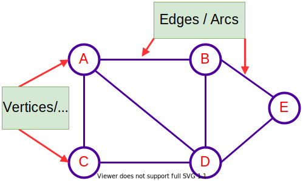

<!-- _backgroundColor: aquq -->

<!-- _color: orange -->

<!-- paginate: false -->

## CE100 Algorithms and Programming II

## Week-10 (Graphs)

#### Spring Semester, 2021-2022

Download [DOC-PDF](ce100-week-10-graphs.en.md_doc.pdf), [DOC-DOCX](ce100-week-10-graphs.en.md_word.docx), [SLIDE](ce100-week-10-graphs.en.md_slide.pdf), [PPTX](ce100-week-10-graphs.en.md_slide.pptx)

<iframe width=700, height=500 frameBorder=0 src="../ce100-week-10-graphs.en.md_slide.html"></iframe>

---

<!-- paginate: true -->

## Graphs

## Outline

- Introduction to Graphs
- Graphs and Representation
- BFS (Breath-First Search) 
- DFS (Depth-First Search) 
  - in-order 
  - post-order 
  - pre-order 

---

- Topological Order 
- SCC (Strongly Connected Components) 
- MST 
  - Prim 
  - Kruskal 

---

<style scoped>section{ font-size: 40px; }</style>

## **Introduction to Graphs**

---

### Introduction to Graphs

- The graph is a non-linear data structure. 

- It contains a set of points known as 
  
  - nodes (or vertices) and 
  
  - a set of links known as edges (or Arcs). 

---

### Introduction to Graphs

- Here edges are used to connect the vertices. A graph is defined as follows.
- Generally, a graph $G$ is represented as $G=(V,E)$, where 
  - $V$ is set of vertices and 
  - $E$ is set of edges.



---

<style scoped>section{ font-size: 30px; }</style>

### Introduction to Graphs - **Example**

- The following is a graph with `5 vertices` ($V$) and `6 edges` ($E$).
- This graph G can be defined as

$$
\begin{aligned}
G&=(V,E)
\end{aligned}
$$

$$
\begin{align*}
V&=\{A,B,C,D,E\}&
\end{align*}
$$

$$
\begin{align*}
E=\{&(A,B),(A,C),(A,D),\\
    &(B,D),(C,D),(B,E),\\
    &(E,D)\}
\end{align*}
$$


---

<style scoped>section{ font-size: 40px; }</style>

## **Graph Terminology**

---

## **Graph Terminology**

### Vertex

Individual data element of a graph is called as Vertex. Vertex is also known as node. In above example graph, $A, B, C, D, E$ are known as vertices.


---

## **Graph Terminology**

### Edge

- An edge is a connecting link between two vertices. 
- Edge is also known as Arc. 
- An edge is represented as 

$$
(\text{startingVertex}, \text{endingVertex})
$$

- For example, in above graph the link between vertices $A$ and $B$ is represented as 

$$
(A,B)
$$


---

## **Graph Terminology**

### Edge

- In example graph, there are $7$ edges 

$$
(A,B),(A,C),(A,D),\\
(B,D),(B,E),(C,D),(D,E)
$$


---

## **Graph Terminology**

### Edge

- Edges are three types.
  
  - Undirected Edge 
  - Directed Edge
  - Weighted Edge
  
  

---

## **Graph Terminology**

### Edge

#### Undirected Edge

- An undirected egde is a bidirectional edge. If there is undirected edge between vertices $A$ and $B$ then edge $(A,B)$ is equal to edge $(B,A)$
  
  

---

## **Graph Terminology**

### Edge

#### Directed Edge

- A directed egde is a unidirectional edge. If there is directed edge between vertices A and B then edge $(A,B)$ is not equal to edge $(B,A)$.
  
  

---

## **Graph Terminology**

### Edge

#### Weighted Edge

- A weighted egde is a edge with value (cost) on it.
  
  

---

## **Graph Terminology**

### Undirected Graph

- A graph with only undirected edges is said to be undirected graph.
  
  

---

## **Graph Terminology**

### Directed Graph

- A graph with only directed edges is said to be directed graph.
  
  

---

## **Graph Terminology**

### Mixed Graph

- A graph with both undirected and directed edges is said to be mixed graph.
  
  

---

## **Graph Terminology**

### End vertices or Endpoints

- The two vertices joined by edge are called end vertices (or endpoints) of that edge.

- In graph theory, a vertex with degree 1 is called an end vertex (plural end vertices)
  
  

---

## **Graph Terminology**

### Origin

- If a edge is directed, its first endpoint is said to be the origin of it.
  
  

---

## **Graph Terminology**

### Destination

- If a edge is directed, its first endpoint is said to be the origin of it and the other endpoint is said to be the destination of that edge.
  
  

---

## **Graph Terminology**

### Adjacent

- If there is an edge between vertices $A$ and $B$ then both $A$ and $B$ are said to be adjacent. In other words, vertices A and B are said to be adjacent if there is an edge between them.

  

---

## **Graph Terminology**

### Incident

- **Edge/Arc** is said to be **incident** on a **Vertex/Node** if the **Vertex/Node** is one of the endpoints of that **Edge/Arc**.

- An incidence is a pair $(B, e1)$ where $B$ is a vertex and $e1$ is an edge incident to $B$

- Two distinct incidences $(B, e1)$ and $(v,e2)$ are adjacent if and only if $B = v$, $e1 = e2$ or $BB' = e1$ or $e2$.
  
  

---

## **Graph Terminology**

### Outgoing Edge

- A directed edge is said to be outgoing edge on its origin vertex.


---

## **Graph Terminology**

### Incoming Edge

- A directed edge is said to be incoming edge on its destination vertex.


---

## **Graph Terminology**

### Degree

- Total number of edges connected to a vertex is said to be degree of that vertex.


---

## **Graph Terminology**

### Indegree

- Total number of incoming edges connected to a vertex is said to be indegree of that vertex.


---

## **Graph Terminology**

### Outdegree

- Total number of outgoing edges connected to a vertex is said to be outdegree of that vertex.


---

## **Graph Terminology**

### Parallel edges or Multiple edges

- If there are two undirected edges with same end vertices and two directed edges with same origin and destination, such edges are called parallel edges or multiple edges.


---

## **Graph Terminology**

### Self-loop

- Edge (undirected or directed) is a self-loop if its two endpoints coincide with each other.


---

## **Graph Terminology**

### Simple Graph

- A graph is said to be simple if there are no parallel and self-loop edges.


---

## **Graph Terminology**

### Complex Graph

- A graph is said to be complex if there are parallel or self-loop edges.


---

## **Graph Terminology**

### Path

- A path is a sequence of alternate vertices and edges that starts at a vertex and ends at other vertex such that each edge is incident to its predecessor and successor vertex.


---

<style scoped>section{ font-size: 40px; }</style>

## **Graph Representations**

---

## **Graph Representations**

- Graph data structure is represented using following representations
  - **Adjacency Matrix**
  - **Incidence Matrix**
  - **Adjacency List**

---

## **Graph Representations**

### Adjacency Matrix

- In this representation, the graph is represented using a matrix of size total number of vertices by a total number of vertices. 
- That means a graph with 4 vertices is represented using a matrix of size 4X4.
- In this matrix, both rows and columns represent vertices. 
  - This matrix is filled with either 1 or 0. 
  - Here, 
    - 1 represents that there is an edge from row vertex to column vertex and 
    - 0 represents that there is no edge from row vertex to column vertex.

---

## **Graph Representations**

### Adjacency Matrix

- Undirected Graph


---

## **Graph Representations**

### Adjacency Matrix

- Directed Graph


---

<style scoped>section{ font-size: 26px; }</style>

## **Graph Representations**

### Incidence Matrix

- In this representation, the graph is represented using a matrix of size total number of vertices by a total number of edges. 
- That means graph with 4 vertices and 6 edges is represented using a matrix of size 4X6. 
- In this matrix, rows represent vertices and columns represents edges. 
- This matrix is filled with 0 or 1 or -1. 
  - Here, 
    - 0 represents that the row edge is not connected to column vertex, 
    - 1 represents that the row edge is connected as the outgoing edge to column vertex and 
    - -1 represents that the row edge is connected as the incoming edge to column vertex.

---

<style scoped>section{ font-size: 28px; }</style>

## **Graph Representations**

### Incidence Matrix


---

<style scoped>section{ font-size: 28px; }</style>

## **Graph Representations**

### Adjacency List

- In this representation, every vertex of a graph contains list of its adjacent vertices.

---

<style scoped>section{ font-size: 28px; }</style>

## **Graph Representations**

### Adjacency List

- Linked List Implementation


---

<style scoped>section{ font-size: 28px; }</style>

## **Graph Representations**

### Adjacency List

- Reference Array Implementation


---

<style scoped>section{ font-size: 30px; }</style>

### **Introduction to Graphs** - Review

$G=(V,E)$

- Adjency List Complexity $O(degree \ of \ u)$ $(u,v) \in E$
- Sparse Matrix $\rightarrow$ $|E|<|V^2|$
- Dense Matrix $\rightarrow$ $|E| \ close \ to \ |V^2|$
- Space Complexity $\Theta(|V|+|E|)$

---

<style scoped>section{ font-size: 27px; }</style>

### **Introduction to Graphs** - Review

- Many definitions for directed and undirected graphs are the same although certain terms have slightly different meanings
- If $(u,v) \in E$ in a **directed graph** $G=(V,E)$, we say that $(u,v)$ is **incident from** or **leaves** vertex $u$ and is **incident to** or **enters** vertex $v$
- If $(u,v) \in E$ in an **undirected graph** $G=(V,E)$, we say that $(u,v)$ is **incident on** vertices $u$ and $v$
- If $(u,v)$ is an edge in a graph $G=(V,E)$, we say that vertex $v$ is **adjacent to** vertex $u$
- When the graph is **undirected**,the **adjacency relation** is symmetric
- When the graph is **directed** 
  - the **adjacency relation** is **not necessarily symmetric**
  - if $v$ is adjacent to $u$, we sometimes write $u \rightarrow v$

---

<style scoped>section{ font-size: 27px; }</style>

### **Introduction to Graphs** - Review

- The **degree** of a vertex in an **undirected graph** is the number of edges **incident on** it
- In a directed graph, 
  - **out-degree of a vertex:** number of edges **leaving** it
  - **in-degree of a vertex:** number of edges **entering** it
  - **degree of a vertex:** its **in-degree** + its **out-degree**
- A **path** of **length** $k$ from a vertex $u$ to a vertex $u'$ in a graph $G=(V,E)$ is a **sequence** $\langle v_0,v_1,v_2,\dots,v_k \rangle$ of vertices such 
  - that $v_0=u$,$v_k=u'$ and $(v_{i-1},v_i) \in E$, for $i=1,2,\dots,k$
- The **length** of a **path** is the **number of edges** in the path

---

<style scoped>section{ font-size: 27px; }</style>

### **Introduction to Graphs** - Review

- If there is a path $p$ from $u$ to $u'$, we say that $u'$ is **reachable** from $u$ via $p: u \xrightarrow[]{p} u'$
- A **path is simple** if all vertices in the path are **distinct**
- A **subpath** of path $p= \langle v_0,v_1,v_2,\dots,v_k \rangle$ is a **contiguous subsequence** of its vertices
- That is, for any $0 \leq i \leq j \leq k$, the subsequence of vertices $\langle v_i, v_{i+1},\dots, v_j \rangle$ is a **subpath** of $p$
- In a **directed graph**, a path $\langle v_0,v_1,\dots, v_k\rangle$ forms a **cycle** if $v_0=v_k$ and the path contains at least one edge
- The **cycle** is **simple** if, in addition, $v_0,v_1,\dots,v_k$ are **distinct** 
- A **self-loop** is a **cycle** of **length 1**

---

<style scoped>section{ font-size: 27px; }</style>

### **Introduction to Graphs** - Review

---

<style scoped>section{ font-size: 40px; }</style>

## **Elementary Graph Algorithms**

---

## **Elementary Graph Algorithms**

- Graph Traversal
  - [DONE] Breadth-first search (BFS)
  - [DONE] Depth-first search (DFS)

---

## **Elementary Graph Algorithms**

- Topological sort
  - [DONE] DFS version
  - [DONE] BFS version (Kahn's algorithm)

---

## **Elementary Graph Algorithms**

- Bipartite Graph Check
  - [TBD] BFS version
  - [TBD] DFS version

---

## **Elementary Graph Algorithms**

- Cut Vertex & Bridge
  - [TBD] DFS version

---

## **Elementary Graph Algorithms**

- Strongly connected components (SCC)
  - [DONE] Kosaraju's algorithm
  - [DONE] Tarjan's algorithm

---

## **Elementary Graph Algorithms**

- [TBD] 2-SAT Checker

---

## **Elementary Graph Algorithms**

- Single-source shortest path (SSSP)
  - [TBD] Dijkstra's algorithm
  - [TBD] Bellman-Ford algorithm
  - [TBD] Johnson's algorithm
  - [TBD] DFS 
  - [TBD] BFS 
  - [TBD] DP

---

## **Elementary Graph Algorithms**

- Minimum spanning tree
  - [TBD] Kruskal's algorithm
  - [TBD] Prim's algorithm

---

## **Elementary Graph Algorithms**

- Convex Hull
  - [TBD] Graham Scan
  - [TBD] Jarvis march

---

<style scoped>section{ font-size: 40px; }</style>

## **Online Visual Animations**

---

## **Online Visual Animations**

- Graph Structures

- https://visualgo.net/en/graphds?slide=1

- Single-Source Shortest Paths (SSSP)
  
  - https://visualgo.net/en/sssp?slide=1

- Minimum Spanning Tree (MST)
  
  - https://visualgo.net/en/mst?slide=1

- Convex Hull
  
  - https://visualgo.net/en/convexhull?slide=1

---

## **Online Visual Animations**

- Data Structure Visualizations (University of Sout Florida-USF)
  - https://www.cs.usfca.edu/~galles/visualization/Algorithms.html

---

## **Online Visual Animations**

- Common Graph Algorithms
  - https://algorithm-visualizer.org/

---

<style scoped>section{ font-size: 40px; }</style>

## **Graph Tools**

---

## **Graph Tools**

- Graphviz Tools
  - https://graphviz.org/download/
- Graphviz (short for Graph Visualization Software) is a package of open-source tools initiated by AT&T Labs Research for drawing graphs specified in DOT language scripts having the file name extension "gv". It also provides libraries for software applications to use the tools. Graphviz is free software licensed under the Eclipse Public License.

---

## **Graph Tools**

- Graphviz Tools
  - https://graphviz.org/download/
  - https://graphviz.org/doc/info/command.html
  - https://graphviz.org/docs/outputs/svg/
  - http://magjac.com/graphviz-visual-editor/
  - https://graphs.grevian.org/graph
- Graphviz Tutorials
  - https://graphs.grevian.org/example#example-1 
  - https://graphs.grevian.org/reference
  - 

---

## **Graphviz Gallery**

### Family Tree

- https://graphviz.org/Gallery/directed/kennedyanc.html
  
  ### UML
- https://graphviz.org/Gallery/directed/UML_Class_diagram.html
  
  ### Data Structure
- https://graphviz.org/Gallery/gradient/datastruct.html
- https://graphviz.org/Gallery/directed/datastruct.html

---

## **Graphviz Gallery**

### Neural Network (Keras)

- https://graphviz.org/Gallery/directed/neural-network.html
  
  ### Linux Kernel Diagram
- https://graphviz.org/Gallery/directed/Linux_kernel_diagram.html

---

## Graphviz Tools and Binaries

- Graphviz consists of a graph description language named the DOT language[4] and a set of tools that can generate and/or process DOT files:

---

## **Graphviz Layout Engines**

### dot

a command-line tool to produce layered drawings of directed graphs in a variety of output formats, such as (PostScript, PDF, SVG, annotated text and so on).

Visit: https://graphviz.org/docs/layouts/dot/

---

## **Graphviz Layout Engines**

### neato

useful for undirected graphs. "spring model" layout, minimizes global energy. Useful for graphs up to about 1000 nodes

Visit : https://graphviz.org/docs/layouts/neato/

---

## **Graphviz Layout Engines**

### fdp

useful for undirected graphs. "spring model" which minimizes forces instead of energy

Visit : https://graphviz.org/docs/layouts/fdp/

---

## **Graphviz Layout Engines**

### sfdp

multiscale version of fdp for the layout of large undirected graphs

Visit : https://graphviz.org/docs/layouts/sfdp/

---

## **Graphviz Layout Engines**

### twopi

for radial graph layouts. Nodes are placed on concentric circles depending their distance from a given root node

Visit : https://graphviz.org/docs/layouts/twopi/

---

## **Graphviz Layout Engines**

### circo

circular layout. Suitable for certain diagrams of multiple cyclic structures, such as certain telecommunications networks

Visit : https://graphviz.org/docs/layouts/circo/

---

## **Graphviz Layout Engines**

### osage

osage draws clustered graphs. Suitable for certain diagrams of multiple cyclic structures, such as certain telecommunications networks

Visit : https://graphviz.org/docs/layouts/osage/

---

## **Graphviz Layout Engines**

### patchwork

patchwork draws clustered graphs using a squarified treemap layout.

Visit : https://graphviz.org/docs/layouts/patchwork/

---

## **Graphviz Layout Engines**

### dotty (DEPRECATED)

a graphical user interface to visualize and edit graphs.

---

## **Graphviz Tools**

### lefty (DEPRECATED)

a programmable (in a language inspired by EZ[5]) widget that displays DOT graphs and allows the user to perform actions on them with the mouse. Therefore, Lefty can be used as the view in a model–view–controller GUI application that uses graphs.

---

## **Graphviz Tools**

### gml2gv - gv2gml

convert to/from GML, another graph file format.

---

## **Graphviz Tools**

### graphml2g

convert a GraphML file to the DOT format.

---

## **Graphviz Tools**

### gxl2gv - gv2gxl

convert to/from GXL, another graph file format.

---

## **Graphviz Tools**

for more information visit 

- https://graphviz.org/documentation/#tool-manual-pages

---

## **Graphviz API**

- Visit
  - https://graphviz.org/documentation/#sample-programs-using-graphviz

---

## **Graph Tools**

- Plantuml Tools (https://plantuml.com/download)
  - PlantUML is an open-source tool allowing users to create diagrams from a plain text language. Besides various UML diagrams, PlantUML has support for various other software development related formats (such as Archimate, Block diagram, BPMN, C4, Computer network diagram, ERD, Gantt chart, Mind map, and WBD), as well as visualisation of JSON and YAML files.

---

## **Graph Tools**

- Plantuml Tutorials
  - Visit [OOP Plantuml Course Notes](https://ucoruh.github.io/ce204-object-oriented-programming/week-5/ce204-week-5/)

---

## **Graph Tools**

- Plantuml Graphs and References
  - https://plantuml.com/use-case-diagram
  - https://plantuml.com/deployment-diagram
  - https://plantuml.com/component-diagram
  - https://plantuml.com/mindmap-diagram
  - https://plantuml.com/object-diagram
  - https://plantuml.com/state-diagram
  - https://plantuml.com/wbs-diagram
  - https://plantuml.com/json
  - https://plantuml.com/yaml

---

## **Graph Tools**

- Plantuml API
  - https://plantuml.com/api

---

## **Graph Tools**

- Microsoft Graph Layout
- MSAGL is a .NET tool for graph layout and viewing. 
- It was developed in Microsoft by Lev Nachmanson, Sergey Pupyrev, Tim Dwyer and Ted Hart. 
- MSAGL is available as open source.
  - Demo Project
    - https://github.com/ucoruh/microsoft-graph-layout-cs-demo
  - Library
    - https://github.com/microsoft/automatic-graph-layout
  - Website
    - https://www.microsoft.com/en-us/research/project/microsoft-automatic-graph-layout/

---

<style scoped>section{ font-size: 40px; }</style>

## **Elementary Graph Algorithms**

---

## **Graph Traversal**

### Breadth-first search (BFS)

- Breadth-first search (BFS) is a graph traversal algorithm that starts at a vertex and explores as far as possible along each branch before backtracking.

---

## **Graph Traversal**

### Breadth-first search (BFS)

- In this algorithm, we use a queue to store the vertices that are yet to be visited.
- Complexity of following part is $O(V)$
  
  ```cpp
  G -> Graph
  s -> Source
  BFS(G,s)
    // Mark all the vertices as not visited
    for each vertex u in G.V - {s}
        u.color = white;
        u.distance = infinity;
        u.parent = NIL;
  ...
  ```

---

## **Graph Traversal**

### Breadth-first search (BFS)

- We enqueue the first vertex and mark it as visited.
- Complexity of following part is $O(1)$
  
  ```cpp
  ...
    s.color = gray;
    s.distance = 0;
    s.parent = NIL;
    // Create a queue for BFS
    Q = empty
    ENQUEUE(Q, s)
  ...
  ```

---

## **Graph Traversal**

### Breadth-first search (BFS)

- We dequeue a vertex u and mark it as visited.
- We enqueue all the adjacent vertices of u.
- Complexity of following part is $O(E)$
  
  ```cpp
  ...
    WHILE Q is not empty
        u = DEQUEUE(Q)
        for each vertex v in G.Adj[u]
            if v.color == white
                v.color = gray;
                v.distance = u.distance + 1;
                v.parent = u;
                ENQUEUE(Q, v)
        u.color = black;
  ```

---

## **Graph Traversal**

### Breadth-first search (BFS)

- Complexity of BFS is $O(V+E) = O(V)+O(E)+O(1)$

---

<style scoped>section{ font-size: 20px; }</style>

## **Graph Traversal**

### Breadth-first search (BFS) Complete Algorithm

```cpp
G -> Graph
s -> Source
BFS(G,s)
    // Mark all the vertices as not visited
    for each vertex u in G.V - {s}
        u.color = white;
        u.distance = infinity;
        u.parent = NIL;
    s.color = gray;
    s.distance = 0;
    s.parent = NIL;
    // Create a queue for BFS
    Q = empty
    ENQUEUE(Q, s)
    WHILE Q is not empty
        u = DEQUEUE(Q)
        for each vertex v in G.Adj[u]
            if v.color == white
                v.color = gray;
                v.distance = u.distance + 1;
                v.parent = u;
                ENQUEUE(Q, v)
        u.color = black;
```

---

<style scoped>section{ font-size: 25px; }</style>

## **Graph Traversal**

### Breadth-first search (BFS) Example-1

- s is the source vertex.


---

<style scoped>section{ font-size: 25px; }</style>

## **Graph Traversal**

### Breadth-first search (BFS) Example-1

- STEP-1
  
  ```cpp
  //init the graph
  s.parent = NIL;
  s.color = gray;
  s.distance = 0;
  Q = empty;
  ENQUEUE(Q, s)
  and 
  u = DEQUEUE(Q) in the while loop
  ```


---

<style scoped>section{ font-size: 25px; }</style>

## **Graph Traversal**

### Breadth-first search (BFS) Example-1

- STEP-2
  
```cpp
----------------
Q = {c,a}
s = b
----------------
c.parent = s
c.distance = 1
c.color = gray
----------------
a.parent = s
a.distance = 1
a.color = gray
----------------
```


---

<style scoped>section{ font-size: 25px; }</style>

## **Graph Traversal**
### Breadth-first search (BFS) Example-1
- STEP-3

```cpp
----------------
Q = {e,c}
a = b
----------------
e.parent = a
e.distance = 2
e.color = gray
----------------
```


---

<style scoped>section{ font-size: 25px; }</style>

## **Graph Traversal**

### Breadth-first search (BFS) Example-1

- STEP-4
  
```cpp
----------------
Q = {g,e}
c = b
----------------
g.parent = c
g.distance = 2
g.color = gray
----------------
```


---

<style scoped>section{ font-size: 25px; }</style>

## **Graph Traversal**
### Breadth-first search (BFS) Example-1
- STEP-5

```cpp
----------------
Q = {b,h,g}
e = b
----------------
h.parent = e
h.distance = 3
h.color = gray
----------------
b.parent = e
b.distance = 3
b.color = gray
----------------
```


---

<style scoped>section{ font-size: 25px; }</style>

## **Graph Traversal**

### Breadth-first search (BFS) Example-1

- STEP-6
  
```cpp
----------------
Q = {f,i,b,h}
g = b
----------------
i.parent = g
i.distance = 3
i.color = gray
----------------
f.parent = e
f.distance = 3
f.color = gray
----------------
```


---

<style scoped>section{ font-size: 25px; }</style>

## **Graph Traversal**
### Breadth-first search (BFS) Example-1

- STEP-7

```cpp
----------------
Q = {f,i,b}
h = b
----------------
```


---

<style scoped>section{ font-size: 25px; }</style>

## **Graph Traversal**

### Breadth-first search (BFS) Example-1

- STEP-8
  
```cpp
----------------
Q = {f,i}
b = b
----------------
```


---

<style scoped>section{ font-size: 25px; }</style>

## **Graph Traversal**
### Breadth-first search (BFS) Example-1

- STEP-9

```cpp
----------------
Q = {f}
i = b
----------------
```


---

<style scoped>section{ font-size: 25px; }</style>

## **Graph Traversal**

### Breadth-first search (BFS) Example-1

- STEP-10
  
```cpp
----------------
Q = {}
f = b
----------------
```


---

<style scoped>section{ font-size: 25px; }</style>

## **Graph Traversal**
### Breadth-first search (BFS) Example-1

- BFS is done and the graph is traversed.


---
<style scoped>section{ font-size: 25px; }</style>

## **Graph Traversal**
### Breadth-first search (BFS) Algorithm Summary

- **Step 1** - Define a Queue of size total number of vertices in the graph.
- **Step 2** - Select any vertex as starting point for traversal. Visit that vertex and insert it into the Queue.
- **Step 3** - Visit all the non-visited adjacent vertices of the vertex which is at front of the Queue and insert them into the Queue.
- **Step 4** - When there is no new vertex to be visited from the vertex which is at front of the Queue then delete that vertex.
- **Step 5** - Repeat steps 3 and 4 until queue becomes empty.
- **Step 6** - When queue becomes empty, then produce final spanning tree by removing unused edges from the graph

---

$TODO - Add \ more \ examples$

---

## **Graph Traversal**
### Depth-first search (DFS) 
- DFS is a traversal algorithm that visits each vertex in a graph in a depth-first manner.

---

## **Graph Traversal**
### Depth-first search (DFS) 
- Complexity of the following part is $\Theta(V+V)=O(V)$ (two sequential loops)

```cpp
DFS(G)
 for each vertex u in G.V
    u.color = white
    u.parent = nil
 time = 0
  for each vertex u in G.V
    if u.color == white
      DFS-VISIT(G,u)
```

---

## **Graph Traversal**

### Depth-first search (DFS)

```cpp
DFS-VISIT(G,u)
  time = time + 1
  u.discovery = time
  u.color = gray
  for each vertex v in G.Adj[u]
    if v.color == white
      v.parent = u
      DFS-VISIT(G,v)
  u.color = black
  time = time + 1
  u.finish = time
```

---

## SCC - Kosaraju's algorithm

```cpp
for each unvisited vertex u, DFS(u)

  try all free neighbor v of u, DFS(v)

  finish DFS(u), add u to the front of list

transpose the graph

DFS in order of the list, DFS(u)

  try all free neighbor v of u, DFS(v)

each time we complete a DFS, we get an SCC
```

---

## SCC - Tarjan's algorithm

```cpp
for each unvisited vertex u

  DFS(u), s.push(u), num[u] = low[u] = DFSCount

    for each neighbor v of u

      if v is unvisited, DFS(v)

      low[u] = min(low[u], low[v])

    if low[u] == num[u] // root of an SCC

      pop from stack s until we get u
```

---

## **Graph Traversal**

### Depth-first search (DFS)

- DFS complexity is $\Theta(V+E)$
- Note for all $v \rightarrow v.discovery < v.finish$
  - $1 \leq u.discovery < u.finish \leq 2|V|$

---

## **Graph Traversal**

### Depth-first search (DFS)

- Edge Types in DFS
  - Tree Edges
  - Back Edges
  - Forward Edges
  - Cross Edges
- Colors in DFS
  - White -> Tree Edges
  - Gray -> Back Edges
  - Black -> Forward Edges

---

## **Graph Traversal**

### Depth-first search (DFS) Example-1

#### Kosaraju's algorithm


---

## **Graph Traversal**

### Depth-first search (DFS) Example-1

- STEP-1
  

---

## **Graph Traversal**

### Depth-first search (DFS) Example-1

- STEP-2
  

---

## **Graph Traversal**

### Depth-first search (DFS) Example-1

- STEP-3
  

---

## **Graph Traversal**

### Depth-first search (DFS) Example-1

- STEP-4
  

---

## **Graph Traversal**

### Depth-first search (DFS) Example-1

- STEP-5
  

---

## **Graph Traversal**

### Depth-first search (DFS) Example-1

- STEP-6
  

---

## **Graph Traversal**

### Depth-first search (DFS) Example-1

- STEP-7
  

---

## **Graph Traversal**

### Depth-first search (DFS) Example-1

- STEP-8
  

---

## **Graph Traversal**

### Depth-first search (DFS) Example-1

- STEP-9
  

---

## **Graph Traversal**

### Depth-first search (DFS) Example-1

- STEP-10
  

---

## **Graph Traversal**

### Depth-first search (DFS) Example-1

- STEP-11
  

---

## **Graph Traversal**

### Depth-first search (DFS) Example-1

- STEP-12
  

---

## **Graph Traversal**

### Depth-first search (DFS) Example-1

- STEP-13
  

---

## **Graph Traversal**

### Depth-first search (DFS) Example-1

- STEP-14
  

---

## **Graph Traversal**

### Depth-first search (DFS) Example-1

- STEP-15
  

---

## **Graph Traversal**

### Depth-first search (DFS) Example-1

- FINAL STEP-16
  

---

## **Graph Traversal**

### Depth-first search (DFS) Example-1

- Edges and Clusters after DFS
  

---

## **Graph Traversal**

### Depth-first search (DFS) Example-2

- Different Start Point and Different Graph
  

---

<style scoped>section{ font-size: 24px; }</style>

## **Elementary Graph Algorithms**

### Depth-first search (DFS) Algorithm Summary

- **Step 1** - Define a Stack of size total number of vertices in the graph.
- **Step 2** - Select any vertex as starting point for traversal. Visit that vertex and push it on to the Stack.
- **Step 3** - Visit any one of the non-visited adjacent vertices of a vertex which is at the top of stack and push it on to the stack.
- **Step 4** - Repeat step 3 until there is no new vertex to be visited from the vertex which is at the top of the stack.
- **Step 5** - When there is no new vertex to visit then use back tracking and pop one vertex from the stack.
- **Step 6** - Repeat steps 3, 4 and 5 until stack becomes Empty.
- **Step 7** - When stack becomes Empty, then produce final spanning tree by removing unused edges from the graph

---

$TODO - Add \ more \ examples$

---

## **Graph Segmentation**
### SCC (Strongly Connected Components)

- SCC Algorithm is used to find the connected components in a graph.

---

## **Graph Segmentation**
### SCC (Strongly Connected Components)

- $G^T=(V,E^T)$ can create $G^T$ $\rightarrow$ $\Theta(V+E)$ adjency list.
- $SCC(G)$ complexity is $O(V+E)$

---

## **Graph Segmentation**
### SCC Algorithm

```cpp
1- call DFS(G) compute all u.finishTime values
2- compute G^T = (V,E^T) and reverse edge directions
3- call DFS(G^T) but in the main loop, 
consider vertices 
in order of decreasing u.finishTime 
(as computed in DFS)
```

---

## **Graph Segmentation**
### SCC Algorithm - Example-1 Graph

  

---

## **Graph Segmentation**
### SCC Algorithm - Example-1 / Step - 1


---

## **Graph Segmentation**
### SCC Algorithm - Example-1 / Step - 2


---

## **Graph Segmentation**
### SCC Algorithm - Example-1 / Step - 3


---

## **Graph Segmentation**
### SCC Algorithm - Example-1/ Step - 4
  


---

## **Graph Segmentation**
### SCC Algorithm - Example-1/ Step - 5


---

## **Graph Segmentation**
### SCC Algorithm - Example-1/ Step - 6


---

## **Graph Segmentation**
### SCC Algorithm - Example-1/ Step - 7


---

## **Graph Segmentation**
### SCC Algorithm - Example-1/ Step - 8


---

## **Graph Segmentation**
### SCC Algorithm - Example-1/ Step - 9


---

## **Graph Segmentation**
### SCC Algorithm - Example-1/ Step - 10


---

## **Graph Segmentation**
### SCC Algorithm - Example-1/ Step - 11


---

## **Graph Segmentation**
### SCC Algorithm - Example-1/ Step - 12


---

## **Graph Segmentation**
### SCC Algorithm - Example-1/ Step - 13


---

## **Graph Segmentation**
### SCC Algorithm - Example-1/ Step - 14


---

## **Graph Segmentation**
### SCC Algorithm - Example-1/ Step - 15


---

## **Graph Segmentation**
### SCC Algorithm - Example-1/ Step - 16


---

## **Graph Segmentation**
### SCC Algorithm - Example-1/ Step - 17


---

## **Graph Segmentation**
### SCC Algorithm - Example-1/ Step - 18


---

## **Graph Segmentation**
### SCC Algorithm - Example-1/ Step - 19


---

## **Graph Segmentation**
### SCC Algorithm - Example-1/ Step - 20


---

## **Graph Segmentation**
### SCC Algorithm - Example-1/ Step - 21


---

## **Graph Segmentation**
### SCC Algorithm - Example-1/ Step - 22


---

## **Graph Segmentation**
### SCC Algorithm - Example-1/ Step - 23


---

## **Graph Segmentation**
### SCC Algorithm - Example-1/ Step - 24


---

## **Graph Segmentation**
### SCC Algorithm - Example-1/ Step - 25


---

## **Graph Segmentation**
### SCC Algorithm - Example-1/ Step - 26


---

## **Graph Segmentation**
### SCC Algorithm - Example-1/ Step - 27


---

## **Graph Segmentation**
### SCC Algorithm - Example-1/ Step - 28


---

## **Graph Segmentation**
### SCC Algorithm - Example-1/ Step - 29


---

## **Graph Segmentation**
### SCC Algorithm - Example-1/ Step - 30


---

## **Graph Segmentation**
### SCC Algorithm - Example-1/ Step - 31


---

## **Graph Segmentation**
### SCC Algorithm - Example-1/ Step - 32


---

## **Graph Segmentation**
### SCC Algorithm - Example-1/ Step - 33


---

## **Graph Segmentation**
### SCC Algorithm - Example-1/ Step - 34


---

## **Graph Segmentation**
### SCC Algorithm - Example-1/ Step - 35


---

## **Graph Segmentation**
### SCC Algorithm - Example-1/ Step - 36


---

## **Graph Segmentation**
### SCC Algorithm - Example-1/ Step - 37


---

## **Graph Segmentation**
### SCC Algorithm - Example-1/ Step - 38


---

## **Graph Segmentation**
### SCC Algorithm - Example-1/ Step - 39


---

## **Graph Segmentation**
### SCC Algorithm - Example-1/ Step - 40


---

## **Graph Segmentation**
### SCC Algorithm - Example-1/ Step - 41


---

## **Graph Segmentation**
### SCC Algorithm - Example-1/ Step - 42


---

## **Graph Traversal**
### Topological Sort

- When we are scheduling jobs or tasks, they may have dependencies. 
- For example, before we finish task a, we have to finish b first. 
  - In this case, given a set of tasks and their dependencies, how shall we arrange our schedules? There comes an interesting graph algorithm: Topological Sort.

- According to Introduction to Algorithms, given a directed acyclic graph (DAG), 
- a topological sort is a linear ordering of all vertices such that for any edge (u, v), u comes before v. 
- Another way to describe it is that when you put all vertices horizontally on a line, all of the edges are pointing from left to right.

---

## **Graph Traversal**
### Topological Sort

- Topological sort is a linear ordering of a directed acyclic graph.
- If a graph has a cycle, it is not a directed acyclic graph.
- A graph is acyclic if it has no cycles.

---

## **Graph Traversal**
### Topological Sort
#### DFS version

- The key observation is that, leaf nodes should always come after their parents and ancestors. Following this intuition we can apply DFS and output nodes from leaves to the root.

- We need to implement a boolean array visited so that visited[i] indicates if we have visited vertex i. 
- For each unvisited node, we would first mark it as visited and call DFS() to start searching its neighbours. 
- After finishing this, we can insert it to the front of a list. After visiting all nodes, we can return that list.

---

## **Graph Traversal**
### Topological Sort - DFS Version

```cpp
run DFS(G)
when a vertex finished, output it
vertices output in reverse topologically sorted order
```
- Runs in O(V+E) time

---

## **Graph Traversal**
### Topological Sort - DFS Version

```cpp
def topological_sort():
    for each node:
        if visited[node] is False:
            dfs(node)

def dfs(node):
    visited[node] = True
    for nei in neighbours[node]:
        dfs(node)
	if visited(node) = false:
		ret.insert_at_the_front(node)
```

<!--
---

## **Graph Traversal**
### Topological Sort
#### DFS version

```cpp
for each unvisited vertex u

  DFS(u)

    for each neighbor v of u

      if v is unvisited, DFS(v)

    else skip v;

    finish DFS(u), add u to the back of list

reverse list
```
-->

---

## **Graph Traversal**
### Topological Sort - DFS Version (Example)


---

## **Graph Traversal**
### Topological Sort - DFS Version STEP-1


---

## **Graph Traversal**
### Topological Sort - DFS Version STEP-2


---

## **Graph Traversal**
### Topological Sort - DFS Version STEP-3


---

## **Graph Traversal**
### Topological Sort - DFS Version STEP-4


---

## **Graph Traversal**
### Topological Sort - DFS Version STEP-5


---

## **Graph Traversal**
### Topological Sort - DFS Version STEP-6


---

## **Graph Traversal**
### Topological Sort - DFS Version STEP-7


---

## **Graph Traversal**
### Topological Sort - DFS Version STEP-8


---

## **Graph Traversal**
### Topological Sort - DFS Version STEP-9


---

## **Graph Traversal**
### Topological Sort - DFS Version STEP-10


---

## **Graph Traversal**
### Topological Sort - DFS Version


---

## **Graph Traversal**
### Topological Sort
#### BFS version (Kahn's algorithm)

- For BFS, we need an array indegree to keep the track of indegrees. Then we will try to output all nodes with 0 indegree, and remove the edges coming out of them at the same time. Besides, remember to put the nodes that become 0 indegree in the queue.

- Then, we can keep doing this until all nodes are visited. To implement it, we can store the graph in an adjacent list (a hashmap or a dictionary in Python) and a queue to loop.

---

## **Graph Traversal**
### Topological Sort
#### BFS version (Kahn's algorithm)

```cpp
indegree = an array indicating indegrees for each node
neighbours = a HashMap recording neighbours of each node
queue = []
for i in indegree:
    if indegree[i] == 0:
        queue.append(i)
		
while !queue.empty():
    node = queue.dequeue()
    for neighbour in neighbours[node]:
        indegree[neighbour] -= 1
        if indegree[neighbour] == 0:
            queue.append(neighbour)
```
---

## **Graph Traversal**
### Topological Sort - BFS version (Kahn's algorithm)

- STEP-1


---

## **Graph Traversal**
### Topological Sort - BFS version (Kahn's algorithm)

- STEP-2


---

## **Graph Traversal**
### Topological Sort - BFS version (Kahn's algorithm)

- STEP-3


---

## **Graph Traversal**
### Topological Sort - BFS version (Kahn's algorithm)

- STEP-4


---

## **Graph Traversal**
### Topological Sort - BFS version (Kahn's algorithm)

- STEP-5


---

## **Graph Traversal**
### Topological Sort - BFS version (Kahn's algorithm)

- STEP-6


---

## **Graph Traversal**
### Topological Sort - BFS version (Kahn's algorithm)

- STEP-7


---

## **Graph Traversal**
### Topological Sort - BFS version (Kahn's algorithm)

- STEP-8


---

## **Graph Traversal**
### Topological Sort - BFS version (Kahn's algorithm)

- STEP-9


---

## **Graph Traversal**
### Topological Sort - BFS version (Kahn's algorithm)

- STEP-10


---

## **Graph Traversal**
### Topological Sort - BFS version (Kahn's algorithm)

- STEP-11 (Final)


---

## References

- [BtechSmartClass-Introduction to Graphs](http://www.btechsmartclass.com/data_structures/introduction-to-graphs.html)
- [BtechSmartClass-Graph Representations](http://www.btechsmartclass.com/data_structures/graph-representations.html)
- [Leetcode - Topological Sort](https://leetcode.com/discuss/general-discussion/1078072/introduction-to-topological-sort#:~:text=According%20to%20Introduction%20to%20Algorithms,pointing%20from%20left%20to%20right.)

---

$End-Of-Week-10-Course-Notes$
