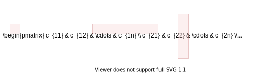

<!-- _backgroundColor: aquq -->

<!-- _color: orange -->

<!-- paginate: false -->

## CE100 Algorithms and Programming II

## Week-3 (Matrix Multiplication/ Quick Sort)

#### Spring Semester, 2021-2022

Download [DOC](ce100-week-3-matrix.md_doc.pdf), [SLIDE](ce100-week-3-matrix.md_slide.pdf), [PPTX](ce100-week-3-matrix.md_slide.pptx)

<iframe width=700, height=500 frameBorder=0 src="../ce100-week-3-matrix.md_slide.html"></iframe>

---

<!-- paginate: true -->

## Matrix Multiplication / Quick Sort

## Outline

- Matrix Multiplication 
  
  - Traditional 
  
  - Recursive 
  
  - Strassen

---

## Outline

- Quicksort 
  
  - Hoare Partitioning 
  
  - Lomuto Partitioning 
  
  - Recursive Sorting 

---

## Outline

- Quicksort Analysis 
  
  - Randomized Quicksort 
  
  - Randomized Selection 
    
    - Recursive 
    
    - Medians 

---

## Matrix Multiplication

- **Input:** $A=[a_{ij}],B=[b_{ij}]$
- **Output:** $C=[c_{ij}]=A \cdot B$ $\Longrightarrow i,j=1,2,3, \dots, n$

$$
\begin{bmatrix}
    c_{11} & c_{12} & \dots & c_{1n}  \\
    c_{21} & c_{22} & \dots & c_{2n}  \\
    \vdots & \vdots & \vdots & \ddots \\
    c_{n1} & c_{n2} & \dots & c_{nn}  \\
\end{bmatrix}
=
\begin{bmatrix}
    a_{11} & a_{12} & \dots & a_{1n}  \\
    a_{21} & a_{22} & \dots & a_{2n}  \\
    \vdots & \vdots & \vdots & \ddots \\
    a_{n1} & a_{n2} & \dots & a_{nn}  \\
\end{bmatrix}
\cdot
\begin{bmatrix}
    b_{11} & b_{12} & \dots & b_{1n}  \\
    b_{21} & b_{22} & \dots & b_{2n}  \\
    \vdots & \vdots & \vdots & \ddots \\
    b_{n1} & a_{n2} & \dots & b_{nn}  \\
\end{bmatrix}
$$

---

## Matrix Multiplication



- $c_{ij}=\sum_{1\leq k \leq n}a_{ik}.b_{kj}$

---

## Matrix Multiplication: Standard Algorithm

Running Time: $\Theta(n^3)$

```r
for i=1 to n do
    for j=1 to n do
        C[i,j] = 0
        for k=1 to n do
            C[i,j] = C[i,j] + A[i,k] + B[k,j]
        endfor
    endfor
endfor
```

---

## Matrix Multiplication: Divide & Conquer

**IDEA:** Divide the $nxn$ matrix into $2x2$ matrix of $(n/2)x(n/2)$ submatrices.


---

## Matrix Multiplication: Divide & Conquer

$$
\begin{bmatrix}
    c_{11} & c_{12} \\
    c_{21} & c_{22} 
\end{bmatrix}
=
\begin{bmatrix}
    a_{11} & a_{12} \\
    a_{21} & a_{22} 
\end{bmatrix}
\cdot
\begin{bmatrix}
    b_{11} & b_{12} \\
    b_{21} & b_{22}
\end{bmatrix}
$$

$$
\text{8 mults and 4 adds of (n/2)*(n/2) submatrices}=
\begin{cases}
  c_{11}=a_{11}b_{11}+a_{12}b_{21} \\
  c_{21}=a_{21}b_{11}+a_{22}b_{21} \\
  c_{12}=a_{11}b_{12}+a_{12}b_{22} \\
  c_{22}=a_{21}b_{12}+a_{22}b_{22}
\end{cases}
$$

---

## Matrix Multiplication: Divide & Conquer

```r
MATRIX-MULTIPLY(A, B)
    // Assuming that both A and B are nxn matrices
    if n == 1 then 
        return A * B
    else  
        //partition A, B, and C as shown before
        C[1,1] = MATRIX-MULTIPLY (A[1,1], B[1,1]) + 
                 MATRIX-MULTIPLY (A[1,2], B[2,1]); 

        C[1,2] = MATRIX-MULTIPLY (A[1,1], B[1,2]) + 
                MATRIX-MULTIPLY (A[1,2], B[2,2]); 

        C[2,1] = MATRIX-MULTIPLY (A[2,1], B[1,1]) + 
        MATRIX-MULTIPLY (A[2,2], B[2,1]);

        C[2,2] = MATRIX-MULTIPLY (A[2,1], B[1,2]) + 
        MATRIX-MULTIPLY (A[2,2], B[2,2]);
    endif      

    return C
```

---

## Matrix Multiplication: Divide & Conquer Analysis

$T(n) = 8T(n/2) + \Theta(n^2)$

- $8$ recursive calls $\Longrightarrow 8T(\cdots)$ 
- each problem has size $n/2$ $\Longrightarrow \cdots T(n/2)$ 
- Submatrix addition $\Longrightarrow \Theta(n^2)$

---

## Matrix Multiplication: Solving the Recurrence

- $T(n) = 8T(n/2) + \Theta(n^2)$
  
  - $a=8$, $b=2$
  - $f(n)=\Theta(n^2)$ 
  - $n^{log_b^a}=n^3$

- Case 1: $\frac{n^{log_b^a}}{f(n)}=\Omega(n^{\varepsilon}) \Longrightarrow T(n)=\Theta(n^{log_b^a})$

Similar with ordinary (iterative) algorithm.

---

## Matrix Multiplication: Strassen’s Idea

Compute $c_{11},c_{12},c_{21},c_{22}$ using $7$ recursive multiplications. 

In normal case we need $8$ as below.

$$
\begin{bmatrix}
    c_{11} & c_{12} \\
    c_{21} & c_{22} 
\end{bmatrix}
=
\begin{bmatrix}
    a_{11} & a_{12} \\
    a_{21} & a_{22} 
\end{bmatrix}
\cdot
\begin{bmatrix}
    b_{11} & b_{12} \\
    b_{21} & b_{22}
\end{bmatrix}
$$

$$
\text{8 mults and 4 adds of (n/2)*(n/2) submatrices}=
\begin{cases}
  c_{11}=a_{11}b_{11}+a_{12}b_{21} \\
  c_{21}=a_{21}b_{11}+a_{22}b_{21} \\
  c_{12}=a_{11}b_{12}+a_{12}b_{22} \\
  c_{22}=a_{21}b_{12}+a_{22}b_{22}
\end{cases}
$$

---

## Matrix Multiplication: Strassen’s Idea

- **Reminder:** 
  - Each submatrix is of size $(n/2)*(n/2)$
  - Each add/sub operation takes $\Theta(n^2)$ time
- Compute $P1 \dots P7$ using $7$ recursive calls to  matrix-multiply

$P_1 =  a_{11} * (b_{12} - b_{22} )    \\
P_2 = (a_{11} + a_{12} ) * b_{22}    \\
P_3 = (a_{21} + a_{22} ) * b_{11}    \\          
P_4 = a_{22} * (b_{21} - b_{11} )    \\           
P_5 = (a_{11} + a_{22} ) * (b_{11} + b_{22} ) \\
P_6 = (a_{12} - a_{22} ) * (b_{21} + b_{22} ) \\
P_7 = ( a_{11} - a_{21} ) * (b_{11} + b_{12} )$

---

## Matrix Multiplication: Strassen’s Idea

$P_1 =  a_{11} * (b_{12} - b_{22} )    \\
P_2 = (a_{11} + a_{12} ) * b_{22}    \\
P_3 = (a_{21} + a_{22} ) * b_{11}    \\          
P_4 = a_{22} * (b_{21} - b_{11} )    \\           
P_5 = (a_{11} + a_{22} ) * (b_{11} + b_{22} ) \\
P_6 = (a_{12} - a_{22} ) * (b_{21} + b_{22} ) \\
P_7 = ( a_{11} - a_{21} ) * (b_{11} + b_{12} )$

- How to compute $c_{ij}$ using $P1 \dots P7$ ?

$c_{11} = P_5 + P_4 – P_2 + P_6 \\
c_{12} = P_1 + P_2 \\
c_{21} = P_3 + P_4 \\
c_{22} = P_5 + P_1 – P_3 – P_7$

---

## Matrix Multiplication: Strassen’s Idea

- $7$ recursive multiply calls
- $18$ add/sub operations

---

## Matrix Multiplication: Strassen’s Idea

e.g. Show that $c_{12} = P_1+P_2$

$c_{12} = P_1 + P_2 \\
     = a_{11}(b_{12}–b_{22})+(a_{11}+a_{12})b_{22} \\
     = a_{11}b_{12}-a_{11}b_{22}+a_{11}b_{22}+a_{12}b_{22} \\
     = a_{11}b_{12}+a_{12}b_{22}$

---

## Strassen’s Algorithm

- **Divide:** Partition $A$ and $B$ into $(n/2)*(n/2)$ submatrices. Form terms to be multiplied using $+$ and $-$.

- **Conquer:** Perform $7$ multiplications of $(n/2)*(n/2)$ submatrices recursively.

- **Combine:** Form $C$ using $+$ and $–$ on $(n/2)*(n/2)$submatrices.

**Recurrence:** $T(n) = 7T(n/2) + \Theta(n^2)$ 

---

## Strassen’s Algorithm: Solving the Recurrence

- $T(n) = 7T(n/2) + \Theta(n^2)$
  
  - $a=7$, $b=2$
  - $f(n)=\Theta(n^2)$ 
  - $n^{log_b^a}=n^{lg7}$

- Case 1: $\frac{n^{log_b^a}}{f(n)}=\Omega(n^{\varepsilon}) \Longrightarrow T(n)=\Theta(n^{log_b^a})$

$T(n)=\Theta(n^{log_2^7})$

$2^3 = 8, 2^2=4$ so $\Longrightarrow log_2^7 \approx 2.81$

or use https://www.omnicalculator.com/math/log

---

## Strassen’s Algorithm

- The number $2.81$ may not seem much smaller than $3$

- But, it is significant because the difference is in the exponent.

- Strassen’s algorithm beats the ordinary algorithm on today’s machines for $n \geq 30$ or so.

- Best to date: $\Theta(n^{2.376 \dots})$  (of theoretical interest only)

---

## Maximum Subarray Problem

**Input:** An array of values
**Output:** The contiguous subarray that has the largest sum of elements

- Input array:
  $[13][-3][-25][20][-3][-16][-23]\overbrace{[18][20][-7][12]}^{\textrm{max. contiguous subarray}}[-22][-4][7]$

---

## Maximum Subarray Problem: Divide & Conquer

- **Basic idea:**
- **Divide** the input array into 2 from the middle
- Pick the **best** solution among the following:
  - The max subarray of the **left half**
  - The max subarray of the **right half**
  - The max subarray **crossing the mid-point**

---

## Maximum Subarray Problem: Divide & Conquer


---

## Maximum Subarray Problem: Divide & Conquer

- **Divide:** Trivial (divide the array from the middle)
- **Conquer:** Recursively compute the max subarrays of the left and right halves
- **Combine:** Compute the max-subarray crossing the $mid-point$ 
  - (can be done in $\Theta(n)$ time). 
  - Return the max among the following:
    - the max subarray of the $\text{left-subarray}$
    - the max subarray of the $\text{rightsubarray}$
    - the max subarray crossing the $\text{mid-point}$

TODO : detailed solution in textbook...

---

## Conclusion : Divide & Conquer

- Divide and conquer is just one of several powerful techniques for algorithm design.
- Divide-and-conquer algorithms can be analyzed using recurrences and the master method (so practice this math).
- Can lead to more efficient algorithms  

---

## Quicksort

- One of the most-used algorithms in practice
- Proposed by **C.A.R.** *Hoare* in 1962.
- Divide-and-conquer algorithm
- In-place algorithm
  - The additional space needed is O(1)
  - The sorted array is returned in the input array
  - *Reminder: Insertion-sort is also an in-place algorithm, but Merge-Sort is not in-place.*
- Very practical

---

## Quicksort

- **Divide:** Partition the array into 2 subarrays such that elements in the lower part $\leq$ elements in the higher part
- **Conquer:** Recursively sort 2 subarrays
- **Combine:** Trivial (because in-place)

**Key:** Linear-time $(\Theta(n))$ partitioning algorithm


---

---

## References

TODO
