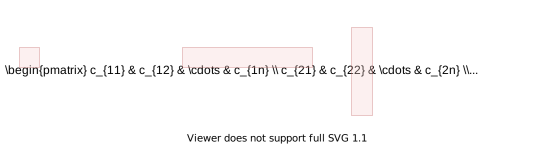
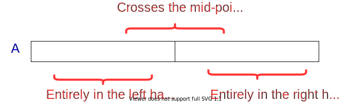

<!-- _backgroundColor: aquq -->

<!-- _color: orange -->

<!-- paginate: false -->

## CE100 Algorithms and Programming II

## Week-3 (Matrix Multiplication/ Quick Sort)

#### Spring Semester, 2021-2022

Download [DOC](ce100-week-3-matrix.tr.md_doc.pdf), [SLIDE](ce100-week-3-matrix.tr.md_slide.pdf), [PPTX](ce100-week-3-matrix.tr.md_slide.pptx)

<iframe width=700, height=500 frameBorder=0 src="../ce100-week-3-matrix.tr.md_slide.html"></iframe>

---

<!-- paginate: true -->

## Matrix Multiplication / Quick Sort

## Outline (1)

- Matrix Multiplication 
  
  - Traditional 
  
  - Recursive 
  
  - Strassen

---

## Outline (2)

- Quicksort 
  
  - Hoare Partitioning 
  
  - Lomuto Partitioning 
  
  - Recursive Sorting 

---

## Outline (3)

- Quicksort Analysis 
  
  - Randomized Quicksort 
  
  - Randomized Selection 
    
    - Recursive 
    
    - Medians 

---

## Matrix Multiplication (1)

- **Input:** $A=[a_{ij}],B=[b_{ij}]$
- **Output:** $C=[c_{ij}]=A \cdot B$ $\Longrightarrow i,j=1,2,3, \dots, n$

$$
\begin{bmatrix}
    c_{11} & c_{12} & \dots & c_{1n}  \\
    c_{21} & c_{22} & \dots & c_{2n}  \\
    \vdots & \vdots & \vdots & \ddots \\
    c_{n1} & c_{n2} & \dots & c_{nn}  \\
\end{bmatrix}
=
\begin{bmatrix}
    a_{11} & a_{12} & \dots & a_{1n}  \\
    a_{21} & a_{22} & \dots & a_{2n}  \\
    \vdots & \vdots & \vdots & \ddots \\
    a_{n1} & a_{n2} & \dots & a_{nn}  \\
\end{bmatrix}
\cdot
\begin{bmatrix}
    b_{11} & b_{12} & \dots & b_{1n}  \\
    b_{21} & b_{22} & \dots & b_{2n}  \\
    \vdots & \vdots & \vdots & \ddots \\
    b_{n1} & a_{n2} & \dots & b_{nn}  \\
\end{bmatrix}
$$

---

## Matrix Multiplication (2)



- $c_{ij}=\sum \limits_{1\leq k \leq n}^{}a_{ik}.b_{kj}$

---

## Matrix Multiplication: Standard Algorithm

Running Time: $\Theta(n^3)$

```r
for i=1 to n do
    for j=1 to n do
        C[i,j] = 0
        for k=1 to n do
            C[i,j] = C[i,j] + A[i,k] + B[k,j]
        endfor
    endfor
endfor
```

---

## Matrix Multiplication: Divide & Conquer (1)

**IDEA:** Divide the $nxn$ matrix into $2x2$ matrix of $(n/2)x(n/2)$ submatrices.


---

## Matrix Multiplication: Divide & Conquer (2)

$$
\begin{bmatrix}
    c_{11} & c_{12} \\
    c_{21} & c_{22} 
\end{bmatrix}
=
\begin{bmatrix}
    a_{11} & a_{12} \\
    a_{21} & a_{22} 
\end{bmatrix}
\cdot
\begin{bmatrix}
    b_{11} & b_{12} \\
    b_{21} & b_{22}
\end{bmatrix}
$$

$$
\text{8 mults and 4 adds of (n/2)*(n/2) submatrices}=
\begin{cases}
  c_{11}=a_{11}b_{11}+a_{12}b_{21} \\
  c_{21}=a_{21}b_{11}+a_{22}b_{21} \\
  c_{12}=a_{11}b_{12}+a_{12}b_{22} \\
  c_{22}=a_{21}b_{12}+a_{22}b_{22}
\end{cases}
$$

---

## Matrix Multiplication: Divide & Conquer (3)

```r
MATRIX-MULTIPLY(A, B)
    // Assuming that both A and B are nxn matrices
    if n == 1 then 
        return A * B
    else  
        //partition A, B, and C as shown before
        C[1,1] = MATRIX-MULTIPLY (A[1,1], B[1,1]) + 
                 MATRIX-MULTIPLY (A[1,2], B[2,1]); 

        C[1,2] = MATRIX-MULTIPLY (A[1,1], B[1,2]) + 
                MATRIX-MULTIPLY (A[1,2], B[2,2]); 

        C[2,1] = MATRIX-MULTIPLY (A[2,1], B[1,1]) + 
        MATRIX-MULTIPLY (A[2,2], B[2,1]);

        C[2,2] = MATRIX-MULTIPLY (A[2,1], B[1,2]) + 
        MATRIX-MULTIPLY (A[2,2], B[2,2]);
    endif      

    return C
```

---

## Matrix Multiplication: Divide & Conquer Analysis

$T(n) = 8T(n/2) + \Theta(n^2)$

- $8$ recursive calls $\Longrightarrow 8T(\cdots)$ 
- each problem has size $n/2$ $\Longrightarrow \cdots T(n/2)$ 
- Submatrix addition $\Longrightarrow \Theta(n^2)$

---

## Matrix Multiplication: Solving the Recurrence

- $T(n) = 8T(n/2) + \Theta(n^2)$
  
  - $a=8$, $b=2$
  - $f(n)=\Theta(n^2)$ 
  - $n^{log_b^a}=n^3$

- Case 1: $\frac{n^{log_b^a}}{f(n)}=\Omega(n^{\varepsilon}) \Longrightarrow T(n)=\Theta(n^{log_b^a})$

Similar with ordinary (iterative) algorithm.

---

## Matrix Multiplication: Strassen’s Idea (1)

Compute $c_{11},c_{12},c_{21},c_{22}$ using $7$ recursive multiplications. 

In normal case we need $8$ as below.

$$
\begin{bmatrix}
    c_{11} & c_{12} \\
    c_{21} & c_{22} 
\end{bmatrix}
=
\begin{bmatrix}
    a_{11} & a_{12} \\
    a_{21} & a_{22} 
\end{bmatrix}
\cdot
\begin{bmatrix}
    b_{11} & b_{12} \\
    b_{21} & b_{22}
\end{bmatrix}
$$

$$
\text{8 mults and 4 adds of (n/2)*(n/2) submatrices}=
\begin{cases}
  c_{11}=a_{11}b_{11}+a_{12}b_{21} \\
  c_{21}=a_{21}b_{11}+a_{22}b_{21} \\
  c_{12}=a_{11}b_{12}+a_{12}b_{22} \\
  c_{22}=a_{21}b_{12}+a_{22}b_{22}
\end{cases}
$$

---

<style scoped>section{ font-size: 25px; }</style>

## Matrix Multiplication: Strassen’s Idea (2)

- **Reminder:** 
  - Each submatrix is of size $(n/2)*(n/2)$
  - Each add/sub operation takes $\Theta(n^2)$ time
- Compute $P1 \dots P7$ using $7$ recursive calls to  matrix-multiply

$$
\begin{align*} 
  P_1 & =  a_{11} * (b_{12} - b_{22} )    \\
  P_2 & = (a_{11} + a_{12} ) * b_{22}    \\
  P_3 & = (a_{21} + a_{22} ) * b_{11}    \\          
  P_4 & = a_{22} * (b_{21} - b_{11} )    \\           
  P_5 & = (a_{11} + a_{22} ) * (b_{11} + b_{22} ) \\
  P_6 & = (a_{12} - a_{22} ) * (b_{21} + b_{22} ) \\
  P_7 & = ( a_{11} - a_{21} ) * (b_{11} + b_{12} )
\end{align*}
$$

---

<style scoped>section{ font-size: 25px; }</style>

## Matrix Multiplication: Strassen’s Idea (3)

$$
\begin{align*} 
P_1 &=  a_{11} * (b_{12} - b_{22} )    \\
P_2 &= (a_{11} + a_{12} ) * b_{22}    \\
P_3 &= (a_{21} + a_{22} ) * b_{11}    \\          
P_4 &= a_{22} * (b_{21} - b_{11} )    \\           
P_5 &= (a_{11} + a_{22} ) * (b_{11} + b_{22} ) \\
P_6 &= (a_{12} - a_{22} ) * (b_{21} + b_{22} ) \\
P_7 &= ( a_{11} - a_{21} ) * (b_{11} + b_{12} )
\end{align*}
$$

- How to compute $c_{ij}$ using $P1 \dots P7$ ?

$$
\begin{align*} 
c_{11} & = P_5 + P_4 – P_2 + P_6 \\
c_{12} & = P_1 + P_2 \\
c_{21} & = P_3 + P_4 \\
c_{22} & = P_5 + P_1 – P_3 – P_7
\end{align*}
$$

---

## Matrix Multiplication: Strassen’s Idea (4)

- $7$ recursive multiply calls
- $18$ add/sub operations

---

## Matrix Multiplication: Strassen’s Idea (5)

e.g. Show that $c_{12} = P_1+P_2$ :

$$
\begin{align*} 
c_{12} & = P_1 + P_2 \\ 
&= a_{11}(b_{12}–b_{22})+(a_{11}+a_{12})b_{22} \\
&= a_{11}b_{12}-a_{11}b_{22}+a_{11}b_{22}+a_{12}b_{22} \\
&= a_{11}b_{12}+a_{12}b_{22}
\end{align*}
$$

---

## Strassen’s Algorithm

- **Divide:** Partition $A$ and $B$ into $(n/2)*(n/2)$ submatrices. Form terms to be multiplied using $+$ and $-$.

- **Conquer:** Perform $7$ multiplications of $(n/2)*(n/2)$ submatrices recursively.

- **Combine:** Form $C$ using $+$ and $–$ on $(n/2)*(n/2)$submatrices.

**Recurrence:** $T(n) = 7T(n/2) + \Theta(n^2)$ 

---

## Strassen’s Algorithm: Solving the Recurrence (1)

- $T(n) = 7T(n/2) + \Theta(n^2)$
  
  - $a=7$, $b=2$
  - $f(n)=\Theta(n^2)$ 
  - $n^{log_b^a}=n^{lg7}$

- Case 1: $\frac{n^{log_b^a}}{f(n)}=\Omega(n^{\varepsilon}) \Longrightarrow T(n)=\Theta(n^{log_b^a})$

$T(n)=\Theta(n^{log_2^7})$

$2^3 = 8, 2^2=4$ so $\Longrightarrow log_2^7 \approx 2.81$

or use https://www.omnicalculator.com/math/log

---

## Strassen’s Algorithm: Solving the Recurrence (2)

- The number $2.81$ may not seem much smaller than $3$

- But, it is significant because the difference is in the exponent.

- Strassen’s algorithm beats the ordinary algorithm on today’s machines for $n \geq 30$ or so.

- Best to date: $\Theta(n^{2.376 \dots})$  (of theoretical interest only)

---

## Maximum Subarray Problem

**Input:** An array of values

**Output:** The contiguous subarray that has the largest sum of elements

- Input array:
  $[13][-3][-25][20][-3][-16][-23]\overbrace{[18][20][-7][12]}^{\textrm{max. contiguous subarray}}[-22][-4][7]$

---

## Maximum Subarray Problem: Divide & Conquer (1)

- **Basic idea:**
  - **Divide** the input array into 2 from the middle
  - Pick the **best** solution among the following:
    - The max subarray of the **left half**
    - The max subarray of the **right half**
    - The max subarray **crossing the mid-point**

---

## Maximum Subarray Problem: Divide & Conquer (2)



---

## Maximum Subarray Problem: Divide & Conquer (3)

- **Divide:** Trivial (divide the array from the middle)

- **Conquer:** Recursively compute the max subarrays of the left and right halves

- **Combine:** Compute the max-subarray crossing the $mid-point$ 
  - (can be done in $\Theta(n)$ time). 
  - Return the max among the following:
    - the max subarray of the $\text{left-subarray}$
    - the max subarray of the $\text{rightsubarray}$
    - the max subarray crossing the $\text{mid-point}$

TODO : detailed solution in textbook...

---

## Conclusion : Divide & Conquer

- Divide and conquer is just one of several powerful techniques for algorithm design.
- Divide-and-conquer algorithms can be analyzed using recurrences and the master method (so practice this math).
- Can lead to more efficient algorithms  

---

## Quicksort (1)

- One of the most-used algorithms in practice
- Proposed by **C.A.R.** *Hoare* in 1962.
- Divide-and-conquer algorithm
- In-place algorithm
  - The additional space needed is O(1)
  - The sorted array is returned in the input array
  - *Reminder: Insertion-sort is also an in-place algorithm, but Merge-Sort is not in-place.*
- Very practical

---

## Quicksort (2)

- **Divide:** Partition the array into 2 subarrays such that elements in the lower part $\leq$ elements in the higher part
- **Conquer:** Recursively sort 2 subarrays
- **Combine:** Trivial (because in-place)

**Key:** Linear-time $(\Theta(n))$ partitioning algorithm


---

<style scoped>section{ font-size: 25px; }</style>

## Divide: Partition the array around a pivot element

- Choose a pivot element $x$

- Rearrange the array such that:
  
  - Left subarray: All elements $\leq x$
  - Right subarray: All elements $\geq x$
  
  

---

## Conquer: Recursively Sort the Subarrays

Note: Everything in the left subarray ≤ everything in the right subarray


Note: Combine is trivial after conquer. Array already sorted.

---

<style scoped>section{ font-size: 25px; }</style>

## Two partitioning algorithms

- **Hoare’s algorithm:** 
  Partitions around the first element of subarray 
  - $(pivot = x = A[p])$


- **Lomuto’s algorithm:** 
  Partitions around the last element of subarray 
  - $(pivot = x = A[r])$


---

## Hoare’s Partitioning Algorithm (1)

- Choose a pivot element: $pivot = x = A[p]$


- Grow two regions:
  - from left to right: $A[p \dots i]$
  - from right to left: $A[j \dots r]$
    - such that:
  - every element in $A[p \dots i] \leq$ pivot
  - every element in $A[p \dots i] \geq$ pivot

---

## Hoare’s Partitioning Algorithm (2)


---

<style scoped>section{ font-size: 25px; }</style>

## Hoare’s Partitioning Algorithm (3)

- Elements are exchanged when
  - $A[i]$ is **too large** to  belong to the **left** region
  - $A[j]$ is **too small** to belong to the **right** region 
    - assuming that the inequality is strict
- The two regions $A[p \dots i]$ and $A[j \dots r]$ grow until $A[i] \geq pivot \geq A[j]$

```r
  H-PARTITION(A, p, r)
        pivot = A[p]
          i = p - 1
          j = r - 1
          while true do
            repeat j = j - 1 until A[j] <= pivot
            repeat i = i - 1 until A[i] <= pivot
          if i < j then 
            exchange A[i] with A[j]
          else 
            return j
```

---

## Hoare’s Partitioning Algorithm Example (Step-1)


---

## Hoare’s Partitioning Algorithm Example (Step-2)


---

## Hoare’s Partitioning Algorithm Example (Step-3)


---

## Hoare’s Partitioning Algorithm Example (Step-4)


---

## Hoare’s Partitioning Algorithm Example (Step-5)


---

## Hoare’s Partitioning Algorithm Example (Step-6)


---

## Hoare’s Partitioning Algorithm Example (Step-7)


---

## Hoare’s Partitioning Algorithm Example (Step-8)


---

## Hoare’s Partitioning Algorithm Example (Step-9)


---

## Hoare’s Partitioning Algorithm Example (Step-10)


---

## Hoare’s Partitioning Algorithm Example (Step-11)


---

## Hoare’s Partitioning Algorithm Example (Step-12)


---

<style scoped>section{ font-size: 25px; }</style>

## Hoare’s Partitioning Algorithm - Notes

- Elements are exchanged when
  - $A[i]$ is **too large** to belong to the **left** region
  - $A[j]$ is **too small** to belong to the **right** region
    - assuming that the inequality is strict
- The two regions $A[p \dots i]$ and $A[j \dots r]$ grow until  $A[i] \geq pivot \geq A[j]$
- The asymptotic runtime of Hoare’s partitioning algorithm $\Theta(n)$

```r
  H-PARTITION(A, p, r)
        pivot = A[p]
          i = p - 1
          j = r - 1
          while true do
            repeat j = j - 1 until A[j] <= pivot
            repeat i = i - 1 until A[i] <= pivot
          if i < j then exchange A[i] with A[j]
          else return j
```

---

<style scoped>section{ font-size: 25px; }</style>

## Quicksort with Hoare’s Partitioning Algorithm

```r
QUICKSORT (A, p, r)
  if p < r then
    q = H-PARTITION(A, p, r)
    QUICKSORT(A, p, q)
    QUICKSORT(A, q + 1, r)
  endif
```

Initial invocation: `QUICKSORT(A,1,n)`


---

<style scoped>section{ font-size: 25px; }</style>

## Hoare’s Partitioning Algorithm: Pivot Selection

- if we select pivot to be $A[r]$ instead of $A[p]$ in **H-PARTITION**


- Consider the example where $A[r]$ is the largest element in the array:
  - End of H-PARTITION: $i = j = r$
  - In QUICKSORT: $q = r$
    - So, recursive call to: 
      - `QUICKSORT(A, p, q=r)`
        - **infinite loop** 

---

## Correctness of Hoare’s Algorithm (1)

We need to prove $3$ claims to show correctness:

- Indices $i$ and $j$ never reference $A$ outside the interval $A[p \dots r]$
- Split is always non-trivial; i.e., $j \neq r$ at termination
- Every element in $A[p \dots j] \leq$ every element in $A[j+1 \dots r]$ at termination


---

## Correctness of Hoare’s Algorithm (2)

- Notations: 
  
  - $k$: $\#$ of times the while-loop iterates until termination
  - $i_m$: the value of index i at the end of iteration $m$
  - $j_m$: the value of index j at the end of iteration $m$
  - $x$: the value of the pivot element

- **Note**: We always have $i_1= p$ and  $p \leq j_1 \leq r$
    because $x = A[p]$

---

## Correctness of Hoare’s Algorithm (3)

**Lemma 1:** Either $i_k = j_k$ or $i_k = j_k+1$ at termination

**Proof of Lemma 1:**

- The algorithm terminates when $i \geq j$ (the else condition). 

- So, it is sufficient to prove that $i_k – j_k \leq 1$

- There are $2$ cases to consider:
  
  - Case 1: $k = 1$, i.e. the algorithm terminates in a single iteration
  - Case 2: $k > 1$, i.e. the alg. does not terminate in a single iter.
  
  **By contradiction**, assume there is a run with $i_k – j_k > 1$

---

<style scoped>section{ font-size: 25px; }</style>

## Correctness of Hoare’s Algorithm (4)

**Original correctness claims:**

- Indices $i$ and $j$ never reference A outside the interval $A[p \dots r]$
- Split is always non-trivial; i.e., $j \neq r$ at termination

**Proof:**

- **For $k = 1$:** 
  - Trivial because $i_1 = j_1 = p$ (*see Case 1 in proof of Lemma 2*)
- **For $k > 1$:** 
  - $i_k > p$ and $j_k < r$ (*due to the repeat-until loops moving indices*)
  - $i_k \leq r$ and $j_k \geq p$ (*due to Lemma 1 and the statement above*)

**The proof of claims (a) and (b) complete**

---

<style scoped>section{ font-size: 25px; }</style>

## Correctness of Hoare’s Algorithm (5)

**Lemma 2:** At the end of iteration $m$, where $m<k$ (*i.e. m is not the last iteration*), we must have:
$A[p \dots i_m] \leq x$  and  $A[j_m \dots r] \geq x$

**Proof of Lemma 2:**

- **Base case:** $m=1$ and $k>1$ (*i.e. the alg. does not terminate in the first iter.*)

**Ind. Hyp.:** At the end of iteration $m-1$, where $m<k$ (*i.e. m is not the last iteration*), we must have: 
$A[p \dots i_m-1] \leq x$ and $A[j_m-1 \dots r] \geq x$

**General case:** The lemma holds for $m$, where $m < k$

**Proof of base case complete!**

---

## Correctness of Hoare’s Algorithm (6)

**Original correctness claim:**

- (c) Every element in $A[ \dots j] \leq$ every element in $A[j+ \dots r]$ at termination

**Proof of claim (c)**

- There are $3$ cases to consider:
  - **Case 1:** $k=1$, i.e. the algorithm terminates in a single iteration
  - **Case 2:** $k>1$ and $i_k = j_k$ 
  - **Case 3:** $k>1$ and $i_k = j_k + 1$

---

## Lomuto’s Partitioning Algorithm (1)

- Choose a pivot element: $pivot = x = A[r]$


- Grow two regions:
  - from left to right: $A[p \dots i]$
  - from left to right: $A[i+1 \dots j]$
    - such that:
      - every element in $A[p \dots i]  \leq pivot$
      - every element in $A[i+1 \dots j] > pivot$

---

## Lomuto’s Partitioning Algorithm (2)


---

## Lomuto’s Partitioning Algorithm Ex. (Step-1)


---

## Lomuto’s Partitioning Algorithm Ex. (Step-2)


---

## Lomuto’s Partitioning Algorithm Ex. (Step-3)


---

## Lomuto’s Partitioning Algorithm Ex. (Step-4)


---

## Lomuto’s Partitioning Algorithm Ex. (Step-5)


---

## Lomuto’s Partitioning Algorithm Ex. (Step-6)


---

## Lomuto’s Partitioning Algorithm Ex. (Step-7)


---

## Lomuto’s Partitioning Algorithm Ex. (Step-8)


---

## Lomuto’s Partitioning Algorithm Ex. (Step-9)


---

## Lomuto’s Partitioning Algorithm Ex. (Step-10)


---

## Lomuto’s Partitioning Algorithm Ex. (Step-11)


---

## Lomuto’s Partitioning Algorithm Ex. (Step-12)


---

## Lomuto’s Partitioning Algorithm Ex. (Step-13)


---

## Lomuto’s Partitioning Algorithm Ex. (Step-14)


---

## Lomuto’s Partitioning Algorithm Ex. (Step-15)


---

## Quicksort with Lomuto’s Partitioning Algorithm

```r
QUICKSORT (A, p, r)
  if p < r then
    q = L-PARTITION(A, p, r)
    QUICKSORT(A, p, q - 1)
    QUICKSORT(A, q + 1, r)
  endif
```

Initial invocation: `QUICKSORT(A,1,n)`


---

## Comparison of Hoare’s & Lomuto’s Algorithms (1)

- Notation: $n=r-p+1$ 
  - $pivot=A[p]$ (*Hoare*)
  - $pivot=A[r]$ (*Lomuto*)
- **$\#$ of element exchanges: $e(n)$**
  - Hoare: $0 \geq e(n) \geq \lfloor \frac{n}{2} \rfloor$
    - **Best**: $k=1$ with $i_1=j_1=p$ (i.e., $A[p+1 \dots r]>pivot$)
    - **Worst**: $A[p+1 \dots p+ \lfloor \frac{n}{2} \rfloor - 1] \geq pivot \geq A[p+ \lceil \frac{n}{2} \rceil \dots r]$
  - Lomuto : $1 \leq e(n) \leq n$
    - **Best**: $A[p \dots r -1]>pivot$
    - **Worst**: $A[p \dots r-1] \leq pivot$

---

## Comparison of Hoare’s & Lomuto’s Algorithms (2)

- **$\#$ of element comparisons: $c_e(n)$**
  
  - **Hoare**: $n+1 \leq c_e(n) \leq n+2$
    - **Best**: $i_k=j_k$
    - **Worst**: $i_k=j_k+1$
  - **Lomuto**: $c_e(n)=n-1$

- **$\#$ of index comparisons: $c_i(n)$**
  
  - **Hoare**: $1 \leq c_i(n) \leq \lfloor \frac{n}{2} \rfloor + 1 | (c_i(n)=e(n)+1)$
  - **Lomuto**: $c_i(n)=n-1$

---

## Comparison of Hoare’s & Lomuto’s Algorithms (3)

- **$\#$ of index increment/decrement operations: $a(n)$**
  
  - **Hoare**: $n+1 \leq a(n) \leq n+2 | (a(n)=c_e(n))$
  - **Lomuto**: $n \leq a(n) \leq 2n-1 | (a(n)=e(n)+(n-1))$

- Hoare’s algorithm is in general faster 

- Hoare behaves better when pivot is repeated in $A[p \dots r]$
  
  - **Hoare**: Evenly distributes them between left & right regions
  - **Lomuto**: Puts all of them to the left region

---

## Analysis of Quicksort (1)

```r
QUICKSORT (A, p, r)
  if p < r then
    q = H-PARTITION(A, p, r)
    QUICKSORT(A, p, q)
    QUICKSORT(A, q + 1, r)
  endif
```

Initial invocation: `QUICKSORT(A,1,n)`


Assume **all elements are distinct** in the following analysis

---

## Analysis of Quicksort (2)

- **H-PARTITION** always chooses $A[p]$ (the first element) as the pivot. 
- The runtime of **QUICKSORT** on an already-sorted array is $\Theta(n^2)$

---

## Example: An Already Sorted Array

Partitioning always leads to $2$ parts of size $1$ and $n-1$


---

## Worst Case Analysis of Quicksort

- **Worst case** is when the **PARTITION** algorithm always returns **imbalanced partitions** (of size $1$ and $n-1$) in every recursive call.
  - This happens when the pivot is selected to be either the min or **max** element.
  - This happens for **H-PARTITION** when the input array is already sorted or reverse sorted

$$
\begin{align*} 
T(n) &= T(1) + T(n-1) + Θ(n) \\
        &= T(n-1) + Θ(n) \\
        &= Θ(n2)
\end{align*}
$$

---

## Worst Case Recursion Tree

$$
T(n) = T(1) + T(n-1) + cn
$$


---

## Best Case Analysis (for intuition only)

- If we’re extremely lucky, **H-PARTITION** splits the array evenly at every recursive call

$$
\begin{align*} 
T(n) &= 2T(n/2) + \Theta(n) \\
&= \Theta(nlgn)
\end{align*}
$$ 

*(same as merge sort)*

- Instead of splitting $0.5:0.5$, if we split $0.1:0.9$ then we need solve following equation.

$$
\begin{align*} 
T(n) &= T(n/10) + T(9n/10) + \Theta(n) \\
&= \Theta(nlgn)
\end{align*}
$$ 

---

## “Almost-Best” Case Analysis


---

## Balanced Partitioning (1)

- We have seen that if **H-PARTITION** always splits the array with $0.1-to-0.9$ ratio, the runtime will be $\Theta(nlgn)$.

- Same is true with a split ratio of $0.01-to-0.99$, etc.

- Possible to show that if the split has always constant $(\Theta(1))$ proportionality, then the runtime will be $\Theta(nlgn)$.

- In other words, for a **constant** $\alpha | (0 < \alpha ≤ 0.5)$: 
  
  - $\alpha–to–(1-\alpha)$ proportional split yields $\Theta(nlgn)$ total runtime

---

## Balanced Partitioning (2)

- In the rest of the analysis, assume that all input permutations are equally likely.
  - This is only to gain some intuition
  - We cannot make this assumption for average case analysis
  - We will revisit this assumption later
- Also, assume that all input elements are distinct.

---

## Balanced Partitioning (3)

- **Question:** What is the probability that H-PARTITION returns a split that is more balanced than $0.1-to-0.9$?

---

## Balanced Partitioning (4)

**Reminder:** *H-PARTITION* will place the pivot in the right partition unless the pivot is the smallest element in the arrays.

**Question:** If the pivot selected is the mth smallest value $(1 < m ≤ n)$ in the input array, what is the size of the left region after partitioning?


---

## Balanced Partitioning (5)

- **Question:** What is the probability that the **pivot** selected is the $m^{th}$ smallest value in the array of size $n$? 
  
  - $1/n$ (*since all input permutations are equally likely*)

- **Question:** What is the probability that the left partition returned by **H-PARTITION** has size $m$, where $1<m<n$?
  
  - $1/n$ (*due to the answers to the previous 2 questions*)

---

## Balanced Partitioning (6)

<style scoped>section{ font-size: 25px; }</style>

- **Question:** What is the probability that H-PARTITION returns a split that is more balanced than $0.1-to-0.9$?

$$
\begin{align*} 
Probability &=\sum \limits_{q=0.1n+1}^{0.9n-1}\frac{1}{n} \\
&=\frac{1}{n}(0.9n-1-0.1n-1+1) \\ 
&= 0.8-\frac{1}{n} \\ 
& \approx 0.8 \text{ for large n}
\end{align*} 
$$


---

## Balanced Partitioning (7)

- The probability that **H-PARTITION** yields a split that is more balanced than $0.1-to-0.9$ is $80\%$ on a random array.

- Let $P_{\alpha>}$ be the probability that **H-PARTITION** yields a split more balanced than $\alpha-to-(1-\alpha)$, where $0 < \alpha \leq 0.5$

- Repeat the analysis to generalize the previous result

---

<style scoped>section{ font-size: 25px; }</style>

## Balanced Partitioning (8)

- **Question:** What is the probability that H-PARTITION returns a split that is more balanced than $\alpha-to-(1-\alpha)$?


$$
\begin{align*} 
Probability & =\sum \limits_{q=\alpha n+1}^{(1-\alpha)n-1}\frac{1}{n} \\
& =\frac{1}{n}((1-\alpha)n-1- \alpha n-1+1) \\ 
& = (1-2\alpha)-\frac{1}{n} \\ 
& \approx (1-2\alpha) \text{ for large n}
\end{align*} 
$$

---

## Balanced Partitioning (9)

- We found $P_{\alpha >}=1-2\alpha$
  - Ex: $P_{0.1>}=0.8$ and $P_{0.01>}=0.98$
- Hence, **H-PARTITION** produces a split 
  - **more balanced than a**
    - $0.1-to-0.9$ split $80\%$ of the time
    - $0.01-to-0.99$ split $98\%$ of the time
  - **less balanced than a**
    - $0.1-to-0.9$ split $20\%$ of the time
    - $0.01-to-0.99$ split $2\%$ of the time

---

## Intuition for the Average Case (1)

- **Assumption:** All permutations are equally likely
  
  - Only for intuition; we’ll revisit this assumption later

- **Unlikely:** Splits always the same way at every level

- **Expectation:**
  
  - Some splits will be reasonably balanced
  - Some splits will be fairly unbalanced

- **Average case:** A mix of good and bad splits
  
  - **Good** and **bad** splits distributed randomly thru the tree

---

## Intuition for the Average Case (2)

- **Assume for intuition:** Good and bad splits occur in the alternate levels of the tree
  - **Good split:** Best case split
  - **Bad split:** Worst case split

---

## Intuition for the Average Case (3)

Compare 2-successive levels of avg case vs. 1 level of best case


---

## Intuition for the Average Case (4)

- In terms of the remaining subproblems, **two levels of avg case** is slightly better than the **single level of the best case**

- The avg case has **extra divide cost of $\Theta(n)$** at alternate levels

- The extra divide cost $\Theta(n)$ of bad splits absorbed into the $\Theta(n)$ of good splits.

- Running time is still $\Theta(nlgn)$
  
  - But, slightly larger hidden constants, because the height of the recursion tree is about twice of that of best case.

---

## Intuition for the Average Case (5)

- Another way of looking at it:
  
  - Suppose we alternate lucky, unlucky, lucky, unlucky, $\dots$
  - We can write the recurrence as:
    - $L(n) = 2U(n/2) + \Theta(n)$    lucky split (best)
    - $U(n) = L(n-1) + \Theta(n)$        unlucky split (worst)
  - Solving:
  
  $$
  \begin{align*} 
  L(n) & = 2(L(n/2-1) + \Theta(n/2)) + \Theta(n) \\
          & = 2L(n/2-1) + \Theta(n) \\
          & = Θ(nlgn) 
  \end{align*} 
  $$

- How can we make sure we are usually lucky for all inputs?

---

## Summary: Quicksort Runtime Analysis (1)

- **Worst case:** Unbalanced split at every recursive call

$$
\begin{align*} 
T(n) & = T(1) + T(n-1) + \Theta(n) \\
T(n) & = \Theta(n2)
\end{align*} 
$$

- **Best case:** Balanced split at every recursive call (*extremely lucky*)

$$
\begin{align*} 
T(n) & = 2T(n/2) + \Theta(n) \\
T(n) & = \Theta(nlgn)
\end{align*} 
$$

---

## Summary: Quicksort Runtime Analysis (2)

- **Almost-best case:** Almost-balanced split at every recursive call

$$
\begin{align*} 
T(n) &=T(n/10)+T(9n/10)+ \Theta(n) \\
\text{or } T(n) &= T(n/100) + T(99n/100) + Θ(n) \\
\text{or } T(n) &= T(\alpha n) + T((1-\alpha n)+ \Theta(n)
\end{align*} 
$$

for any constant $\alpha, 0 < \alpha \leq 0.5$

---

## Summary: Quicksort Runtime Analysis (3)

- For a random input array, the probability of having a split 
  - more balanced than   $0.1 – to – 0.9 : 80\%$
  - more balanced than $0.01 – to – 0.99  :  98\%$
  - more balanced than $\alpha – to – (1-\alpha) : 1 – 2 \alpha$
    
- for any constant $\alpha, 0 < \alpha \leq 0.5$

---

## Summary: Quicksort Runtime Analysis (4)

- **Avg case intuition:** Different splits expected at different levels
  
  - some balanced (good), some unbalanced (bad)

- **Avg case intuition:** Assume the good and bad splits alternate
  
  - i.e. good split -> bad split -> good split -> …
  - $T(n) = \Theta(nlgn)$
    - (informal analysis for intuition)

---

## Randomized Quicksort

- In the avg-case analysis, we assumed that **all permutations** of the input array are **equally likely.**
  - But, this assumption **does not always hold**
  - e.g. What if **all** the input arrays are **reverse sorted**?
    - **Always worst-case behavior**
- Ideally, the avg-case runtime should be **independent of the input permutation**.
- **Randomness should be within the algorithm**, not based on the distribution of the inputs.
  - i.e. The avg case should hold for all possible inputs

---

## Randomized Algorithms (1)

- Alternative to assuming a uniform distribution: 
  - **Impose a uniform distribution**
  - e.g. Choose a random pivot rather than the first element
- Typically useful when:
  - there are many ways that an algorithm can proceed
  - but, it’s **difficult** to determine a way that is **always guaranteed to be good**.
  - If there are **many good alternatives**; simply **choose one randomly**.

---

## Randomized Algorithms (1)

- Ideally:
  - Runtime should be **independent of the specific inputs**
  - No specific input should cause worst-case behavior
  - Worst-case should be determined only by output of a random number generator.

---

<style scoped>section{ font-size: 25px; }</style>

## Randomized Quicksort (1)

- Using Hoare’s partitioning algorithm:

```r
R-QUICKSORT(A, p, r)
  if p < r then
    q = R-PARTITION(A, p, r)
    R-QUICKSORT(A, p, q)
    R-QUICKSORT(A, q+1, r)
```

```r
R-PARTITION(A, p, r)
  s = RANDOM(p, r)
  exchange A[p] with A[s]
  return H-PARTITION(A, p, r)
```

- Alternatively, permuting the whole array would also work
  - but, would be more difficult to analyze

---
<style scoped>section{ font-size: 25px; }</style>

## Randomized Quicksort (2)

- Using Lomuto’s partitioning algorithm:

```r
R-QUICKSORT(A, p, r)
  if p < r then
    q = R-PARTITION(A, p, r)
    R-QUICKSORT(A, p, q-1)
    R-QUICKSORT(A, q+1, r)
```

```r
R-PARTITION(A, p, r)
  s = RANDOM(p, r)
  exchange A[r] with A[s]
  return L-PARTITION(A, p, r)
```

- Alternatively, permuting the whole array would also work
  - but, would be more difficult to analyze

---

## Notations for Formal Analysis

- Assume all elements in $A[p \dots r]$ are distinct  
  
  - Let $n = r – p + 1$

- Let $rank(x) = |{A[i]: p \leq i \leq r \text{ and } A[i] \leq x}|$

- i.e. $rank(x)$ is the number of array elements with value less than or equal to $x$
  
  - $A=\{5,9,7,6,8,1,4\}$
  - $p=5,r=4$
  - $rank(5)=3$
    - i.e. it is the $3^{rd}$ smallest element in the array

---

## Formal Analysis for Average Case

- The following analysis will be for **Quicksort** using **Hoare’s** partitioning algorithm.

- **Reminder:** The **pivot** is selected **randomly** and exchanged with $A[p]$ before calling **H-PARTITION**

- Let $x$ be the **random pivot** chosen.

- What is the probability that $rank(x) = i$ for $i = 1, 2, \dots n$ ?
  
  - $P(rank(x) = i) = 1/n$

---

<style scoped>section{ font-size: 25px; }</style>

## Various Outcomes of H-PARTITION (1)

- Assume that $rank(x)=1$
  - i.e. the **random pivot** chosen is the **smallest** element
  - What will be the **size of the left partition** $(|L|)$?
  - **Reminder:** Only the elements less than or equal to $x$ will be in the left partition.

$A=\{\overbrace{2}^{p=x=pivot}\underbrace{,}_{\Longrightarrow|L|=1 } 9,7,6,8,5,\overbrace{4}^r\}$

$p=2,r=4$
$pivot=x=2$

**TODO: convert to image...S6_P9**

---

<style scoped>section{ font-size: 25px; }</style>

## Various Outcomes of H-PARTITION (2)

- Assume that $rank(x)>1$
  - i.e. the random pivot chosen is not the smallest element
  - What will be the size of the left partition $(|L|)$?
  - **Reminder:** Only the elements less than or equal to $x$ will be in the left partition.
  - **Reminder:** The pivot will stay in the right region     after **H-PARTITION** if $rank(x)>1$

$A=\{\overbrace{2}^{p}, 4 \underbrace{,}_{\Longrightarrow|L|=rank(x)-1}7,6,8,\overbrace{5,}^{pivot}\overbrace{9}^r\}$

$p=2,r=4$
$pivot=x=5$

**TODO: convert to image...S6_P10**

---

## Various Outcomes of H-PARTITION - Summary (1)

- $x: pivot$

- $|L|: \text{size of left region}$

- $P(rank(x) = i) = 1/n  \text{ for } 1 \leq i \leq n$
  
  - $\text{if } rank(x) = 1 \text{ then } |L| = 1$
  - $\text{if } rank(x) > 1 \text{ then } |L| = rank(x) - 1$

- $P(|L| = 1) = P(rank(x) = 1) + P(rank(x) = 2)$
  
  - $P(|L| = 1) = 2/n$

- $P(|L| = i) = P(rank(x) = i+1) \text{ for } 1< i < n$
  
  - $P(|L| = i) = 1/n \text{ for } 1< i < n$

---

## Various Outcomes of H-PARTITION - Summary (2)


---

<style scoped>section{ font-size: 25px; }</style>

## Average - Case Analysis: Recurrence (1)

$x=pivot$

$$
\begin{align*} 
T(n) & = \frac{1}{n}(T(1)+t(n-1) ) & rank:1 \\
& + \frac{1}{n}(T(1)+t(n-1) ) & rank:2 \\
& + \frac{1}{n}(T(2)+t(n-2) ) & rank:3 \\
& \vdots & \vdots \\
& + \frac{1}{n}(T(i)+t(n-i) ) & rank:i+1 \\
& \vdots & \vdots \\
& + \frac{1}{n}(T(n-1)+t(1) ) & rank:n \\
& + \Theta(n)
\end{align*} 
$$

---

<style scoped>section{ font-size: 25px; }</style>

## Average - Case Analysis: Recurrence (2)

$$
\begin{align*} 
T(n) &= \frac{1}{n}\sum \limits_{q=1}^{n-1}(T(q)+T(n-q))+\frac{1}{n}(T(1)+T(n-1))+\Theta(n)\\
& \text{Note: } \frac{1}{n}(T(1)+T(n-1))=\frac{1}{n}(\Theta(1)+O(n^2))=O(n) \\
T(n) &= \frac{1}{n}\sum \limits_{q=1}^{n-1}(T(q)+T(n-q))+\Theta(n)
\end{align*} 
$$

for $k=1,2,\dots,n-1$ each term $T(k)$ appears twice once for $q = k$ and once for $q = n−k$

$$
T(n) = \frac{2}{n}\sum \limits_{k=1}^{n-1} T(k)+\Theta(n)
$$

---

## Average - Case Analysis -Solving Recurrence: Substitution

- Guess: $T(n)=O(nlgn)$
- $T(k) ≤ aklgk$ for  $k<n$, for some constant  $a > 0$

$$
\begin{align*} 
T(n) &= \frac{2}{n} \sum \limits_{k=1}^{n-1} T(k)+\Theta(n) \\
& \leq \frac{2}{n} \sum \limits_{k=1}^{n-1} aklgk+\Theta(n) \\
& \leq \frac{2a}{n}  \sum \limits_{k=1}^{n-1} klgk+\Theta(n) 
\end{align*} 
$$

- Need a tight bound for $\sum klgk$

---

## Tight bound for $\sum klgk$ (1)

- Bounding the terms
  - $\ \sum \limits_{k=1}^{n-1}klgk \leq \sum \limits_{k=1}^{n-1}nlgn = n(n-1)lgn \leq n^2lgn$
  - This bound **is not strong** enough because
  - $T(n) \leq \frac{2a}{n}n^2lgn+\Theta(n)$
  - $=2anlgn+\Theta(n)$ $\Longrightarrow$ couldn’t prove $T(n) \leq anlgn$

---

## Tight bound for $\sum klgk$ (2)

- **Splitting summations:** ignore ceilings for simplicity
$$
\sum \limits_{k=1}^{n-1}klgk \leq \sum \limits_{k=1}^{n/2-1}klgk + \sum \limits_{k=n/2}^{n-1}klgk
$$

  - **First summation**: $lgk < lg(n/2)=lgn-1$
  - **Second summation**: $lgk < lgn$

---

<style scoped>section{ font-size: 25px; }</style>

## Splitting: $\sum \limits_{k=1}^{n-1}klgk \leq \sum \limits_{k=1}^{n/2-1}klgk + \sum \limits_{k=n/2}^{n-1}klgk$ (3)

$$
\begin{align*}
& \sum \limits_{k=1}^{n-1}klgk \leq (lg(n-1))\sum \limits_{k=1}^{n/2-1}k + lgn \sum \limits_{k=n/2}^{n-1}k \\
&= lgn \sum \limits_{k=1}^{n-1}k- \sum \limits_{k=1}^{n/2-1}k \\
&= \frac{1}{2}n(n-1)lgn - \frac{1}{2} \frac{n}{2}(\frac{n}{2}-1) \\
&= \frac{1}{2}n^2lgn - \frac{1}{8}n^2 - \frac{1}{2}n(lgn-1/2) \\
\end{align*}
$$

$$
\begin{align*}
& \sum \limits_{k=1}^{n-1} klgk \leq \frac{1}{2}n^2lgn-\frac{1}{8}n^2 \ for \ lgn \geq 1/2 \Longrightarrow n \geq \sqrt{2} 
\end{align*}
$$


---

## Substituting: - $\sum \limits_{k=1}^{n-1}klgk \leq \frac{1}{2}n^2lgn-\frac{1}{8}n^2$ (4)

$$
\begin{align*} 
T(n) & \leq \frac{2a}{n}\sum \limits_{k=1}^{n-1}klgk+\Theta(n)\\
& \leq \frac{2a}{n}(\frac{1}{2}n^2lgn-\frac{1}{8}n^2)+\Theta(n) \\
& = anlgn - (\frac{a}{4}n-\Theta(n))
\end{align*} 
$$

- We can choose a large enough so that $\frac{a}{4}n \geq \Theta(n)$ 

$$
\begin{align*} 
T(n) & \leq anlgn \\
T(n) & = O(nlgn)
\end{align*} 
$$

Q.E.D.

---

## Medians and Order Statistics

- **ith order statistic**: $i^{th}$ smallest element of a set of $n$ elements

- **minimum:** *first* order statistic

- **maximum:** $n^{th}$ order statistic

- **median:** “halfway point” of the set

$$
\begin{align*} 
i & = \lfloor \frac{(n+1)}{2} \rfloor \\ 
\text{ or } \\
i & = \lceil \frac{(n+1)}{2}  \rceil
 \end{align*} 
$$

---

## Selection Problem

- **Selection problem:** Select the $i^{th}$ smallest of $n$ elements

- **Naïve algorithm:**  Sort the input array $A$; then return $A[i]$
  
  - $T(n) = \theta(nlgn)$
    - *using e.g. merge sort (but not quicksort)*

- Can we do any better?

---

## Selection in Expected Linear Time

- Randomized algorithm using divide and conquer

- Similar to randomized quicksort
  
  - **Like quicksort:** Partitions input array recursively
  - **Unlike quicksort:** Makes a single recursive call
    - **Reminder:** *Quicksort makes two recursive calls*

- Expected runtime: $\Theta(n)$
  
  - **Reminder:** *Expected runtime of quicksort: $\Theta(nlgn)$*

---

## Selection in Expected Linear Time: Example 1

- Select the $2^{nd}$ smallest element:

$$
\begin{align*} 
A & = \{6,10,13,5,8,3,2,11\} \\
i & = 2 \\
\end{align*} 
$$

- Partition the input array:

$$
\begin{align*} 
A & = \{\underbrace{2,3,5,}_{\text{left subarray}
}\underbrace{13,8,10,6,11}_{\text{right subarray}}\} 
\end{align*} 
$$

- make a recursive call to select the **$2^{nd}$ smallest** element in **left subarray**

---

## Selection in Expected Linear Time: Example 2

- Select the $7^{th}$ smallest element:

$$
\begin{align*} 
A & = \{6,10,13,5,8,3,2,11\} \\
i & = 7 \\
\end{align*} 
$$

- Partition the input array:

$$
\begin{align*} 
A & = \{\underbrace{2,3,5,}_{\text{left subarray}
}\underbrace{13,8,10,6,11}_{\text{right subarray}}\} 
\end{align*} 
$$

- make a recursive call to select the **$4^{th}$ smallest** element in **right subarray**

---

## Selection in Expected Linear Time (1)

```r
R-SELECT(A,p,r,i)
  if p == r then 
    return A[p];
  q = R-PARTITION(A, p, r)
  k = q–p+1;
  if i <= k then 
    return R-SELECT(A, p, q, i);
  else
    return R-SELECT(A, q+1, r, i-k);
```

$$
\begin{align*} 
A & = \{ \underbrace{ | }_{p} \dots \leq x \text{(k smallest elements)} \dots \underbrace{ | }_{q} \dots \geq x \dots \underbrace{ | }_{r} \} \\
x & = pivot
\end{align*} 
$$

---

## Selection in Expected Linear Time (2)

$$
\begin{align*} 
A & = \{ \overbrace{ | }^{p} \underbrace{ \dots \leq x  \dots }_{L} \overbrace{ | }^{q} \underbrace{ \dots \geq x  \dots }_{R}  \overbrace{ | }^{r} \} \\
x & = pivot
\end{align*} 
$$

- All elements in $L \leq$  all elements in $R$ 
- $L$ contains:
  - $|L| = q–p+1$  $=$ k smallest elements of $A[p...r]$
  - if $i \leq |L| = k$  then
    - **search** $L$ recursively for its $i^{th}$ smallest element 
  - else 
    - **search** $R$ recursively for its $(i-k)^{th}$ smallest element 

---

## Runtime Analysis (1)

- **Worst case:**
  - Imbalanced partitioning at every level and the recursive call always to the larger partition

$$
\begin{align*} 
& = \{1,\underbrace{2,3,4,5,6,7,8}_{\text{recursive call}} \} &
i & =  8 \\
& = \{2,\underbrace{3,4,5,6,7,8}_{\text{recursive call}} \} &
i & = 7
\end{align*} 
$$

---

## Runtime Analysis (2)

- **Worst case:** Worse than the naïve method (based on sorting)

$$
\begin{align*} 
T(n) &= T(n-1) + \Theta(n) \\
T(n) &= \Theta(n^2)
\end{align*} 
$$

- **Best case:** Balanced partitioning at every recursive level

$$
\begin{align*} 
T(n) &= T(n/2) + \Theta(n) \\
T(n) &= \Theta(n)
\end{align*} 
$$

- **Avg case:** Expected runtime – need analysis T.B.D.

---

<style scoped>section{ font-size: 25px; }</style>

## Reminder: Various Outcomes of H-PARTITION

- $x: pivot$

- $|L|: \text{size of left region}$

- $P(rank(x) = i) = 1/n  \text{ for } 1 \leq i \leq n$
  
  - $\text{if } rank(x) = 1 \text{ then } |L| = 1$
  - $\text{if } rank(x) > 1 \text{ then } |L| = rank(x) - 1$

- $P(|L| = 1) = P(rank(x) = 1) + P(rank(x) = 2)$
  
  - $P(|L| = 1) = 2/n$

- $P(|L| = i) = P(rank(x) = i+1) \text{ for } 1< i < n$
  
  - $P(|L| = i) = 1/n \text{ for } 1< i < n$

---

## Average Case Analysis of Randomized Select

- To compute the **upper bound** for the **avg case**, assume that the $i^{th}$ element always falls into the **larger partition**.

$$
\begin{align*} 
A & = \{ \overbrace{ | }^{p} \underbrace{ \dots \leq x  \dots }_{Left Partition} \overbrace{ | }^{q} \underbrace{ \dots \geq x  \dots }_{Right Partition}  \overbrace{ | }^{r} \} \\
x & = pivot
\end{align*} 
$$

- We will analyze the case where the recursive call is always made to the larger partition
  - *This will give us an upper bound for the avg case*

---

## Various Outcomes of H-PARTITION


---

## Average-Case Analysis of Randomized Select (1)

$$
\text{Recall:} P(|L|=i) = 
\begin{cases}
 2/n & \text{for } i=1 \\
 1/n & \text{for }  i=2,3,\dots,n-1
\end{cases}
$$

**Upper bound:** Assume $i^{th}$ element always falls into the larger part.

$$
\begin{align*}
T(n) &\leq \frac{1}{n}T(max(1,n-1))+\frac{1}{n}\sum \limits_{q=1}^{n-1}T(max(q,n-q))+O(n) \\
Note: & \frac{1}{n}T(max(1,n-1)) = \frac{1}{n}T(n-1)=\frac{1}{n}O(n^2) = O(n) \\
\therefore \text{(3 dot mean therefore) } & T(n) \leq \frac{1}{n}\sum \limits_{q=1}^{n-1}T(max(q,n-q))+O(n)
\end{align*}
$$

---

## Average-Case Analysis of Randomized Select (2)

$$
\begin{align*}
\therefore T(n) \leq \frac{1}{n}\sum \limits_{q=1}^{n-1}T(max(q,n-q))+O(n)
\end{align*}
$$

$$
max(q, n–q) =
\begin{cases}
q & \text{ if } q \geq \lceil n/2 \rceil \\
n-q & \text{ if } q < \lceil n/2 \rceil \\
\end{cases}
$$

- $n$ is odd: $T(k)$ appears twice for $k=\lceil n/2 \rceil+1,\lceil n/2 \rceil+2,\dots,n–1$
- $n$ is even:$T(\lceil n/2 \rceil)$ appears once $T(k)$ appears twice for $k =  \lceil n/2 \rceil +1, \lceil n/2 \rceil+2,\dots,n–1$

---

## Average-Case Analysis of Randomized Select (3)

- Hence, in both cases: 

$$
\begin{align*}
\sum \limits_{q=1}^{n-1} T(max(q,n-q))+O(n) & \leq 2\sum \limits_{q=\lceil n/2 \rceil}^{n-1} T(q)+O(n) \\
\therefore T(n) & \leq \frac{2}{n} \sum \limits_{q=\lceil n/2 \rceil}^{n-1}T(q)+O(n)
\end{align*}
$$

---

<style scoped>section{ font-size: 25px; }</style>

## Average-Case Analysis of Randomized Select (4)

$$
\begin{align*}
T(n) & \leq \frac{2}{n} \sum \limits_{q=\lceil n/2 \rceil}^{n-1}T(q)+O(n)
\end{align*}
$$

- By substitution guess $T(n) = O(n)$
- Inductive hypothesis: $T(k) \leq ck, \forall k<n$

$$
\begin{align*}
T(n) & \leq \frac{2}{n} \sum \limits_{q=\lceil n/2 \rceil}^{n-1}ck+O(n) \\
& = \frac{2c}{n} \Bigg(\sum \limits_{k=1}^{n-1}k-\sum \limits_{k=1}^{\lceil n/2 \rceil-1}k \Bigg)+ O(n) \\
& = \frac{2c}{n} \Bigg(\frac{1}{2}n(n-1)-\frac{1}{2} \lceil \frac{n}{2} \rceil \bigg( \frac{n}{2}-1 \bigg) \Bigg)+ O(n)
\end{align*}
$$

---

## Average-Case Analysis of Randomized Select (5)

$$
\begin{align*}
T(n)& \leq \frac{2c}{n} \Bigg(\frac{1}{2}n(n-1)-\frac{1}{2} \lceil \frac{n}{2} \rceil \bigg( \frac{n}{2}-1 \bigg) \Bigg)+ O(n) \\
 & \leq c(n-1)-\frac{c}{4}n+\frac{c}{2}+O(n) \\
 & = cn - \frac{c}{4}n - \frac{c}{2} + O(n) \\
 & = cn - \Bigg( \bigg( \frac{c}{4}n+\frac{c}{2}\bigg) + O(n) \Bigg) \\
 & \leq cn
\end{align*}
$$

- since we can choose c large enough so that $(cn/4+c/2 )$ dominates $O(n)$

---

## Summary of Randomized Order-Statistic Selection

- Works fast: linear expected time
- Excellent algorithm in practise
- But, the worst case is very bad: $\Theta(n^2)$

- **Blum, Floyd, Pratt, Rivest & Tarjan[1973]** algorithms are runs in **linear time** in the **worst case**.

- Generate a **good pivot** recursively

---

<style scoped>section{ font-size: 25px; }</style>

## Selection in Worst Case Linear Time

```r
//return i-th element in set S with n elements
SELECT(S, n, i)  

  if n <= 5 then

    SORT S and return the i-th element

  DIVIDE S into ceil(n/5) groups
  //first ceil(n/5) groups are of size 5, last group is of size n mod 5

  FIND median set M={m , …, m_ceil(n/5)}
  // m_j : median of j-th group

  x = SELECT(M,ceil(n/5),floor((ceil(n/5)+1)/2))

  PARTITION set S around the pivot x into L and R

  if i <= |L| then
    return  SELECT(L, |L|, i)
  else
    return  SELECT(R, n–|L|, i–|L|)
```

---

## Selection in Worst Case Linear Time - Example (1)

- **Input:** Array $S$ and index $i$
- **Output:** The $i^{th}$ smallest value

$$
\begin{array}{ccc}
25 & 9 & 16  & 8  & 11 &  27 & 39 & 42 & 15 & 6  
32 & 14 & 36 & 20 & 33 & 22 & 31 & 4 & 17 & 3 & 30 & 41 \\ 2 & 13 & 19 & 7 & 21 & 10 & 34 & 1 & 37 & 23 & 40 & 5 & 29 & 18 & 24 & 12 & 38 & 28 & 26 & 35 & 43
\end{array}
$$

---

## Selection in Worst Case Linear Time - Example (2)

**Step 1:** Divide the input array into groups of size $5$

$$
\overbrace{
\begin{array}{ccc}
25 & 9 & 16 & 8  & 11 \\ 
27 & 39 & 42 & 15 & 6 \\ 
32 & 14 & 36 & 20 & 33 \\
22 & 31 & 4 & 17 & 3 \\ 
30 & 41 & 2 & 13 & 19 \\
7 & 21 & 10 & 34 & 1 \\ 
37 & 23 & 40 & 5 & 29 \\
18 & 24 & 12 & 38 & 28 \\ 
26 & 35 & 43
\end{array}
}^{\text{group size}=5}
$$

---

<style scoped>section{ font-size: 25px; }</style>

## Selection in Worst Case Linear Time - Example (3)

**Step 2:** Compute the median of each group ($\Theta(n)$)

$$
\begin{array}{ccc}
25 & 16 & \overbrace{11}^{Medians} & 8  & 9 \\ 
39 & 42 & 27 & 6 & 15 \\ 
36 & 33 & 32 & 20 & 14 \\
22 & 31 & 17 & 3 & 4 \\ 
41 & 30 & 19 & 13 & 2 \\
21 & 34 & 10 & 1 & 7 \\ 
37 & 40 & 29 & 23 & 5 \\
38 & 28 & 24 & 12 & 18 \\ 
& 26 & 35 & 43
\end{array}
$$

- Let $M$ be the set of the medians computed: 
  - $M = \{11, 27, 32, 17, 19, 10, 29, 24, 35\}$

---

## Selection in Worst Case Linear Time - Example (4)

**Step 3:** Compute the median of the median group $M$

$x \leftarrow SELECT(M,|M|,\lfloor (|M|+1)/2 \rfloor)$ where $|M|=\lceil n/5 \rceil$ 

- Let $M$ be the set of the medians computed: 
  
  - $M = \{11, 27, 32, 17, 19, 10, 29, \overbrace{24}^{Median}, 35\}$

- $Median = 24$

- The runtime of the recursive call: $T(|M|)=T(\lceil n/5 \rceil)$

---

## Selection in Worst Case Linear Time - Example (5)

**Step 4:** Partition the input array $S$ around the median-of-medians $x$

$$
\begin{array}{ccc}
25 & 9 & 16  & 8  & 11 &  27 & 39 & 42 & 15 & 6  
32 & 14 & 36 & 20 & 33 & 22 & 31 & 4 & 17 & 3 & 30 & 41 \\ 2 & 13 & 19 & 7 & 21 & 10 & 34 & 1 & 37 & 23 & 40 & 5 & 29 & 18 & 24 & 12 & 38 & 28 & 26 & 35 & 43
\end{array}
$$

Partition $S$ around $x = 24$

**Claim:** Partitioning around x is guaranteed to be **well-balanced.**

---

<style scoped>section{ font-size: 25px; }</style>

## Selection in Worst Case Linear Time - Example (6)

- $M$ : Median, $M^*$ : Median of Medians

$$
\begin{array}{ccc}
41 & 30 & \overbrace{19}^{M} & 13 & 2 \\
21 & 34 & 10 & 1 & 7 \\ 
22 & 31 & 17 & 3 & 4 \\ 
25 & 16 & 11 & 8  & 9 \\ 
38 & 28 & \overbrace{24}^{M^*} & 12 & 18 \\ 
36 & 33 & 32 & 20 & 14 \\
37 & 40 & 29 & 23 & 5 \\
39 & 42 & 27 & 6 & 15 \\ 
& 26 & 35 & 43
\end{array}
$$

- About half of the medians greater than $x=24$ (about $n/10$)

---

## Selection in Worst Case Linear Time - Example (7)


---

## Selection in Worst Case Linear Time - Example (8)


---

## Selection in Worst Case Linear Time - Example (9)

$$
S =
\begin{array}{ccc}
\{  25 & 9 & 16  & 8  & 11 &  27 & 39 & 42 & 15 & 6  
32 & 14 & 36 & 20 & 33 & 22 & 31 & 4 & 17 & 3 & 30 & 41 \\ 2 & 13 & 19 & 7 & 21 & 10 & 34 & 1 & 37 & 23 & 40 & 5 & 29 & 18 & 24 & 12 & 38 & 28 & 26 & 35 & 43  \}
\end{array}
$$

- Partitioning $S$ around $x = 24$ will lead to partitions
  of sizes $\sim 3n/10$ and $\sim 7n/10$ in the **worst case**. 

**Step 5:** Make a recursive call to one of the partitions

```r
if i <= |L| then 
  return SELECT(L,|L|,i)
else 
  return SELECT(R,n-|L|,i-|L|)
```

---

<style scoped>section{ font-size: 25px; }</style>

## Selection in Worst Case Linear Time

```r
//return i-th element in set S with n elements
SELECT(S, n, i)  

  if n <= 5 then

    SORT S and return the i-th element

  DIVIDE S into ceil(n/5) groups
  //first ceil(n/5) groups are of size 5, last group is of size n mod 5

  FIND median set M={m , …, m_ceil(n/5)}
  // m_j : median of j-th group

  x = SELECT(M,ceil(n/5),floor((ceil(n/5)+1)/2))

  PARTITION set S around the pivot x into L and R

  if i <= |L| then
    return  SELECT(L, |L|, i)
  else
    return  SELECT(R, n–|L|, i–|L|)
```

---

## Choosing the Pivot (1)

1. Divide S into groups of size 5


---

## Choosing the Pivot (2)

- Divide S into groups of size 5
- Find the median of each group


---

## Choosing the Pivot (3)

- Divide S into groups of size 5
- Find the median of each group
- Recursively select the median x of the medians


---

## Choosing the Pivot (4)

- At least half of the medians $\geq x$ 
- Thus $m = \lceil \lceil n/5 \rceil /2 \rceil$ groups contribute 3 elements to R except possibly the last group and the group that contains $x$, $|R|\geq 3(m–2)\geq \frac{3n}{10}–6$


---

## Choosing the Pivot (5)

- Similarly $|L| \geq \frac{3n}{10}– 6$
- Therefore, **SELECT** is recursively called on at most $n-(\frac{3n}{10}-6)=\frac{7n}{10}+6$ elements


---

## Selection in Worst Case Linear Time (1)


---

## Selection in Worst Case Linear Time (2)

- Thus recurrence becomes
  - $T(n) \leq T \big( \lceil \frac{n}{5} \rceil \big) + T\big( \frac{7n}{10}+6 \big) + \Theta(n)$
- Guess $T(n)=O(n)$ and prove by induction
- Inductive step:

$$
\begin{align*}
T(n) & \leq c \lceil n/5 \rceil + c(7n/10+6)+\Theta(n) \\
& \leq cn/5 + c + 7cn/10 + 6c + \Theta(n) \\
& = 9cn/10 + 7c + \Theta(n) \\
& = cn - [c(n/10-7)-\Theta(n)] \leq cn &\text{( for large c)}
\end{align*}
$$

- Work at each level of recursion is a constant factor $(9/10)$ smaller

---

## References

- [Introduction to Algorithms, Third Edition | The MIT Press](https://mitpress.mit.edu/books/introduction-algorithms-third-edition)

- [Bilkent CS473 Course Notes (new)](http://nabil.abubaker.bilkent.edu.tr/473/)

- [Bilkent CS473 Course Notes (old)](http://cs.bilkent.edu.tr/~ugur/teaching/cs473/)

- [Insertion Sort - GeeksforGeeks](https://www.geeksforgeeks.org/insertion-sort/)

- [NIST Dictionary of Algorithms and Data Structures](https://xlinux.nist.gov/dads/)

- [NIST - Dictionary of Algorithms and Data Structures](https://xlinux.nist.gov/dads/)

- [NIST - big-O notation](https://xlinux.nist.gov/dads/HTML/bigOnotation.html)

- [NIST - big-Omega notation](https://xlinux.nist.gov/dads/HTML/omegaCapital.html)

---

$-End-Of-Week-3-Course-Module-$ 