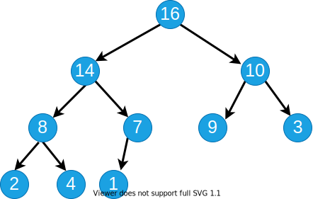
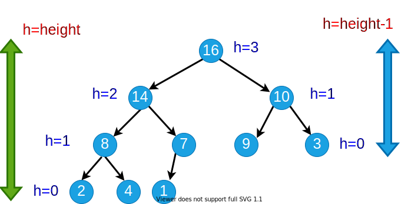
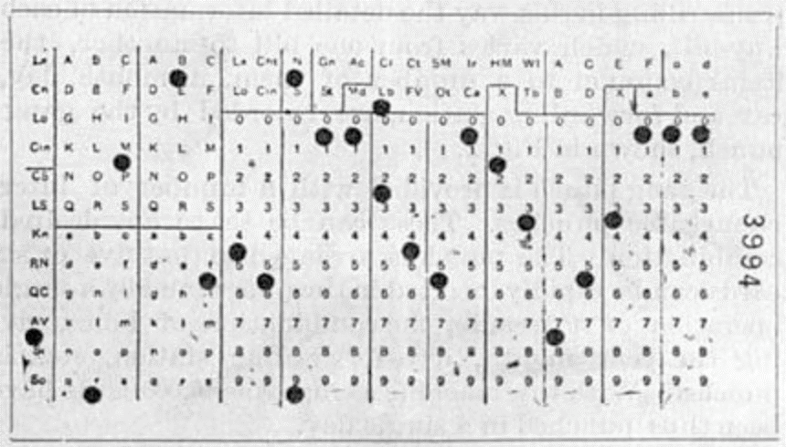
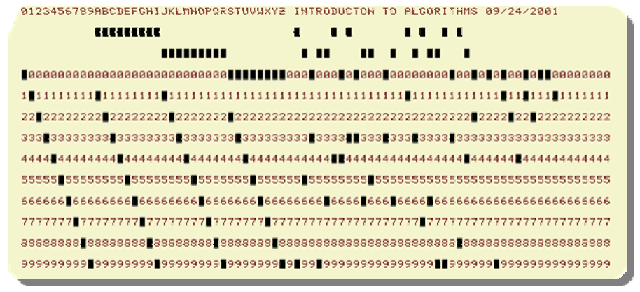
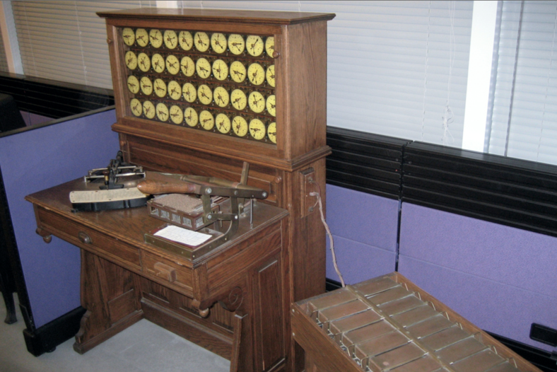

<!-- _backgroundColor: aquq -->

<!-- _color: orange -->

<!-- paginate: false -->

<!--  -->

## CE100 Algorithms and Programming II

## Week-4 (Heap/Heap Sort)

#### Spring Semester, 2021-2022

Download [DOC-PDF](ce100-week-4-heap.en.md_doc.pdf), [DOC-DOCX](ce100-week-4-heap.en.md_word.docx), [SLIDE](ce100-week-4-heap.en.md_slide.pdf), [PPTX](ce100-week-4-heap.en.md_slide.pptx)

<iframe width=700, height=500 frameBorder=0 src="../ce100-week-4-heap.en.md_slide.html"></iframe>

---

<!-- paginate: true -->

## Heap/Heap Sort

## Outline (1)

- Heaps 
  
  - Max / Min Heap 

- Heap Data Structure 
  
  - Heapify 
    
    - Iterative 
    
    - Recursive 

---

## Outline (2)

- Extract-Max 

- Build Heap 

---

## Outline (3)

- Heap Sort 

- Priority Queues 

- Linked Lists 

- Radix Sort 

- Counting Sort 

---

## Heapsort

- Worst-case runtime: $O(nlgn)$
- Sorts in-place
- Uses a special data structure (heap) to manage information during execution of the algorithm
  - Another design paradigm

---

## Heap Data Structure (1)

- Nearly complete binary tree
  - Completely filled on all levels except possibly the lowest level



---

## Heap Data Structure (2)

- **Height of node i:** Length of the longest simple downward path from **i** to a **leaf**
- **Height of the tree:** height of the **root**



---

## Heap Data Structures (3)

- **Depth of node i:** Length of the simple downward path from the **root** to node **i**


---

## Heap Property: Min-Heap

- The **smallest** element in any subtree is the **root** element in a **min-heap**

- **Min heap:** For every node **i** other than **root**, $A[parent(i)] \leq A[i]$
  
  - Parent node is always smaller than the child nodes


---

## Heap Property: Max-Heap

- The **largest** element in any subtree is the **root** element in a **max-heap**
  - We will focus on max-heaps
- **Max heap:** For every node **i** other than **root**, $A[parent(i)] ≥ A[i]$
  - Parent node is always larger than the child nodes


---

## Heap Data Structures (4)


---

## Heap Data Structures (5)

- Computing left child, right child, and parent indices very fast
  
  - **left(i) = 2i** $\Longrightarrow$ binary left shift
  - **right(i) = 2i+1** $\Longrightarrow$ binary left shift, then set the lowest bit to 1
  - **parent(i) = floor(i/2)** $\Longrightarrow$ right shift in binary

- $A[1]$ is always the **root** element

- Array $A$ has two attributes:
  
  - **length(A):** The number of elements in $A$
  - **n = heap-size(A):** The number elements in $heap$
    - $n \leq length(A)$

---

## Heap Operations : EXTRACT-MAX (1)

```r
EXTRACT-MAX(A, n)
  max = A[1]
  A[1] = A[n]
  n = n - 1
  HEAPIFY(A, 1,n)
  return max
```

---

## Heap Operations : EXTRACT-MAX (2)

- Return the max element,and reorganize the heap to maintain heap property


---

## Heap Operations: HEAPIFY (1)


---

## Heap Operations: HEAPIFY (2)

- Maintaining heap property:
  - Subtrees rooted at $left[i]$ and $right[i]$ are already heaps.
  - But, $A[i]$ may violate the heap property (i.e., may be smaller than its children)
- **Idea:** Float down the value at $A[i]$ in the heap so that subtree rooted at $i$ becomes a heap.

---

## Heap Operations: HEAPIFY (2)

```r
HEAPIFY(A, i, n)
  largest = i 

  if 2i <= n and A[2i] > A[i] then 
    largest = 2i;
  endif

  if 2i+1 <= n and A[2i+1] > A[largest] then 
    largest = 2i+1;
  endif

  if largest != i  then
    exchange A[i] with A[largest];
    HEAPIFY(A, largest, n);
  endif
```

---

## Heap Operations: HEAPIFY (3)


---

## Heap Operations: HEAPIFY (4)


---

## Heap Operations: HEAPIFY (5)


---

## Heap Operations: HEAPIFY (6)


---

## Heap Operations: HEAPIFY (7)


---

## Heap Operations: HEAPIFY (8)


---

## Intuitive Analysis of HEAPIFY

- Consider $HEAPIFY(A, i, n)$
  - let $h(i)$ be the height of node $i$
  - at most $h(i)$ recursion levels
    - Constant work at each level: $\Theta(1)$ 
  - Therefore $T(i)=O(h(i))$
- Heap is almost-complete binary tree
  - $h(n)=O(lgn)$ 
- Thus $T(n)=O(lgn)$ 

---

## Formal Analysis of HEAPIFY

- **What is the recurrence?**
  - Depends on the size of the **subtree** on which recursive call is made
    - In the next, we try to compute an **upper bound** for this **subtree**.

---

## Reminder: Binary trees

- For a complete binary tree:
  - $\#$ of nodes at depth $d$:  $2^d$
  - $\#$ of nodes with depths less than $d$:  $2^d-1$


---

## Formal Analysis of HEAPIFY (1)

- Worst case occurs when last row of the subtree $S_i$ rooted at node $i$ is **half full**

- $T(n) \leq T(|S_{L(i)}|) + \Theta(1)$ 

- $S_{L(i)}$ and $S_{R(i)}$ are complete binary trees of heights  $h(i)-1$ and $h(i)-2$, respectively


---

## Formal Analysis of HEAPIFY (2)

- Let $m$ be the number of **leaf nodes** in $S_{L(i)}$
  - $|S_{L(i)}|=\overbrace{m}^{ext.}+\overbrace{(m–1)}^{int.}=2m–1$ 
  - $|S_{R(i)}|=\overbrace{\frac{m}{2}}^{ext.}+\overbrace{(\frac{m}{2}–1)}^{int.}=m–1$
  - $|S_{L(i)}|+|S_{R(i)}|+1=n$

---

## Formal Analysis of HEAPIFY (2)

$$ 
\begin{align*}
(2m–1)+(m–1)+1 &=n \\ 
m &= (n+1)/3 \\
|S_{L(i)}| &= 2m – 1 \\
&=2(n+1)/3 – 1 \\
&=(2n/3+2/3) –1 \\
&=\frac{2n}{3}-\frac{1}{3} \leq \frac{2n}{3} \\
T(n) & \leq T(2n/3) + \Theta(1) \\
T(n) &= O(lgn)
\end{align*}
$$

- **By CASE-2 of Master Theorem** $\Longrightarrow$ $T(n)=\Theta(n^{log_b^a}lgn)$

---

## Formal Analysis of HEAPIFY (2)

- Recurrence: $T(n) = aT(n/b) + f(n)$

- *Case 2:* $\frac{f(n)}{n^{log_b^a}}=\Theta(1)$

- i.e., $f(n)$ and $n^{log_b^a}$ grow at similar rates

- **Solution:** $T(n)=\Theta(n^{log_b^a}lgn)$
  
  - $T(n) \leq T(2n/3) + \Theta(1)$ (drop constants.)
  - $T(n) \leq \Theta(n^{log_3^1}lgn)$ 
  - $T(n) \leq \Theta(n^0lgn)$
  - $T(n) = O(lgn)$

---

## HEAPIFY: Efficiency Issues

- **Recursion vs Iteration:**
  - In the absence of tail recursion, **iterative version** is in general **more efficient** because of the **pop/push** operations **to/from** stack at each **level of recursion**.

---

## Heap Operations: HEAPIFY (1)

**Recursive**

```r
  HEAPIFY(A, i, n)
  largest = i 

  if 2i <= n and A[2i] > A[i] then 
    largest = 2i

  if 2i+1 <= n and A[2i+1] > A[largest] then 
    largest = 2i+1

  if largest != i  then
    exchange A[i] with A[largest]
    HEAPIFY(A, largest, n)
```

---

## Heap Operations: HEAPIFY (2)

**Iterative**

```r
HEAPIFY(A, i, n)
  j = i
  while(true) do
    largest = j 

  if 2j <= n and A[2j] > A[j] then 
    largest = 2j

  if 2j+1 <= n and A[2j+1] > A[largest] then 
    largest = 2j+1

  if largest != j  then
    exchange A[j] with A[largest]
    j = largest
  else return
```

---

## Heap Operations: HEAPIFY (3)


---

## Heap Operations: Building Heap

- Given an arbitrary array, how to build a heap from scratch?

- **Basic idea:** Call $HEAPIFY$ on each node bottom up 
  
  - Start from the leaves (which trivially satisfy the heap property)
  - Process nodes in bottom up order.
  - When $HEAPIFY$ is called on node $i$, the subtrees connected to the $left$ and $right$ subtrees already satisfy the heap property.
  
   

---

## Storage of the leaves (Lemma)

- **Lemma:** The last $\lceil \frac{n}{2} \rceil$ nodes of a heap are all leaves. 

<!-- 
 
-->


---

## Storage of the leaves (Proof of Lemma) (1)

- **Lemma:** last $\lceil n/2 \rceil$ nodes of a heap are all leaves
- Proof : 
  - $m=2^{d-1}$: $\#$ nodes at level $d-1$
  - $f$: $\#$ nodes at level $d$ (last level)
- $\#$ of nodes with depth $d-1$ : $m$
- $\#$ of nodes with depth $<d-1$ : $m-1$
- $\#$ of nodes with depth $d$ : $f$
- **Total** $\#$ of nodes :$n=f+2m-1$


---

## Storage of the leaves (Proof of Lemma) (2)

- **Total** $\#$ of nodes : $f=n-2m+1$

$$
\begin{align*}
\text{\# of leaves: }&=f+m-\lceil f/2 \rceil \\
&= m+\lfloor f/2 \rfloor \\
&= m+\lfloor (n-2m+1)/2 \rfloor \\
&= \lfloor (n+1)/2 \rfloor \\
&= \lceil n/2 \rceil
\end{align*}
$$

Proof is Completed


---

## Heap Operations: Building Heap

```r
BUILD-HEAP (A, n)
  for i = ceil(n/2) downto 1 do
    HEAPIFY(A, i, n)
```

- **Reminder:** The last $\lceil n/2 \rceil$ nodes of a heap are **all leaves**, which trivially satisfy the heap property

---

## Build-Heap Example (Step-1)


---

## Build-Heap Example (Step-2)


---

## Build-Heap Example (Step-3)


---

## Build-Heap Example (Step-4)


---

## Build-Heap Example (Step-5)


---

## Build-Heap Example (Step-6)


---

## Build-Heap Example (Step-7)


---

## Build-Heap Example (Step-8)


---

## Build-Heap Example (Step-9)


---

## Build-Heap: Runtime Analysis

- Simple analysis:
  
  - $O(n)$ calls to $HEAPIFY$, each of which takes $O(lgn)$ time
  - $O(nlgn)$ $\Longrightarrow$ loose bound

- In general, a good approach:
  
  - Start by proving an easy bound
  - Then, try to tighten it

- Is there a tighter bound?

---

<style scoped>section{ font-size: 25px; }</style>

## Build-Heap: **Tighter** Running Time Analysis

- If the heap is complete binary tree then $h_{\ell} = d – \ell$
- Otherwise, nodes at a given level do not all have the same height, But we have $d – \ell – 1 \leq h_{\ell} \leq d – \ell$

 

---

<style scoped>section{ font-size: 25px; }</style>

## Build-Heap: **Tighter** Running Time Analysis

- Assume that all nodes at level $\ell= d – 1$ are processed 

$$
\begin{align*}
  T(n) &=\sum \limits_{\ell=0}^{d-1}n_{\ell}O(h_{\ell})=O(\sum \limits_{\ell=0}^{d-1}n_{\ell}h_{\ell})
  \begin{cases}
   n_{\ell}=2^{\ell} = \# \text{ of nodes at level }\ell \\
   h_{\ell}=\text{height of nodes at level } \ell
  \end{cases} \\
\therefore T(n) &= O \bigg( \sum \limits_{\ell=0}^{d-1}2^{\ell}(d-\ell) \bigg) \\
\text{Let } & h=d-\ell \Longrightarrow \ell = d-h \text{ change of variables} \\ 
T(n) &= O\bigg(\sum \limits_{h=1}^{d}h2^{d-h} \bigg)=O\bigg(\sum \limits_{h=1}^{d}h \frac{2^d}{2^h} \bigg) = O\bigg(2^d\sum \limits_{h=1}^{d}h (1/2)^h\bigg) \\
\text{ but } & 2^d = \Theta(n) \Longrightarrow O\bigg(n\sum \limits_{h=1}^{d}h (1/2)^h \bigg)
\end{align*}
$$

---

<style scoped>section{ font-size: 25px; }</style>

## Build-Heap: **Tighter** Running Time Analysis

$$
\sum \limits_{h=1}^{d}h(1/2)^h \leq  \sum \limits_{h=0}^{d}h(1/2)^h \leq \sum \limits_{h=0}^{\infty}h(1/2)^h 
$$

- recall infinite decreasing geometric series

$$
\sum \limits_{k=0}^{\infty} x^k = \frac{1}{1-x} \text{ where } |x|<1 
$$

- differentiate both sides

$$
\sum \limits_{k=0}^{\infty}kx^{k-1} = \frac{1}{(1-x)^2}  
$$

---

## Build-Heap: **Tighter** Running Time Analysis

$$
\sum \limits_{k=0}^{\infty}kx^{k-1} = \frac{1}{(1-x)^2}  
$$

- then, multiply both sides by $x$

$$
\sum \limits_{k=0}^{\infty}kx^k = \frac{x}{(1-x)^2}  
$$

- in our case: $x = 1/2$ and $k = h$

$$
\therefore \sum \limits_{h=0}^{\infty}h(1/2)^h = \frac{1/2}{(1-(1/2))^2}=2=O(1) \\
\therefore T(n)=O(n\sum \limits_{h=1}^{d}h(1/2)^h)=O(n)  
$$

---

## Heapsort Algorithm Steps

- **(1)** Build a heap on array $A[1 \dots n]$ by calling $BUILD-HEAP(A, n)$
- **(2)** The largest element is stored at the root $A[1]$ 
  - Put it into its correct final position $A[n]$ by $A[1] \longleftrightarrow A[n]$
- **(3)** Discard node $n$ from the heap
- **(4)** Subtrees $(S2 \& S3)$ rooted at children of root remain as heaps, but the new root element may violate the heap property. 
  - Make $A[1 \dots n-1]$ a heap by calling $HEAPIFY(A,1,n-1)$
- **(5)** $n \leftarrow n-1$
- **(6)** Repeat steps **(2-4)** until $n=2$

---

## Heapsort Algorithm Example (Step-1)


---

## Heapsort Algorithm Example (Step-2)


---

## Heapsort Algorithm Example (Step-3)


---

## Heapsort Algorithm Example (Step-4)


---

## Heapsort Algorithm Example (Step-5)


---

## Heapsort Algorithm Example (Step-6)


---

## Heapsort Algorithm Example (Step-7)


---

## Heapsort Algorithm Example (Step-8)


---

## Heapsort Algorithm Example (Step-9)


---

## Heapsort Algorithm Example (Step-10)


---

## Heapsort Algorithm Example (Step-11)


---

## Heapsort Algorithm Example (Step-12)


---

## Heapsort Algorithm Example (Step-13)


---

## Heapsort Algorithm Example (Step-14)


---

## Heapsort Algorithm Example (Step-15)


---

## Heapsort Algorithm Example (Step-16)


---

## Heapsort Algorithm Example (Step-17)


---

## Heapsort Algorithm Example (Step-18)


---

## Heapsort Algorithm Example (Step-19)


---

## Heapsort Algorithm: Runtime Analysis


$$
\begin{align*}
T(n) &= \Theta(n)+\sum \limits_{i=2}^{n}O(lgi) \\
&= \Theta(n)+O\bigg( \sum \limits_{i=2}^{n}O(lgn) \bigg) \\
&= O(nlgn)
\end{align*}
$$

---

## Heapsort - Notes

- **Heapsort** is a very good algorithm but, a good implementation of **quicksort** always **beats** heapsort **in practice**
- However, **heap data structure** has many popular applications, and it can be efficiently used for implementing **priority queues**

---

## Data structures for **Dynamic Sets**

- Consider sets of records having **key** and **satellite** data


---

## Operations on **Dynamic Sets**

- **Queries:** Simply return info; 
  - $MAX(S) / MIN(S):$ (Query) return $x \in S$ with the **largest/smallest** $key$
  - $SEARCH(S, k):$ (Query) return $x \in S$ with $key[x]= k$
  - $SUCCESSOR(S, x) / PREDECESSOR(S, x):$ (Query) return $y \in S$ which is the next **larger/smaller** element after $x$
- **Modifying operations:** Change the set
  - $INSERT(S, x):$ (Modifying) $S \leftarrow S \cup \{x\}$
  - $DELETE(S, x):$ (Modifying) $S \leftarrow S - \{x\}$
  - $\text{EXTRACT-MAX}(S) / \text{EXTRACT-MIN}(S):$ (Modifying) return and delete $x \in S$ with the largest/smallest $key$
- Different data structures support/optimize different operations

---

## Priority Queues (PQ)

- Supports
  - $INSERT$
  - $MAX / MIN$ 
  - $\text{EXTRACT-MAX} / \text{EXTRACT-MIN}$

---

## Priority Queues (PQ)

- **One application:** Schedule jobs on a shared resource 
  - **PQ** keeps track of jobs and their relative priorities
  - When a job is finished or interrupted, highest priority job is selected from those pending using $\text{EXTRACT-MAX}$
  - A new job can be added at any time using $INSERT$

---

## Priority Queues (PQ)

- **Another application:** Event-driven simulation
  - Events to be simulated are the items in the **PQ** 
  - Each event is associated with a time of occurrence which serves as a $key$
  - Simulation of an event can cause other events to be simulated in the future
  - Use $\text{EXTRACT-MIN}$ at each step to choose the next event to simulate
  - As new events are produced insert them into the **PQ** using $INSERT$

---

## Implementation of **Priority Queue**

- **Sorted linked list:** Simplest implementation
  - $INSERT$
    - $O(n)$ time
    - Scan the list to find place and splice in the new item
  - $\text{EXTRACT-MAX}$
    - $O(1)$ time
    - Take the first element
  - **Fast** extraction but **slow** insertion.

---

## Implementation of **Priority Queue**

- **Unsorted linked list:** Simplest implementation
  
  - $INSERT$
    - $O(1)$ time
    - Put the new item at front
  - $\text{EXTRACT-MAX}$
    - $O(n)$ time
    - Scan the whole list
  - **Fast** insertion but **slow** extraction.

- Sorted linked list is better on the average
  
  - **Sorted list:** on the average, scans $n/2$ element per insertion
  - **Unsorted list:** always scans $n$ element at each extraction

---

## Heap Implementation of **PQ**

- $INSERT$ and $\text{EXTRACT-MAX}$ are both $O(lgn)$
  - good compromise between fast insertion but slow extraction and vice versa
- $\text{EXTRACT-MAX}$: already discussed $\text{HEAP-EXTRACT-MAX}$
- $INSERT$: Insertion is like that of Insertion-Sort. 

```r
HEAP-INSERT(A, key, n)
  n = n+1
  i=n  
  while i>1 and A[floor(i/2)] < key do
    A[i]=A[floor(i/2)] 
    i= floor(i/2)
  A[i]=key
```

---

## Heap Implementation of **PQ**

- Traverses $O(lgn)$ nodes, as $HEAPIFY$ does but makes fewer comparisons and assignments
  - $HEAPIFY$: compares parent with both children
  - $HEAP-INSERT$: with only one 

---

## HEAP-INSERT Example (Step-1)


---

## HEAP-INSERT Example (Step-2)


---

## HEAP-INSERT Example (Step-3)


---

## HEAP-INSERT Example (Step-4)


---

## HEAP-INSERT Example (Step-5)


---

## Heap Increase Key

- Key value of $i^{th}$ element of heap is increased from $A[i]$ to $key$

```r
HEAP-INCREASE-KEY(A, i, key)

  if key < A[i] then
    return error

  while i > 1 and A[floor(i/2)] < key do
    A[i] = A[floor(i/2)] 
    i = floor(i/2)

  A[i] = key
```

---

## HEAP-INCREASE-KEY Example (Step-1)


---

## HEAP-INCREASE-KEY Example (Step-2)


---

## HEAP-INCREASE-KEY Example (Step-3)


---

## HEAP-INCREASE-KEY Example (Step-4)


---

## HEAP-INCREASE-KEY Example (Step-5)


---

## Heap Implementation of Priority Queue (PQ)


---

<style scoped>section{ font-size: 25px; }</style>

## Summary: **Max Heap**

- **Heapify(A, i)**
  - Works when both child subtrees of node i are heaps
  - "*Floats down*" node i to satisfy the heap property
  - Runtime: $O(lgn)$
- **Max(A, n)**
  - Returns the max element of the heap (no modification)
  - Runtime: $O(1)$
- **Extract-Max(A, n)**
  - Returns and removes the max element of the heap
  - Fills the gap in $A[1]$ with $A[n]$, then calls **Heapify(A,1)**
  - Runtime: $O(lgn)$

---

<style scoped>section{ font-size: 25px; }</style>

## Summary: **Max Heap**

- **Build-Heap(A, n)**
  - Given an arbitrary array, builds a heap from scratch
  - Runtime: $O(n)$
- **Min(A, n)**
  - How to return the min element in a max-heap?
  - Worst case runtime: $O(n)$
    - because ~half of the heap elements are leaf nodes
  - Instead, use a min-heap for efficient min operations
- **Search(A, x)**
  - For an arbitrary $x$ value, the worst-case runtime: $O(n)$
  - Use a sorted array instead for efficient search operations

---

## Summary: **Max Heap**

- **Increase-Key(A, i, x)**
  - Increase the key of node $i$ (from $A[i]$ to $x$)
  - “*Float up*” $x$ until heap property is satisfied
  - Runtime: $O(lgn)$
- **Decrease-Key(A, i, x)**
  - Decrease the key of node $i$ (from $A[i]$ to $x$)
  - Call **Heapify(A, i)**
  - Runtime: $O(lgn)$

---

## **Phone Operator** Problem


- A phone operator answering **$n$ phones**

- Each phone $i$ has **$x_i$ people waiting** in line for their calls to be answered.

- Phone operator needs to answer the phone with the largest number of people waiting in line.

- New calls come continuously, and
  some people hang up after waiting.

---

## **Phone Operator** Solution

- **Step 1:** Define the following array:

- $A[i]$: the ith element in heap

- $A[i].id$: the index of the corresponding phone

- $A[i].key$: $\#$ of people waiting in line for phone with index $A[i].id$


---

## **Phone Operator** Solution

- **Step 2:** $\text{Build-Max-Heap}(A, n)$
  - **Execution:**
    - When the operator wants to answer a phone:
      - $id = A[1].id$
        - $\text{Decrease-Key}(A, 1, A[1].key-1)$
        - answer phone with index $id$
      - When a new call comes in to phone i:
        - $\text{Increase-Key}(A, i, A[i].key+1)$
      - When a call drops from phone i:
        - $\text{Decrease-Key}(A, i, A[i].key-1)$

---

## Linked Lists

- Like arrays, Linked List is a linear data structure.
- Unlike arrays, linked list elements are not stored at a contiguous location; the elements are linked using pointers.


---

## Linked Lists - C Definition

- C
  
  ```c
  // A linked list node
  struct Node {
    int data;
    struct Node* next;
  };
  ```

---

## Linked Lists - Cpp Definition

- Cpp
  
  ```c++
  class Node {
  public:
    int data;
    Node* next;
  };
  ```

---

## Linked Lists - Java Definition

- Java
  
  ```java
  class LinkedList {
    Node head; // head of the list
  
    /* Linked list Node*/
    class Node {
        int data;
        Node next;
  
        // Constructor to create a new node
        // Next is by default initialized
        // as null
        Node(int d) { data = d; }
    }
  }
  ```

---

## Linked Lists - Csharp Definition

- Csharp
  
  ```cs
  class LinkedList {
    // The first node(head) of the linked list
    // Will be an object of type Node (null by default)
    Node head;
  
    class Node {
        int data;
        Node next;
  
        // Constructor to create a new node
        Node(int d) { data = d; }
    }
  }
  ```

---

## Priority Queue using **Linked List** Methods

- Implement Priority Queue using Linked Lists. 
  - **push():** This function is used to insert a new data into the queue.
  - **pop():** This function removes the element with the highest priority from the queue.
  - **peek()/top():** This function is used to get the highest priority element in the queue without removing it from the queue.

---

## Priority Queue using **Linked List** Algorithm

```r
PUSH(HEAD, DATA, PRIORITY)
  Create NEW.Data = DATA & NEW.Priority = PRIORITY
  If HEAD.priority < NEW.Priority 
    NEW -> NEXT = HEAD
    HEAD = NEW 
  Else
    Set TEMP to head of the list 
  Endif

  WHILE TEMP -> NEXT != NULL and TEMP -> NEXT ->PRIORITY > PRIORITY THEN
    TEMP = TEMP -> NEXT 
  ENDWHILE

  NEW -> NEXT = TEMP -> NEXT 
  TEMP -> NEXT = NEW 
```

---

## Priority Queue using **Linked List** Algorithm

```r
POP(HEAD)
//Set the head of the list to the next node in the list.
HEAD = HEAD -> NEXT.
Free the node at the head of the list
```

```r
PEEK(HEAD): 
Return HEAD -> DATA 
```

---

## Priority Queue using **Linked List** Notes

- LinkedList is already sorted. 
- Time Complexities and Comparison with Binary Heap

|             | peek() | push()   | pop()    |
| ----------- | ------ | -------- | -------- |
| Linked List | $O(1)$ | $O(n)$   | $O(1)$   |
| Binary Heap | $O(1)$ | $O(lgn)$ | $O(lgn)$ |

---

## Sorting in Linear Time

---

## How Fast Can We Sort?

- The algorithms we have seen so far:
  
  - Based on comparison of elements
  - We only care about the relative ordering between the elements (not the actual values)
  - The smallest worst-case runtime we have seen so far: $O(nlgn)$
  - Is $O(nlgn)$ the best we can do?

- **Comparison sorts:** Only use comparisons to determine the relative order of elements.

---

## Decision Trees for Comparison Sorts

- Represent a sorting algorithm abstractly in terms of a **decision tree**
  
  - A **binary tree** that represents the **comparisons between** elements in the sorting algorithm
  - Control, data movement, and other aspects are ignored

- One decision tree corresponds to one sorting algorithm and one value of $n$ (*input size*)

---

## Reminder: Insertion Sort Step-By-Step Description (1)


---

## Reminder: Insertion Sort Step-By-Step Description (2)


---

## Reminder: Insertion Sort Step-By-Step Description (3)


---

## Different Outcomes for Insertion Sort and n=3

- Input : 
  $<a_1,a_2,a_3>$


---

## Decision Tree for Insertion Sort and n=3


---

## Decision Tree Model for Comparison Sorts

- **Internal node $(i:j)$:** Comparison between elements $a_i$ and $a_j$

- **Leaf node:** An output of the sorting algorithm

- **Path from root to a leaf:** The execution of the sorting algorithm for a given input

- **All possible executions** are captured by the decision tree

- **All possible outcomes (permutations)** are in the leaf nodes

---

## Decision Tree for Insertion Sort and n=3

- Input:
  $<9, 4, 6>$


---

## Decision Tree Model

- A decision tree can model the execution of any comparison sort:
  
  - One tree for each input size $n$
  - View the algorithm as **splitting** whenever it compares two elements
  - The tree contains the **comparisons along all possible** instruction traces

- **The running time of the algorithm** $=$ *the length of the path taken*

- **Worst case running time** $=$ *height of the tree*

---

## Counting Sort

---

## Lower Bound for Comparison Sorts

- Let $n$ be the number of elements in the input array.

- What is the $min$ number of leaves in the decision tree?
  
  - $n!$ **(because there are n! permutations of the input array, and all possible outputs must be captured in the leaves)**

- What is the max number of leaves in a binary tree of height $h$? $\Longrightarrow$ $2^h$ 

- So, we must have:
  
  $$
  2^h \geq n!
  $$

---

## Lower Bound for Decision Tree Sorting

- **Theorem:** Any comparison sort algorithm requires 
  $\Omega(nlgn)$ comparisons in the worst case.
- **Proof:** We’ll prove that any decision tree corresponding to a comparison sort algorithm must have height $\Omega(nlgn)$

$$
\begin{align*}
2^h & \geq n! \\
h & \geq lg(n!) \\
& \geq lg((n/e)^n) (Stirling Approximation) \\
& = nlgn - nlge \\
& = \Omega(nlgn)
\end{align*}
$$

---

## Lower Bound for Decision Tree Sorting

**Corollary:** Heapsort and merge sort are asymptotically optimal comparison sorts.

**Proof:** The $O(nlgn)$ upper bounds on the runtimes for heapsort and merge sort match the $\Omega(nlgn)$ **worst-case** lower bound from the previous theorem.

---

## Sorting in Linear Time

- **Counting sort:** No comparisons between elements
  
  - **Input:** $A[1 \dots n]$, where $A[j] \in \{1, 2,\dots, k\}$
  - **Output:** $B[1 \dots n]$, sorted
  - **Auxiliary storage:** $C[1 \dots k]$

---

## Counting Sort-1


---

## Counting Sort-2

- **Step 1:** Initialize all counts to 0


---

## Counting Sort-3

- **Step 2:** Count the number of occurrences
  of each value in the input array


---

## Counting Sort-4

- **Step 3:** Compute the number of elements
  less than or equal to each value


---

## Counting Sort-5

- **Step 4:** Populate the output array
  - There are $C[3] = 3$ elements that are $\leq 3$


---

## Counting Sort-6

- **Step 4:** Populate the output array
  - There are $C[4]=5$ elements that are $\leq 4$


---

## Counting Sort-7

- **Step 4:** Populate the output array
  - There are $C[3]=2$ elements that are $\leq 3$


---

## Counting Sort-8

- **Step 4:** Populate the output array
  - There are $C[1]=1$ elements that are $\leq 1$


---

## Counting Sort-9

- **Step 4:** Populate the output array
  - There are $C[4]=4$ elements that are $\leq 4$


---

## Counting Sort: Runtime Analysis

- **Total Runtime:** $\Theta(n+k)$
  - $n$ : size of the input array
  - $k$ : the range of input values


---

## Counting Sort: Runtime

- Runtime is $\Theta(n+k)$
  - If $k=O(n)$, then counting sort takes $\Theta(n)$
- **Question:** We proved a lower bound of $\Theta(nlgn)$ before! Where is the fallacy?
- **Answer:** 
  - $\Theta(nlgn)$ lower bound is for comparison-based sorting
  - Counting sort is not a comparison sort
  - In fact, not a single comparison between elements occurs!

---

## Stable Sorting

- Counting sort is a **stable sort:** It preserves the input order among equal elements.
  - i.e. The numbers with the same value appear in the output array in the same order as they do in the input array.
- **Note**: Which other sorting algorithms have this property?


---

## Radix Sort

- **Origin:** Herman Hollerith’s card-sorting machine for the 1890 US Census.

- **Basic idea:** Digit-by-digit sorting

- Two variations:
  
  - Sort from **MSD** to **LSD** (bad idea)
  - Sort from **LSD** to **MSD** (good idea)

(*LSD/MSD: Least/most significant digit*)

---

## Herman Hollerith (1860-1929)

- The 1880 U.S. Census took **almost 10 years** to process. 
- While a lecturer at MIT, Hollerith prototyped **punched-card technology**. 
- His machines, including a **card sorter**, allowed the 1890 census total to be reported in **6 weeks**. 
- He founded the **Tabulating Machine Company** in 1911, which merged with other companies in 1924 to form **International Business Machines(IBM)**. 


---

## Hollerith Punched Card

- **Punched card:** A piece of stiff paper that contains digital information represented by the presence or absence of holes.
  - 12 rows and 24 columns
  - coded for age, state of residency, gender, etc.



---

## **Modern** IBM card

- One character per column
  
  - So, that’s why text windows have 80 columns!
  
  

- for more samples visit https://en.wikipedia.org/wiki/Punched_card

---

## Hollerith Tabulating Machine and Sorter

- Mechanically sorts the cards based on the hole locations.
- Sorting performed for one column at a time
- Human operator needed to load/retrieve/move cards at each stage



---

## Hollerith’s MSD-First Radix Sort

- Sort starting from the most significant digit (MSD)
- Then, sort each of the resulting bins recursively
- At the end, combine the decks in order


---

## Hollerith’s MSD-First Radix Sort

- To sort a subset of cards recursively:
  
  - All the other cards need to be removed from the machine, because the machine can handle only one sorting problem at a time.
  - The human operator needs to keep track of the intermediate card piles
  
  

---

## Hollerith’s MSD-First Radix Sort

- MSD-first sorting may require:
  - very large number of sorting passes
  - very large number of intermediate card piles to maintain
- **S(d):** 
  - $\#$ of passes needed to sort d-digit numbers (worst-case)
- **Recurrence:** 
  - $S(d)=10S(d-1)+1$ with $S(1)=1$
    - **Reminder:** Recursive call made to each subset with the same most significant digit(MSD)

---

## Hollerith’s MSD-First Radix Sort

- **Recurrence:**  $S(d)=10S(d-1)+1$

$$
\begin{align*}
S(d) &= 10 S(d-1) + 1 \\
     & = 10 \bigg(10 S(d-2) + 1 \bigg) + 1 \\
     & = 10 \Big(10 \bigg(10 S(d-3) + 1\bigg) + 1 \Big) + 1 \\
     & = 10i S(d-i) + 10i-1 + 10i-2 + \dots +  101 + 100 \\
     &=\sum \limits_{i=0}^{d-1}10^i
\end{align*}
$$

- Iteration terminates when  $i = d-1$ with  $S(d-(d-1)) = S(1) = 1$

---

## Hollerith’s MSD-First Radix Sort

- **Recurrence:**  $S(d)=10S(d-1)+1$

$$
\begin{align*}
 S(d) &=\sum \limits_{i=0}^{d-1}10^i \\
 & = \frac{10^d-1}{10-1} \\
 & = \frac{1}{9}(10^d-1)\\
 & \Downarrow \\
S(d)&=\frac{1}{9}(10^d-1)
\end{align*}
$$

---

## Hollerith’s MSD-First Radix Sort

- $P(d)$: $\#$ of intermediate card piles maintained (worst-case)
- **Reminder:** Each routing pass generates 9 intermediate piles except the sorting passes on least significant digits (LSDs)
  - There are $10^{d-1}$ sorting calls to LSDs

$$
\begin{align*}
P(d) &= 9(S(d)–10^{d-1}) \\
     &= 9\frac{(10^{d–1})}{9– 10^{d-1}} \\
     &= (10^{d–1}–9 * 10^{d-1}) \\
     &= 10^{d-1} - 1
\end{align*}
$$

---

## Hollerith’s MSD-First Radix Sort

$$
\begin{align*}
P(d) &= 10^{d-1} - 1
\end{align*}
$$

**Alternative solution:** Solve the recurrence

$$
\begin{align*}
P(d) &= 10P(d-1)+9 \\
P(1) &= 0 \\
\end{align*}
$$

---

## Hollerith’s MSD-First Radix Sort

- **Example:** To sort $3$ digit numbers, in the worst case:
  
  - $S(d) = (1/9) (103-1) = 111$ sorting passes needed
  - $P(d) = 10d-1-1 = 99$ intermediate card piles generated

- MSD-first approach has more recursive calls and intermediate storage requirement
  
  - Expensive for a **tabulating machine** to sort punched cards
  - Overhead of recursive calls in a modern computer

---

<style scoped>section{ font-size: 25px; }</style>

## LSD-First Radix Sort

- Least significant digit (**LSD**)-first radix sort seems to be a folk invention originated by machine operators.

- It is the counter-intuitive, but the better algorithm.

- **Basic Algorithm:**
  
  ```r
  Sort numbers on their LSD first   (Stable Sorting Needed)
  Combine the cards into a single deck in order 
  Continue this sorting process for the other digits
    from the LSD to MSD
  ```

- Requires only $d$ sorting passes

- No intermediate card pile generated

---

## LSD-first Radix Sort **Example**


---

## Correctness of Radix Sort **(LSD-first)**

- **Proof by induction:** 
  - **Base case:** $d=1$ is correct (**trivial**)
  - **Inductive hyp:** Assume the first $d-1$ digits are sorted correctly
- Prove that all $d$ digits are sorted correctly after sorting digit $d$
- Two numbers that differ in digit $d$ are correctly sorted (**e.g. 355 and 657**) 
- Two numbers equal in digit d are put in the same order as the input 
  - (**correct order**)


---

## Radix Sort **Runtime**

- Use counting-sort to sort each digit
- **Reminder:** Counting sort complexity: $\Theta(n+k)$
  - $n$: size of input array
  - $k$: the range of the values
- Radix sort runtime: $\Theta(d(n+k))$
  - $d$: $\#$ of digits

**How to choose the $d$ and $k$?**

---

## Radix Sort: Runtime – **Example 1**

- We have flexibility in choosing $d$ and $k$

- Assume we are trying to sort **32-bit words**
  
  - We can define each digit to be **4 bits**
  - Then, the range for each digit $k=2^4=16$
    - So, counting sort will take $\Theta(n+16)$
  - The number of digits $d =32/4=8$
  - Radix sort runtime: $\Theta(8(n+16)) = \Theta(n)$

- $\overbrace{[4bits|4bits|4bits|4bits|4bits|4bits|4bits|4bits]}^{\text{32-bits}}$

---

## Radix Sort: Runtime – **Example 2**

- We have flexibility in choosing $d$ and $k$

- Assume we are trying to sort **32-bit words**
  
  - Or, we can define each digit to be **8 bits**
  - Then, the range for each digit $k = 2^8 = 256$
    - So, counting sort will take $\Theta(n+256)$
  - The number of digits $d = 32/8 = 4$
  - Radix sort runtime: $\Theta(4(n+256)) = \Theta(n)$

- $\overbrace{[8bits|8bits|8bits|8bits]}^{\text{32-bits}}$

---

<style scoped>section{ font-size: 25px; }</style>

## Radix Sort: **Runtime**

- Assume we are trying to sort **$b$-bit** words
  
  - Define each digit to be **$r$ bits**
  
  - Then, the range for each digit $k = 2^r$
    
    - So, **counting sort will take** $\Theta(n+2^r)$
  
  - The number of digits $d = b/r$
    
    - **Radix sort runtime:** 
      
$$
\begin{align*}
T(n,b)&=\Theta \bigg( \frac{b}{r}(n+2^r) \bigg)
\end{align*}
$$

- $\overbrace{[rbits|rbits|rbits|rbits]}^{b/r \text{ bits}}$

---

## Radix Sort: **Runtime Analysis**

$$
\begin{align*}
T(n,b)&=\Theta \bigg( \frac{b}{r}(n+2^r) \bigg)
\end{align*}
$$

- Minimize $T(n,b)$ by differentiating and setting to $0$
- Or, intuitively: 
  - We want to balance the terms $(b/r)$ and $(n + 2^r)$
  - **Choose $r \approx lgn$**
    - If we choose $r << lgn \Longrightarrow (n + 2^r)$ term **doesn’t improve**
    - If we choose $r >> lgn \Longrightarrow (n + 2^r)$ increases **exponentially**

---

## Radix Sort: **Runtime Analysis**

$$
\begin{align*}
T(n,b)&=\Theta \bigg( \frac{b}{r}(n+2^r) \bigg)
\end{align*}
$$

$$
\begin{align*}
\text{Choose } r=lgn \Longrightarrow T(n,b)=\Theta(bn/lgn)
\end{align*}
$$

- For numbers in the range from $0$ to $n^d – 1$, we have:
  - The number of bits $b = lg(nd ) = d lgn$ 
    - Radix sort runs in $\Theta(dn)$

---

## Radix Sort: **Conclusions**

$$
\begin{align*}
\text{Choose } r=lgn \Longrightarrow T(n,b)=\Theta(bn/lgn)
\end{align*}
$$

- **Example:** Compare radix sort with merge sort/heapsort
  - $1$ million ($2^{20}$), $32$-bit numbers $(n = 2^{20}, b = 32)$
    - **Radix sort:** $\lfloor 32/20 \rfloor  = 2$ passes
    - **Merge sort/heap sort:** $lgn = 20$ passes
- **Downsides:**
  - Radix sort has **little locality of reference** (more cache misses)
  - The version that uses counting sort is not in-place
- On modern processors, a well-tuned quicksort implementation  typically runs faster.

---

## References

- [Introduction to Algorithms, Third Edition | The MIT Press](https://mitpress.mit.edu/books/introduction-algorithms-third-edition)

- [Bilkent CS473 Course Notes (new)](http://nabil.abubaker.bilkent.edu.tr/473/)

- [Bilkent CS473 Course Notes (old)](http://cs.bilkent.edu.tr/~ugur/teaching/cs473/)

- [Insertion Sort - GeeksforGeeks](https://www.geeksforgeeks.org/insertion-sort/)

- [Priority Queue Using Linked List - GeeksforGeeks](https://www.geeksforgeeks.org/priority-queue-using-linked-list/)

- [Priority Queue Using Linked List - JavatPoint](https://www.javatpoint.com/priority-queue-using-linked-list)

- [NIST Dictionary of Algorithms and Data Structures](https://xlinux.nist.gov/dads/)

- [NIST - Dictionary of Algorithms and Data Structures](https://xlinux.nist.gov/dads/)

---

$-End-Of-Week-4-Course-Module-$ 
