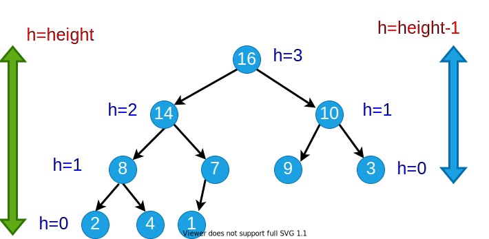

<!-- _backgroundColor: aquq -->

<!-- _color: orange -->

<!-- paginate: false -->

<!--  -->

## CE100 Algorithms and Programming II

## Week-4 (Heap/Heap Sort)

#### Spring Semester, 2021-2022

Download [DOC](ce100-week-4-heap.md_doc.pdf), [SLIDE](ce100-week-4-heap.md_slide.pdf), [PPTX](ce100-week-4-heap.md_slide.pptx)

<iframe width=700, height=500 frameBorder=0 src="../ce100-week-4-heap.md_slide.html"></iframe>

---

<!-- paginate: true -->

## Heap/Heap Sort

## Outline (1)

- Heaps 
 
  - Max / Min Heap 
  
- Heap Data Structure 
  
  - Heapify 
  
    - Iterative 
   
    - Recursive 

---

## Outline (2)
   
- Extract-Max 
  
- Build Heap 

---

## Outline (3)

 - Heap Sort 
 
 - Priority Queues 
 
 - Linked Lists 
 
 - Radix Sort 
 
 - Counting Sort 

---

## Heapsort

- Worst-case runtime: $O(nlgn)$
- Sorts in-place
- Uses a special data structure (heap) to manage information during execution of the algorithm
  - Another design paradigm

---

## Heap Data Structure (1)

- Nearly complete binary tree
  - Completely filled on all levels except possibly the lowest level


---

## Heap Data Structure (2)

- **Height of node i:** Length of the longest simple downward path from **i** to a **leaf**
- **Height of the tree:** height of the **root**



---

## Heap Data Structures (3)

- **Depth of node i:** Length of the simple downward path from the **root** to node **i**


---

## Heap Property: Min-Heap

- The **smallest** element in any subtree is the **root** element in a **min-heap**

- **Min heap:** For every node **i** other than **root**, $A[parent(i)] \leq A[i]$
  - Parent node is always smaller than the child nodes


---

## Heap Property: Max-Heap

- The **largest** element in any subtree is the **root** element in a **max-heap**
  - We will focus on max-heaps
- **Max heap:** For every node **i** other than **root**, $A[parent(i)] ≥ A[i]$
  - Parent node is always larger than the child nodes


---

## Heap Data Structures (4)


---

## Heap Data Structures (5)

- Computing left child, right child, and parent indices very fast
  - **left(i) = 2i** $\Longrightarrow$ binary left shift
  - **right(i) = 2i+1** $\Longrightarrow$ binary left shift, then set the lowest bit to 1
  - **parent(i) = floor(i/2)** $\Longrightarrow$ right shift in binary

- $A[1]$ is always the **root** element

- Array $A$ has two attributes:
  - **length(A):** The number of elements in $A$
  - **n = heap-size(A):** The number elements in $heap$
    - $n \leq length(A)$
---

## Heap Operations : EXTRACT-MAX (1)

```r
EXTRACT-MAX(A, n)
  max = A[1]
  A[1] = A[n]
  n = n - 1
  HEAPIFY(A, 1,n)
  return max
```

---

## Heap Operations : EXTRACT-MAX (2)

- Return the max element,and reorganize the heap to maintain heap property


---

## Heap Operations: HEAPIFY (1)


---

## Heap Operations: HEAPIFY (2)

- Maintaining heap property:
  - Subtrees rooted at $left[i]$ and $right[i]$ are already heaps.
  - But, $A[i]$ may violate the heap property (i.e., may be smaller than its children)
- **Idea:** Float down the value at $A[i]$ in the heap so that subtree rooted at $i$ becomes a heap.

---

## Heap Operations: HEAPIFY (2)

```r
HEAPIFY(A, i, n)
  largest = i 
  
  if 2i <= n and A[2i] > A[i] then 
    largest = 2i;
  endif
  
  if 2i+1 <= n and A[2i+1] > A[largest] then 
    largest = 2i+1;
  endif

  if largest != i  then
    exchange A[i] with A[largest];
    HEAPIFY(A, largest, n);
  endif
```

---

## Heap Operations: HEAPIFY (3)


---

## Heap Operations: HEAPIFY (4)


---

## Heap Operations: HEAPIFY (5)


---

## Heap Operations: HEAPIFY (6)


---

## Heap Operations: HEAPIFY (7)


---

## Heap Operations: HEAPIFY (8)


---

## Intuitive Analysis of HEAPIFY

- Consider $HEAPIFY(A, i, n)$
  - let $h(i)$ be the height of node $i$
  - at most $h(i)$ recursion levels
    - Constant work at each level: $\Theta(1)$ 
  - Therefore $T(i)=O(h(i))$
- Heap is almost-complete binary tree
  - $h(n)=O(lgn)$ 
- Thus $T(n)=O(lgn)$ 

---

## Formal Analysis of HEAPIFY

- **What is the recurrence?**
  - Depends on the size of the **subtree** on which recursive call is made
    - In the next, we try to compute an **upper bound** for this **subtree**.

---

## Reminder: Binary trees

- For a complete binary tree:
  - $\#$ of nodes at depth $d$:  $2^d$
  - $\#$ of nodes with depths less than $d$:  $2^d-1$


---

## Formal Analysis of HEAPIFY (1)

- Worst case occurs when last row of the subtree $S_i$ rooted at node $i$ is **half full**

- $T(n) \leq T(|S_{L(i)}|) + \Theta(1)$ 
- $S_{L(i)}$ and $S_{R(i)}$ are complete binary trees of heights  $h(i)-1$ and $h(i)-2$, respectively


---

## Formal Analysis of HEAPIFY (2)

- Let $m$ be the number of **leaf nodes** in $S_{L(i)}$
  - $|S_{L(i)}|=\overbrace{m}^{ext.}+\overbrace{(m–1)}^{int.}=2m–1$ 
  - $|S_{R(i)}|=\overbrace{\frac{m}{2}}^{ext.}+\overbrace{(\frac{m}{2}–1)}^{int.}=m–1$
  - $|S_{L(i)}|+|S_{R(i)}|+1=n$

---

## Formal Analysis of HEAPIFY (2)

$$ 
\begin{align*}
(2m–1)+(m–1)+1 &=n \\ 
m &= (n+1)/3 \\
|S_{L(i)}| &= 2m – 1 \\
&=2(n+1)/3 – 1 \\
&=(2n/3+2/3) –1 \\
&=\frac{2n}{3}-\frac{1}{3} \leq \frac{2n}{3} \\
T(n) & \leq T(2n/3) + \Theta(1) \\
T(n) &= O(lgn)
\end{align*}
$$

- **By CASE-2 of Master Theorem** $\Longrightarrow$ $T(n)=\Theta(n^{log_b^a}lgn)$

---

## Formal Analysis of HEAPIFY (2)

- Recurrence: $T(n) = aT(n/b) + f(n)$

- *Case 2:* $\frac{f(n)}{n^{log_b^a}}=\Theta(1)$

- i.e., $f(n)$ and $n^{log_b^a}$ grow at similar rates

- **Solution:** $T(n)=\Theta(n^{log_b^a}lgn)$

  - $T(n) \leq T(2n/3) + \Theta(1)$ (drop constants.)
  - $T(n) \leq \Theta(n^{log_3^1}lgn)$ 
  - $T(n) \leq \Theta(n^0lgn)$
  - $T(n) = O(lgn)$
---
## HEAPIFY: Efficiency Issues

- **Recursion vs Iteration:**
  - In the absence of tail recursion, **iterative version** is in general **more efficient** because of the **pop/push** operations **to/from** stack at each **level of recursion**.

---

## Heap Operations: HEAPIFY (1)

**Recursive**

```r
  HEAPIFY(A, i, n)
  largest = i 

  if 2i <= n and A[2i] > A[i] then 
    largest = 2i

  if 2i+1 <= n and A[2i+1] > A[largest] then 
    largest = 2i+1

  if largest != i  then
    exchange A[i] with A[largest]
    HEAPIFY(A, largest, n)
```
---

## Heap Operations: HEAPIFY (2)

**Iterative**

```r
HEAPIFY(A, i, n)
  j = i
  while(true) do
    largest = j 

  if 2j <= n and A[2j] > A[j] then 
    largest = 2j

  if 2j+1 <= n and A[2j+1] > A[largest] then 
    largest = 2j+1

  if largest != j  then
    exchange A[j] with A[largest]
    j = largest
  else return
```

---

## Heap Operations: HEAPIFY (3)


---

## Heap Operations: Building Heap

- Given an arbitrary array, how to build a heap from scratch?
- **Basic idea:** Call $HEAPIFY$ on each node bottom up 
  - Start from the leaves (which trivially satisfy the heap property)
  - Process nodes in bottom up order.
  - When $HEAPIFY$ is called on node $i$, the subtrees connected to the $left$ and $right$ subtrees already satisfy the heap property.

   

---

## Storage of the leaves (Lemma)

- **Lemma:** The last $\lceil \frac{n}{2} \rceil$ nodes of a heap are all leaves. 

<!-- 
 
-->


---

##  Storage of the leaves (Proof of Lemma) (1)

- **Lemma:** last $\lceil n/2 \rceil$ nodes of a heap are all leaves
- Proof : 
  - $m=2^{d-1}$: $\#$ nodes at level $d-1$
  - $f$: $\#$ nodes at level $d$ (last level)
- $\#$ of nodes with depth $d-1$ : $m$
- $\#$ of nodes with depth $<d-1$ : $m-1$
- $\#$ of nodes with depth $d$ : $f$
- **Total** $\#$ of nodes :$n=f+2m-1$


---
##  Storage of the leaves (Proof of Lemma) (2)

- **Total** $\#$ of nodes : $f=n-2m+1$

$$
\begin{align*}
\text{\# of leaves: }&=f+m-\lceil f/2 \rceil \\
&= m+\lfloor f/2 \rfloor \\
&= m+\lfloor (n-2m+1)/2 \rfloor \\
&= \lfloor (n+1)/2 \rfloor \\
&= \lceil n/2 \rceil
\end{align*}
$$

Proof is Completed


---

## Heap Operations: Building Heap

```r
BUILD-HEAP (A, n)
  for i = ceil(n/2) downto 1 do
    HEAPIFY(A, i, n)
```

- **Reminder:** The last $\lceil n/2 \rceil$ nodes of a heap are **all leaves**, which trivially satisfy the heap property

---
## Build-Heap Example (Step-1)


---
## Build-Heap Example (Step-2)


---
## Build-Heap Example (Step-3)


---
## Build-Heap Example (Step-4)


---
## Build-Heap Example (Step-5)


---
## Build-Heap Example (Step-6)


---
## Build-Heap Example (Step-7)


---
## Build-Heap Example (Step-8)


---
## Build-Heap Example (Step-9)


---

## Build-Heap: Runtime Analysis

- Simple analysis:
  - $O(n)$ calls to $HEAPIFY$, each of which takes $O(lgn)$ time
  - $O(nlgn)$ $\Longrightarrow$ loose bound
- In general, a good approach:
  - Start by proving an easy bound
  - Then, try to tighten it

- Is there a tighter bound?

---

## Build-Heap: **Tighter** Running Time Analysis

- If the heap is complete binary tree then $h_{\ell} = d – \ell$
- Otherwise, nodes at a given level do not all have the same height, But we have $d – \ell – 1 \leq h_{\ell} \leq d – \ell$

 

---
## Build-Heap: **Tighter** Running Time Analysis

- Assume that all nodes at level $\ell= d – 1$ are processed 

$$
\begin{align*}
  T(n) &=\sum_{\ell=0}^{d-1}n_{\ell}O(h_{\ell})=O(\sum_{\ell=0}^{d-1}n_{\ell}h_{\ell})

  \begin{cases}
   n_{\ell}=2^{\ell} = \# \text{ of nodes at level }\ell \\

   h_{\ell}=\text{height of nodes at level } \ell
  \end{cases} \\

\therefore T(n) &= O \bigg( \sum_{\ell=0}^{d-1}2^{\ell}(d-\ell) \bigg) \\

\text{Let } & h=d-\ell \Longrightarrow \ell = d-h \text{ change of variables} \\ 

T(n) &= O\bigg(\sum_{h=1}^{d}h2^{d-h} \bigg)=O\bigg(\sum_{h=1}^{d}h \frac{2^d}{2^h} \bigg) = O\bigg(2^d\sum_{h=1}^{d}h (1/2)^h\bigg) \\

\text{ but } & 2^d = \Theta(n) \Longrightarrow O\bigg(n\sum_{h=1}^{d}h (1/2)^h \bigg)
\end{align*}
$$

---
## Build-Heap: **Tighter** Running Time Analysis

$$
\sum_{h=1}^{d}h(1/2)^h \leq  \sum_{h=0}^{d}h(1/2)^h \leq \sum_{h=0}^{\infty}h(1/2)^h 
$$
- recall infinite decreasing geometric series
$$
\sum_{k=0}^{\infty}x^k = \frac{1}{1-x} \text{ where } |x|<1 
$$
- differentiate both sides
$$
\sum_{k=0}^{\infty}kx^{k-1} = \frac{1}{(1-x)^2}  
$$

---
## Build-Heap: **Tighter** Running Time Analysis

$$
\sum_{k=0}^{\infty}kx^{k-1} = \frac{1}{(1-x)^2}  
$$
- then, multiply both sides by $x$
$$
\sum_{k=0}^{\infty}kx^k = \frac{x}{(1-x)^2}  
$$
- in our case: $x = 1/2$ and $k = h$
$$
\therefore \sum_{h=0}^{\infty}h(1/2)^h = \frac{1/2}{(1-(1/2))^2}=2=O(1) \\
\therefore T(n)=O(n\sum_{h=1}^{d}h(1/2)^h)=O(n)  
$$

---
## Heapsort Algorithm Steps

- **(1)** Build a heap on array $A[1 \dots n]$ by calling $BUILD-HEAP(A, n)$
- **(2)** The largest element is stored at the root $A[1]$ 
  - Put it into its correct final position $A[n]$ by $A[1] \longleftrightarrow A[n]$
- **(3)** Discard node $n$ from the heap
- **(4)** Subtrees $(S2 \& S3)$ rooted at children of root remain as heaps, but the new root element may violate the heap property. 
  - Make $A[1 \dots n-1]$ a heap by calling $HEAPIFY(A,1,n-1)$
- **(5)** $n \leftarrow n-1$
- **(6)** Repeat steps **(2-4)** until $n=2$

---
## References

- [Introduction to Algorithms, Third Edition | The MIT Press](https://mitpress.mit.edu/books/introduction-algorithms-third-edition)

- [Bilkent CS473 Course Notes (new)](http://nabil.abubaker.bilkent.edu.tr/473/)

- [Bilkent CS473 Course Notes (old)](http://cs.bilkent.edu.tr/~ugur/teaching/cs473/)

- [Insertion Sort - GeeksforGeeks](https://www.geeksforgeeks.org/insertion-sort/)

- [NIST Dictionary of Algorithms and Data Structures](https://xlinux.nist.gov/dads/)

- [NIST - Dictionary of Algorithms and Data Structures](https://xlinux.nist.gov/dads/)

TODO
