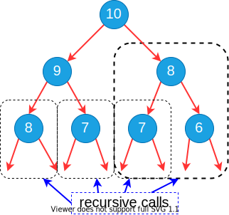
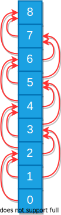

<!-- _backgroundColor: aquq -->

<!-- _color: orange -->

<!-- paginate: false -->

## CE100 Algorithms and Programming II

## Week-5 (Dynamic Programming)

#### Spring Semester, 2021-2022

Download [DOC-PDF](ce100-week-5-dp.tr.md_doc.pdf), [DOC-DOCX](ce100-week-5-dp.tr.md_word.docx), [SLIDE](ce100-week-5-dp.tr.md_slide.pdf), [PPTX](ce100-week-5-dp.tr.md_slide.pptx)

<iframe width=700, height=500 frameBorder=0 src="../ce100-week-5-dp.tr.md_slide.html"></iframe>

---

<!-- paginate: true -->

## Quicksort Sort

## Outline

- Convex Hull (Divide & Conquer)

- Dynamic Programming 
  
  - Introduction 
  
  - Divide-and-Conquer (DAC) vs Dynamic Programming (DP) 

---

- Fibonacci Numbers 
  
  - Recursive Solution 
  
  - Bottom-Up Solution 

- Optimization Problems

- Development of a DP Algorithms

---

- Matrix-Chain Multiplication
  
  - Matrix Multiplication and Row Columns Definitions 
  
  - Cost of Multiplication Operations (pxqxr)
  
  - Counting the Number of Parenthesizations 

---

- The Structure of Optimal Parenthesization 
  
  - Characterize the structure of an optimal solution 
  
  - A Recursive Solution 
    
    - Direct Recursion Inefficiency. 
  
  - Computing the optimal Cost of Matrix-Chain Multiplication 
  
  - Bottom-up Computation 

---

- Algorithm for Computing the Optimal Costs 
  
  - MATRIX-CHAIN-ORDER 

- Construction and Optimal Solution 
  
  - MATRIX-CHAIN-MULTIPLY 

- Summary 

---

## Dynamic Programming - **Introduction**

- An algorithm design paradigm like divide-and-conquer
- **Programming:** A tabular method (not writing computer code)
  - Older sense of planning or scheduling, typically by filling in a table
- **Divide-and-Conquer (DAC):** subproblems are independent
- **Dynamic Programming (DP):** subproblems are not independent
- Overlapping subproblems: subproblems share sub-subproblems
  - In solving problems with overlapping subproblems
    - A DAC algorithm **does redundant** work 
      - Repeatedly solves common subproblems
    - A DP algorithm solves each problem just once
      - **Saves** its result **in a table**

---

## Problem 1: **Fibonacci Numbers** Recursive Solution

- **Reminder:**

$$
\begin{align*}
& F(0)=0 \text{ and } F(1)=1 \\
& F(n)=F(n-1)+F(n-2) \\[10 pt]
&\text{REC-FIBO}(n) \{ \\
& \quad \text{if} \ n < 2 \\
& \qquad   \text{return} \ n \\
& \quad \text{else} \\
& \qquad  \text{return} \ \text{REC-FIBO}(n-1) + \text{REC-FIBO}(n-2) \ \}
\end{align*}
$$

- Overlapping subproblems in different recursive calls. Repeated work!




---

## Problem 1: **Fibonacci Numbers** Recursive Solution

- **Recurrence:**
  - *exponential runtime*

$$
  T(n) = T(n-1) + T(n-2) + 1
$$

- Recursive algorithm inefficient because it recomputes the same $F(i)$ repeatedly in different branches of the recursion tree.

---

## Problem 1: **Fibonacci Numbers** Bottom-up Computation

- **Reminder:**

$$
\begin{align*}
& F(0)=0 \text{ and } F(1)=1 \\
& F(n)=F(n-1)+F(n-2)
\end{align*}
$$

- **Runtime** $\Theta(n)$

``` r

ITER-FIBO(n)
  F[0] = 0
  F[1] = 1
  for i = 2 to n do
    F[i] = F[i-1] + F[i-2]
  return F[n]

```



---

## Optimization Problems

- **DP** typically applied to optimization problems
- In an optimization problem
  - There are many possible solutions (feasible solutions)
  - Each solution has a value
  - Want to find an optimal solution to the problem
    - *A solution with the optimal value (min or max value)*
  - Wrong to say **the** optimal solution to the problem
    - *There may be several solutions with the same optimal value*

---

## Development of a DP Algorithm

  **Step-1**. Characterize the structure of an optimal solution
  **Step-2**. Recursively define the value of an optimal solution
  **Step-3**. Compute the value of an optimal solution in a bottom-up fashion
  **Step-4**. Construct an optimal solution from the information computed in **Step 3**

---

<style scoped>section{ font-size: 25px; }</style>

## Problem 2: **Matric Chain Multiplication**

- **Input:** a sequence (chain) $\langle A_1,A_2, \dots , A_n\rangle$ of $n$ matrices
- **Aim:** compute the product $A_1 \cdot A_2 \cdot \dots A_n$
- A **product of matrices** is **fully parenthesized** if
  - It is either a **single matrix**
  - Or, the **product** of **two fully parenthesized matrix products** surrounded by a pair of parentheses. 
$\bigg(A_i(A_{i+1}A_{i+2} \dots A_j) \bigg)$
$\bigg((A_iA_{i+1}A_{i+2} \dots A_{j-1})A_j \bigg)$
$\bigg((A_iA_{i+1}A_{i+2} \dots A_k)(A_{k+1}A_{k+2} \dots A_j)\bigg)$ for $i \leq k < j$
- All parenthesizations yield the same product; matrix product is associative

---

<style scoped>section{ font-size: 25px; }</style>

## Matrix-chain Multiplication: **An Example Parenthesization**

- **Input:** $\langle A_1,A_2,A_3,A_4\rangle$ ($5$ distinct ways of full parenthesization)

$$
\begin{align*}
& \bigg(A_1\Big(A_2(A_3A_4)\Big)\bigg) \\
& \bigg(A_1\Big((A_2A_3)A_4\Big)\bigg) \\
& \bigg((A_1A_2)(A_3A_4)\bigg) \\
& \bigg(\Big(A_1(A_2A_3)A_4\Big)\bigg) \\
& \bigg(\Big((A_1A_2)A_3\Big)A_4\bigg)
\end{align*}
$$

- The way we parenthesize a chain of matrices can have a dramatic effect on the cost of computing the product

---

## Matrix-chain Multiplication: **Reminder**

``` r

MATRIX-MULTIPLY(A, B)
  if cols[A]!=rows[B] then 
    error(“incompatible dimensions”)
  for i=1 to rows[A] do
    for j=1 to cols[B] do 
      C[i,j]=0
      for k=1 to cols[A] do 
        C[i,j]=C[i,j]+A[i,k]·B[k,j]
  return C 

```


---

## Matrix Chain Multiplication: **Example**

- $A1:10\text{x}100$, $A2:100\text{x}5$, $A3:5\text{x}50$
  - Which paranthesization is better? $(A1A2)A3$ or $A1(A2A3)$?

  


---

## Matrix Chain Multiplication: **Example**

- $A1:10 \times 100$, $A2:100 \times 5$, $A3:5 \times 50$
  - Which paranthesization is better? $(A1A2)A3$ or $A1(A2A3)$?

  

---

## Matrix Chain Multiplication: **Example**

- $A1:10 \times 100$, $A2:100 \times 5$, $A3:5 \times 50$
  - Which paranthesization is better? $(A1A2)A3$ or $A1(A2A3)$?

**In summary:**

- $(A1A2)A3$ = $\#$ of multiply-add ops: $7500$
- $A1(A2A3)$ = $\#$ of multiple-add ops: $75000$ 

First parenthesization yields **10x faster** computation

---

## Matrix-chain Multiplication Problem

- **Input:** A chain $\langle A_1,A_2, \dots ,A_n\rangle$ of $n$ matrices, 
  - where $A_i$ is a $p_{i-1} \times p_i$ matrix

- **Objective:** Fully parenthesize the product 
  - $A_1 \cdot A_2 \dots  A_n$  
    - such that the number of **scalar mult-adds** is minimized.

---

<style scoped>section{ font-size: 25px; }</style>

## Counting the Number of Parenthesizations

- **Brute force approach:** exhaustively check all parenthesizations
- $P(n)$: $\#$ of parenthesizations of a sequence of n matrices
- We can split sequence between $k^{th}$ and $(k+1)^{st}$ matrices for any $k=1, 2, \dots , n-1$ , then parenthesize the two resulting sequences independently, i.e.,

$$
(A_1 A_2 A_3 \dots A_k \overbrace{)(}^{break-point}A_{k+1} A_{k+2} \dots A_n)
$$

- We obtain the recurrence

$$
P(1)=1 \text{ and } P(n)=\sum \limits_{k=1}^{n-1}P(k)P(n-k)
$$

---

## Number of Parenthesizations: 

- $P(1)=1$ and $P(n)=\sum \limits_{k=1}^{n-1}P(k)P(n-k)$

- The recurrence generates the sequence of **Catalan Numbers** Solution is $P(n)=C(n-1)$ where

$$
C(n)=\frac{1}{n+1} {2n \choose n} = \Omega(4^n / n^{3/2})
$$

- The number of solutions is **exponential** in $n$
- Therefore, brute force approach is a poor strategy

---

## The Structure of Optimal Parenthesization

- **Notation:** $A_{i..j}$: The matrix that results from evaluation of the product: $A_i A_{i+1} A_{i+2} \dots A_j$

- **Observation:** Consider the last multiplication operation in any parenthesization: $(A_1 A_2 \dots A_k) \cdot (A_{k+1} A_{k+2} \dots A_n)$
  - There is a $k$ value $(1 \leq k < n)$ such that:
    - First, the product $A_1 \dots k$ is computed
    - Then, the product $A_{k+1 \dots n}$ is computed
    - Finally, the matrices $A_{1 \dots k}$ and $A_{k+1 \dots n}$ are multiplied

---

## **Step 1:** Characterize the Structure of an Optimal Solution

- An optimal parenthesization of product $A_1 A_2 \dots A_n$ will be:
	$(A_1 A_2 \dots A_k) \cdot (A_{k+1} A_{k+2} \dots A_n)$ for some $k$ value
- The **cost of this optimal parenthesization** will be:
$=$ Cost of computing $A_{1 \dots k}$ 
$+$ Cost of computing $A_{k+1 \dots n}$
$+$ Cost of multiplying $A_{1 \dots k} \cdot A_{k+1 \dots n}$

---

## **Step 1:** Characterize the Structure of an Optimal Solution

- **Key observation:** Given optimal parenthesization
  - $(A_1 A_2 A_3 \dots A_k) \cdot (A_{k+1} A_{k+2} \dots A_n)$
- Parenthesization of the subchain $A_1 A_2 A_3 \dots A_k$
- Parenthesization of the subchain $A_{k+1} A_{k+2} \dots A_n$ 

should both be optimal

- Thus, optimal solution to an instance of the problem contains optimal solutions to subproblem instances
  - **i.e.**, optimal substructure within an optimal solution exists.

---

## **Step 2:** A Recursive Solution

- **Step 2:** Define the value of an optimal solution recursively in terms of optimal solutions to the subproblems
- Assume we are trying to determine the min cost of computing $A_{i \dots j}$

- $m_{i,j}$: min $\#$ of scalar multiply-add opns needed to compute $A_{i \dots j}$
  - **Note:** *The optimal cost of the original problem: $m_{1,n}$*
- How to compute $m_{i,j}$ recursively?

---

## **Step 2:** A Recursive Solution

- Base case: $m_{i,i}=0$ (single matrix, no multiplication)

- Let the size of matrix $A_i$ be $(p_{i-1} \times p_i)$
- Consider an optimal parenthesization of chain 
  - $A_i \dots A_j : (A_i \dots A_k) \cdot (A_{k+1} \dots A_j)$
- The optimal cost:	$m_{i,j} = m_{i,k} + m_{k+1,j} + p_{i-1} \times p_k \times p_j$
- **where:**       
  - $m_{i,k}$: Optimal cost of computing $A_{i \dots k}$
  - $m_{k+1,j}$: Optimal cost of computing $A_{k+1 \dots j}$
  - $p_{i-1} \times p_k \times p_j$ : Cost of multiplying $A_{i \dots k}$ and $A_{k+1 \dots j}$

---

## **Step 2:** A Recursive Solution

- In an optimal parenthesization: $k$ must be chosen to minimize $m_{ij}$
- The recursive formulation for $m_{ij}$:

$$
\begin{align*}
m_{ij} = 
  \begin{cases}
    0 & if & i=j \\
    \underset{i \leq k < j}{MIN} \{ m_{ik} + m_{k+1,j} + p_{i-1} p_k p_j \} & if & i<j 
  \end{cases}
\end{align*}
$$

---

## **Step 2:** A Recursive Solution

- The $m_{ij}$ values give the **costs of optimal solutions** to subproblems 
- In order to keep track of how to construct an optimal solution
  - Define $s_{ij}$ to be the value of $k$ which yields the optimal split of the subchain $A_{i \dots j}$
	  - That is, $s_{ij}=k$ such that
        - $m_{ij} = m_{ik} + m_{k+1,j} +p_{i-1} p_k p_j$ holds

---

<style scoped>section{ font-size: 25px; }</style>

## Direct Recursion: **Inefficient!**

- Recursive Matrix-Chain (**RMC**) Order

``` r
RMC(p,i,j)
	
  if (i == j) then 
    return 0
	
  m[i, j] = INF	
	
  for k=i to j-1 do
		
    q = RMC(p, i, k) + RMC(p, k+1, j) + p_{i-1} p_k p_j
		
    if q < m[i, j] then
      m[i, j] = q
  
  endfor

	return m[i, j] 
``` 

---

## Direct Recursion: **Inefficient!**

- Recursion tree for $RMC(p,1,4)$
- Nodes are labeled with $i$ and $j$ values

  

---

## Computing the Optimal Cost (**Matrix-Chain Multiplication**)

**An important observation:**
- We have **relatively few subproblems**
  - one problem for each choice of $i$ and $j$ satisfying $1 \leq i \leq j \leq n$
  - total $n + (n-1) + \dots + 2 + 1 = \frac{1}{2}n(n+1) = \Theta(n2)$ subproblems
- We can write a **recursive** algorithm based on recurrence. 
- However, a recursive algorithm may encounter each subproblem many times in different branches of the recursion tree
- This property, **overlapping subproblems**, is the **second important feature** for applicability of **dynamic programming**

---

## Computing the Optimal Cost (**Matrix-Chain Multiplication**)

- Compute the value of an optimal solution in a **bottom-up** fashion
  - matrix $A_i$ has dimensions $p_{i-1} \times p_i$ for $i = 1, 2, \dots , n$
  - the input is a sequence $\langle p_0, p_1, \dots, p_n \rangle$ where $length[p] = n + 1$
- Procedure uses the following auxiliary tables:
  - $m[1 \dots n, 1 \dots n]$: for storing the $m[i,j]$ costs
  - $s[1 \dots n, 1 \dots n]$:  records which index of $k$ achieved the optimal cost in computing $m[i,j]$

---

## **Bottom-Up** Computation

- How to choose the order in which we process $m_{ij}$ values?
- Before computing $m_{ij}$, we have to make sure that the values for $m_{ik}$ and $m_{k+1,j}$ have been computed for all $k$.

$$
m_{ij}=\underset{i \leq k < j}{MIN} \{ m_{ik} + m_{k+1,j} + p_{i-1} p_k p_j \}
$$

---

## **Bottom-Up** Computation

$$
m_{ij}=\underset{i \leq k < j}{MIN} \{ m_{ik} + m_{k+1,j} + p_{i-1} p_k p_j \}
$$

- $m_{ij}$ must be processed after $m_{ik}$ and $m_{j,k+1}$
- **Reminder:** $m_{ij}$ computed only for $j > i$


---

## **Bottom-Up** Computation

$$
m_{ij}=\underset{i \leq k < j}{MIN} \{ m_{ik} + m_{k+1,j} + p_{i-1} p_k p_j \}
$$

- $m_{ij}$ must be processed after $m_{ik}$ and $m_{j,k+1}$
- How to set up the iterations over $i$ and $j$ to compute $m_{ij}$?


---

## **Bottom-Up** Computation

$$
m_{ij}=\underset{i \leq k < j}{MIN} \{ m_{ik} + m_{k+1,j} + p_{i-1} p_k p_j \}
$$

- If the entries $m_{ij}$ are computed in the shown order, then $m_{ik}$ and $m_{k+1,j}$ values are guaranteed to be computed before $m_{ij}$.


---

## **Bottom-Up** Computation

$$
m_{ij}=\underset{i \leq k < j}{MIN} \{ m_{ik} + m_{k+1,j} + p_{i-1} p_k p_j \}
$$


---

## **Bottom-Up** Computation

$$
m_{ij}=\underset{i \leq k < j}{MIN} \{ m_{ik} + m_{k+1,j} + p_{i-1} p_k p_j \}
$$


---

<style scoped>section{ font-size: 25px; }</style>

## Algorithm for Computing the Optimal Costs

- *Note*: l $=\ell$ and p_{i-1} p_k p_j  $=p_{i-1} p_k p_j$

``` r
MATRIX-CHAIN-ORDER(p)
  n = length[p]-1
  for i=1 to n do
    m[i, i]=0
  endfor
  for l=2 to n do
    for i=1 to n n-l+1 do
      j=i+l-1
      m[i, j]=INF
      for k=i to j-1 do
        q=m[i,k]+m[k+1, j]+p_{i-1} p_k p_j
        if q < m[i,j] then
          m[i,j]=q
          s[i,j]=k
      endfor
    endfor
  endfor
  return m and s
```

---

## Algorithm for Computing the Optimal Costs

- The algorithm first computes 
  - $m[i, i] \leftarrow 0$ for $i=1,2, \dots ,n$ min costs for all chains of length 1
- **Then**, for $\ell = 2,3, \dots,n$ computes 
  - $m[i, i+\ell-1]$ for $i=1,\dots,n-\ell+1$ min costs for all chains of length $\ell$
- For each value of $\ell = 2, 3, \dots ,n$, 
  - $m[i, i+\ell-1]$ depends only on table entries $m[i,k] \& m[k+1, i+\ell-1]$ for $i\leq k < i+\ell-1$, which are already computed

---

## Algorithm for Computing the Optimal Costs

$$
\begin{align}
  \begin{aligned}
  \text{compute } m[i,i+1] \\
  \underbrace{ \{ m[1,2],m[2,3], \dots ,m[n-1,n]\} }_{(n-1) \text{ values}}
  \end{aligned}
    & \begin{cases}
    & \ell=2  \\
    & \text{for } i=1 \text{ to } n-1 \text{ do } \\
    & \quad m[i,i+1]=\infty \\
    & \quad \quad \text{for } k=i \text{ to } i \text{ do } \\
    &  \quad \quad \quad \vdots
    \end{cases} \\
  \begin{aligned}
  \text{compute } m[i,i+2] \\
  \underbrace{ \{ m[1,3],m[2,4], \dots ,m[n-2,n]\} }_{(n-2) \text{ values}}
  \end{aligned}
    & \begin{cases}
    & \ell=3  \\
    & \text{for } i=1 \text{ to } n-2 \text{ do } \\
    & \quad m[i,i+2]=\infty \\
    & \quad \quad \text{for } k=i \text{ to } i+1 \text{ do } \\
    & \quad \quad \quad \vdots
    \end{cases} \\
  \begin{aligned}
  \text{compute } m[i,i+3] \\
  \underbrace{ \{ m[1,4],m[2,5], \dots ,m[n-3,n]\} }_{(n-3) \text{ values}}
    \end{aligned}
    & \begin{cases}
    & \ell=4  \\
    & \text{for } i=1 \text{ to } n-3 \text{ do } \\
    & \quad m[i,i+3]=\infty \\
    & \quad \quad \text{for } k=i \text{ to } i+2 \text{ do } \\
    & \quad \quad \quad \vdots
    \end{cases}
\end{align} 
$$

---

## **Table access pattern** in computing $m[i, j]$s for $\ell=j-i+1$

$$
\begin{align*}
& \text{for} \ k \leftarrow i \ \text{to} \ j-1 \ \text{do} \\
& \quad q \leftarrow m[i,k]+m[k+1,j]+p_{i-1}p_kp_j
\end{align*}
$$


---

## **Table access pattern** in computing $m[i, j]$s for $\ell=j-i+1$

$$
\begin{align*}
& \bigg( (A_i) \overset{mult.}{ \vdots } (A_{i+1}A_{i+2} \dots A_j)  \bigg)
\end{align*}
$$


---

## **Table access pattern** in computing $m[i, j]$s for $\ell=j-i+1$

$$
\begin{align*}
\bigg( (A_iA_{i+1}) \overset{mult.}{ \vdots }  (A_{i+2} \dots A_j) \bigg)
\end{align*}
$$


---

## **Table access pattern** in computing $m[i, j]$s for $\ell=j-i+1$

$$
\begin{align*}
\bigg( (A_iA_{i+1}A_{i+2}) \overset{mult.}{ \vdots } (A_{i+3} \dots A_j) \bigg)
\end{align*}
$$


---

## **Table access pattern** in computing $m[i, j]$s for $\ell=j-i+1$

$$
\begin{align*}
\bigg( (A_iA_{i+1} \dots A_{j-1}) \overset{mult.}{ \vdots } (A_j) \bigg)
\end{align*}
$$


---

## **Table access pattern** Example

- Compute $m_{25}$
- Choose the $k$ value that leads to **min cost**

$$
m_{ij}=\underset{i \leq k < j}{MIN} \{ m_{ik} + m_{k+1,j} + p_{i-1} p_k p_j \} \\[10pt]
\begin{align*}
\begin{aligned}
A_1 &: (30 \times 35) \\
A_2 &: (35 \times 15) \\
A_3 &: (15 \times 5) \\
A_4 &: (5 \times 10) \\
A_5 &: (10 \times 20) \\
A_6 &: (20 \times 25)
\end{aligned}
\begin{aligned}
& ((A_2) \overbrace{\vdots}^{ (k=2) } (A_3 A_4 A_5)) \\[10 pt]
\quad cost &= m_{22} + m_{35} + p_1p_2p_5 \\
&= 0 + 2500 + 35 \times 15 \times 20 \\
&= 13000
\end{aligned}
\end{align*}
$$


---

## **Table access pattern** Example

- Compute $m_{25}$
- Choose the $k$ value that leads to **min cost**

$$
m_{ij}=\underset{i \leq k < j}{MIN} \{ m_{ik} + m_{k+1,j} + p_{i-1} p_k p_j \} \\[10pt]
\begin{align*}
\begin{aligned}
A_1 &: (30 \times 35) \\
A_2 &: (35 \times 15) \\
A_3 &: (15 \times 5) \\
A_4 &: (5 \times 10) \\
A_5 &: (10 \times 20) \\
A_6 &: (20 \times 25)
\end{aligned}
\begin{aligned}
& ((A_2 A_3) \overbrace{\vdots}^{ (k=3) } (A_4 A_5)) \\[10 pt]
\quad cost &= m_{23} + m_{45} + p_1p_3p_5 \\
&= 2625 + 1000 + 35 \times 5 \times 20 \\
&= 7125
\end{aligned}
\end{align*}
$$


---

## **Table access pattern** Example

- Compute $m_{25}$
- Choose the $k$ value that leads to **min cost**

$$
m_{ij}=\underset{i \leq k < j}{MIN} \{ m_{ik} + m_{k+1,j} + p_{i-1} p_k p_j \} \\[10pt]
\begin{align*}
\begin{aligned}
A_1 &: (30 \times 35) \\
A_2 &: (35 \times 15) \\
A_3 &: (15 \times 5) \\
A_4 &: (5 \times 10) \\
A_5 &: (10 \times 20) \\
A_6 &: (20 \times 25)
\end{aligned}
\begin{aligned}
& ((A_2 A_3 A_4)\overbrace{\vdots}^{ (k=4) }(A_5)) \\[10 pt]
\quad cost &= m_{24} + m_{55} + p_1p_4p_5 \\
&= 4375 + 0 + 35 \times 10 \times 20 \\
&= 11375
\end{aligned}
\end{align*}
$$


---

## **Table access pattern** Example

- Compute $m_{25}$
- Choose the $k$ value that leads to **min cost**

$$
m_{ij}=\underset{i \leq k < j}{MIN} \{ m_{ik} + m_{k+1,j} + p_{i-1} p_k p_j \} \\[10pt]
\begin{align*}
\begin{aligned}
A_1 &: (30 \times 35) \\
A_2 &: (35 \times 15) \\
A_3 &: (15 \times 5) \\
A_4 &: (5 \times 10) \\
A_5 &: (10 \times 20) \\
A_6 &: (20 \times 25)
\end{aligned} \quad
\begin{aligned}
& ((A_2)\overbrace{\vdots}^{ (k=2) } (A_3 A_4 A_5)) \rightarrow m_{22} + m_{35} + p_1p_2p_5 = 13000 \\
& ((A_2 A_3) \overbrace{\vdots}^{ (k=3) } (A_4 A_5)) \rightarrow m_{23} + m_{45} + p_1p_3p_5 = \overbrace{ \boldsymbol{7125}}^{selected} \Leftarrow \text{min} \\
& ((A_2 A_3 A_4)\overbrace{\vdots}^{ (k=4) }(A_5)) \rightarrow m_{24} + m_{55} + p_1p_4p_5 = 11375 \\[20 pt]
& m_{25} = 7125 \\
& s_{25} = 3 
\end{aligned} 
\end{align*}
$$


---


## Constructing an Optimal Solution

- **MATRIX-CHAIN-ORDER** determines the optimal $\#$ of scalar **mults/adds**
  - needed to compute a matrix-chain product
  - it does not directly show how to multiply the matrices
- That is,
  - it determines the cost of the optimal solution(s)
  - it does not show how to obtain an optimal solution
- Each entry $s[i, j]$ records the value of $k$ such that optimal parenthesization of $A_i \dots A_j$ splits the product between $A_k$ & $A_{k+1}$
- We know that the final matrix multiplication in computing $A_{1 \dots n}$ optimally is $A_{1 \dots s[1,n]} \times A_{s[1,n]+1,n}$

---

## **Example:** Constructing an Optimal Solution

- **Reminder:** $s_{ij}$ is the optimal top-level split of $A_i \dots A_j$

- What is the optimal top-level split for:
  - $A_1 A_2 A_3 A_4 A_5 A_6$
  - $s_{16}=3$


---

## **Example:** Constructing an Optimal Solution

- **Reminder:** $s_{ij}$ is the optimal top-level split of $A_i \dots A_j$

- $(A_1 A_2 A_3) \overbrace{\vdots}^{ (k=4) } (A_4 A_5 A_6)$
  - What is the optimal split for $A_1 \dots A_3$ ? ( $s_{13}=1$ )
  - What is the optimal split for $A_4 \dots A_6$ ? ( $s_{46}=5$ )


---

## **Example:** Constructing an Optimal Solution

- **Reminder:** $s_{ij}$ is the optimal top-level split of $A_i \dots A_j$

- $\Big((A_1) \overbrace{\vdots}^{ (k=1) } (A_2 A_3) \Big) \Big( (A_4 A_5) \overbrace{\vdots}^{ (k=5) } (A_6) \Big)$
  - What is the optimal split for $A_1 \dots A_3$ ? ( $s_{13}=1$ )
  - What is the optimal split for $A_4 \dots A_6$ ? ( $s_{46}=5$ )


---

## **Example:** Constructing an Optimal Solution

- **Reminder:** $s_{ij}$ is the optimal top-level split of $A_i \dots A_j$


- $\Big((A_1)  (A_2 A_3) \Big) \Big( (A_4 A_5)  (A_6) \Big)$
  - What is the optimal split for $A_2 A_3$ ? ( $s_{23}=2$ )
  - What is the optimal split for $A_4 A_5$ ? ( $s_{45}=4$ )


---

## **Example:** Constructing an Optimal Solution

- **Reminder:** $s_{ij}$ is the optimal top-level split of $A_i \dots A_j$


- $\bigg(\Big(A_1\Big)\Big((A_2)\overbrace{\vdots}^{ (k=2) }(A_3)\Big) \bigg) \bigg( \Big((A_4)\overbrace{\vdots}^{ (k=4) }(A_5)\Big) \Big(A_6\Big) \bigg)$
  - What is the optimal split for $A_2 A_3$ ? ( $s_{23}=2$ )
  - What is the optimal split for $A_4 A_5$ ? ( $s_{45}=4$ )


---

## Constructing an **Optimal Solution**

<style scoped>section{ font-size: 20px; }</style>

- Earlier optimal matrix multiplications can be computed recursively 
- **Given:** 
  - the chain of matrices $A = \langle A_1, A_2, \dots A_n \rangle$
the s table computed by $\text{MATRIX-CHAIN-ORDER}$
  - The following recursive procedure computes the **matrix-chain product** $A_{i \dots j}$

$$
\begin{align*}
& \text{MATRIX-CHAIN-MULTIPLY}(A, s, i,  j) \\
& \quad \text{if} \ j > i \ \text{then} \\
& \qquad X \longleftarrow \text{MATRIX-CHAIN-MULTIPLY}(A, s, i, s[i, j]) \\
& \qquad Y \longleftarrow \text{MATRIX-CHAIN-MULTIPLY}(A, s, s[i, j]+1, j) \\
& \qquad \text{return} \ \text{MATRIX-MULTIPLY}(X, Y) \\
& \quad \text{else} \\
& \qquad return A_i
\end{align*}
$$

- **Invocation:** $\text{MATRIX-CHAIN-MULTIPLY}(A, s, 1, n)$

---

## Example: Recursive Construction of an Optimal Solution


---

## Example: Recursive Construction of an Optimal Solution


---

## Example: Recursive Construction of an Optimal Solution


---

## Table reference pattern for $m[i, j]$ $(1 \leq i \leq j \leq n)$ 

- $m[i, j]$ is referenced for the computation of
  - $m[i, r] \ \text{for} \ j < r \leq n  \ (n - j )$ times
  - $m[r, j] \ \text{for} \ 1 \leq r < i \ (i - 1 )$ times


---

## Table reference pattern for $m[i, j]$ $(1 \leq i \leq j \leq n)$ 

- $R(i, j)$ = $\#$ of times that $m[i, j]$ is referenced in computing other entries

$$
\begin{align*}
R(i, j) &= (n - j) + (i-1) \\
 &=(n-1) - (j-i)
\end{align*}
$$

- The total $\#$ of references for the entire table is: $\sum \limits_{i=1}^{n}\sum \limits_{j=i}^{n}R(i,j)= \frac{n^3-n}{3}$


---

## Summary

- Identification of the optimal substructure property

- Recursive formulation to compute the cost of the optimal solution

- Bottom-up computation of the table entries

- Constructing the optimal solution by backtracing the table entries


---

## References

- [Introduction to Algorithms, Third Edition | The MIT Press](https://mitpress.mit.edu/books/introduction-algorithms-third-edition)

- [Bilkent CS473 Course Notes (new)](http://nabil.abubaker.bilkent.edu.tr/473/)

- [Bilkent CS473 Course Notes (old)](http://cs.bilkent.edu.tr/~ugur/teaching/cs473/)

---

$-End-Of-Week-5-Course-Module-$ 

