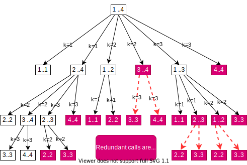
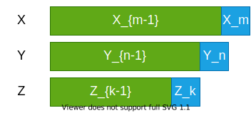
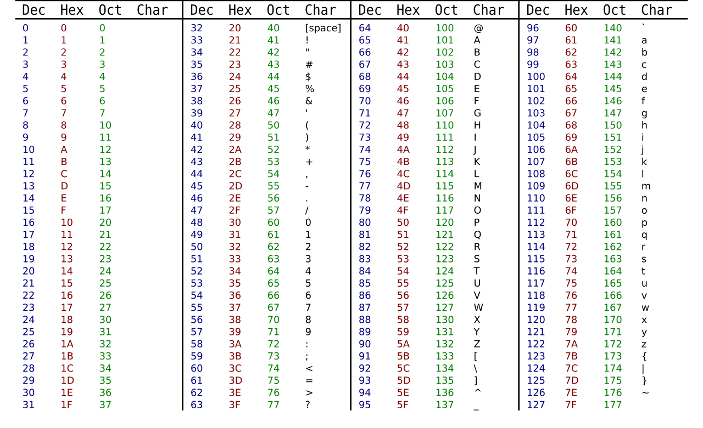

<!-- _backgroundColor: aquq -->

<!-- _color: orange -->

<!-- paginate: false -->

## CE100 Algorithms and Programming II

## Week-6 (Matrix Chain Order / LCS)

#### Spring Semester, 2021-2022

Download [DOC](ce100-week-6-lcs.en.md_doc.pdf), [SLIDE](ce100-week-6-lcs.en.md_slide.pdf), [PPTX](ce100-week-6-lcs.en.md_slide.pptx)

<iframe width=700, height=500 frameBorder=0 src="../ce100-week-6-lcs.en.md_slide.html"></iframe>

---

<!-- paginate: true -->

## Matrix Chain Order / Longest Common Subsequence

## Outline

- Elements of Dynamic Programming 
  - Optimal Substructure 
  - Overlapping Subproblems 

---

- Recursive Matrix Chain Order Memoization 
  - Top-Down Approach 
  - RMC 
  - MemoizedMatrixChain 
    - LookupC 
  - Dynamic Programming vs Memoization Summary 

---

- Dynamic Programming 
  - Problem-2 : Longest Common Subsequence 
    - Definitions 
    - LCS Problem 
    - Notations 
    - Optimal Substructure of LCS 
      - Proof Case-1 
      - Proof Case-2 
      - Proof Case-3 
    
---
    
- A recursive solution to subproblems (inefficient) 
- Computing the length of and LCS 
  - LCS Data Structure for DP 
  - Bottom-Up Computation 
- Constructing and LCS 
  - PRINT-LCS 
  - Back-pointer space optimization for LCS length 

---

- Most Common Dynamic Programming Interview Questions 

---

## Elements of Dynamic Programming

- When should we look for a DP solution to an optimization problem?
- Two key ingredients for the problem
  - Optimal substructure 
  - Overlapping subproblems

---

## DP Hallmark #1

- **Optimal Substructure**
  - A problem exhibits optimal substructure 
    - if an optimal solution to a problem contains within it optimal solutions to subproblems
  - **Example:** *matrix-chain-multiplication*
    - Optimal parenthesization of $A_1 A_2 \dots A_n$ that splits the product between $A_k$ and $A_{k+1}$, contains within it **optimal soln’s** to the problems of parenthesizing $A_1A_2 \dots A_k$ and $A_{k+1} A_{k+2} \dots A_n$

---

## Optimal Substructure

- Finding a suitable space of subproblems
  - Iterate on subproblem instances
  - **Example:** *matrix-chain-multiplication*
    - Iterate and look at the structure of optimal soln’s to subproblems, sub-subproblems, and so forth
    - Discover that all subproblems consists of subchains of $\langle A_1, A_2, \dots , A_n \rangle$ 
    - Thus, the set of chains of the form $\langle A_i,A_{i+1}, \dots , A_j \rangle$ for $1 \leq i \leq j \leq n$
    - Makes a natural and reasonable space of subproblems

---

## DP Hallmark #2

- **Overlapping Subproblems**
  - Total number of distinct subproblems should be **polynomial** in the input size
  - When a **recursive** algorithm revisits the same problem **over and over again**, 
    - We say that the optimization problem has **overlapping subproblems**

---

## Overlapping Subproblems

- **DP** algorithms typically take advantage of overlapping subproblems
  - by solving each problem once
  - then storing the solutions in a table 
    - where it can be looked up when needed
  - using constant time per lookup

---

## Overlapping Subproblems

- Recursive matrix-chain order

$$
\begin{align*}
& \text{RMC}(p, i, j) \{ \\[5 pt]
& \quad	\text{if} \ i = j \ \text{then} \\
&	\qquad \text{return} \ 0 \\[5 pt]
& \quad m[i, j] \leftarrow \infty	 \\[5 pt]
& \quad \text{for} \ k \leftarrow i \text{to} \ j - 1 \ \text{do} \\
&	\qquad q \leftarrow \text{RMC}(p, i, k) + \text{RMC}(p, k+1, j) + p_{i-1} p_k p_j \\[5 pt]
&	\quad if \ q < m[i, j] \ \text{then} \\
&	\qquad m[i, j] \leftarrow q \\[5 pt]
& \quad \text{return} \ m[i, j] \ \}  
\end{align*}
$$

---

## Direct Recursion: **Inefficient!**

- Recursion tree for $RMC(p,1,4)$
- Nodes are labeled with $i$ and $j$ values

---

## Running Time of RMC

$T(1) \geq 1$
$T(n) \geq 1 + \sum \limits_{k=1}^{n-1} (T(k)+T(n-k)+1)\ \text{for} \ n>1$
- For $i =1,2, \dots ,n$ each term $T(i)$ appears twice
  - Once as $T(k)$, and once as $T(n-k)$ 
- Collect $n-1,$ $1$’s in the summation together with the front $1$

$$
\begin{align*}
  T(n) \geq 2 \sum \limits_{i=1}^{n-1}T(i)+n
\end{align*}
$$

- Prove that $T(n)= \Omega(2n)$ using the **substitution method**

--- 

## Running Time of RMC: **Prove that $T(n)= \Omega(2n)$**

- Try to show that $T(n) \geq 2^{n-1}$ (**by substitution**)
- **Base case:** $T(1) \geq 1 = 2^0 = 2^{1-1}$ for $n=1$
- **Ind. Hyp.:** 

$$
\begin{align*}
T(i) & \geq 2^{i-1} \ \text{for all} \ i=1, 2, \dots, n-1 \ \text{and} \ n \geq 2 \\
T(n) & \geq 2 \sum \limits_{i=1}^{n-1}2^{i-1} + n \\[15 pt]
 & = 2 \sum \limits_{i=1}^{n-1} 2^{i-1} + n \\
 & = 2(2^{n-1}-1) + n \\ 
 & = 2^{n-1} + (2^{n-1} - 2 + n) \\
 & \Rightarrow T(n) \geq 2^{n-1} \	\text{ Q.E.D.}	
\end{align*}
$$

	
---

## Running Time of RMC: **$T(n) \geq 2^{n-1}$**
 
- **Whenever**
  - a recursion tree for the natural recursive solution to a problem contains the same subproblem repeatedly
  - the total number of different subproblems is small  
    - it is a good idea to see if $DP (Dynamic \ Programming)$ can be applied

---

## Memoization

- Offers the efficiency of the usual $DP$ approach while maintaining **top-down** strategy 
- Idea is to **memoize** the natural, but inefficient, **recursive algorithm**

---

## Memoized Recursive Algorithm

- Maintains an **entry** in a **table** for the soln to each subproblem 
- Each table entry contains **a special value** to indicate that the entry has yet to be filled in
- When the subproblem is **first encountered** its solution is **computed** and then **stored** in the table
- Each **subsequent** time that the subproblem encountered the value stored in the table is simply **looked up** and **returned**

---

## Memoized Recursive Matrix-chain Order

- Shaded subtrees are looked-up rather than recomputing

$$
\begin{align*}
\begin{aligned}
& \text{MemoizedMatrixChain(p)} \\
& \quad n \leftarrow length[p] - 1 \\ 
& \quad \text{for} \ i \leftarrow 1 \ \text{to} \ n  \ \text{do} \\ 
& \qquad \text{for} \ j \leftarrow 1 \ \text{to} \  n \ \text{do} \\
& \qquad \quad m[i, j] \leftarrow \infty \\	
& \quad \text{return} \ \text{LookupC}(p, 1, n) \Longrightarrow
\end{aligned} 
\begin{aligned}
& \Longrightarrow \text{LookupC}(p, i, j) \\
& \quad \text{if} \ m[i, j] = \infty \ \text{then} \\
& \qquad \text{if} \ i = j \ \text{then} \\
& \qquad \quad m[i, j] \leftarrow 0 \\
& \qquad \text{else} \\
& \qquad \quad \text{for} \ k \leftarrow i \ \text{to} \ j-1 \ \text{do} \\
& \qquad \quad \quad q \leftarrow \text{LookupC}(p, i, k) + \text{LookupC}(p, k+1, j) + p_{i-1} p_k p_j \\
& \qquad \quad \quad \text{if} \ q < m[i, j] \ \text{then} \\
& \qquad \quad \quad \quad m[i, j] \leftarrow q \\
& \quad \text{return} \ m[i, j]  
\end{aligned}
\end{align*}
$$

---

## Memoized Recursive Algorithm

- The approach assumes that
  - The set of **all possible subproblem parameters** are known
  - The relation between the **table positions** and **subproblems** is established
- Another approach is to memoize
  - by using **hashing** with subproblem parameters as key

<!-- 
- Memoization-based solutions will NOT BE ACCEPTED in the exams!
-->

---

## Dynamic Programming **vs** Memoization Summary (1)

- Matrix-chain multiplication can be solved in $O(n^3)$ time
  - by either a top-down memoized recursive algorithm
  - or a bottom-up dynamic programming algorithm
- Both methods exploit the **overlapping subproblems** property
  - There are only $\Theta(n^2)$ different subproblems in total 
  - Both methods **compute** the soln to **each problem once**
- **Without memoization** the natural **recursive** algorithm runs in **exponential time** since subproblems are solved repeatedly

---

## Dynamic Programming **vs** Memoization Summary (2)

- **In general practice**
  - If all subproblems must be solved at once
    - a bottom-up **DP algorithm always outperforms** a top-down memoized algorithm by a constant factor
  - because, bottom-up **DP** algorithm
    - Has no overhead for recursion
    - Less overhead for maintaining the table
  - **DP:** **Regular** pattern of **table accesses** can be exploited to reduce the time and/or space requirements even further
  - **Memoized:** If some problems need not be solved at all, it has the advantage of avoiding solutions to those subproblems 

---

## Problem 3: **Longest Common Subsequence**

**Definitions**

- A **subsequence** of a given sequence is just the **given sequence** with **some elements** (possibly none) **left out**

- **Example:**
  - $X = \langle  A, B, C, B, D, A, B \rangle$
  - $Z = \langle B, C, D, B \rangle$
    -  $Z$ is a subsequence of $X$

---

## Problem 3: **Longest Common Subsequence**

**Definitions**

- **Formal definition:** Given a sequence $X = \langle x_1, x_2, \dots , x_m \rangle$, sequence $Z = \langle z_1, z_2, \dots, z_k \rangle$ is a subsequence of $X$
  - if $\exists$ a **strictly increasing sequence** $\langle i_1, i_2,\dots, i_k \rangle$  of indices of $X$ such that $x_{i_j} = z_j$ for all $j = 1, 2, …, k$, where $1 \leq k \leq m$

- **Example:** $Z =  \langle B,C,D,B \rangle$ is a subsequence of $X =  \langle A,B,C,B,D,A,B \rangle$ with the **index sequence** $\langle i_1, i_2, i_3, i_4 \rangle = \langle 2, 3, 5, 7 \rangle$

---

## Problem 3: **Longest Common Subsequence**

**Definitions**

- If $Z$ is a subsequence of both $X$ and $Y$, we denote $Z$ as a **common subsequence** of $X$ and $Y$.

- **Example:**

$$
\begin{align*}
X &= \langle A,B^*,C^*,B,D,A^*,B \rangle \\
Y &= \langle B^*,D,C^*,A^*,B,A \rangle
\end{align*}
$$

- $Z_1 = \langle B^*, C^*, A^* \rangle$ is a common subsequence (**of length 3**) of $X$ and $Y$.
- **Two longest common subsequence (LCSs)** of $X$ and $Y$?
  - $Z2 = \langle B, C, B, A \rangle$ of length $4$
  - $Z3 = \langle B, D, A, B \rangle$ of length $4$
    - *The optimal solution value = 4*

---

## Longest Common Subsequence (LCS) Problem

- **LCS problem:** Given two sequences 
  - $X = \langle x_1, x_2, \dots, x_m \rangle$ and 
  - $Y = \langle y_1, y_2, \dots , y_n \rangle$, find the **LCS** of $X \& Y$
- **Brute force approach:**
  - Enumerate all subsequences of $X$
  - Check if each subsequence is also a subsequence of $Y$
  - Keep track of the **LCS** 
  - What is the complexity?
  - There are $2^m$ subsequences of $X$
    - **Exponential runtime**

---

## Notation

- **Notation:** Let $X_i$ denote the $i^{th}$ prefix of $X$
  - i.e. $X_i = \langle x_1, x_2, \dots, x_i \rangle$
- **Example:** 

$$
\begin{align*}
X &= \langle A, B, C, B, D, A, B \rangle \\[10 pt]
X_4 &= \langle A, B, C, B \rangle  \\ 
X_0 &= \langle \rangle
\end{align*}
$$

---

## Optimal Substructure of an **LCS**

- Let $X = <x1, x2, …, xm>$ and $Y = \langle y_1, y_2, \dots, y_n \rangle$ are given
- Let $Z = \langle z_1, z_2, \dots, z_k \rangle$ be an **LCS** of $X$ and $Y$

- **Question 1:** If $x_m = y_n$, how to define the optimal substructure?
  - We must have $z_k = x_m = y_n$ and 
  - $Z_{k-1} = \text{LCS}(X_{m-1}, Y_{n-1})$

---

## Optimal Substructure of an **LCS**

- Let $X = <x1, x2, …, xm>$ and $Y = \langle y_1, y_2, \dots, y_n \rangle$ are given
- Let $Z = \langle z_1, z_2, \dots, z_k \rangle$ be an **LCS** of $X$ and $Y$

- **Question 2:** If $x_m \neq y_n \ \text{and} \ z_k \neq x_m$, how to define the optimal substructure?
  - We must have $Z = \text{LCS}(X_{m-1}, Y)$

---

## Optimal Substructure of an **LCS**

- Let $X = <x1, x2, …, xm>$ and $Y = \langle y_1, y_2, \dots, y_n \rangle$ are given
- Let $Z = \langle z_1, z_2, \dots, z_k \rangle$ be an **LCS** of $X$ and $Y$

- **Question 3:** If $x_m \neq y_n \ \text{and} \ z_k \neq y_n$, how to define the optimal substructure?
  - We must have $Z = \text{LCS}(X, Y_{n-1})$

---

## Theorem: Optimal Substructure of an **LCS**

- Let $X = \langle x_1, x_2, \dots, x_m \rangle$ and Y = <y1, y2, …, yn> are given
- Let $Z = \langle z_1, z_2, \dots, z_k \rangle$ be an **LCS** of $X$ and $Y$
- **Theorem:** Optimal substructure of an LCS:
  - If $x_m = y_n$ 
    - then $z_k = x_m = y_n$ and $Z_{k-1}$ is an **LCS** of $X_{m-1}$ and $Y_{n-1}$
  - If $x_m \neq y_n$ and $z_k \neq x_m$ 
    - then $Z$ is an **LCS** of $X_{m-1}$ and $Y$
  - If $x_m \neq y_n$ and $z_k \neq y_n$ 
    - then $Z$ is an **LCS** of $X$ and $Y_{n-1}$

---

## Optimal Substructure Theorem **(case 1)**

- If $x_m = y_n$ then $z_k = x_m = y_n$ and $Z_{k-1}$ is an **LCS** of $X_{m-1}$ and $Y_{n-1}$

---

## Optimal Substructure Theorem (case 2)

- If $x_m \neq y_n$ and $z_k \neq x_m$ then $Z$ is an **LCS** of $X_{m-1}$ and $Y$

---

## Optimal Substructure Theorem (case 3)

- If $x_m \neq y_n$ and $z_k \neq y_n$ then $Z$ is an **LCS** of $X$ and $Y_{n-1}$

---

## Proof of Optimal Substructure Theorem (case 1)

- If $x_m = y_n$ then $z_k = x_m = y_n$ and $Z_{k-1}$ is an **LCS** of $X_{m-1}$ and $Y_{n-1}$
- **Proof:** If $z_k \neq x_m = y_n$ then
  - we can append $x_m = y_n$ to $Z$ to obtain a common subsequence of length $k+1 \Longrightarrow$ **contradiction**
  - Thus, we must have $z_k = x_m = y_n$
  - Hence, the prefix $Z_{k-1}$ is a **length-($k-1$) CS** of $X_{m-1}$ and $Y_{n-1}$
- **We have to show that** $Z_{k-1}$ is in fact an **LCS** of $X_{m-1}$ and $Y_{n-1}$
- **Proof by contradiction:**
  - **Assume that** $\exists$ a CS $W$ of $X_{m-1}$ and $Y_{n-1}$ with $|W| = k$
  - Then appending $x_m = y_n$ to $W$ produces a **CS** of length $k+1$

---

## Proof of Optimal Substructure Theorem (case 2)

- If $x_m \neq y_n$ and $z_k \neq x_m$ then $Z$ is an **LCS** of $X_{m-1}$ and $Y$
- **Proof :** If $z_k \neq x_m$ then $Z$ is a CS of $X_{m-1}$ and $Y_n$
  - **We have to show that** $Z$ is in fact an **LCS** of $X_{m-1}$ and $Y_n$
- **(Proof by contradiction)**
  - Assume that $\exists$ a CS $W$ of $X_{m-1}$ and $Y_n$ with $|W| > k$
  - Then $W$ would also be a CS of $X$ and $Y$ 
  - Contradiction to the assumption that
    - $Z$ is an LCS of $X$ and $Y$ with $|Z| = k$
- **Case 3:** Dual of the proof for (case 2)

---

## A Recursive Solution to Subproblems

- Theorem implies that there are one or two subproblems to examine
- **if** $x_m = y_n$ **then**
  - we must solve the subproblem of finding an **LCS** of $X_{m-1}  \&  Y_{n-1}$
  - appending $x_m = y_n$ to this **LCS** yields an **LCS** of $X \& Y$
- **else**
  - we must solve **two subproblems**
    - finding an **LCS** of $X_{m-1} \& Y$
    - finding an **LCS** of $X \& Y_{n-1}$
  - longer of these two **LCS** s is an **LCS** of $X \& Y$
- **endif**

---

## Recursive Algorithm **(Inefficient)**

$$
\begin{align*}
& \text{LCS}(X, Y) \ \{ \\
& \quad  m \leftarrow length[X] \\
& \quad  n \leftarrow length[Y] \\
& \quad  \text{if} \ x_m = y_n \ \text{then} \\
& \qquad  Z \leftarrow \text{LCS}(X_{m-1}, Y_{n-1}) \triangleright \text{solve one subproblem} \\
& \qquad \text{return} \ \langle Z, x_m = y_n \rangle \triangleright \text{append} \ x_m = y_n \ \text{to} \ Z \\
& \quad else \\
& \qquad Z^{'} \leftarrow \text{LCS}(X_{m-1}, Y) \triangleright \text{solve two subproblems} \\
& \qquad Z^{''} \leftarrow \text{LCS}(X, Y_{n-1}) \\
& \qquad \text{return longer of} \ Z^{'} \ \text{and} \ Z^{''} \\
& \}
\end{align*}
$$

---

## A Recursive Solution

- $c[i, j]:$ length of an **LCS** of $X_i$ and $Y_j$

$$
\begin{align*}
c[i,j] = \begin{cases}
  & 0  &  \text{if}& \ i=0 \ \text{or} \ j=0 \\
  & c[i-1,j-1]+1 & \text{if}& \ i,j>0 \ \text{and} \ x_i=y_j \\
  & \text{max}\{c[i,j-1],c[i-1,j]\} & \text{if}& \ i,j>0 \ \text{and} \ x_i \neq y_j \\
\end{cases}
\end{align*}
$$

---

## Computing the Length of an **LCS**

- We can easily write an **exponential-time recursive algorithm** based on the given recurrence. $\Longrightarrow$ **Inefficient!**
- How many distinct subproblems to solve? 
  - $\Theta(mn)$
- **Overlapping subproblems property:** Many subproblems share the same sub-subproblems.
  - **e.g.** Finding an **LCS** to $X_{m-1} \& Y$ and an **LCS** to $X \& Y_{n-1}$ 
  - has the sub-subproblem of finding an **LCS** to $X_{m-1} \& Y_{n-1}$
- Therefore, we can use **dynamic programming**.

---

## Data Structures

- Let:
  - $c[i, j]:$ length of an **LCS** of $X_i$ and $Y_j$
  - $b[i, j]:$ direction towards the table entry corresponding to the optimal subproblem solution chosen when computing $c[i, j]$. 
  - Used to simplify the construction of an optimal solution at the end.
- Maintain the following tables:
  - $c[0 \dots m, 0 \dots n]$
  - $b[1 \dots m, 1 \dots n]$

---

## Bottom-up Computation

- **Reminder:**

$$
\begin{align*}
c[i,j] = \begin{cases}
  & 0  &  \text{if}& \ i=0 \ \text{or} \ j=0 \\
  & c[i-1,j-1]+1 & \text{if}& \ i,j>0 \ \text{and} \ x_i=y_j \\
  & \text{max}\{c[i,j-1],c[i-1,j]\} & \text{if}& \ i,j>0 \ \text{and} \ x_i \neq y_j \\
\end{cases}
\end{align*}
$$

- How to choose the order in which we process $c[i, j]$ values?
- The values for $c[i-1, j-1]$, $c[i, j-1]$, and $c[i-1,j]$ must be computed before computing $c[i, j]$.

---

## Bottom-up Computation

$$
\begin{align*}
c[i,j] = \begin{cases}
  & 0  &  \text{if}& \ i=0 \ \text{or} \ j=0 \\
  & c[i-1,j-1]+1 & \text{if}& \ i,j>0 \ \text{and} \ x_i=y_j \\
  & \text{max}\{c[i,j-1],c[i-1,j]\} & \text{if}& \ i,j>0 \ \text{and} \ x_i \neq y_j \\
\end{cases}
\end{align*}
$$

**Need to process:**
        $c[i, j]$
**after computing:**
       $c[i-1, j-1]$, 
       $c[i, j-1]$,  
       $c[i-1,j]$ 

---

## Bottom-up Computation

$$
\begin{align*}
c[i,j] = \begin{cases}
  & 0  &  \text{if}& \ i=0 \ \text{or} \ j=0 \\
  & c[i-1,j-1]+1 & \text{if}& \ i,j>0 \ \text{and} \ x_i=y_j \\
  & \text{max}\{c[i,j-1],c[i-1,j]\} & \text{if}& \ i,j>0 \ \text{and} \ x_i \neq y_j \\
\end{cases}
\end{align*}
$$

$$
\Downarrow
$$

$$
\begin{align*}
& \text{for} \ i \leftarrow 1 \ \text{to} \ m \\
& \quad     \text{for} \ j \leftarrow 1 \ \text{to} \ n \\
& \qquad      \dots \\
& \qquad       \dots \\
& \qquad    c[i, j] =  \cdots
\end{align*}
$$

---

## Computing the Length of an **LCS**

$$
\begin{align*}
\frac{\text{Total Runtime} = \Theta(mn)}{\text{Total Space} = \Theta(mn)}
\begin{cases}
& LCS-LENGTH(X,Y) \\
& \quad m \leftarrow length[X]; n \leftarrow length[Y] \\
& \quad \text{for} \ i \leftarrow 0 \ \text{to} \ m \ \text{do} \ c[i, 0] \leftarrow 0 \\
& \quad \text{for} \ j \leftarrow 0 \ \text{to} \ n \ \text{do} \ c[0, j] \leftarrow 0 \\
& \quad \text{for} \ i \leftarrow 1 \ \text{to} \ m \ \text{do} \\
& \qquad \text{for} \ j \leftarrow 1 \ \text{to} \ n \ \text{do} \\
& \qquad \quad \text{if} \ x_i = y_j \ \text{then}  \\
& \qquad \quad \quad c[i, j] \leftarrow c[i-1, j-1]+1 \\
& \qquad \quad \quad b[i, j] \leftarrow " \nwarrow " \\
& \qquad \quad \text{else if} \ c[i - 1, j] \geq c[i, j-1] \\
& \qquad \quad \quad c[i, j] \leftarrow c[i-1, j] \\
& \qquad \quad \quad b[i, j] \leftarrow "\uparrow " \\
& \qquad \quad \text{else} \\
& \qquad \quad \quad c[i, j] \leftarrow c[i, j-1] \\
& \qquad \quad \quad b[i, j] \leftarrow " \leftarrow " \\
\end{cases}
\end{align*}
$$

---

## Computing the Length of an LCS-1

Operation of LCS-LENGTH  on the sequences
$$
\begin{align*}
X &= \langle \overset{1}{A}, \overset{2}{B}, \overset{3}{C}, \overset{4}{B}, \overset{5}{D}, \overset{6}{A}, \overset{7}{B} \rangle \\
Y &= \langle \overset{1}{B}, \overset{2}{D}, \overset{3}{C}, \overset{4}{A}, \overset{5}{B}, \overset{6}{A} \rangle 
\end{align*}
$$

---

## Computing the Length of an LCS-2

Operation of LCS-LENGTH  on the sequences
$$
\begin{align*}
X &= \langle \overset{1}{A}, \overset{2}{B}, \overset{3}{C}, \overset{4}{B}, \overset{5}{D}, \overset{6}{A}, \overset{7}{B} \rangle \\
Y &= \langle \overset{1}{B}, \overset{2}{D}, \overset{3}{C}, \overset{4}{A}, \overset{5}{B}, \overset{6}{A} \rangle 
\end{align*}
$$

---

## Computing the Length of an LCS-3

Operation of LCS-LENGTH  on the sequences
$$
\begin{align*}
X &= \langle \overset{1}{A}, \overset{2}{B}, \overset{3}{C}, \overset{4}{B}, \overset{5}{D}, \overset{6}{A}, \overset{7}{B} \rangle \\
Y &= \langle \overset{1}{B}, \overset{2}{D}, \overset{3}{C}, \overset{4}{A}, \overset{5}{B}, \overset{6}{A} \rangle 
\end{align*}
$$

---

## Computing the Length of an LCS-4

Operation of LCS-LENGTH  on the sequences
$$
\begin{align*}
X &= \langle \overset{1}{A}, \overset{2}{B}, \overset{3}{C}, \overset{4}{B}, \overset{5}{D}, \overset{6}{A}, \overset{7}{B} \rangle \\
Y &= \langle \overset{1}{B}, \overset{2}{D}, \overset{3}{C}, \overset{4}{A}, \overset{5}{B}, \overset{6}{A} \rangle 
\end{align*}
$$

---

## Computing the Length of an LCS-5

Operation of LCS-LENGTH  on the sequences
$$
\begin{align*}
X &= \langle \overset{1}{A}, \overset{2}{B}, \overset{3}{C}, \overset{4}{B}, \overset{5}{D}, \overset{6}{A}, \overset{7}{B} \rangle \\
Y &= \langle \overset{1}{B}, \overset{2}{D}, \overset{3}{C}, \overset{4}{A}, \overset{5}{B}, \overset{6}{A} \rangle 
\end{align*}
$$

---

## Computing the Length of an LCS-6

Operation of LCS-LENGTH  on the sequences
$$
\begin{align*}
X &= \langle \overset{1}{A}, \overset{2}{B}, \overset{3}{C}, \overset{4}{B}, \overset{5}{D}, \overset{6}{A}, \overset{7}{B} \rangle \\
Y &= \langle \overset{1}{B}, \overset{2}{D}, \overset{3}{C}, \overset{4}{A}, \overset{5}{B}, \overset{6}{A} \rangle 
\end{align*}
$$

---

## Computing the Length of an LCS-7

Operation of LCS-LENGTH  on the sequences
$$
\begin{align*}
X &= \langle \overset{1}{A}, \overset{2}{B}, \overset{3}{C}, \overset{4}{B}, \overset{5}{D}, \overset{6}{A}, \overset{7}{B} \rangle \\
Y &= \langle \overset{1}{B}, \overset{2}{D}, \overset{3}{C}, \overset{4}{A}, \overset{5}{B}, \overset{6}{A} \rangle 
\end{align*}
$$

---

## Computing the Length of an LCS-8

Operation of LCS-LENGTH  on the sequences
$$
\begin{align*}
X &= \langle \overset{1}{A}, \overset{2}{B}, \overset{3}{C}, \overset{4}{B}, \overset{5}{D}, \overset{6}{A}, \overset{7}{B} \rangle \\
Y &= \langle \overset{1}{B}, \overset{2}{D}, \overset{3}{C}, \overset{4}{A}, \overset{5}{B}, \overset{6}{A} \rangle 
\end{align*}
$$

---

## Computing the Length of an LCS-9

Operation of LCS-LENGTH  on the sequences
$$
\begin{align*}
X &= \langle \overset{1}{A}, \overset{2}{B}, \overset{3}{C}, \overset{4}{B}, \overset{5}{D}, \overset{6}{A}, \overset{7}{B} \rangle \\
Y &= \langle \overset{1}{B}, \overset{2}{D}, \overset{3}{C}, \overset{4}{A}, \overset{5}{B}, \overset{6}{A} \rangle 
\end{align*}
$$

---

## Computing the Length of an LCS-10

Operation of LCS-LENGTH  on the sequences
$$
\begin{align*}
X &= \langle \overset{1}{A}, \overset{2}{B}, \overset{3}{C}, \overset{4}{B}, \overset{5}{D}, \overset{6}{A}, \overset{7}{B} \rangle \\
Y &= \langle \overset{1}{B}, \overset{2}{D}, \overset{3}{C}, \overset{4}{A}, \overset{5}{B}, \overset{6}{A} \rangle 
\end{align*}
$$

---

## Computing the Length of an LCS-11

Operation of LCS-LENGTH  on the sequences
$$
\begin{align*}
X &= \langle \overset{1}{A}, \overset{2}{B}, \overset{3}{C}, \overset{4}{B}, \overset{5}{D}, \overset{6}{A}, \overset{7}{B} \rangle \\
Y &= \langle \overset{1}{B}, \overset{2}{D}, \overset{3}{C}, \overset{4}{A}, \overset{5}{B}, \overset{6}{A} \rangle 
\end{align*}
$$

---

## Computing the Length of an LCS-12

Operation of LCS-LENGTH  on the sequences
$$
\begin{align*}
X &= \langle \overset{1}{A}, \overset{2}{B}, \overset{3}{C}, \overset{4}{B}, \overset{5}{D}, \overset{6}{A}, \overset{7}{B} \rangle \\
Y &= \langle \overset{1}{B}, \overset{2}{D}, \overset{3}{C}, \overset{4}{A}, \overset{5}{B}, \overset{6}{A} \rangle 
\end{align*}
$$

---

## Computing the Length of an LCS-13

Operation of LCS-LENGTH  on the sequences
$$
\begin{align*}
X &= \langle \overset{1}{A}, \overset{2}{B}, \overset{3}{C}, \overset{4}{B}, \overset{5}{D}, \overset{6}{A}, \overset{7}{B} \rangle \\
Y &= \langle \overset{1}{B}, \overset{2}{D}, \overset{3}{C}, \overset{4}{A}, \overset{5}{B}, \overset{6}{A} \rangle 
\end{align*}
$$

- Running-time = $O(mn)$ since each table entry takes $O(1)$ time to compute

---

## Computing the Length of an LCS-14

Operation of LCS-LENGTH  on the sequences
$$
\begin{align*}
X &= \langle \overset{1}{A}, \overset{2}{B}, \overset{3}{C}, \overset{4}{B}, \overset{5}{D}, \overset{6}{A}, \overset{7}{B} \rangle \\
Y &= \langle \overset{1}{B}, \overset{2}{D}, \overset{3}{C}, \overset{4}{A}, \overset{5}{B}, \overset{6}{A} \rangle 
\end{align*}
$$

- Running-time = $O(mn)$ since each table entry takes $O(1)$ time to compute

- **LCS** of $X \& Y = \langle B, C, B, A \rangle$

---

## Constructing an **LCS**

- The $b$ table returned by **LCS-LENGTH** can be used to quickly construct an **LCS** of $X \& Y$
- Begin at $b[m, n]$ and trace through the table following arrows
- Whenever you encounter a "$\nwarrow$" in entry $b[i, j]$ it implies that $x_i = y_j$ is an element of **LCS**
- The elements of **LCS** are encountered in **reverse order**

---

## Constructing an **LCS**

- The recursive procedure $\text{PRINT-LCS}$ prints out $\text{LCS}$ in proper order
- This procedure takes $O(m+n)$ time  since at least one of $i$ and $j$ is decremented in each stage of the recursion

$$
\begin{align*}
& \text{PRINT-LCS}(b, X, i, j) \\
& \quad \text{if} \ i = 0 \ \text{or} j = 0 \ \text{then} \\
& \quad \text{return} \\
& \quad \text{if} \ b[i, j] = " \nwarrow " \ \text{then} \\
& \qquad \text{PRINT-LCS}(b, X, i-1, j-1) \\
& \qquad \text{print} \ x_i \\
& \quad \text{else if} \ b[i, j] = " \uparrow " \ \text{then} \\
& \qquad \text{PRINT-LCS}(b, X, i-1, j) \\
& \quad \text{else} \\
& \qquad \text{PRINT-LCS}(b, X, i, j-1) 
\end{align*}
$$

- **The initial invocation:** $\text{PRINT-LCS}(b, X, length[X], length[Y])$

---

## Do we really need the b table (back-pointers)?

- **Question:** From which neighbor did we expand to the highlighted cell?
- **Answer:** Upper-left neighbor,because $X[i] = Y[j]$.

---

## Do we really need the b table (back-pointers)?

- **Question:** From which neighbor did we expand to the highlighted cell?
- **Answer:** Left neighbor, because $X[i] \neq Y[j]$ and $LCS[i, j-1] > LCS[i-1, j]$.

---

## Do we really need the b table (back-pointers)?

- **Question:** From which neighbor did we expand to the highlighted cell?
- **Answer:** Upper neighbor,because $X[i] \neq Y[j]$ and
$LCS[i, j-1] = LCS[i-1, j]$. 
*(See pseudo-code to see how ties are handled.)*

---

## Improving the Space Requirements

- We can eliminate the b table altogether
  - each $c[i, j]$ entry depends only on $3$ other $c$ table entries: $c[i-1, j-1]$, $c[i-1, j]$ and $c[i, j-1]$
- Given the value of $c[i, j]$:
  - We can determine in $O(1)$ time which of these $3$ values was used to compute $c[i, j]$ without inspecting table $b$
  - We save $\Theta(mn)$ space by this method
  - However, space requirement is still $\Theta(mn)$ since we need $\Theta(mn)$ space for the $c$ table anyway

---

## What if we store the last 2 rows only?

- To compute $c[i, j]$, we only need $c[i-1, j-1]$, $c[i-1, j]$,and $c[i-1, j-1]$
- So, we can store only the last two rows.

---

## What if we store the last 2 rows only?

- To compute $c[i, j]$, we only need $c[i-1, j-1]$, $c[i-1, j]$, and $c[i-1, j-1]$
- So, we can store only the last two rows.

---

## What if we store the last 2 rows only?

- To compute $c[i, j]$, we only need $c[i-1, j-1]$, $c[i-1, j]$, and $c[i-1, j-1]$
- So, we can store only the last two rows.

- This reduces space complexity from $\Theta(mn)$ to $\Theta(n)$.
- Is there a problem with this approach?

---

## What if we store the last 2 rows only?

- **Is there a problem with this approach?**

  - We cannot construct the optimal solution because we cannot backtrace anymore.
  - This approach works if we only need the length of an LCS, not the actual LCS.

---

## Problem 4 **Optimal Binary Search Tree**

---

## **Reminder:** Binary Search Tree (BST)

---

## Binary Search Tree Example

- **Example:** English-to-French translation
  - Organize (English, French) word pairs in a BST
    - **Keyword:** English word
    - **Satellite Data:** French word
- We can search for an English word (node key)  efficiently, and  return the  corresponding French word (satellite data).

---

## **ASCII** Table

---

## Binary Search Tree Example

Suppose we know the frequency of each keyword in texts:
$$
\underset{5\%}{\underline{begin}},
\underset{40\%}{\underline{do}},
\underset{8\%}{\underline{else}},
\underset{4\%}{\underline{end}},
\underset{10\%}{\underline{if}},
\underset{10\%}{\underline{then}},
\underset{23\%}{\underline{while}},
$$

---

## Cost of a Binary Search Tree

**Example:** If we search for keyword **"while"**, we need
to access $3$ nodes. So, $23%$ of the queries will have cost of $3$.

$$
\begin{align*}
\text{Total Cost} &= \sum \limits_{i}^{}(\text{depth}(i)+1)\text{freq}(i) \\
&= 1 \times 0.04 + 2 \times 0.4 + \\
& 2 \times 0.1 + 3 \times 0.05 + \\
& 3 \times 0.08 + 3 \times 0.1 + \\
& 3 \times 0.23 \\
&= 2.42
\end{align*}
$$

---

## Cost of a Binary Search Tree

**Example:** If we search for keyword **"while"**, we need
to access $3$ nodes. So, $23%$ of the queries will have cost of $3$.

$$
\begin{align*}
\text{Total Cost} &= \sum \limits_{i}^{}(\text{depth}(i)+1)\text{freq}(i) \\
&= 1 \times 0.4 + 2 \times 0.05 + 2 \times 0.23 + \\
& 3 \times 0.1 + 4 \times 0.08 + \\
& 4 \times 0.1 + 5 \times 0.04 \\
&= 2.18
\end{align*}
$$

- This is in fact an optimal BST.

---

## Optimal Binary Search Tree Problem

- **Given:**
  - A collection of $n$ keys $K_1 < K_2 < \dots K_n$ to be stored in a **BST**.
  - The corresponding $p_i$ values for $1 \leq i \leq n$
    - $p_i$: probability of searching for key $K_i$
- **Find:**
  - An **optimal BST** with minimum total cost:

$$
\begin{align*}
\text{Total Cost} &= \sum \limits_{i}^{}(\text{depth}(i)+1)\text{freq}(i)
\end{align*}
$$

- **Note:** The BST will be static. Only search operations will be  performed. No insert, no delete, etc.

---

## Cost of a **Binary Search Tree**

- **Lemma 1**: Let $Tij$ be a BST containing keys $K_i < K_{i+1} < \dots < K_j$. Let $T_L$ and $T_R$ be the left and right subtrees of $T$. Then we have:

$$
\begin{align*}
\text{cost}(T_{ij})=\text{cost}(T_{L})+\text{cost}(T_{R})+\sum \limits_{h=i}^{j}p_h
\end{align*}
$$

**Intuition:** When we add the root node, the depth of each node in $T_L$ and $T_R$ increases by $1$. So, the cost of node $h$ increases by $p_h$. In addition, the cost of root node $r$ is $p_r$. That’s why, we have the last term at the end of the formula above.

---

## Optimal Substructure Property

- **Lemma 2:** Optimal substructure property
  - Consider an optimal **BST** $T_{ij}$ for keys $K_i < K_{i+1} < \dots < K_j$
  - Let $K_m$ be the key at the root of $T_{ij}$
- **Then:** 
  - $T_{i,m-1}$ is an **optimal BST** for subproblem containing keys: 
    - $K_i < \dots < K_{m-1}$
  - $T_{m+1,j}$ is an **optimal BST** for subproblem containing keys: 
    - $K_{m+1} < \dots < K_j$

$$
\begin{align*}
\text{cost}(T_{ij})=\text{cost}(T_{i,m-1})+\text{cost}(T_{m+1,j})+\sum \limits_{h=i}^{j}p_h
\end{align*}
$$

---

## Recursive Formulation

- **Note:** *We don’t know which root vertex leads to the minimum total cost. So, we need to try each vertex $m$, and choose the one with minimum total cost.*

- $c[i, j]$: cost of an optimal BST $T_{ij}$ for the subproblem $K_i < \dots < K_j$

$$
\begin{align*}
& c[i,j] = 
\begin{cases}
& 0  & \text{if} \ i>j \\
& \underset{i \leq r \leq j}{\text{min}}\{ c[i,r-1]+c[r+1,j]+P_{ij} \} & \text{otherwise} \\
\end{cases} \\
& \text{where} \ P_{ij}= \sum \limits_{h=i}^{j}p_h
\end{align*}
$$

---

## Bottom-up computation

$$
\begin{align*}
& c[i,j] = 
\begin{cases}
& 0  & \text{if} \ i>j \\
& \underset{i \leq r \leq j}{\text{min}}\{ c[i,r-1]+c[r+1,j]+P_{ij} \} & \text{otherwise} \\
\end{cases}
\end{align*}
$$

- How to choose the order in which we process $c[i, j]$ values?
- Before computing $c[i, j]$, we have to make sure that the values for $c[i, r-1]$ and $c[r+1,j]$ have been computed for all $r$.

---

## Bottom-up computation

$$
\begin{align*}
& c[i,j] = 
\begin{cases}
& 0  & \text{if} \ i>j \\
& \underset{i \leq r \leq j}{\text{min}}\{ c[i,r-1]+c[r+1,j]+P_{ij} \} & \text{otherwise} \\
\end{cases}
\end{align*}
$$

- $c[i,j]$ must be processed after $c[i,r-1]$ and $c[r+1,j]$

---

## Bottom-up computation

$$
\begin{align*}
& c[i,j] = 
\begin{cases}
& 0  & \text{if} \ i>j \\
& \underset{i \leq r \leq j}{\text{min}}\{ c[i,r-1]+c[r+1,j]+P_{ij} \} & \text{otherwise} \\
\end{cases}
\end{align*}
$$

- If the entries $c[i,j]$ are computed in the shown order, then $c[i,r-1]$ and $c[r+1,j]$ values are guaranteed to be computed before $c[i,j]$.

---

## Computing the Optimal BST Cost

$$
\begin{align*}
& \text{OPTIMAL-BST-COST} (p, n) \\
& \quad \text{for} \ i \leftarrow 1 \ \text{to} \ n \ \text{do} \\
& \qquad c[i, i-1] \leftarrow 0 \\
& \qquad c[i, i] \leftarrow p[i] \\
& \qquad R[i, j] \leftarrow i \\
& \quad PS[1] \leftarrow p[1] \Longleftarrow PS[i] \rightarrow  \text{ prefix-sum } (i): \text{Sum of all} \ p[j] \ \text{values for}  \ j \leq i
 \\
& \quad \text{for} \ i \leftarrow 2 \ \text{to} \ n \ \text{do} \\
& \qquad PS[i] \leftarrow p[i] + PS[i-1]  \Longleftarrow  \text{compute the prefix sum} \\
& \quad \text{for} \ d \leftarrow 1 \ \text{to} \ n−1 \ \text{do}   \Longleftarrow  \text{BSTs with} \ d+1 \ \text{consecutive keys} \\
& \qquad \text{for} \  i \leftarrow 1 \ \text{to} \ n – d \ \text{do} \\
& \qquad \quad j \leftarrow i + d \\
& \qquad \quad c[i, j] \leftarrow \infty \\
& \qquad \quad \text{for} \ r \leftarrow i \ \text{to} \ j \ \text{do} \\
& \qquad \qquad q \leftarrow min\{c[i,r-1] + c[r+1, j]\} +  PS[j] – PS[i-1]\} \\
& \qquad \qquad \text{if} \ q < c[i, j] \ \text{then} \\
& \qquad \qquad \quad c[i, j]  \leftarrow q \\
& \qquad \qquad	\quad R[i, j] \leftarrow r \\
& \quad \text{return} \ c[1, n], R
\end{align*}
$$

---

## Note on Prefix Sum

- We need $P_{ij}$ values for each $i, j (1 ≤ i ≤ n \ \text{and} \ 1 ≤ j ≤ n)$, where: 

$$
\begin{align*}
P_{ij} = \sum \limits_{h=i}^{j}p_h
\end{align*}
$$

- If we compute the summation directly for every $(i, j)$ pair, the runtime would be $\Theta(n^3)$.

- Instead, we spend $O(n)$ time in preprocessing to compute the prefix sum array **PS**. Then we can compute each $P_{ij}$ in $O(1)$ time using **PS**.

---

## Note on Prefix Sum

- In preprocessing, compute for each $i$:
  - $PS[i]$: the sum of $p[j]$ values for $1 \leq j \leq i$
- Then, we can compute $P_{ij}$ in $O(1)$ time as follows:
  - $P_{ij} = PS[i] – PS[j-1]$
- **Example:** 

$$
\begin{align*}
p &: \overset{1}{0.05} \ \overset{2}{0.02} \ \overset{3}{0.06} \ \overset{4}{0.07} \ \overset{5}{0.20} \ \overset{6}{0.05} \ \overset{7}{0.08} \ \overset{8}{0.02} \\
PS &: \overset{1}{0.05} \ \overset{2}{0.07} \ \overset{3}{0.13} \ \overset{4}{0.20} \ \overset{5}{0.40} \ \overset{6}{0.45} \ \overset{7}{0.53} \ \overset{8}{0.55} \\[10 pt]
P_{27} &= PS[7] – PS[1] = 0.53 – 0.05 = 0.48  \\
P_{36} &= PS[6] – PS[2] = 0.45 – 0.07 = 0.38  
\end{align*}
$$

---

##  Most Common Dynamic Programming **Interview** Questions 

---

  - Problem-1:  Longest Increasing Subsequence 
    - https://www.geeksforgeeks.org/longest-increasing-subsequence-dp-3/ 
    - https://en.wikipedia.org/wiki/Longest_increasing_subsequence#:~:text=In%20computer%20science%2C%20the%20longest,not%20necessarily%20contiguous%2C%20or%20unique. 
    - https://www.youtube.com/watch?v=22s1xxRvy28&ab_channel=StableSort 

---

  - Problem-2: Edit Distance 
    - https://www.geeksforgeeks.org/edit-distance-dp-5/ 
    - https://www.youtube.com/watch?v=tU2f2JwHmfQ&feature=youtu.be&ab_channel=PrepForTech 
    - Recursive 
      - https://www.youtube.com/watch?v=8Q2IEIY2pDU&ab_channel=BenLangmead 
    - DP 
      - https://www.youtube.com/watch?v=0KzWq118UNI&ab_channel=BenLangmead 
      - https://www.youtube.com/watch?v=eAVGRWSryGo&ab_channel=BenLangmead 

---

  - Problem-3: Partition a set into two subsets such that the difference of subset sums is minimum 
    - https://www.geeksforgeeks.org/partition-a-set-into-two-subsets-such-that-the-difference-of-subset-sums-is-minimum/ 
  - Problem-4: Count number of ways to cover a distance 
    - https://www.geeksforgeeks.org/count-number-of-ways-to-cover-a-distance/ 
  - Problem-5: Find the longest path in a matrix with given constraints 
    - https://www.geeksforgeeks.org/find-the-longest-path-in-a-matrix-with-given-constraints/ 

---

  - Problem-6: Subset Sum Problem 
    - https://www.geeksforgeeks.org/subset-sum-problem-dp-25/ 
  - Problem-7: Optimal Strategy for a Game 
    - https://www.geeksforgeeks.org/optimal-strategy-for-a-game-dp-31/ 
  - Problem-8: 0-1 Knapsack Problem 
    - https://www.geeksforgeeks.org/0-1-knapsack-problem-dp-10/ 

---

  - Problem-9: Boolean Parenthesization Problem 
    - https://www.geeksforgeeks.org/boolean-parenthesization-problem-dp-37/ 
  - Problem-10: Shortest Common Supersequence 
    - https://www.geeksforgeeks.org/shortest-common-supersequence/ 
    - https://en.wikipedia.org/wiki/Shortest_common_supersequence_problem 
  - Problem-11: Partition Problem 
    - https://www.geeksforgeeks.org/partition-problem-dp-18/ 
  - Problem-12: Cutting a Rod 
    - https://www.geeksforgeeks.org/cutting-a-rod-dp-13/ 

---

  - [Problem-13: Coin Change](https://www.geeksforgeeks.org/coin-change-dp-7) 
  - [Problem-14: Word Break Problem](https://www.geeksforgeeks.org/word-break-problem-dp-32/) 
  - [Problem-15: Maximum Product Cutting](https://www.geeksforgeeks.org/maximum-product-cutting-dp-36/)

---

  - Problem-16: Dice Throw 
    - https://www.geeksforgeeks.org/dice-throw-dp-30/ 
  - Problem-17: Box Stacking Problem 
    - https://www.geeksforgeeks.org/box-stacking-problem-dp-22/ 
  - Problem-18: Egg Dropping Puzzle 
    - https://www.geeksforgeeks.org/egg-dropping-puzzle-dp-11/ 

---

## References

- [Introduction to Algorithms, Third Edition | The MIT Press](https://mitpress.mit.edu/books/introduction-algorithms-third-edition)

- [Bilkent CS473 Course Notes (new)](http://nabil.abubaker.bilkent.edu.tr/473/)

- [Bilkent CS473 Course Notes (old)](http://cs.bilkent.edu.tr/~ugur/teaching/cs473/)

---

$-End-Of-Week-6-Course-Module-$ 