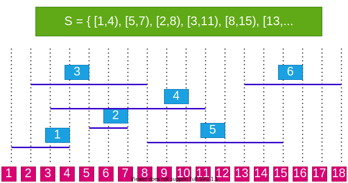
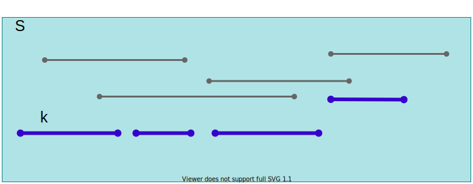
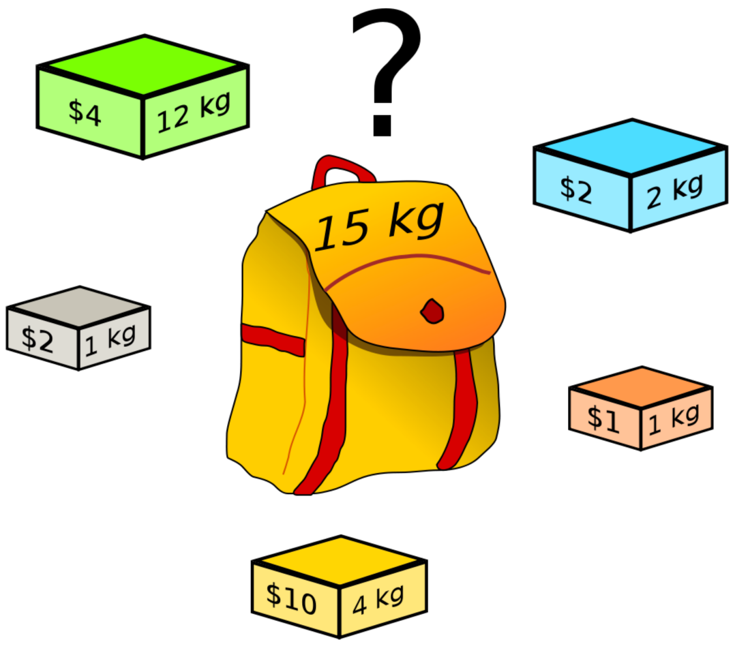

<!-- _backgroundColor: aquq -->

<!-- _color: orange -->

<!-- paginate: false -->

## CE100 Algorithms and Programming II

## Week-7 (Greedy Algorithms, Knapsack)

#### Spring Semester, 2021-2022

Download [DOC](ce100-week-7-knapsack.en.md_doc.pdf), [SLIDE](ce100-week-7-knapsack.en.md_slide.pdf), [PPTX](ce100-week-7-knapsack.en.md_slide.pptx)

<iframe width=700, height=500 frameBorder=0 src="../ce100-week-7-knapsack.en.md_slide.html"></iframe>

---

<!-- paginate: true -->

## Greedy Algorithms, Knapsack

## Outline

- Greedy Algorithms and Dynamic Programming Differences 
- Greedy Algorithms 
  - Activity Selection Problem 
  - Knapsack Problems 
    - The 0-1 knapsack problem 
    - The fractional knapsack problem 

---

## **Activity Selection Problem**

---

## Activity Selection Problem

- We have: 
  - A set of activities with fixed start and finish times
  - One shared resource (only one activity can use at any time)
- **Objective:** Choose the max number of compatible activities
- **Note:** Objective is to maximize the number of activities, not the total time of activities.

- **Example:**
  - *Activities:* Meetings with fixed start and finish times
  - *Shared resource:* A meeting room
	- *Objective:* Schedule the max number of meetings

---

## Activity Selection Problem

- **Input:** a set $S=\{a_{1}, a_{2}, \dots, a_{n}\}$ of n activities
- $s_i$  : Start time of activity $a_i$, 
- $f_i$  : Finish time of activity $a_i$
Activity $i$ takes place in $[s_i, f_i )$
- **Aim:** Find max-size subset $A$ of mutually *compatible* activities
  - Max number of activities, not max time spent in activities
  - Activities $i$ and $j$ are compatible if intervals $[s_i, f_i )$ and $[s_j, f_j)$ do not overlap, i.e., either $s_i \geq f_j$ or $s_j \geq f_i$ 

---

## Activity Selection Problem An Example

---

## Optimal Substructure Property

- Consider an optimal solution $A$ for activity set $S$.
- Let $k$ be the activity in $A$ with the **earliest finish time**

---

## Optimal Substructure Property

- Consider an optimal solution $A$ for activity set $S$.
- Let $k$ be the activity in $A$ with the **earliest finish time**
- Now, consider the **subproblem $S_k'$** that has the activities that start after $k$ finishes, i.e. $S_k'=\{a_i \in S: s_i \geq f_k \}$
- What can we say about the optimal solution to $S_k'$ ?

---

## Optimal Substructure Property

- Consider an optimal solution $A$ for activity set $S$.
- Let $k$ be the activity in $A$ with the **earliest finish time**
- Now, consider the **subproblem $S_k'$** that has the activities that start after $k$ finishes, i.e. $S_k'=\{a_i \in S: s_i \geq f_k \}$
- $A-\{k\}$ is an optimal solution for $S_k'$. Why?

---

## Optimal Substructure

- **Theorem:**  Let $k$ be the activity with the earliest finish time in an optimal soln $A \subseteq S$ then 
  - $A-\{k\}$ is an optimal solution to subproblem
  - $S_k' = \{a_i \in S: s_i \geq f_k \}$
- **Proof (by contradiction):**
  - $\rhd$ Let $B'$ be an optimal solution to $S_k'$ and 
	  - $|B'| > | A-\{k\}| = | A | - 1$
  - Then, $B = B' \cup \{k\}$ is compatible and
    - $|B| = |B'|+1 > | A |$ 
  - Contradiction to the optimality of $A$                 
  $Q.E.D.$

---

## Optimal Substructure

- **Recursive formulation:** Choose the first activity $k$, and then solve the remaining subproblem $S_k'$

- How to choose the first activity $k$?
  - DP, memoized recursion?
    - i.e. choose the $k$ value that will have the max size for $S_k'$
- DP would work, 
  - but is it necessary to try all possible values for $k$?

---

## Greedy Choice Property

- Assume (without loss of generality) $f_1 \leq f_2 \leq \dots \leq f_n$
  - If not, sort activities according to their finish times in non-decreasing order

- **Greedy choice property:** a sequence of locally optimal (greedy) choices $\Rightarrow$ an optimal solution

- How to choose the first activity **greedily** without losing optimality?

---

## Greedy Choice Property - Theorem

- Let activity set $S = \{a_1, a_2, \dots a_n\}$, where $f_1 \leq f_2 \leq \dots \leq f_n$

- **Theorem:** There exists an optimal solution $A \subseteq S$ such that $a_1 \in A$

 **In other words, the activity with the earliest finish time is guaranteed to be in an optimal solution**.

---

## Greedy Choice Property - Proof

- **Theorem:** There exists an optimal solution $A \subseteq S$ such that $a_1 \in A$

- **Proof:** Consider an arbitrary optimal solution $B = \{a_k, a_{\ell}, a_m, \dots\}$, where $f_k < f_{\ell} < f_m < \dots$
  - If $k = 1$, then $B$ starts with $a_1$, and the proof is complete
  - If $k > 1$, then create another solution $B'$ by replacing $a_k$ with $a_1$. Since $f_1 \leq f_k$, $B'$ is guaranteed to be valid, and $|B'| = |B|$, hence also optimal

---

## Greedy Algorithm

- So far, we have:
  - **Optimal substructure property:** If $A = \{a_k, \dots \}$ is an optimal solution, then $A-\{a_k\}$ must be optimal for subproblem $S_k'$, where $Sk' = \{a_i \in S: s_i \geq f_k\}$
    - **Note:** $a_k$ is the activity with the earliest finish time in $A$
  - **Greedy choice property:** There is an optimal solution $A$ that contains $a_1$
    - **Note:** $a_1$ is the activity with the earliest finish time in $S$

---

## Greedy Algorithm

*explained in the next slide..*

---

## Greedy Algorithm

- **Theorem:** There exists an optimal solution $A \subseteq S$ such that $a_1 \in A$

- Basic idea of the greedy algorithm:
  - Add $a_1$ to $A$
  - Solve the remaining subproblem $S_1'$, and then append the result to $A$

- **Remember arbitary optimal solution explaination from previous sections (finish time order is important for $a_1$ selection with star time and overlapping checking)**
  -  $B = \{a_k, a_{\ell}, a_m, \dots\}$, 
  - where $f_k < f_{\ell} < f_m < \dots$

---

## Greedy Algorithm for Activity Selection

### Definitions in Greedy Algorithm:

- $j$: specifies the index of most recent activity added to $A$

- $f_j = Max\{f_k : k \in A\}$, max finish time of any activity in $A$; 
  - because activities are processed in non-decreasing order of finish times
- Thus, $s_i \geq f_j$ checks the compatibility of $i$ to current $A$
- **Running time:** $\Theta(n)$ assuming that the activities were already sorted.

---

## Greedy Algorithm for Activity Selection

### Pseudocode for Greedy Algorithm:

$$
\begin{align*}
& \text{GAS}(s, f, n) \ \{ \\
& \quad  A \leftarrow \{1\} \\
& \quad  j \leftarrow 1 \\

& \quad \text{for} \ i \leftarrow 2 \ \text{to} \ n \ \text{do} \\
& \qquad \text{if} \ s_i \geq f_j \ \text{then} \\
& \qquad \quad A \leftarrow A \cup \{i\} \\
& \qquad \quad j \leftarrow i  \\
& \qquad \text{endif}  \\
& \quad \text{endfor} \\
& \quad \}
\end{align*}
$$

---

## Greedy Algorithm for Activity Selection, An Example (Step-1)

---

## Greedy Algorithm for Activity Selection, An Example (Step-2)

---

## Greedy Algorithm for Activity Selection, An Example (Step-3)

---

## Greedy Algorithm for Activity Selection, An Example (Step-4)

---

## Greedy Algorithm for Activity Selection, An Example (Step-5)

---

## Greedy Algorithm for Activity Selection, An Example (Step-6)

---

## Greedy Algorithm for Activity Selection, An Example (Step-7)  
### Final Solution

---

## **Comparison of DP and Greedy Algorithms**

---

## **Reminder**: DP-Based Matrix Chain Order

$$
m_{ij}=\underset{i \leq k < j}{MIN} \{ m_{ik} + m_{k+1,j} + p_{i-1} p_k p_j \}
$$

- We don’t know ahead of time which $k$ value to choose.

- We first need to compute the results of subproblems $m_{ik}$  and $m_{k+1,j}$ before computing $m_{ij}$

- The selection of $k$ is done based on the **results of the subproblems**.

---

## Greedy Algorithm for Activity Selection

*explained in the next slide..*

---

## Greedy Algorithm for Activity Selection

- Make a greedy selection in the beginning:
  - Choose $a_1$ (the activity with the earliest finish time)
- Solve the remaining subproblem $S_1'$ (all activities that start after a1)

---

## Greedy vs Dynamic Programming

- Optimal substructure property exploited by both **Greedy** and **DP** strategies
- **Greedy Choice Property:** A sequence of locally optimal choices $\Rightarrow$ an optimal solution
  - We make the choice that seems best at the moment
  - Then solve the subproblem arising after the choice is made
- **DP:** We also make a choice/decision at each step, but the choice may depend on the optimal solutions to subproblems
- **Greedy:** The choice may depend on the choices made so far, but it cannot depend on any future choices or on the solutions to subproblems

---

## Greedy vs Dynamic Programming

- **DP** is a bottom-up strategy (*use memory to store the results of subproblems*)
- **Greedy** is a top-down strategy (*make choices at each step*)
  - each greedy choice in the sequence iteratively reduces each problem to a similar but smaller problem

---

## Proof of Correctness of Greedy Algorithms

- Examine a globally optimal solution
- Show that this soln can be modified so that 
  - (1) A greedy choice is made as the first step
  - (2) This choice reduces the problem to a similar but smaller problem
- Apply induction to show that a greedy choice can be used at every step
- Showing (2) reduces the proof of correctness to proving that the problem exhibits optimal substructure property

---

## Greedy Choice Property - Proof

- **Theorem:** There exists an optimal solution $A \subseteq S$ such that $a_1 \in A$

- **Proof:** Consider an arbitrary optimal solution $B = \{a_k, a_{\ell}, a_m, \dots\}$, where $f_k < f_{\ell} < f_m < \dots$
  - If $k = 1$, then $B$ starts with $a_1$, and the proof is complete
  - If $k > 1$, then create another solution $B'$ by replacing $a_k$ with $a_1$. Since $f_1 \leq f_k$, $B'$ is guaranteed to be valid, and $|B'| = |B|$, hence also optimal

---

## Elements of Greedy Strategy

- How can you judge whether
- A greedy algorithm will solve a particular optimization problem?

- **Two key ingredients**
  - Greedy choice property
  - Optimal substructure property 

---

## Key Ingredients of Greedy Strategy

- **Greedy Choice Property:** A globally optimal solution can be arrived at by making locally optimal (greedy) choices
- In **DP**,we make a choice at each step but the choice may depend on the solutions to subproblems
- In **Greedy Algorithms**, we make the choice that seems best at that moment then solve the subproblems arising after the choice is made
  - The choice may depend on choices so far, but it cannot depend on any future choice or on the solutions to subproblems
- DP solves the problem bottom-up
- Greedy usually progresses in a top-down fashion by making one greedy choice after another reducing each given problem instance to a smaller one 

---

## Key Ingredients: **Greedy Choice Property**

- We must prove that a greedy choice at each step yields a globally optimal solution
- The proof examines a globally optimal solution
- Shows that the soln can be modified so that a **greedy choice made as the first step** reduces the problem to a similar but smaller subproblem
- Then **induction** is applied to show that a greedy choice can be used at each step
- Hence, this induction proof reduces the proof of correctness to demonstrating that an optimal solution must exhibit **optimal substructure** property

---

## Key Ingredients: **Greedy Choice Property**

- **How to prove the greedy choice property?**
  - Consider the greedy choice $c$
  - Assume that there is an **optimal solution $B$ that doesn’t contain $c$**.
  - Show that it is possible to **convert $B$** to another optimal solution $B'$, where $B'$ contains $c$.
- **Example:** Activity selection algorithm
  - Greedy choice: $a_1$ (the activity with the earliest finish time)
  - Consider an optimal solution $B$ without $a_1$
  - Replace the first activity in $B$ with $a_1$ to construct $B'$
  - Prove that $B'$ must be an optimal solution

---

## Key Ingredients: **Optimal Substructure**

- A problem exhibits optimal substructure if an optimal solution to the problem contains within it optimal solutions to subproblems
- **Example:** Activity selection problem $S$
  - If an optimal solution A to S begins with activity a1 then the set of activities
  
  $$
  A' = A - \{a_1\}
  $$
  
  - is an optimal solution to the activity selection problem 
  
  $$
  S' = \{ a_i \in S : s_i \geq f_1 \}
  $$

  - where $s_i$ is the start time of activity $a_i$ and $f_i$ is the finish time of activity $a_i$

---

## Key Ingredients: **Optimal Substructure**

- Optimal substructure property is exploited by both Greedy and dynamic programming strategies
- Hence one may
  - Try to generate a dynamic programming soln to a problem when a greedy strategy suffices  inefficient
  - Or, may mistakenly think that a greedy soln works when in fact a DP soln is required  incorrect
- **Example:** `Knapsack Problems(S, w)`

---

## **Knapsack Problems**

---

## Knapsack Problem

- Each item $i$ has:
  - weight $w_i$
  - value $v_i$
- A thief has a knapsack of weight capacity $w$

- **Which items to choose to maximize the value of the items in the knapsack?**

---

## Knapsack Problem: **Two Versions**

- **The 0-1 knapsack problem:**
  - Each item is discrete.
  - Each item either chosen as a whole or not chosen.
  - **Examples:** *TV, laptop, gold bricks, etc*.

- **The fractional knapsack problem:**
  - Can choose fractional part of each item.
  - If item i has weight wi, we can choose any amount ≤ wi
  - **Examples:** *Gold dust, silver dust, rice, etc.* 

---

## Knapsack Problems

- **The 0-1 Knapsack Problem($S, W$)**
  - A thief robbing a store finds $n$ items $S=\{I_1, I_2, \dots , I_n\}$, the ith item is worth $v_i$ dollars and weighs $w_i$ pounds, where vi and wi are integers
  - He wants to take as valuable a load as possible, but he can carry at most $W$ pounds in his knapsack, where $W$ is an integer
  - The thief cannot take a fractional amount of an item
- **The Fractional Knapsack Problem ($S, W$)**
  - The scenario is the same
  - But, the thief can take fractions of items rather than having to make binary ($0-1$) choice for each item

---

## Optimal Substructure Property for the 0-1 Knapsack Problem (S, W)

- Consider an optimal load L for the problem (S, W).
- Let Ij be an item chosen in L with weight wj
- Assume we remove Ij from L, and let:
	
$$
\begin{align*}
& L_{j}' = L – \{I_j\} \\
& S_{j}' = S – \{I_j\} \\
& W_{j}' = W – w_j
\end{align*}
$$

- Q: *What can we say about the optimal substructure property?*

---

## Optimal Substructure Property for the 0-1 Knapsack Problem (S, W)
	
$$
\begin{align*}
& L_{j}' = L – \{I_j\} \\
& S_{j}' = S – \{I_j\} \\
& W_{j}' = W – w_j
\end{align*}
$$

- Optimal substructure property: 
  - $L_j'$ must be an optimal solution for $(S_j', W_j')$
- **Why?**
  - If we remove item $j$ from $L$, we can construct a new optimal solution $L_j'$ for $(S_j', W_j')$
  - If $L_j'$ is optimal, then $L$ must be optimal

---

## Optimal Substructure Property for the 0-1 Knapsack Problem (S, W)

$$
\begin{align*}
& L_j' = L – \{I_j\} \\
& S_j' = S – \{I_j\} \\	
& W_j' = W – w_j 
\end{align*}
$$

- Optimal substructure: $L_j'$ must be an optimal solution for $(S_j', W_j')$

- **Proof:**  By contradiction, assume there is a solution $B_j'$ for $(S_j', W_j')$, which is better than $L_j'$. 
  - We can construct a solution B for the original problem ($S, W$) as: $B = Bjʹ ∪ {Ij}$. 
  - The total value of $B$ is now higher than $L$, which is a contradiction because $L$ is optimal for $(S, W)$. 
- $Q.E.D.$

---

## Optimal Substructure Property for the Fractional Knapsack Problem (S, W)

- Consider an optimal solution L for (S, W)
- If we remove a weight $0 < w \leq w_j$ of item $j$ from optimal load $L$ and let:

  - The remaining load 
  
  $$
  L_j' = L - \{ w \ \text{pounds of} \ I_j \} 
  $$

  - must be a most valuable load weighing at most 
	
  $$
  W_j' = W - w
  $$

	- pounds that the thief can take from 

  $$
  S_j' = S  - \{I_j\} \cup \{ w_j - w \ \text{pounds of} \ I_j \} 
  $$

- That is, Lj´ should be an optimal soln to the 

$$
\text{Fractional Knapsack Problem}(S_j', W_j')
$$

---

## Knapsack Problems

- Two different problems:
  - 0-1 knapsack problem
  - Fractional knapsack problem

- The problems are similar.
  - Both problems have optimal substructure property.

- Which algorithm to solve each problem? 

---

## Fractional Knapsack Problem

- Can we use a greedy algorithm?
- Greedy choice: Take as much as possible from the item with the largest value per pound $v_i/w_i$

- Does the greedy choice property hold?
  - Let $j$ be the item with the largest value per pound $v_j/w_j$
  - Need to prove that there is an optimal load that has as much $j$ as possible.
  - **Proof:** *Consider an optimal solution L that does not have the maximum amount of item $j$. We could replace the items in $L$ with item $j$ until $L$ has maximum amount of $j$. $L$ would still be optimal, because item $j$ has the highest value per pound.*

---

## Greedy Solution to Fractional Knapsack 

- (1) Compute the value per pound $v_i/w_i$ for each item
- (2) The thief begins by taking, as much as possible, of the item with the greatest value per pound
- (3) If the supply of that item is exhausted before filling the knapsack, then he takes, as much as possible, of the item with the next greatest value per pound
- (4) Repeat (2-3) until his knapsack becomes full

**Thus, by sorting the items by value per pound the greedy algorithm runs in $O(nlgn)$ time**

---

## Fractional Knapsack Problem: **Example**

---

## 0-1 Knapsack Problem

- Can we use the same greedy algorithm?
  - Is there a better solution?

---

## 0-1 Knapsack Problem

- The optimal solution for this problem is:
  - This solution cannot be obtained using the greedy algorithm

---

## 0-1 Knapsack Problem

- When we consider an item $I_j$ for inclusion we must compare the solutions to two subproblems 
  - Subproblems in which $I_j$ is included and excluded
- The problem formulated in this way gives rise to many 
  - **overlapping subproblems** (a key ingredient of DP)
	- In fact, dynamic programming can be used to solve the **0-1 Knapsack problem**

---

## 0-1 Knapsack Problem

- A thief robbing a store containing $n$ articles 
  - $\{a_1, a_2, \dots, a_n\}$
- The value of $i_{th}$ article is $v_i$ dollars ($v_i$ is integer)
- The weight of $i_{th}$ article is $w_i$ kg ($w_i$ is integer)
- Thief can carry at most $W$ kg in his knapsack
- Which articles should he take to maximize the value of his load?
- Let $K_{n,W} = \{a_1, a_2, \dots ,a_n:W\}$ denote 0-1 knapsack problem
- Consider the solution as a sequence of $n$ decisions
  - **i.e.**, $i_{th}$ decision: whether thief should pick $a_i$ for optimal load.

---

## Optimal Substructure Property

- Notation: $K_{n,W}$: 
  - The items to choose from: $\{a_1, \dots , a_n\}$
  - The knapsack capacity: $W$
- Consider an optimal load $L$ for problem $K_{n,W}$

- Let’s consider two cases:
	- $a_n$ is **in** $L$
	- $a_n$ is **not in** $L$

---

## Optimal Substructure Property

- **Case 1:** If  $a_n \in L$
  - What can we say about the optimal substructure?
	- $L – \{a_n\}$ must be optimal for $K_{n-1,W-wn}$
    - $K_{n-1,W-wn}$:
      - The items to choose from $\{a_1, \dots a_{n-1}\}$
      - The knapsack capacity: $W – wn$
- **Case 2:** If $a_n \notin L$
  - What can we say about the optimal substructure?
	- $L$ must be optimal for $K_{n-1,W}$
	  - $K_{n-1,W}$:
      - The items to choose from $\{a_1, \dots a_{n-1}\}$
      - The knapsack capacity: $W$

---

## Optimal Substructure Property

- In other words, optimal solution to $K_{n,W}$ contains an optimal solution to:
  - either: $K_{n-1,W-wn}$	(if $a_n$ is selected)
  - or: 	 $K_{n-1, W}$		(if $a_n$ is not selected)

---

## Recursive Formulation

$$
c[i,w] =
\begin{cases}
0 & \text{ if } i = 0, \ \text{or} \ w = 0 \\
c[i-1,w], & \text{ if } w_i > w \\
max\{v_i + c[i-1,w-w_i],c[i-1,w] & otherwise \\
\end{cases}
$$

---

## 0-1 Knapsack Problem

- **Recursive definition for value of optimal soln:**
  - This recurrence says that an optimal solution $S_{i,w}$ for $K_{i,w}$ 
    - either contains $a_i \Rightarrow c(S_i,w) = v_i + c(S_{i-1,w-w_i})$
    - or does not contain $a_i \Rightarrow c(Si,w) = c(S_{i-1},w)$
  - If thief decides to pick $a_i$
    - He takes $v_i$ value and he can choose from $\{a_1, a_2, \dots,a_{i-1}\}$ up to the weight limit $w - w_i$ to get $c[i-1,w-w_i]$ 
  - If he decides not to pick $a_i$ 
    - He can choose from $\{a_1, a_2, \dots ,a_{i-1}\}$ up to the weight limit $w$ to get $c[i-1,w]$
  - The better of these two choices should be made

---

## Bottom-up Computation

- Need to process:
  - $c[i, w]$
- after computing:
  - $c[i-1, w]$,
  - $c[i-1, w-w_i]$
	  - for all $w_i < w$

---

## Bottom-up Computation

$$
\begin{align*}
& \quad \text{for} \ i \leftarrow 1 \ \text{to} \ n \ \text{do} \\
& \qquad \text{for} \ w \leftarrow 1 \ \text{to} \ W \ \text{do} \\
& \qquad \quad \dots  \\
& \qquad \quad c[i,w] \leftarrow \dots  \\
& \qquad \quad \dots  \\
\end{align*}
$$

---

## DP Solution to 0-1 Knapsack

- $c$ is an $(n + 1)\times(W+1)$ array; $c[0 \dots n : 0 \dots W]$

- **Note** : table is computed in row-major order

- **Run time:** $T(n) = \Theta(nW)$

---

## DP Solution to 0-1 Knapsack

$$
\begin{align*}
& \text{KNAP0-1}(v, w, n,W) \\
& \quad	\text{for} \ \omega \leftarrow 0 \ \text{to} \ W \ \text{do} \\
& \qquad c[0, \omega] \leftarrow 0 \\
& \quad	\text{for} \ i \leftarrow 0 \ \text{to} \ m \ \text{do} \\
& \qquad c[i, 0] \leftarrow 0 \\
& \quad	\text{for} \ i \leftarrow 0 \ \text{to} \ m \ \text{do} \\
& \qquad \quad \text{for} \ \omega \leftarrow 1 \ \text{to} \ W \ \text{do} \\
& \qquad \qquad \text{if} \ w_i \leq \omega \ \text{then} \\
& \qquad \qquad \quad c[i, \omega] \leftarrow max\{v_i + c[i-1, \omega - w_i] , c[i -1, \omega]\} \\
& \qquad \qquad \text{else} \\
& \qquad \qquad \quad c[i, \omega] \leftarrow c[i-1, \omega] \\
& \quad return \ c[m,W]
\end{align*}
$$

---

## Constructing an Optimal Solution

- No extra data structure is maintained to keep track of the choices made to compute $c[i, w]$
  - i.e. The choice of whether choosing item i or not
- Possible to understand the choice done by comparing $c[i, w]$ with $c[i-1, w]$
  - If $c[i,w] = c[i-1, w]$ then it means item i was assumed to be not chosen for the best $c[i, w]$

---

## Finding the Set S of Articles in an Optimal Load

$$
\begin{align*}
& \text{SOLKNAP0-1}(a, v, w, n,W,c) \\
& \quad	 i \leftarrow n ; \omega \leftarrow  W 	\\
& \quad	S \leftarrow \emptyset 					\\
& \quad while \ i \leftarrow 0 \ do \\
& \qquad if \ c[i, \omega] = c[i-1, \omega] \ then \\
& \qquad \quad i \leftarrow i - 1 \\
& \qquad else \\
& \qquad \quad S \leftarrow S \cup \{a_i\} \\
& \qquad \quad \omega \leftarrow \omega - w_i \\
& \qquad \quad i \leftarrow i - 1 \\
& \quad  return \ S 
\end{align*}
$$

---

## References

- [Introduction to Algorithms, Third Edition | The MIT Press](https://mitpress.mit.edu/books/introduction-algorithms-third-edition)

- [Bilkent CS473 Course Notes (new)](http://nabil.abubaker.bilkent.edu.tr/473/)

- [Bilkent CS473 Course Notes (old)](http://cs.bilkent.edu.tr/~ugur/teaching/cs473/)

---

$-End-Of-Week-7-Course-Module-$ 