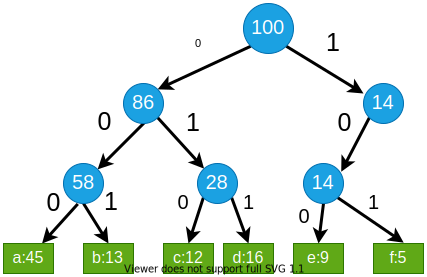

<!-- _backgroundColor: aquq -->

<!-- _color: orange -->

<!-- paginate: false -->

## CE100 Algorithms and Programming II

## Week-9 (Huffman Coding)

#### Spring Semester, 2021-2022

Download [DOC](ce100-week-9-huffman.tr.md_doc.pdf), [SLIDE](ce100-week-9-huffman.tr.md_slide.pdf), [PPTX](ce100-week-9-huffman.tr.md_slide.pptx)

<iframe width=700, height=500 frameBorder=0 src="../ce100-week-9-huffman.tr.md_slide.html"></iframe>

---

<!-- paginate: true -->

## Huffman Coding

## Outline
 - Heap Data Structure (Review Week-4)
 - Heap Sort (Review Week-4)
 - Huffman Coding

---

## **Huffman Codes**

---

## Huffman Codes for Compression

- Widely used and very effective for data compression
- Savings of 20% - 90% typical
  - (depending on the characteristics of the data)

- **In summary:** Huffman’s greedy algorithm uses a **table of frequencies** of character occurrences to build up an optimal way of **representing each character as a binary string**.

---

## Binary String Representation - **Example**

- Consider a data file with:
  - 100K characters
  - Each character is one of $\{a, b, c, d, e, f\}$
- Frequency of each character in the file:
  - **frequency:**	$\overbrace{a}^{45K},\overbrace{b}^{13K},\overbrace{c}^{12K},\overbrace{d}^{16K},\overbrace{e}^{9K},\overbrace{f}^{5K}$

- **Binary character code:** Each character is represented by a unique binary string.
- **Intuition:** 
  - Frequent characters  $\Leftrightarrow$ shorter codewords
  - Infrequent characters $\Leftrightarrow$ longer codewords

---

## Binary String Representation - **Example**

$$
\begin{array}{ccc}
\text{characters} & a & b & c & d & e & f \\
\text{frequency} & 45K & 13K & 12K & 16K & 9K & 5K \\ 
\text{fixed-length} & 000 & 001 & 010 & 011 & 100 & 101 \\ 
\text{variable-length(1)} & 0 & 101 & 100 & 111 & 1101 & 1100 \\
\text{variable-length(2)} & 0 & 10 & 110 & 1110 & 11110 & 11111
\end{array}
$$

- How many total bits needed for **fixed-length** codewords?
	$100K \times 3 = 300K \ bits$
- How many total bits needed for **variable-length(1)** codewords?
  $45K \times 1 + 13K \times 3 + 12K \times 3 + 16K \times 3 + 9K \times 4 + 5K \times 4 = 224K$
- How many total bits needed for **variable-length(2)** codewords?
  $45K \times 1 + 13K \times 2 + 12K \times 3 + 16K \times 4 + 9K \times 5 + 5K \times 5 = 241K$

---

## Prefix Codes

- **Prefix codes:** No codeword is also a prefix of some other codeword
- **Example:**

$$
\begin{array}{ccc}
\text{characters} & a & b & c & d & e & f \\
\text{codeword} & 0 & 101 & 100 & 111 & 1101 & 1100
\end{array}
$$

- It can be shown that:
  - Optimal data compression is achievable with a **prefix code**
- In other words, optimality is not lost due to **prefix-code** restriction.

---

## Prefix Codes: Encoding

$$
\begin{array}{ccc}
\text{characters} & a & b & c & d & e & f \\
\text{codeword} & 0 & 101 & 100 & 111 & 1101 & 1100
\end{array}
$$

- **Encoding:** Concatenate the codewords representing each character of the file

- **Example:** Encode file "abc" using the codewords above
  - $abc \Rightarrow 0.101.100 \Rightarrow 0101100$
- **Note:** "." denotes the concatenation operation. It is just for illustration purposes, and does not exist in the encoded string.

---

## Prefix Codes: Decoding

- Decoding is quite simple with a prefix code
- The first codeword in an encoded file is unambiguous
  - *because no codeword is a prefix of any other*
- **Decoding algorithm:**
  - Identify the initial codeword
  - Translate it back to the original character
  - Remove it from the encoded file
  - Repeat the decoding process on the remainder of the encoded file.

---

## Prefix Codes: Decoding - Example

$$
\begin{array}{ccc}
\text{characters} & a & b & c & d & e & f \\
\text{codeword} & 0 & 101 & 100 & 111 & 1101 & 1100
\end{array}
$$

- Example: Decode encoded file $001011101$
  - $001011101$ 
  - $0.01011101$
  - $0.0.1011101$
  - $0.0.101.1101$
  - $0.0.101.1101$
  - $aabe$

---

## Prefix Codes

- Convenient representation for the prefix code:
  - a binary tree whose leaves are the given characters

- Binary codeword for a character is the path from the
root to that character in the binary tree

- "$0$" means "**go to the left child**"
- "$1$" means "**go to the right child**"

---

## Binary Tree Representation of Prefix Codes

- **Weight of an internal node:** sum of weights of the leaves in its subtree
- The binary tree corresponding to the fixed-length code

---

## Binary Tree Representation of Prefix Codes

- **Weight of an internal node:** sum of weights of the leaves in its subtree
- The binary tree corresponding to the **optimal variable-length** code

- An optimal code for a file is always represented by a **full binary tree**

---

## Full Binary Tree Representation of Prefix Codes

- Consider an **FBT** corresponding to an optimal prefix code

- It has $|C|$ leaves (external nodes)

- One for each letter of the alphabet where $C$ is the alphabet from which the characters are drawn

- **Lemma:** An **FBT** with $|C|$ external nodes has exactly $|C|-1$ internal nodes

---

## Full Binary Tree Representation of Prefix Codes

- Consider an $FBT$ $T$, corresponding to a prefix code.
- **Notation**:
  - $f( c )$: frequency of character c in the file
  - $d_T( c )$: depth of $c$'s leaf in the $FBT$ $T$
  - $B(T)$: the number of bits required to encode the file
- What is the length of the codeword for $c$?
  - $d_T( c )$, same as the depth of $c$ in $T$
- How to compute $B(T)$, cost of tree $T$?
  - $B(T) = \sum \limits_{c \in C}^{} f( c )d_T( c )$

---

## Cost Computation - **Example**

 $$
 B(T) = \sum \limits_{c \in C}^{} f( c )d_T( c )
 $$

 $$
 \begin{align*}
 B(T) =& (45 \times 1) + (12 \times 3) + \\
 & (13 \times 3) + (16 \times 3) + \\
 & (5 \times 4)  + (9 \times 4) \\
 =& 224
 \end{align*}
 $$

  

---

## Prefix Codes

- **Lemma:** Let each internal node i is labeled with 
the sum of the weight $w(i)$ of the leaves in its subtree

- Then 

 $$
 B(T) = \sum \limits_{c \in C}^{} f( c )d_T( c ) = \sum \limits_{i \in I_T}^{} w(i)
 $$

- *where $I_T$ is the set of internal nodes of $T$*

- **Proof:** Consider a leaf node $c$ with $f( c )$ & $d_T( c )$
  - Then, $f( c )$ appears in the weights of $d_T( c )$ internal node 
  - along the path from $c$ to the root
  - Hence, $f( c )$ appears $d_T( c )$ times in the above summation

---

## Cost Computation - **Example**

 $$
 B(T) = \sum \limits_{i \in I_T}^{} w(i)
 $$

 $$
 \begin{align*}
 B(T) =& 100 + 55 + \\
 & 25 + 30 + 14 \\
 =& 224
 \end{align*}
 $$

  

---

## Constructing a Huffman Code

- **Problem Formulation:** For a given character set C, construct an optimal prefix code with the minimum total cost

- **Huffman** invented a **greedy algorithm** that constructs an optimal prefix code called a **Huffman code**

- The greedy algorithm
  - builds the **FBT** corresponding to the optimal code in a **bottom-up** manner
  - begins with a set of $|C|$ leaves
  - performs a sequence of $|C|-1$ "**merges**" to create the final tree

---

## Constructing a Huffman Code

- A **priority queue** $Q$, keyed on $f$, is used 
	to identify the two **least-frequent** objects to merge

- The result of the **merger** of two objects is a **new object**
  - inserted into the priority queue according to its frequency
  - which is the sum of the frequencies of the two objects merged

---

## Constructing a Huffman Code

- Priority queue is implemented as a binary heap
- Initiation of $Q$ ($\text{BUILD-HEAP}$): $O(n)$ time
- $\text{EXTRACT-MIN}$ & $\text{INSERT}$ take $O(lgn)$ time on $Q$ with $n$ objects

---

## Constructing a Huffman Code

$$
\begin{align*}
& \text{HUFFMAN}( c ) \\
& \quad n \leftarrow |C| \\
& \quad Q \leftarrow \text{BUILD-HEAP}( c ) \\
& \quad for \ i \leftarrow 1 \ to \ n-1 \ do \\
& \qquad z \leftarrow \text{ALLOCATE-NODE}() \\
& \qquad x \leftarrow left[z] \leftarrow \text{EXTRACT-MIN}(Q) \\
& \qquad y \leftarrow right[z] \leftarrow \text{EXTRACT-MIN}(Q) \\
& \qquad f [z] \leftarrow f [x] \leftarrow f [y] \\
& \qquad \text{INSERT}(Q, z) \\
& \quad return \ \text{EXTRACT-MIN}(Q) \lhd \text{one object left in} \ Q
\end{align*}
$$

---

## Constructing a Huffman Code - **Example**

- Start with one leaf node for each character
- The $2$ nodes with the least frequencies: $f \&e$ 
- Merge $f \& e$ and create an internal node 
- Set the internal node frequency to $5 + 9 = 14$

---

## Constructing a Huffman Code - **Example**

- The 2 nodes with least frequencies: $b \& c$

---

## Constructing a Huffman Code - **Example**

---

## Constructing a Huffman Code - **Example**

---

## Constructing a Huffman Code - **Example**

---

## Constructing a Huffman Code - **Example**

---

## Correctness Proof of Huffman’s Algorithm

- **We need to prove:**
  - The greedy choice property
  - The optimal substructure property

- **What is the greedy step in Huffman’s algorithm?**
  - *Merging the two characters with the lowest frequencies*

- *We will first prove the greedy choice property*

---

## Greedy Choice Property

- **Lemma 1:** Let $x \& y$ be two characters in $C$ having the **lowest frequencies**.
- Then, $\exists$ an optimal prefix code for $C$ in which the codewords for $x \& y$ have the same length and differ only in the last bit
- **Note:** *If $x \& y$ are merged in Huffman’s algorithm, their codewords are guaranteed to have the same length and they will differ only in the last bit*. 
  - *Lemma 1* states that there exists an optimal solution where this is the case.

---

## Greedy Choice Property - Proof

- Outline of the proof:
  - Start with an arbitrary optimal solution
  - Convert it to an optimal solution that satisfies the greedy choice property.

- **Proof:** Let $T$ be an arbitrary optimal solution where:
	- $b \& c$ are the sibling leaves with the **max depth**
	- $x \& y$ are the characters with the **lowest frequencies**

---

## Greedy Choice Property - Proof

- Reminder: 
  - $b \& c$ are the nodes with max depth
  - $x \& y$ are the nodes with min freq.	
- Without loss of generality, assume:
  - $f( x ) \leq f( y )$
  - $f( b ) \leq f( c )$
- Then, it must be the case that:
  - $f( x ) \leq f( b )$
  - $f( y ) \leq f( c )$

---

## Greedy Choice Property - Proof

- $T \Rightarrow T'$: exchange the positions of  the leaves $b \& x$
- $T' \Rightarrow T''$: exchange the positions of  the leaves $c \& y$

---

## Greedy Choice Property - Proof

---

## Greedy Choice Property - Proof

- **Reminder:** Cost of tree $T'$
 $$
 B(T) = \sum \limits_{c \in C}^{} f( c )d_{T'}( c )
 $$

 - How does $B(T')$ compare to $B(T)$?
- **Reminder:** $f(x) \leq f(b)$
  - $d_{T'}(x)=d_T(b)$ and $d_{T'}(b)=d_T(x)$

---

## Greedy Choice Property - Proof

- **Reminder:** $f( x ) \leq f( b )$
  - $d_{T'}( x )=d_T( b )$ and $d_{T'}( b )=d_T(x)$

- The difference in cost between $T$ and $T'$:

$$
\begin{align*}
B(T) - B(T') =& \sum \limits_{c \in C}^{} f( c )d_{T}( c ) - \sum \limits_{c \in C}^{} f( c )d_{T'}( c ) \\
&= f[ x ]d_{T}( x ) + f[ b ]d_{T}( b ) - f[ x ]d_{T'}( x ) - f[ b ]d_{T'}( b ) \\
&= f[ x ]d_{T}( x ) + f[ b ]d_{T}( b ) - f[ x ]d_{T}( x )  - f[ b ]d_{T}( b ) \\
&= f[ b ](d_{ T }( b ) + d_{ T }( x )) - f[ x ](d_{ T }( b ) - d_{ T }( x )) \\
&= (f [ b ] - f[x])(d_{T}( b ) + d_{T}( x )) 
\end{align*}
$$

---

## Greedy Choice Property - Proof

 $$
 \begin{align*}
 B(T) - B(T') = (f[ b ] - f[ x ])(d_{T}( b ) + d_{T}( x )) 
 \end{align*}
 $$

- Since $f [ b ] - f [ x ] \geq 0$ and $d_T( b ) \geq d_T( x )$
  - therefore $B(T') \leq B(T)$
- In other words, $T'$ is also optimal

---

## Greedy Choice Property - Proof

---

## Greedy Choice Property - Proof

- We can similarly show that 
- $B(T')-B(T'') \geq 0 \Rightarrow B(T'') \leq B(T')$
  - which implies $B(T'') \leq B(T)$
- Since $T$ is optimal $\Rightarrow B(T'') = B(T) \Rightarrow T''$ is also optimal

- **Note:** $T''$ contains our greedy choice:
  - Characters $x \& y$ appear as sibling leaves of max-depth in $T''$
- Hence, the proof for the greedy choice property is complete

---

## Greedy-Choice Property of Determining an Optimal Code

- **Lemma 1** implies that 
  - process of building an optimal tree 
  - by mergers can begin with the greedy choice of merging 
  - those two characters with the lowest frequency

- We have already proved that $B(T)=\sum \limits_{i \in I_T}w(i)$ , that is, 
  - the total cost of the tree constructed 
  - is the **sum** of the **costs** of its **mergers** (**internal nodes**) **of all possible mergers** 
- At each step **Huffman chooses** the merger that incurs the **least cost**

---

## Optimal Substructure Property

- Consider an optimal solution $T$ for alphabet $C$. Let $x$ and $y$ be any two sibling leaf nodes in $T$. Let $z$ be the parent node of $x$ and $y$ in $T$.
- Consider the subtree $T'$ where $T' = T – \{x, y\}$.
  - Here, consider z as a new character, where 
    - $f[z] = f[x] + f[y]$
- **Optimal substructure property:** $T'$ must be optimal for the alphabet $C'$,
	where $C' = C – \{x, y\} \cup \{z\}$

---

## Optimal Substructure Property - Proof

Reminder:
$$
  B(T) = \sum \limits_{c \in C}^{} f[c]d_{T}( c )
$$

Try to express $B(T)$ in terms of $B(T')$.

**Note:** All characters in $C'$ have the same depth in $T$ and $T'$.

$$
B(T) = B(T') – cost(z) + cost(x) + cost(y)
$$

---

## Optimal Substructure Property - Proof

Reminder:
$$
  B(T) = \sum \limits_{c \in C}^{} f[ c ]d_{T}( c )
$$

$$
\begin{align*}
B(T) &= B(T') – cost( z ) + cost( x ) + cost( y ) \\
&= B(T') - f[ z ].d_T( z ) + f[ x ].d_T( x ) + f[ y ].d_T( y ) \\
&= B(T') - f[ z ].d_T( z ) + (f[ x ]+f[ y ])(d_T( z )+1) \\
&= B(T') - f[ z ].d_T( z ) + f[ z ](d_T( z )+1) \\
&= B(T') - f[ z ] 
\end{align*}
$$

$$
\begin{align*}
d_T( x )=d_T( z )+1 \\
d_T( y )=d_T( z )+1 \\
\end{align*}
$$

$$
\begin{align*}
  B(T)=B(T') + f[ x ] + f[ y ] 
\end{align*}
$$

---

## Optimal Substructure Property - Proof

- We want to prove that $T'$ is optimal for 
  - $C' = C – \{x, y\} \cup \{z\}$
- Assume by contradiction that that there exists another solution for $C'$ with smaller cost than $T'$. Call this solution $R'$:
- $B(R') < B(T')$
- Let us construct another prefix tree $R$ by adding $x \& y$ as children of $z$ in $R'$ 

$$
\begin{align*}
  B(T)=B(T') + f[ x ] + f[ y ] 
\end{align*}
$$

---

## Optimal Substructure Property - Proof

- Let us construct another prefix tree $R$ by adding $x \& y$ as children of $z$ in $R'$.
- We have: 
  - $B(R) = B(R') + f[ x ] + f[ y ]$
- In the beginning, we assumed that:
  - $B(Rʹ) < B(T')$
- So, we have: 
  - $B(R) < B(T') + f[ x ] + f[ y ] = B(T)$

**Contradiction! Proof complete**

---

## Greedy Algorithm for Huffman Coding - Summary

- For the greedy algorithm, we have proven that:
  - **The greedy choice property** holds.
  - **The optimal substructure property** holds.
- So, the greedy algorithm is optimal.

---

## References

- [Introduction to Algorithms, Third Edition | The MIT Press](https://mitpress.mit.edu/books/introduction-algorithms-third-edition)

- [Bilkent CS473 Course Notes (new)](http://nabil.abubaker.bilkent.edu.tr/473/)

- [Bilkent CS473 Course Notes (old)](http://cs.bilkent.edu.tr/~ugur/teaching/cs473/)

---

$-End-Of-Week-9-Course-Module-$ 